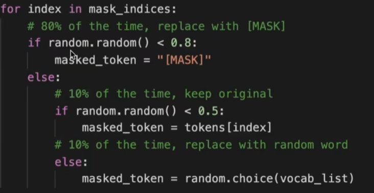

# Bert预训练(MLM+NSP)

## MLM任务(Masked Language Model)

### 1. 自回归模型和自编码模型

1. AR(autoregressive)：自回归模型，只能考虑单侧信息，典型为GPT
2. AE(autoencoding)：自编码模型，从损坏的输入数据中预测重建原始数据，可以使用上下文的信息，典型为Bert

- AR: 

  P(我爱吃饭)=P(我)P(爱|我)P(吃|我爱)P(饭|我爱吃)

- AE: mask之后：【我爱mask饭】

  P(我爱吃饭|我爱mask饭)=P(mask=吃|我爱饭)

缺点：P(我爱吃饭|我爱maskmask)=P(吃|我爱)P(饭|我爱)，两个mask相互独立，但实际上吃饭可能不是相互独立的

### 2、实际操作

随机mask 15%的单词，其中

- 10%替换为其他
- 10%原封不动
- 80%替换成mask

## NSP任务(Next Sentence Prediction)

1、从训练语料库中取出两个连续的段落作为正样本(50%)

2、从不同的文档中随机创建一对段落作为负样本(50%)

缺点：主题预测和连贯性预测合并为一个单项任务

- 主题预测太容易获取负样本，效果不够好

- 例子

​	两句话：

​	请问请问，你是你是。哈哈哈，事实上。三得利，乌龙茶。

​	啊啊啊，经济。士大夫十分，飒飒法。

​	按句号拆分数据集就有(两句话是否是前后两句)，

​	text1: 请问请问，你是你是	text2: 哈哈哈，事实上	label: 1

​	text1: 请问请问，你是你是	text2: 三得利，乌龙茶	label: 0

​	...

​	注意：

​	如果样本数量足够，只需要判断是否相邻即可，可以不需要判断前后顺序

​	如果取在两篇不同文章里面选取两句话，显然不会相邻，差别太明显，学习效果不会太好

​	**改进：**

​	**样本增强：两篇文章中取出两句话，语义相似，但不相邻，可以设置为负样本**

​	但是预训练不好改进，数据不够，设备(GPU)不够，训练策略不行

