# Java基础

## 一、java是什么

### Java是什么

- sun公司(Stanford University Network)1995年推出的==高级编程语言==
- 2009年sun公司被Oracle公司收购
- Java创始人之一：James Gosling

### Java为什么广泛应用

- 世界最流行之一，国内最广泛应用
- 开发社区完善，开源，功能丰富
- 可移植性，安全可靠，性能较好

### Java能做什么

- 大数据，云计算（python+SQL）
- 桌面应用开发
- 移动端APP开发(Kotlin/前端框架，安卓/Swift)
- 科学计算
- ==企业服务器端软件的开发==（**90%以上**）
- 游戏开发

### Java三大技术平台

- ==JavaSE(Standard Edition)：核心和基础==
- ==JavaEE(Enterprise Edition)：企业级应用开发==
- JavaME(Micro Edition)：移动设备应用（不常用）

## 二、开发Java的入门程序

### 1、安装JDK

- JDK(Java Development Kit)：安装JDK后才能使用Java，Oracle官网

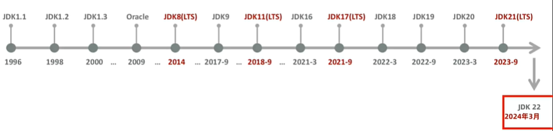

Java LTS版本：Long-Term Support

- JRE(Java Runtime Environment)：运行Java的环境

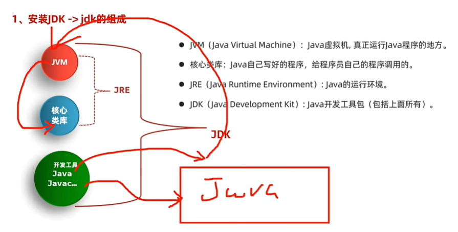

### 2、配置环境变量

CMD命令：

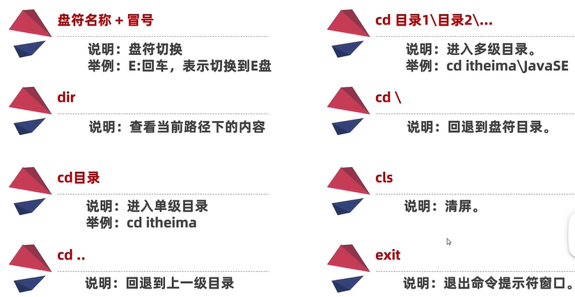

### 3、Java的跨平台原理

编写 (.java结尾，**文件名称需与代码里类名一致**)  --> 编译(javac) .class --> 运行(java)

==一次编译，处处可用==

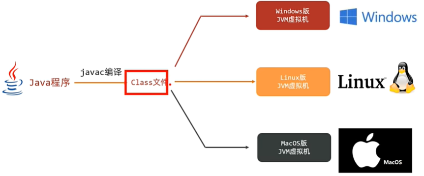

# IDEA企业开发工具

## 一、开发工具安装和下载

### 1、介绍

IDE（Integrated Development Environment，集成开发环境）：集成了JDK、代码编写窗、编译、执行等多种功能的开发工具

有提示、功能强大、一键编译运行、直接集成AI工具

- ==IntelliJ IDEA==：代码提示、智能补全优秀，Java开发首选的企业级开发工具
- Eclipse
- NetBeans

### 2、Java项目结构

- Project(工程)：new project
- Module(模块)：new Module
- Package(包)：new Package
- Class(类)

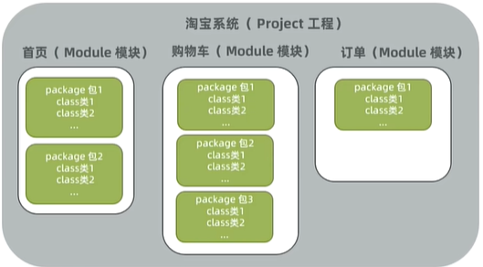

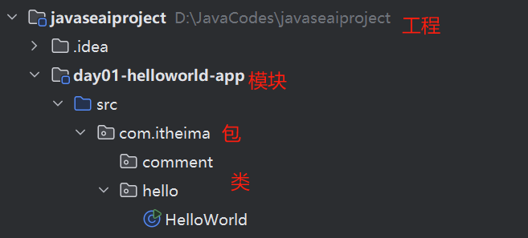

- 一个project可以创建多个Module
- 一个Module可以创建多个Package
- 一个Package可以创建多个Class
- 在IDEA中java程序都是自动编译和执行的，通常会放在一个out文件夹下

### 3、常用快捷键

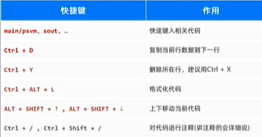

格式化代码是指将代码结构改成标准结构

==导入模块==操作：先复制进来，再用New-Module From Existing Source；或者直接新建Module再复制包进来

# Java的基本语法

## 一、注释和字面量

### 1、注释

- 单行注释
- 多行注释
- 文档注释

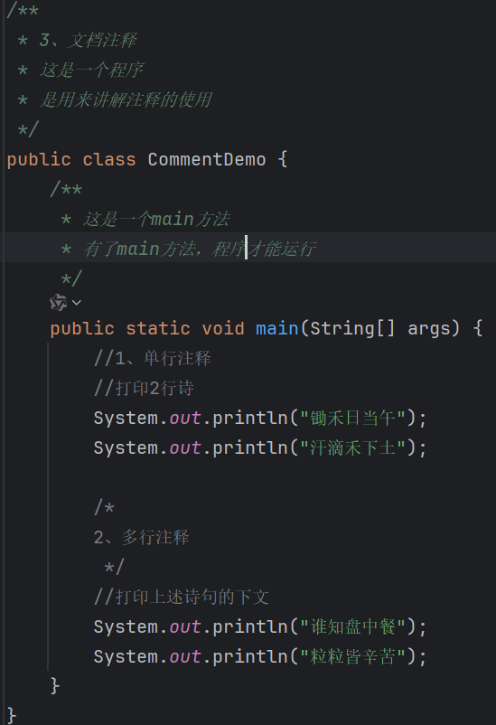

注释不影响程序执行，因为编译成.class文件后已经没用注释了

### 2、字面量

字面量：程序中能直接书写的数据，数据在程序中的书写格式

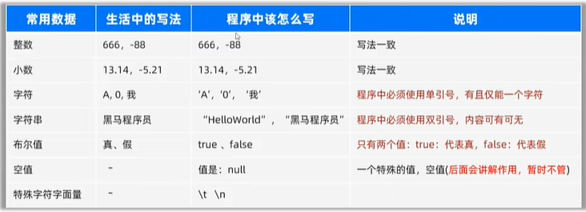

特殊字符主要有

- \n(换行) 
- \t(制表符)：添加空格把字符串的长度变成8或8的倍数，==如果字符串长度为8，则再补8位==
-  \r(回车)
-  \b(退格)
-  \f(换页)
-  \\' (单引号) 
- \\\" (双引号) 
- \\\ (反斜杠)

## 二、变量

### 1、认识变量

- ==变量是内存中的一块区域，可以理解成一个盒子，用来装程序要处理的数据的。==

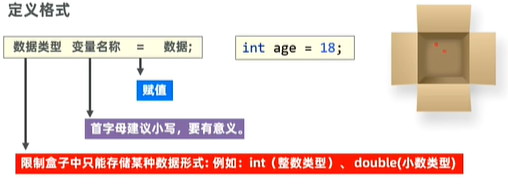

- 使用变量记要处理的数据，编写代码更灵活，管理代码更方便
- 变量中装的数据可以替换

### 2、变量里数据的存储原理

#### 2.1  十进制数字的存储

- 二进制：计算机底层存储方式，只有0、1，按照逢2进1的方式表示数据
- 十进制转二进制：除二取余法

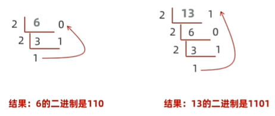

- 二进制转十进制

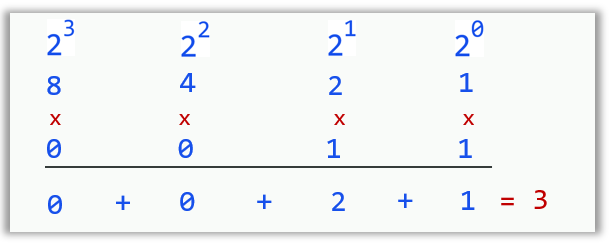

- ==计算机中存储数据的最小单元：字节(byte, 简称B)，一个字节占8个比特位(bit, 简称b)==

  即1B = 8b

  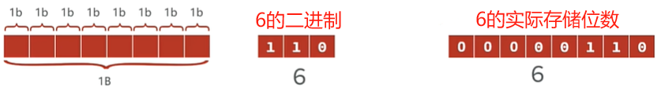

- 在B的基础之上，发展出了KB, MB, GB, TB等数据存储单位

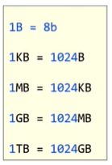

#### 2.2  其他形式数据存储形式

- 字符数据的存储：ASCII码对应数字的二进制形式

  **大写字母A\~Z: 65\~90；小写字母a\~z: 97~122; 对应大小写字母之间的ASCAII码相差32**

  **字符'0'\~'9': 48~57**

  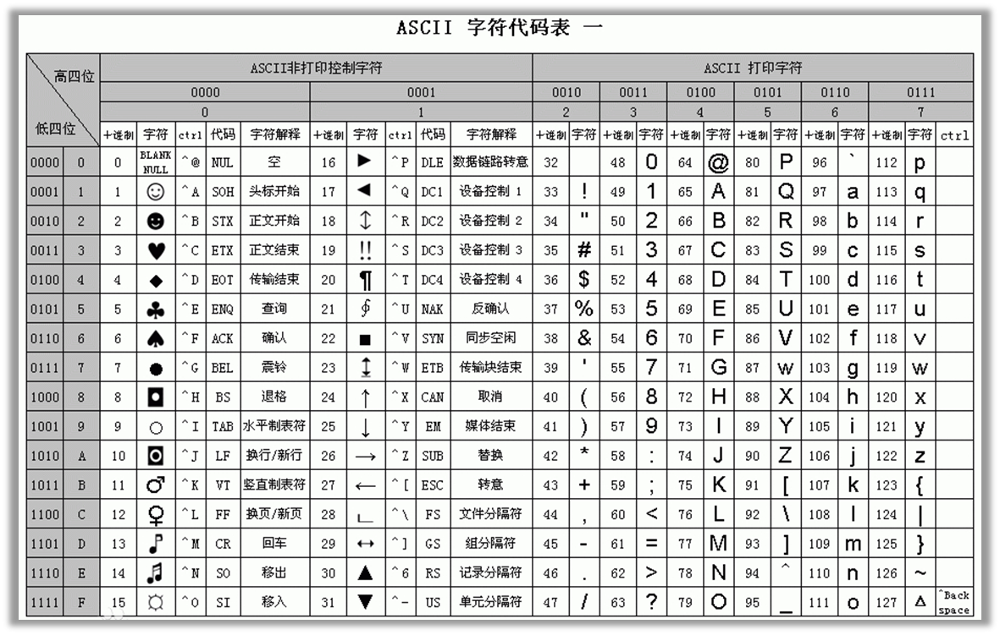

- 图片的存储：无数个像素点组成，每个像素点用0~255表示
- 声音数据的存储：波形图坐标存储为二进制

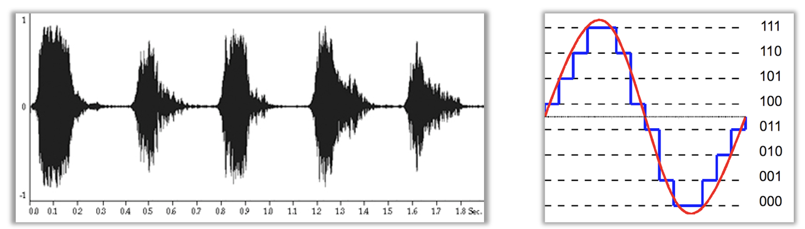

#### 2.3  八进制与十六进制

- 为了便于观察和表示二进制，推出了八进制和十六进制

- 八进制

  将二进制切分，每三位一组，每一组（000\~111）就相当于有**0\~7**八个数字

  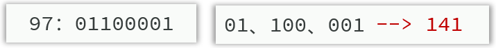

- 十六进制

  将二进制切分，每四位一组，每一组（0000\~1111）就相当于有0\~15十六个数字

  依次用**0\~9 A B C D E F**表示

  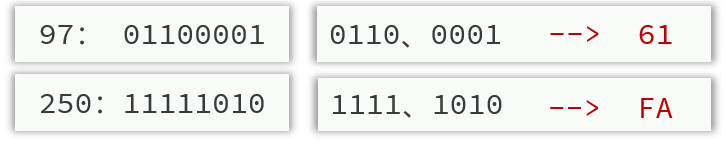

==程序中，可以直接书写二进制(0B或0b开头)、八进制(0开头)、十六进制数据(0X或0x开头)==

### 3、Java的数据类型

- 基本数据类型

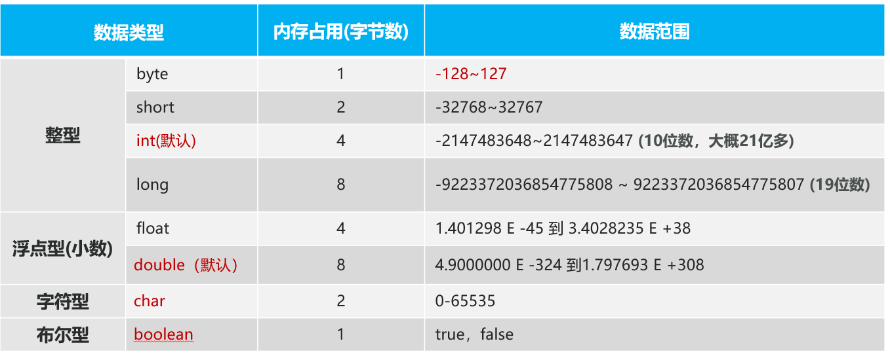

​	注意：

1. 整型变量默认是int类型，如需构造long类型，后面需要加上L或者l
2. 浮点型变量默认是double类型，如需构造float类型，后面需要加上F或者f

- 引用数据类型: String

## 三、关键字和标识符

- 关键字：Java语言自己用的一些词汇，有特殊作用的，称之为关键字， 如：public、class、int、double

  注意：关键字是java用了的，我们就不能用来为做为自己的：类名、变量名，否则会报错！

  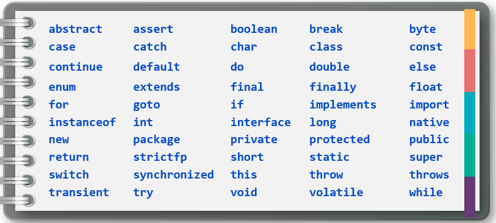

- 标识符：标志符就是名字（如类名、变量名…都是标识符）

  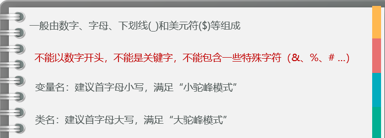