# Java程序的基本语法

## 一、方法

### 1、方法详解

- 方法是一种用于**执行特定任务或操作的代码块**，代表一个功能，它可以接收数据进行处理，并返回一个处理后的结果。

  方法定义的格式

  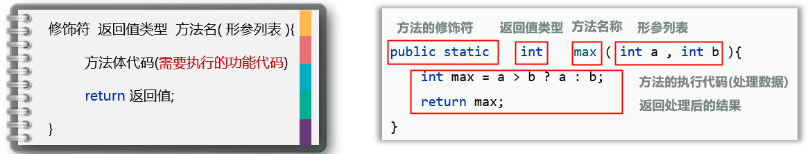

​	  方法的调用格式：**方法名称(数据)**

- 方法不接受数据时，形参列表为空

- 方法没有返回结果，返回值类型为void（无返回值类型）

  ```java
  public static void printHelloWorld(){
      for (int i = 0; i <= 3; i++){
          System.out.println("Hello World!");
      }
  }
  ```

### 2、方法的注意事项

#### 2.1 方法是可以重载的

- 一个类中，出现**多个方法的名称相同**，但是它们的**形参列表是不同的**==(类型不同、个数不同、顺序不同)==，那么这些方法就称为**方法重载**了

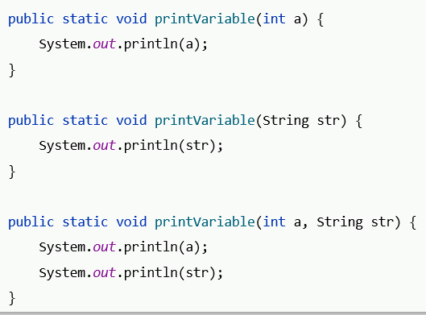

#### 2.2 无返回值的方法

- 可以直接通过单独的==**return;**==立即结束当前方法的执行

```java
public static void div(int a, int b){
    if (b==0){
        System.out.println("除数不能为零"); 
        return; //提前结束方法 卫语言风格
    }
    System.out.println(a / b);
}
```

## 二、类型转换

### 1、自动类型转换，强制类型转换

==存在不同类型的变量赋值给其他类型的变量==

#### 1.1 自动类型转换

- **类型范围小**的变量，可以**直接赋值**给**类型范围大**的变量

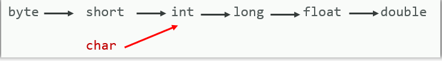

​	 注意：char类型变量转化为ASCII码

- 自动类型转换在计算机中的原理

  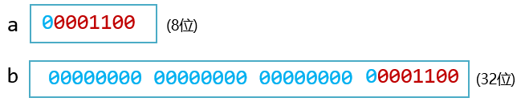

#### 1.2 强制类型转换

- **类型范围大**的变量， 不可以**直接赋值**给**类型范围小**的变量，会报错，需要强制类型转换过去

  强制类型转换方法
  数据类型 变量2 = (数据类型) 变量1、数据

  注意：强制类型转换**可能造成数据(丢失)溢出**；浮点型强转成整型，**直接丢掉小数部分，保留整数部分返回**

- 强制类型转换在计算机中的原理

  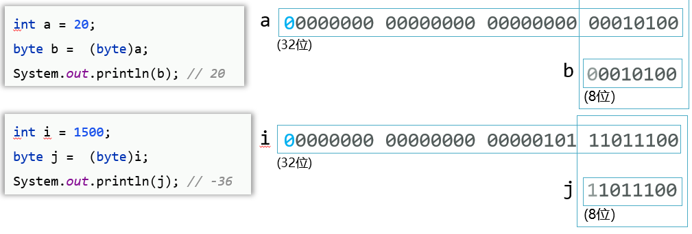

### 2、表达式的自动类型提升

在表达式中，小范围类型的变量，会自动转换成表达式中较大范围的类型，再参与运算。


注意事项：

- 表达式的最终结果类型由表达式中的**最高类型决定**
- 在表达式中，**byte、short、char** 是**直接转换成int类型**参与运算的

```java
// 输入的a和b是以int类型参与运算，最终返回int类型
public static int calc2(byte a, byte b){
    return a+b;
}

// 输入的a和b是以int类型参与运算，最终强制返回byte类型
public static byte calc3(byte a, byte b){
    return (byte) (a+b);
}
```

## 三、输入-输出

- 输入：把程序中的数据展示出来。System.out.println()
- 输入：程序读取键盘输入的数据。通过Java提供的Scanner程序(可直接调用的API)来实现

**API（Application Programming Interface：应用程序编程接口）**

- Java写好的程序，咱们程序员可以直接拿来调用。
- Java为自己写好的程序提供了相应的程序使用说明书(API文档)。

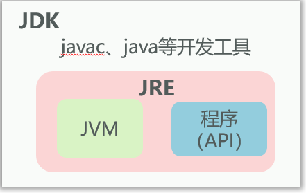

## 四、运算符

### 1、基本的算数运算符

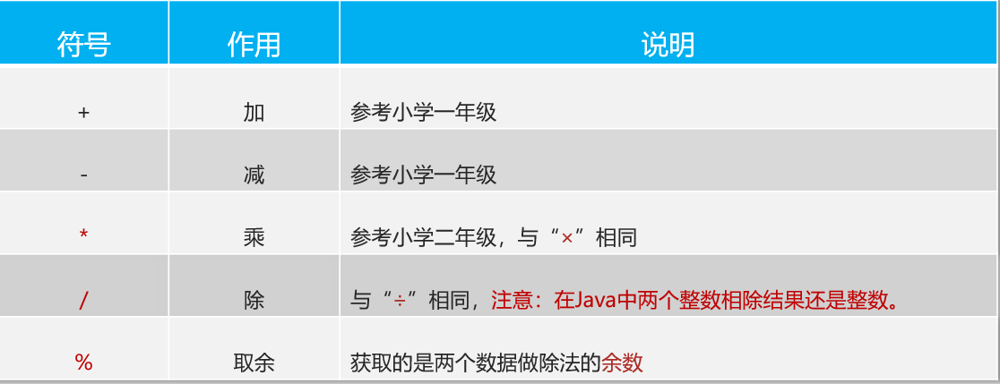

- 除法：两个整数做除法运算得到的结果还是整数

  ```java
  int a=10
  int b=3
  
  System.out.println(a / b);//3.333...==>3
  System.out.println((double) a / b);//保留小数
  System.out.println(1.0 * a / b);
  ```

- 加号"+"的用途：可做加法，可做连接符

  ```java
  int a = 18;
  System.out.println("abc" + a);//abc18
  System.out.println(a+5);//23
  System.out.println("itheima" + a +'a');//itheima18a
  System.out.println(a + 5 + "itheima");//23itheima
  System.out.println(a+'a'+"itheima");//115itheima
  ```

### 2、自增自减

- ++、-- 如果在变量前后单独使用是没有区别的

  ```java
  int a = 10;
  ++a; //a=11
  a++; //a=12
  ```

- ++、-- 如果不是单独使用（如在表达式中、或同时有其它操作），放在变量前后会存在明显区别

  - 在变量前面，先+1/-1，再用变量值做运算

    ```java
    int a = 10;
    int rs = ++a; //rs=11
    ```

  - 在变量后面，先用变量值做运算，再+1/-1

    ```java
    int b = 10;
    int rs = b++; //rs=10
    ```

- ++/--只能操作变量，不能操作字面量

### 3、赋值运算符

- 基本赋值运算符

  ```java
  int a=10; //把数据10赋值给左边的变量a
  ```

- 扩展赋值运算符

  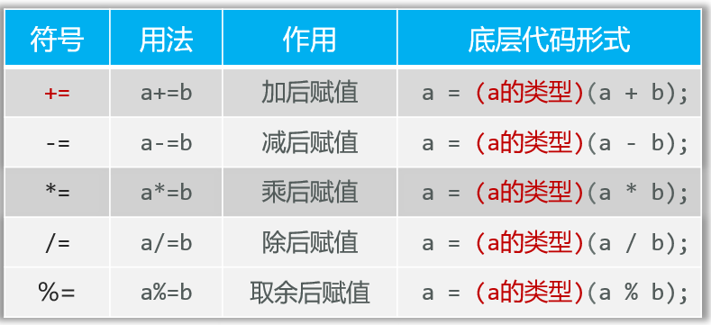

  **注意：扩展的赋值运算符隐含了强制类型转换**

  ```java
  byte a1=10;
  byte a2=20;
  
  a1 = a1 + a2;//报错,a1+a2为int类型
  a1 += a2;//等价于a1 = (byte) (a1 + a2)
  ```

### 4、关系运算符、三元运算符

- 关系运算符：判断数据是否满足条件，最终会返回一个判断的结果，这个结果是布尔类型的值：true或者false

  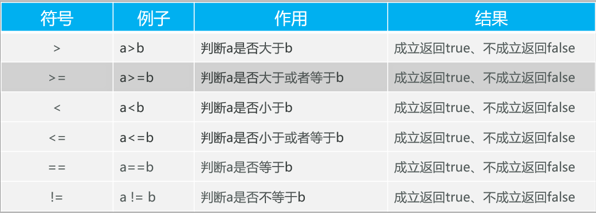

- 三元运算符：首先计算**关系表达式的值，**如果值为**true**，返回**值1**，如果为**false**，返回**值2**

  ==条件表达式 **?**  值1 **:** 值2;==

  ```java
  int max = a > b ? a : b; //取a, b中最大值
  String result = score >=60 ? "通过" : "挂科"; //成绩大于60分则通过 
  // 求三个值的最大值(方法1)
  int max = a > b ? a : b
  max = max > c ? max : c
  // 求三个值的最大值(方法2)三元运算符嵌套
  int max = a > b ? (a > c ? a : c) : (b > c ? b : c);
  ```

### 5、逻辑运算符

把多个条件放在一起运算，最终返回布尔类型的值: true, false

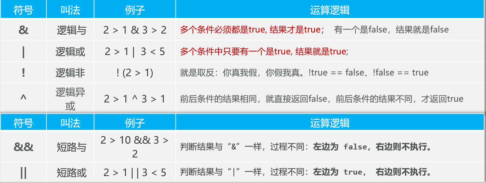

- & ： 有一个为false、结果是false
- &&： 一个为false、结果是false，**但前一个为false,后一个条件不执行了**
- | ： 有一个为true、结果是true
- || ：一个为true、结果是true，**但前一个为true，后一个条件不执行了**
- ! ：!false=true、 !true=false
- ^ ：相同是false、不同是true。

注意：

- 在Java中，"&"与"I": 无论左边是true还是false，**右边都要执行**

- ==在实际开发中，由于&&, || 运算效率更高，因此更常用==

  ```java
  int a = 111;
  int b = 2;
  
  System.out.println(a > 1000 && ++b>1);//false, b=2, 右边不执行
  System.out.println(a > 1000 & ++b>1);//false, b=3
  
  System.out.println(a < 1000 || ++b>1);//true, b=2， 右边不执行
  System.out.println(a < 1000 | ++b>1);//true, b=3
  ```

## 五、综合实战——身体健康指数

需求：开发一个简单的健康计算器应用程序，它可以接受用户的输入（如年龄、性别、体重、身高），并计算出用户的BMI（身体质量指数）和基础代谢率（BMR）

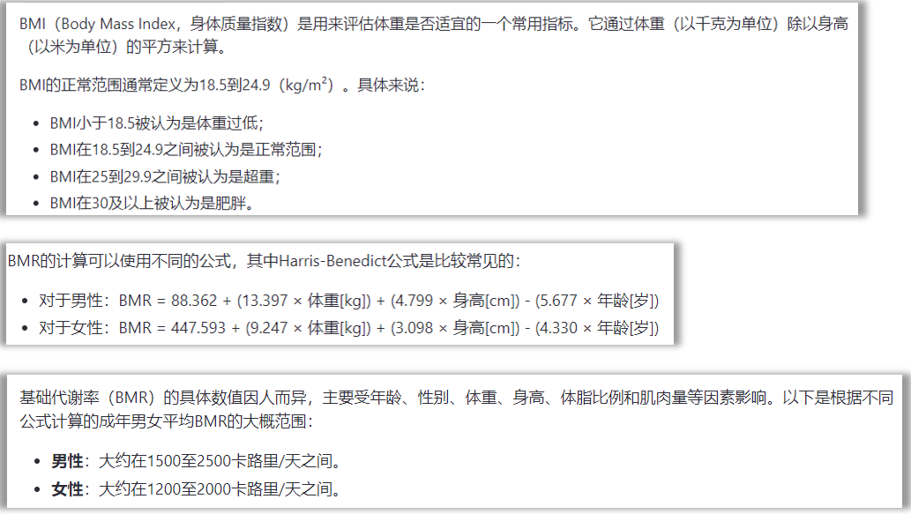

 

```java
package com.itheima.Demo;

import java.util.Objects;
import java.util.Scanner;

/**
 * AllTest类用于计算并输出用户的BMI指数和BMR指数
 */
public class AllTest {
    /**
     * 程序的入口点
     * 从用户输入中读取年龄、性别、体重和身高，然后调用getBMI和getBMR方法进行计算
     * @param args 命令行参数
     */
    public static void main(String[] args) {
        Scanner sc = new Scanner(System.in);
        System.out.println("请输入您的年龄：");
        int age = sc.nextInt();
        System.out.println("请输入您的性别（男/女）：");
        String sex = sc.next();
        System.out.println("请输入您的体重（单位：kg）：");
        double weight = sc.nextDouble();
        System.out.println("请输入您的身高（单位：m）：");
        double height = sc.nextDouble();
        getBMI(weight,height);
        getBMR(age,sex,weight,height);
    }

    /**
     * 计算并输出BMI指数
     * @param weight 体重（单位：千克）
     * @param height 身高（单位：米）
     */
    public static void getBMI(double weight, double height){
        double BMI = weight/(Math.pow(height,2));
        System.out.println("您的BMI指数为：" + BMI);
        if (BMI<18.5) {
            System.out.println("您的体重过低");
        }
        else if (BMI>=18.5 && BMI<=24.9) {
            System.out.println("您的身体质量指数正常");
        }
        else if (BMI>=25 && BMI<=29.9) {
            System.out.println("您已超重");
        }
        else {
            System.out.println("您已肥胖");
        }
    }

    /**
     * 计算并输出BMR指数
     * @param age 年龄
     * @param sex 性别（"男"或"女"）
     * @param weight 体重（单位：千克）
     * @param height 身高（单位：米）
     */
    public static void getBMR(int age, String sex, double weight, double height){
        if ("男".equals(sex)){
            double BMR = 88.363 + (13.397 * weight + 4.799 * height * 100 - 5.677 * age);
            System.out.println("您的BMI指数为：" + BMR);
            String result = BMR >= 1500 && BMR <= 2500 ? "您的BMR指数正常" : "您的BMR指数不正常";
            System.out.println(result);
        }
        if (Objects.equals(sex, "女")){
            double BMR = 447.593 + (9.247 * weight + 3.098 * height * 100 - 4.330 * age);
            System.out.println("您的BMI指数为：" + BMR);
            String result = BMR >= 1200 && BMR <= 2000 ? "您的BMR指数正常" : "您的BMR指数不正常";
            System.out.println(result);
        }
    }
}
```

