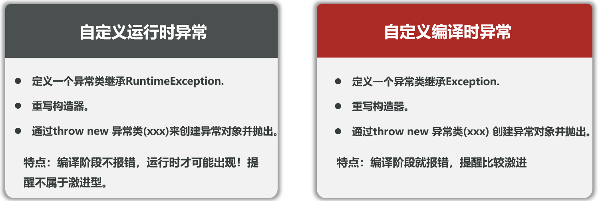
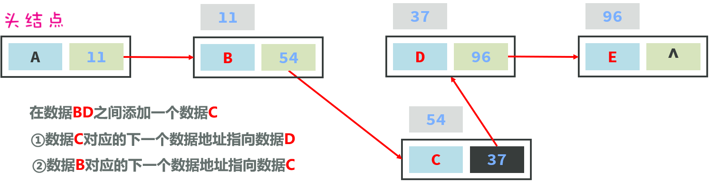

## 一、异常

### 1、认识异常

- 什么是异常：**异常是代码在编译或者执行的过程中可能出现的错误**

  ```java
  int[] arr = {10, 20, 30};
  System.out.println(arr[3]);
  // Exception: Index 3 out of bounds for lenth 3
  
  System.out.println(10 / 0);
  // Exception: / by zero
  
  // 其他异常
  //读取的文件不存在了
  //读取网络数据，断网了
  //...
  ```

- **Java的异常体系**

  

  - **Error**：代表的系统级别错误(属于严重问题)，也就是说系统一旦出现问题，sun公司会把这些问题封装成Error对象给出来

    ( 说白了，Error是给sun公司自己用的，不是给我们程序员用的，因此我们开发人员**不用管它**)

  - **Exception**：叫异常，它代表的才是我们程序可能出现的问题，所以，我们程序员通常会用Exception以及它的孩子来封装程序出现的问题。

    1. **运行时异常：RuntimeException**及其子类，**编译阶段不会出现**错误提醒，**运行时出现**的异常（如：数组索引越界异常）

       ```java
       public static void show(){
           System.out.println("===程序开始===");// 执行
           // 运行时异常的特点：编译阶段不报错，运行阶段报错，继承自 RuntimeException
           int[] arr = {1,2,3};
       
           // System.out.println(arr[3]); // ArrayIndexOutOfBoundsException
       
           // System.out.println(10/0); // ArithmeticException
       
           // 空指针异常
           String str = null;
           System.out.println(str);
           System.out.println(str.length()); // NullPointerException
       
           System.out.println("===程序结束===");// 不执行
       }
       
       public static void main(String[] args) throws ParseException {
           // 目标：认识异常体系，搞清楚异常的基本作用
           show();
           /* 输出：
            * ===程序开始===
            * null
            * Exception in thread "main" java.lang.NullPointerException: Cannot invoke "String.length()" because "str" is null */
       }
       ```

    2. **编译时异常：Exception**，**编译阶段就会出现**错误提醒的。（如：日期解析异常）

       ```java
       // 定义一个方法认识编译时异常
       public static void show2() {
           System.out.println("===程序开始===");// 不执行
           // 编译时异常的特点：编译阶段报错，运行阶段不报错，继承自 Exception
           // 编译时异常，提醒这里的程序容易出错，需要处理
           String str = "2025-03-28 17:49:50";
           // 把字符串事件解析成Java中的日期对象
           SimpleDateFormat sdf = new SimpleDateFormat("yyyy-MM-dd HH:mm:ss");
           Date date = sdf.parse(str);// ParseException
           System.out.println(date);
           
            InputStream is = new FileInputStream("D:/hello.txt"); // FileNotFoundException
           
           System.out.println("===程序结束===");// 不执行
       }
       
       public static void main(String[] args) {
           // 目标：认识异常体系，搞清楚异常的基本作用
           show2();
           /* 直接报错：
            * java: 未报告的异常错误java.text.ParseException; 必须对其进行捕获或声明以便抛出
            * java: 未报告的异常错误java.io.FileNotFoundException; 必须对其进行捕获或声明以便抛出 */
       }
       ```

- 解决异常

  ```java
  // 方法1：抛异常，一个一个异常抛出
  public static void main(String[] args) throws ParseException, FileNotFoundException {
      show2();
  }
  
  public static void show2() throws ParseException, FileNotFoundException {
  }
  
  // 方法1：抛异常，整个异常Exception抛出
  public static void main(String[] args) throws Exception {
      show2();
  }
  
  public static void show2() throws Exception {
  }
  
  // 方法2：先抛出，再捕获捕获异常（常用）
  public static void main(String[] args) {
      try{
          // 可能出现异常的代码！
          show2();
      }catch (Exception e){
          e.printStackTrace(); // 直接打印异常对象的信息
      }
  }
  
  public static void show2() throws Exception{
  }
  ```

- 异常的作用

  1. 用来定位程序bug的关键信息

  2. 可以作为方法内部的一种特殊返回值：用throw代替return抛出异常

     以便通知上层调用者，方法的执行问题

     ```java
     // 方法1：抛出一个运行时异常
     public class ExceptionDemo2 {
         public static void main(String[] args) {
             // 目标：搞清楚异常的作用
             System.out.println(div(10, 0));
         }
     
         // 需求：求两个数相除的结果
         public static int div(int a, int b) {
             if(b == 0){
                 System.out.println("除数不能为0");
                 // 返回一个异常给上层调用，返回异常能告知上层下层是成功还是失败
                 throw new RuntimeException("除数不能为0");
             }
             return a / b;
         }
     }
     
     // 方法2：抛出一个编译异常：写出来就会报错
     public class ExceptionDemo2 {
         public static void main(String[] args) {
             // 目标：搞清楚异常的作用
             try {
                 System.out.println(div(10, 0));
                 System.out.println("底层方法执行成功");
             } catch (Exception e) {
                 e.printStackTrace();
                 System.out.println("底层方法执行失败");
             }
         }
     
         // 需求：求两个数相除的结果
         public static int div(int a, int b) throws Exception {
             if(b == 0){
                 System.out.println("除数不能为0");
                 // 返回一个异常给上层调用，返回异常能告知上层下层是成功还是失败
                 //throw new RuntimeException("除数不能为0");
                 throw new Exception("除数不能为0");
             }
             return a / b;
         }
     }
     ```

### 2、自定义异常

- Java无法为这个世界上全部的问题都提供异常类来代表， 如果企业自己的某种问题，想通过异常来表示，以便用异常来管理该问题，那就需要自己来定义异常类了



```java
// 自定义编译时异常
package com.itheima.demo1exception;

/**
 * 自定义异常类
 * 1、继承Exception
 * 2、重写Exception的构造器
 */
public class AgeException extends Exception {
    public AgeException() {
    }

    public AgeException(String message) {
        super(message);
    }
}

// 自定义运行时异常（更常用）
package com.itheima.demo1exception;

/**
 * 自定义异常类
 * 1、继承RuntimeException
 * 2、重写RuntimeException的构造器
 */
public class AgeRuntimeException extends RuntimeException {
    public AgeRuntimeException() {
    }

    public AgeRuntimeException(String message) {
        super(message);
    }
}
```

- 调用自定义异常

```java
public class ExceptionDemo4 {
    public static void main(String[] args) {
        // 目标：认识自定义异常
        try {
            saveAge(300);
            System.out.println("保存成功");
        } catch (AgeRuntimeException e) {
            e.printStackTrace();
            System.out.println("保存失败");
        }
    }

    // 需求：我们公司只要收到了年龄小于1岁或者年龄大于200岁，就是一个年龄非法的异常
    // 运行时异常
    public static void saveAge(int age) throws AgeRuntimeException {
        if(age < 1 || age > 200){
            throw new AgeRuntimeException("年龄非法");
        } else {
            System.out.println("年龄合法");
            System.out.println("年龄：" + age);
        }
    }
}
```

### 3、异常的处理方案

1. **底层异常层层往上抛出，最外层捕获异常，记录下异常信息，并响应适合用户观看的信息进行提示（常用）**

   

2. 最外层捕获异常后，尝试重新修复

   ```java
   package com.itheima.demo1exception;
   
   import java.util.Scanner;
   
   public class ExceptionDemo6 {
       public static void main(String[] args) {
           // 目标：掌握异常的处理方案2：捕获异常对象，尝试重新修复
           // 接收用户的一个定价
           System.out.println("程序开始");
           while (true) {
               try {
                   double price = userInputPrice();
                   System.out.println("用户成功设置了商品定价：" + price);
                   break;
               } catch (Exception e) {
                   System.out.println("用户输入价格有误，请重新输入");
               }
           }
           System.out.println("程序结束");
       }
   
       public static double userInputPrice() {
           Scanner sc = new Scanner(System.in);
           System.out.println("请输入一个价格：");
           return sc.nextDouble();
       }
   }
   ```

## 二、泛型

### 1、认识泛型

- 定义类、接口、方法时，同时声明了一个或者多个类型变量（如：<E>） 

  称为泛型类、泛型接口，泛型方法、它们统称为泛型。

  ```java
  public class ArrayList<E>{
      . . .
  }
  
  public class GenericDemo1 {
      public static void main(String[] args) {
          // 目标：认识泛型，搞清楚泛型的好处
          ArrayList<String> list = new ArrayList<>();// JDK7开始new后面<>中不用加String
          list.add("hello");
          list.add("world");
          // list.add(23);
          // list.add('a');
          // list.add(true);
          // list.add(new Object());
          for (int i = 0; i < list.size(); i++) {
              String s = list.get(i);
              System.out.println(s);
          }
      }
  }
  ```

- **作用：**泛型提供了在编译阶段约束所能操作的数据类型，并自动进行检查的能力！

  这样可以避免强制类型转换，及其可能出现的异常。

- **泛型的本质：**把具体的数据类型作为参数传给类型变量。

### 2、泛型类

```java
修饰符 class 类名<类型变量，类型变量，…> { 
}

public class ArrayList<E>{
    . . .
}
```

- 注意：类型变量建议用大写的英文字母，常用的有：**E、T、K、V** 等

  ```java
  package com.itheima.demo2genericity;
  
  import java.util.ArrayList;
  
  public class MyArrayList<E> {
  
      private ArrayList list = new ArrayList();
      public boolean add(E e){
          return list.add(e);
      }
  
      public boolean remove(E e){
          return list.remove(e);
      }
  
      @Override
      public String toString() {
          return list.toString();
      }
  
  }
  ```

### 3、泛型接口

```java
修饰符 interface 接口名<类型变量，类型变量，…> { 

}

public interface A<E>{
    . . .
}
```

- 注意：类型变量建议用大写的英文字母，常用的有：**E、T、K、V** 等

  ```java
  // 泛型接口
  public interface Data<T> {
      void add(T t);
      void remove(T t);
      void update(T t);
      T get(int index);
  }
  
  // 实现类
  public class StudentData implements Data<Student>{
  
      @Override
      public void add(Student student) { }
      @Override
      public void remove(Student student) { }
      @Override
      public void update(Student student) { }
  
      @Override
      public Student get(int index) {
          return null;
      }
  }
  
  // 运行文件
  public class GenericDemo3 {
      public static void main(String[] args) {
          // 目标：搞清楚泛型接口的基本使用
          // 需求：项目需要对学生/老师数据进行增删改查操作
          StudentData studentData = new StudentData();
          studentData.add(new Student());
          studentData.remove(new Student());
          Student query = studentData.get(0);
      }
  }
  ```

### 4、泛型方法、通配符、上下限

- 泛型方法

  ```java
  修饰符 <类型变量，类型变量，…>  返回值类型 方法名(形参列表) { 
  
   }
  
  // 正确示例
  public static <T> void test(T t){    
  }
  
  // 错误示例
  public E get(int index){
      return (E) arr[index];
  }
  ```

  ```java
  package com.itheima.demo4generic;
  
  public class GenericDemo4 {
      public static void main(String[] args) {
          // 目标：学会定义泛型方法，搞清楚作用
          // 需求：打印任意数组的内容
          String[] names = {"张三", "李四", "王五"};
          printArray(names);
  
          Integer[] ages = {18, 19, 20};
  
          String maxName = getMax(names);
          Integer maxAge = getMax(ages);
      }
  
      // 无返回值泛型方法
      public static <T> void printArray(T[] arr) {
          for (T t : arr) {
              System.out.println(t);
          }
      }
  
      // 有返回值泛型方法
      public static <T> T getMax(T[] arr) {
          return null;
      }
  }
  ```

- 通配符

  就是“**?**”，可以在“使用泛型”的时候代表一切类型； E T K V 是在定义泛型的时候使用。

- 泛型的上下限

  - 泛型上限:  **? extends Car**:  ? 能接收的必须是Car或者其子类
  - 泛型下限： **? super Car** ： ? 能接收的必须是Car或者其父类

  ```java
  package com.itheima.demo4generic;
  
  import java.util.ArrayList;
  
  public class GenericDemo5 {
      public static void main(String[] args) {
          // 目标：理解通配符和上下限
          // 继承自Car
          ArrayList<XiaoMi> xiaomis = new ArrayList<>();
          xiaomis.add(new XiaoMi());
          xiaomis.add(new XiaoMi());
          xiaomis.add(new XiaoMi());
          go(xiaomis);
  
          // 继承自Car
          ArrayList<LiXiang> lixangs = new ArrayList<>();
          lixangs.add(new LiXiang());
          lixangs.add(new LiXiang());
          lixangs.add(new LiXiang());
          go(lixangs);
  		
          // 没有继承自Car
          ArrayList<Dog> dogs = new ArrayList<>();
          dogs.add(new Dog());
          dogs.add(new Dog());
          dogs.add(new Dog());
          //go(dogs);// 报错
      }
  
      // 需求：开发一个极品飞车的游戏
      // XiaoMi和LiXiang都是继承Car的，但是XiaoMi和LiXiang不是同一个类，所以不能直接使用Car
      // 使用通配符下限可以指定接收Car或者继承Car的子类
      public static void go(ArrayList<? extends Car> cars){
          // car.run();
      }
  }
  ```

### 5、泛型支持的类型

- 泛型不支持基本数据类型，只能支持对象类型（引用数据类型），万物皆对象

  ```java
  // 目标：搞清楚泛型和集合不支持的基本数据类型，只能支持对象类型（引用数据类型）
  ArrayList<int> list = new ArrayList<>(); // 报错
  // 泛型擦除：泛型工作在编译阶段，等编译后泛型就没用了，所有编译后泛型会被擦除。泛型就变成Object类型了
  // 例如：
  list.add(12);
  // 编译后会变成：Object o = 12; 对象不能指向基本数据类型
  ```

- 可以用**包装类**把基本类型的数据**包装成对象**的类型

  - 自动装箱成对象：基本数据类型可以自动转换为包装类型（对象类型）
  - 自动拆箱成基本数据类型：包装类型（对象类型）可以自动转换为基本数据类型

  ```java
  // 把基本数据类型包装成对象类型
  // Integer i = new Integer(100); // java9已淘汰
  // Integer.valueOf()缓存了-128到127的数字，所以可以减少内存消耗
  Integer it1 = Integer.valueOf(100); // 推荐
  Integer it2 = Integer.valueOf(100); // 推荐
  System.out.println(it1 == it2); // true
  
  // 自动装箱成对象：基本数据类型可以自动转换为包装类型（对象类型）
  Integer it3 = Integer.valueOf(130);
  Integer it4 = Integer.valueOf(130);
  System.out.println(it3 == it4); // 超过127，会开辟两个新内存false
  
  // 自动拆箱成基本数据类型：包装类型（对象类型）可以自动转换为基本数据类型
  int i = it3.intValue();
  System.out.println(i); // 130
  
  ArrayList<Integer> list = new ArrayList<>();
  list.add(130); // 自动装箱，不需要手动包装Integer.valueOf(130)
  list.add(120); // 自动装箱
  int rs = list.get(1); // 自动拆箱, 不需要手动调用list.get(1).intValue()
  ```

  

- 包装类具备的其他功能

  - 可以把基本类型的数据转换成字符串类型

    ```java
    public static String toString(double d) 
    
    public String toString()
    ```

  - **可以把字符串类型的数值转换成数值本身对应的真实数据类型**

    ```java
    public static int parseInt(String s) 
    
    public static Integer valueOf(String s)
    ```

  ```java
  // 包装类新增功能
  // 1、把基本类型的数据转换成字符串类型（鸡肋）
  int j = 23;
  String s1 = Integer.toString(j);
  System.out.println(s1 + 1); // 231
  
  Integer j2 = j;
  String s2 = Integer.toString(j2);
  System.out.println(s2 + 1); // 231
  
  // 更常用的方法
  String s3 = j + "";
  System.out.println(s3 + 1); // 231
  
  // 2、把字符串类型转换成对应的基本类型的数据（很有用）
  String str = "123";
  // int i1 = Integer.parseInt(str);
  int i1 = Integer.valueOf(str); // 更常用
  System.out.println(i1 + 1); // 124
  
  
  String str2 = "98.8";
  // double d = Double.parseDouble(str2);
  double d = Double.valueOf(str2); // 更常用
  System.out.println(d + 1); // 99.8
  ```


## 三、集合

### 1、认识集合

- **集合是一种容器**，用来装数据的，类似于数组，但**集合的大小可变**，**开发中也非常常用**

- 集合体系结构

  

- Collection分为两类集合

  1. **List系列集合：添加的元素是有序、可重复、有索引**
     - ArrayList、LinekdList ：有序、可重复、有索引
  2. **Set系列集合：添加的元素是无序、不重复、无索引**
     - HashSet: 无序、不重复、无索引
     - LinkedHashSet: **有序**、不重复、无索引
     - TreeSet：**按照大小默认升序排序、**不重复、无索引

  

  ```java
  // 1、List家族的集合：有序、可重复、有索引
  List<String> list = new ArrayList<>();
  list.add("aaa");
  list.add("bbb");
  list.add("ccc");
  System.out.println(list); // [aaa, bbb, ccc],顺序和添加顺序一致
  String rs = list.get(0);
  System.out.println(rs); // aaa
  
  // 2、Set家族的集合：无序、不重复、无索引
  Set<String> set = new HashSet<>();
  set.add("aaa");
  set.add("bbb");
  set.add("ccc");
  System.out.println(set); // [aaa, bbb, ccc],无序，无索引
  ```

### 2、Collection集合（方法、遍历、并发修改异常）

- 为啥先学Collection集合的常用方法？

  Collection是单列集合的祖宗，他规定的方法（功能）是全部单列集合都会继承的

  

  ```java
  package com.itheima.demo6collection;
  
  import java.util.ArrayList;
  import java.util.Arrays;
  import java.util.Collection;
  
  public class CollectionDemo2 {
      public static void main(String[] args) {
          // 目标：掌握Collection集合的常用方法
          Collection<String> c = new ArrayList<>();
  
          // 添加元素
          c.add("aaa");
          c.add("bbb");
          c.add("ccc");
          System.out.println(c); // [aaa, bbb, ccc]
  
          // 获取元素的个数
          System.out.println(c.size());
  
          // 删除元素
          c.remove("bbb");
          System.out.println(c);
  
          // 判断集合是否为空
          System.out.println(c.isEmpty()); // false
  
          // 判断集合是否包含某个元素
          System.out.println(c.contains("aaa")); // true
  
          // 集合转换为数组
          Object[] arr = c.toArray();
          for (Object o : arr) {
              System.out.println(o);
          }
          System.out.println("--------");
          
          // 把集合转换为字符串数组
          Object[] arr2 = c.toArray(String[]::new);
          // Object[] arr2 = c.toArray(new IntFunction<String[]>(){
          //     @Override
          //     public String[] apply(int value) {
          //         return new String[value];
          //     }
          // });
  
          // 清空集合
          c.clear();
          System.out.println(c.isEmpty()); // true
      }
  }
  ```

- 三种遍历方式

  1. **迭代器遍历**：**迭代器**是用来**遍历集合的专用方式**(数组没有迭代器)，在Java中迭代器的代表是**Iterator**

     

     ```java
     Collection<String> names = new ArrayList<>();
     
      // 1、得到这个集合的迭代器对象
     Iterator<String> it = names.iterator();
     
     // 2、使用while循环遍历
     while (it.hasNext()) { // 判断集合中是否有元素
         System.out.println(it.next()); // 打印出集合中的元素，取一次it就移位
     }
     ```

  2. **增强for循环**：可以用来遍历**集合或者数组**，本质是迭代器遍历的简化写法

     ```java
     for (元素的数据类型 变量名 : 数组或者集合) {        
     }
     
     Collection<String> names = new ArrayList<>();
     ...
     for(String name : names) {
         System.out.println(name);
     }
     ```

  3. **Lambda表达式**

     得益于JDK 8开始的新技术Lambda表达式，提供了一种更简单、更直接的方式来遍历集合

     

     ```java
     Collection<String> names = new ArrayList<>();
     // Collection的遍历方式之三：使用Lambda表达式
     // 匿名内部类
     names.forEach(new Consumer<String>() {
         @Override
         public void accept(String s) {
             System.out.println(s);
         }
     });
     // Lambda表达式
     names.forEach(s -> System.out.println(s));
     // 静态方法引用简化
     names.forEach(System.out::println);
     }
     ```

- 三种遍历方式的区别

  **并发修改异常问题**：遍历集合的同时又存在增删集合元素的行为时可能出现业务异常，这种现象被称之为并发修改异常问题。

  

  **解决方案：**

  ①如果集合支持索引，可以使用for循环遍历，每删除数据后做i--；或者可以倒着遍历

  ②可以使用迭代器遍历，并用迭代器提供的删除方法删除数据。

  ==注意：增强for循环/Lambda遍历均不能解决并发修改异常问题，因此增它们只适合做数据的遍历，不适合同时做增删操作==

  ```java
  //创建集合对象
  ArrayList<String> list = new ArrayList<String>();
  
  //添加元素
  list.add("java入门");
  list.add("宁夏枸杞");
  list.add("黑枸杞");
  list.add("人字拖");
  list.add("特级枸杞");
  list.add("西洋参");
  list.add("枸杞子");
  System.out.println(list); // [java入门, 宁夏枸杞, 黑枸杞, 人字拖, 特级枸杞, 西洋参, 枸杞子]
  ```

  ```java
  // 解决方案1
  // 漏删，因为删除的时候，后面的会补位，索引值会变，所以会漏删
  // 加上i--，解决漏删问题
  for (int i = 0; i < list.size(); i++) {
      String name = list.get(i);
      if (name.contains("枸杞")) {
          list.remove(name);
          // i--;
      }
  }
  System.out.println(list); // [java入门, 人字拖, 西洋参, 枸杞子]
  
  // 解决方案2：倒着遍历，并删除
  for (int i = list.size() - 1; i >= 0; i--) {
      String name = list.get(i);
      if (name.contains("枸杞")) {
          list.remove(name);
      }
  }
  System.out.println(list); // [java入门, 人字拖, 西洋参]
  }
  
   // 方案一：迭代遍历，并删除
  // 默认存在并发修改问题，使用it.remove()解决
  // 解决方案3：使用迭代器遍历，并删除
  Iterator<String> it = list.iterator();
  while (it.hasNext()) {
      String name = it.next();
      if (name.contains("枸杞")) {
          // list.remove(name);// java.util.ConcurrentModificationException
          it.remove(); // 可以解决3：用迭代器自己的方法来删除
      }
  }
  System.out.println(list);
  
  // 方案二增强for循环和方案三lambda表达式（都不能解决并发修改异常问题）
  // 都报错：java.util.ConcurrentModificationException
  for (String name : list) {
      if (name.contains("枸杞")) {
          list.remove(name);// java.util.ConcurrentModificationException
      }
  }
  System.out.println(list);
  
  list.forEach(name -> {
      if (name.contains("枸杞")) {
          list.remove(name);// java.util.ConcurrentModificationException
      }
  });
  }
  ```

### 3、List集合

#### 3.1 List和ArrayList

- **List系列集合特点**:  有序，可重复，有索引

  - ArrayList：有序，可重复，有索引
  - LinkedList：有序，可重复，有索引
  - 二者底层**数据结构(存储、组织数据的格式)**不同，应用场景不同

- List集合的特有方法：继承了Collection的方法，同时多了很多与索引有关的方法

  

- List集合支持的遍历方式

  1. for循环

     ```java
     for (int i = 0; i < list.size(); i++) {
         System.out.println(list.get(i));
     }
     ```

  2. 迭代器

     ```java
     Iterator<String> it = list.iterator();
     while (it.hasNext()) {
         System.out.println(it.next());
     }
     ```

  3. 增强for循环

     ```java
     for (String name : list) {
         System.out.println(name);
     }
     ```

  4. lambda表达式

     ```java
     // lamda表达式
     list.forEach(name -> System.out.println(name));
     // 静态方法引用
     list.forEach(System.out::println)
     ```

- **ArrayList**的底层是基于**数组**存储数据的

  

  - **查询速度快** (注意：是根**据索引查询数据快**）: 查询数据通过地址值和索引定位，查询任意数据耗时相同**。**

  - **增删数据效率低：**可能需要把后面很多的数据进行扩容或者前移。

    增加数据时，最开始是空集，**第一次添加数据时扩容至10**，后面满了之后，就扩到原来的**1.5倍**

#### 3.2 链表和LinkedList

- **LinkedList**的底层是基于**双链表**存储数据的

  - 链表中的数据是一个一个独立的结点组成的，结点在**内存中是不连续的**，**每个结点**包含**数据值和下一个结点的地址**

    

    - **单链表**特点1：**查询慢，无论查询哪个数据都要从头开始找**
    - **单链表**特点2：**链表增删相对快：相对于数组更快**

    

    

  - 单链表和双链表

    

    - **双链表**特点：**对首尾元素进行增删改查的速度是极快的**

- LinkedList特点：查询慢，增删相对较快，**但对首尾元素进行增删改查的速度是极快的**

  新增了需**对首位操作**的特有方法：

  

- LinkedList的**应用场景**：

  1. **设计队列(queue)**：先进先出，后进后出

     

     ```java
     LinkedList<String> queue = new LinkedList<>();
     // 入队
     queue.addLast("张三");
     queue.addLast("李四");
     queue.addLast("王五");
     System.out.println(queue); // [张三, 李四, 王五]
     
     // 出队
     System.out.println(queue.removeFirst());// 张三
     System.out.println(queue.removeFirst());// 李四
     System.out.println(queue.removeFirst());// 王五
     ```

  2. **设计栈(stack)**：后进先出，先进后出

     

     ```java
     LinkedList<String> stack = new LinkedList<>();
     // 入栈
     stack.addFirst("第1颗子弹"); // stack.push("第1颗子弹");
     stack.addFirst("第2颗子弹"); // stack.push("第2颗子弹");
     stack.addFirst("第3颗子弹"); // stack.push("第3颗子弹");
     System.out.println(stack);// [第3颗子弹, 第2颗子弹, 第1颗子弹]
     
     // 出栈
     System.out.println(stack.removeFirst());// 第3颗子弹 stack.pop()
     System.out.println(stack.removeFirst());// 第2颗子弹 stack.pop()
     System.out.println(stack.removeFirst());// 第1颗子弹 stack.pop()
     ```

## 四、综合小案例：电影信息管理模块

**需求**

- 开发一个电影信息管理模块，用户可以上架电影，查询电影

  下架某部电影，以及下架某个主演参演的全部电影

  

**分析**

- 每部电影都是一个电影对象，设计电影类。
- 需要定义一个电影操作类，其对象专门用于处理电影数据的业务。
- 操作类中需要定义一个集合存放全部的电影对象

**代码：**

- 电影类

  ```java
  package com.itheima.demo8test;
  
  import lombok.AllArgsConstructor;
  import lombok.Data;
  import lombok.NoArgsConstructor;
  
  @Data
  @AllArgsConstructor
  @NoArgsConstructor
  public class Movie {
      private String name;
      private double score;
      private String actor;
      private double price;
  }
  ```

- 电影操作类

  ```java
  package com.itheima.demo8test;
  
  import java.util.ArrayList;
  import java.util.Iterator;
  import java.util.List;
  import java.util.Scanner;
  
  public class MovieService {
      // 4、准备一个集合容器，存储电影信息
      private static List<Movie> movies = new ArrayList<>();
      // 5、初始化电影信息
      static {
          movies.add(new Movie("抓娃娃", 7.0, "沈腾、马丽", 39.0));
          movies.add(new Movie("倩女幽魂", 9.1, "张国荣、王祖贤", 9.9));
          movies.add(new Movie("夏洛特烦恼", 8.6, "沈腾、马丽、王智", 29.0));
          movies.add(new Movie("美人鱼", 8.2, "吴某凡", 29.0));
          movies.add(new Movie("老炮儿", 9.0, "冯小刚、吴某凡", 39.0));
      }
      private static Scanner sc = new Scanner(System.in);
      public void start(){
          // 3、准备操作界面：GUI界面/cmd命令
          while (true) {
              System.out.println("====电影信息操作系统====");
              System.out.println("1、上架");
              System.out.println("2、下架某个电影");
              System.out.println("3、查询某个电影");
              System.out.println("4、封杀某个明星");
              System.out.println("5、查询所有电影");
              System.out.println("6、修改某部电影");
              System.out.println("7、退出");
  
              String command = sc.next();
              switch (command){
                  case "1":
                      // 上架(独立的功能独立成功能)
                      addMovie();
                      break;
                  case "2":
                      // 下架某个电影
                      deleteMovie();
                      break;
                  case "3":
                      // 查询某个电影
                      queryMovie();
                      break;
                  case "4":
                      // 封杀某个明星
                      deleteStar();
                      break;
                  case "5":
                      // 查询所有电影
                      queryAllMovies();
                      break;
                  case "6":
                      // 修改某部电影
                      alterMovie();
                      break;
                  case "7":
                      // 退出
                      System.out.println("退出成功");
                      return;
                  default:
                      System.out.println("输入有误，请重新输入");
                      break;
              }
          }
  
      }
  
      /**
       * 修改电影
       */
      private void alterMovie() {
          System.out.println("=====修改某部电影=====");
          System.out.println("请输入电影名称：");
          String name = sc.next();
          Movie movie = queryMovieByName(name);
          if (movie == null){
              System.out.println("没有找到电影");
          } else {
              System.out.println("请输入要修改的序号：\n1、电影名称\n2、电影评分\n3、电影演员\n4、电影价格");
              String index = sc.next();
              switch (index){
                  case "1":
                      System.out.println("请输入电影名称：");
                      movie.setName(sc.next());
                      break;
                  case "2":
                      System.out.println("请输入电影评分：");
                      movie.setScore(sc.nextDouble());
                      break;
                  case "3":
                      System.out.println("请输入电影演员：");
                      movie.setActor(sc.next());
                      break;
                  case "4":
                      System.out.println("请输入电影价格：");
                      movie.setPrice(sc.nextDouble());
                      break;
                  default:
                      System.out.println("输入有误，请重新输入");
                      break;
              }
          }
      }
  
      /**
       * 查询所有电影
       */
      private void queryAllMovies() {
          System.out.println("=====查询所有电影=====");
          for (Movie movie : movies) {
              System.out.println(movie);
          }
      }
  
      /**
       * 封杀明星
       */
      private void deleteStar() {
          System.out.println("=====封杀明星=====");
          System.out.println("请输入明星名称：");
          String star = sc.next();
          Iterator<Movie> it = movies.iterator();
          while (it.hasNext()) {
              Movie movie = it.next();
              if (movie.getActor().contains(star)){
                  // 2、删除电影
                  it.remove();
                  System.out.println(movie.getName() + "电影封杀成功");
              }
          }
          queryAllMovies();
      }
  
      /**
       * 下架电影
       */
      private void deleteMovie() {
          System.out.println("=====下架电影=====");
          System.out.println("请输入电影名称：");
          String name = sc.next();
          Movie movie = queryMovieByName(name);
          if (movie != null){
              // 2、删除电影
              movies.remove(movie);
              System.out.println("删除成功");
          }else {
              System.out.println("没有找到电影");
          }
      }
  
  
      /**
       * 根据电影名称查询电影信息
       */
      private void queryMovie() {
          System.out.println("=====查询电影=====");
          // 1、提示用户输入电影名称
          System.out.println("请输入电影名称：");
          String name = sc.next();
          // 2、根据电影名称查询电影对象并返回
          Movie movie = queryMovieByName(name);
          if (movie != null){
              System.out.println(movie);
          }else {
              System.out.println("没有找到电影");
          }
      }
  
      // 根据电影名称查询电影对象并返回
      private Movie queryMovieByName(String name) {
          for (Movie movie : movies) {
              if (movie.getName().equals(name)){
                  return movie;// 返回电影对象
              }
          }
          return null;// 没有找到电影对象
      }
  
  
      /**
       * 上架电影
       */
      private void addMovie() {
          // 分析：每点击一次上架电影，就可以新增一部电影，每部电影是一个电影对象封装数据
          System.out.println("=====上架电影=====");
          // 1、创建电影对象，封装电影信息
          Movie movie = new Movie();
          // 2、给电影对象注入数据
          System.out.println("请输入电影名称：");
          movie.setName(sc.next());
          System.out.println("请输入电影评分：");
          movie.setScore(sc.nextDouble());
          System.out.println("请输入电影演员：");
          movie.setActor(sc.next());
          System.out.println("请输入电影价格：");
          movie.setPrice(sc.nextDouble());
  
          // 3、将电影对象添加到集合中
          movies.add(movie);
      }
  }
  ```

- 测试类

  ```java
  package com.itheima.demo8test;
  
  public class Test {
      public static void main(String[] args) {
          // 目标：完成电影案例
          // 1、创建电影对象：定义电影类
          // 2、创建一个电影业务对象，专门负责对电影数据进行业务处理（上架、下架、查询、封杀某个电影明星）
          MovieService movieService = new MovieService();
          movieService.start();
      }
  }
  ```

  
