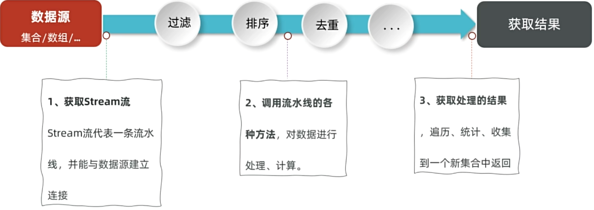
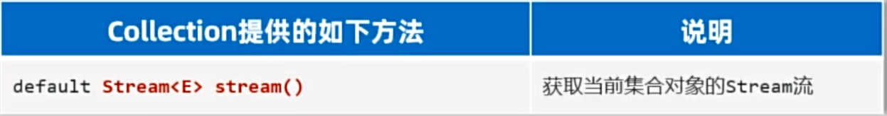
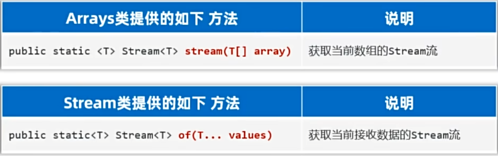
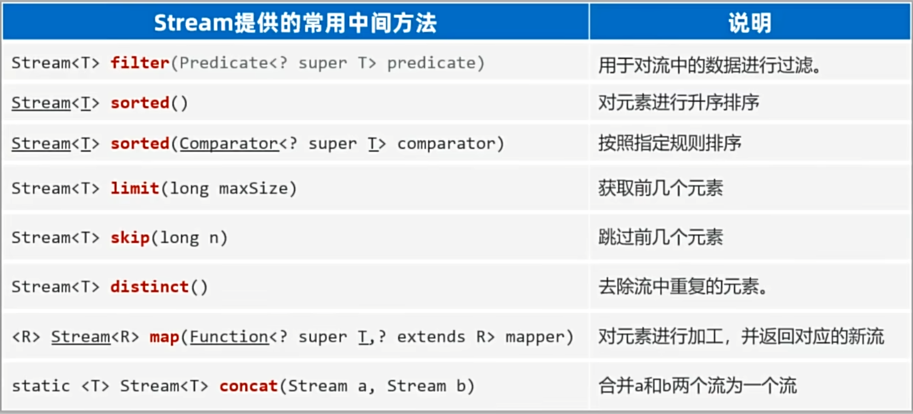
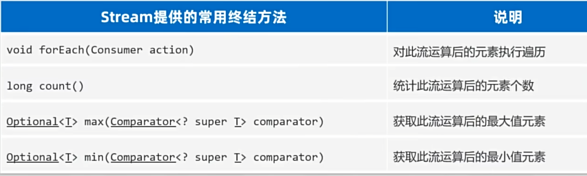
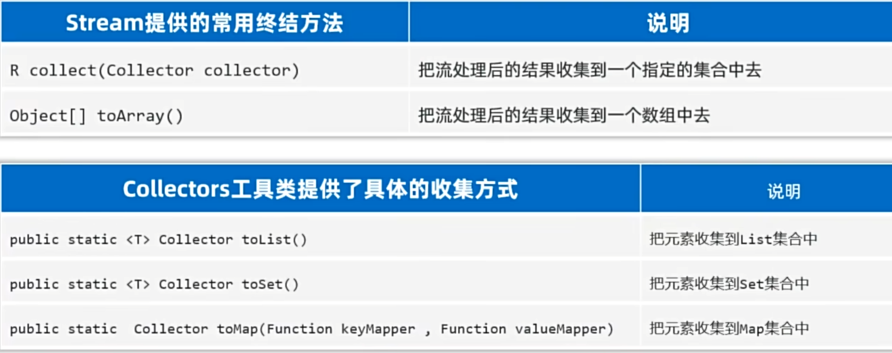
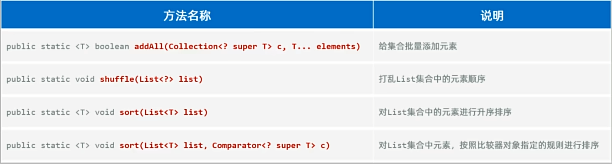

##  一、Set集合


### 1、Set集合的特点

特点：无序：添加数据的顺序和获取出的数据顺序不一致； 不重复； 无索引。

- HashSet：无序、不重复、无索引
- LinkedHashSet：**有序**、不重复、无索引
- TreeSet：**排序**、不重复、无索引

注意：**Set要用到的常用方法，基本上就是Collection提供的！！自己几乎没有额外新增一些常用功能！**

```java
Set<String> set = new HashSet<>(); // 一行经典代码
Set<String> set = new LinkedHashSet<>();
set.add("aaa");
set.add("bbb");
set.add("ccc");
set.add("aaa");
System.out.println(set);// [aaa, ccc, bbb]；[aaa, bbb, ccc]
// 2、创建一个TreeSet集合：排序（默认按大小顺序升序排序），不重复，无索引
Set<Double> set2 = new TreeSet<>();
set2.add(3.14);
set2.add(2.14);
set2.add(1.14);
set2.add(3.14);
System.out.println(set2);// [1.14, 2.14, 3.14]
```

### 2、HashSet集合的底层原理

#### 2.1 哈希值

- 就是一个**int类型**的**随机值**，Java中**每个对象都有一个哈希值**

- Java中所有对象，都可以调用Object类提供的hashCode方法，返回对象自己的哈希值

  ```java
  public int hashCode(); //返回对象的哈希值
  ```

对象哈希值的特点

- 同一个对象多次调用hashCode()方法返回的哈希值是相同的

- **不同的对象，它们的哈希值大概率不相等，但也有可能会相等(哈希碰撞)**

  

#### 2.2 哈希表

**HashSet集合的底层原理**

- 基于哈希表存储数据的

  

- **JDK8之前的哈希表：数组+链表的存储过程**

1. 创建一个默认长度16的数组，默认加载因子为0.75，数组名table

2. 使用元素的**哈希值**对**数组的长度做运算**计算出应存入的位置

3. 判断当前位置是否为null，如果是null直接存入

   

4. **如果不为null，表示有元素，则调用equals方法比较**

   **相等，则不存；不相等，则存入数组**

   - JDK 8之前，新元素存入数组，占老元素位置，老元素挂下面
   - JDK 8开始之后，新元素直接挂在老元素下面

   

- 扩容机制：

  - 哈希表中存储元素总量**超过16*0.75=12**，长度扩容为原来的**2倍**，把元素散开

  - **JDK8开始，当链表长度超过8，且数组长度>=64时，自动将链表转成红黑树**

    

    

#### 2.3 二叉树和红黑树

- 二叉树

  

  二叉查找树存在的问题：**当数据已经是排好序的，导致查询的性能与单链表一样，查询速度变慢！**

- 平衡二叉树（左旋右旋算法）：左右子树高差不超过1

  **在满足查找二叉树的大小规则下，让树尽可能矮小，以此提高查数据的性能**

  

- 红黑树：可以自平衡的二叉树，每条路径黑节点数相同

  **红黑树是一种增删改查数据性能相对都较好的结构**

  

  

#### 2.4 HashSet的特点

- 增删改查数据性能都较好
  - 查数据：用hash值算出位置，通过数组直接能查到（像新华字典）
  - 添加数据：用hash值算出位置，存到对应位置的链表(挂到最后)或红黑树(小左大右)中
  - 删除数据：查到就直接抹除，如果是链表或红黑树，删除都很快，改数据同理
- 问题：不能重复，没有索引，占内存，因为有空位置，每个数据得记位置(链表：记下一个节点的地址，红黑树：记左右节点的位置)

### 3、HashSet集合元素的去重操作

**需求：**

创建一个存储学生对象的集合，存储多个学生对象，要求：多个学生对象的成员变量值相同时，我们就认为是同一个对象，要求只保留一个。

**分析**：

1. 定义学生类，创建HashSet集合对象, 创建学生对象
2. 把学生添加到集合

**问题：**

不同的学生对象，即使数据相同，但哈希值不同，在HashSet中存储的位置不一样，而HashSet中只有在同一位置才会有比较值的操作，==如果希望Set集合认为2个内容一样的对象是重复的，必须重写对象的hashCode()和equals()方法==

```java
// 在学生类中重写方法
@Override
public boolean equals(Object o) {
    if (this == o) return true;// 自己跟自己比
    if (o == null || this.getClass() != o.getClass()) return false;// 和空值或者不是学生类的对象比
    Student student = (Student) o;
    // 如果name、age、address、phone相同，则认为两个对象是相同的，可以去重
    return age == student.age && Objects.equals(name, student.name) && Objects.equals(address, student.address) && Objects.equals(phone, student.phone);
}

@Override
public int hashCode() {
    // 保证了不同学生对象，如果name、age、address、phone相同，hashCode值也相同，保证在HashSet中存储位置一样
    return Objects.hash(name, age, address, phone);
}
```

### 4、LinkedHashSet

- LinkedHashSet：**有序**、不重复、无索引
- 依然是基于哈希表(**数组、链表、红黑树**)实现的。
- **但是，它的每个元素都额外的多了一个双链表的机制记录它前后元素的位置。**


### 5、TreeSet集合

- 特点：不重复、无索引、**可排序（默认升序排序 ，按照元素的大小，由小到大排序）**
- 底层是基于红黑树实现的排序

**注意：**

- 对于数值类型：Integer , Double，默认按照数值本身的大小进行升序排序。

- 对于字符串类型：默认按照首字符的编号升序排序。

- **对于自定义类型如Student对象，TreeSet默认是无法直接排序的。**

  解决方法

  - 让自定义对象实现Comparable接口，重写compareTo方法，指定排序的规则
  - 让TreeSet集合使用public TreeSet (Comparator c)比较器对象，指定排序的规则
  - 注意：如果同时出现两种方法，以TreeSet里面的Comparator比较器为主

  ```java
   // TreeSet集合默认不能给自定义对象排序，因为不知道大小规则
  // 两种方案解决：
  // 方法一：让自定义对象实现Comparable接口，重写compareTo方法，指定排序的规则
  @Data
  @NoArgsConstructor
  @AllArgsConstructor
  public class Teacher implements Comparable<Teacher> {
      private String name;
      private int age;
      private double salary;
  
      @Override
      public String toString() {
          return "Teacher{" +
                  "name='" + name + '\'' +
                  ", age=" + age +
                  ", salary='" + salary + '\'' +
                  '}' + '\n';
      }
  
      // t1.compareTo(t2)
      // this = t2 ，比较者
      // o = t1 ， 被比较者
      // 如果左边大于右边，要返回正整数
      // 如果左边小于右边，要返回负整数
      // 如果左边等于右边，要返回0
      // 默认升序
      @Override
      public int compareTo(Teacher o) {
          // 按照年龄升序排序
          return this.getAge() - o.getAge();
      }
  }
  
  // 方法二：让TreeSet集合使用public TreeSet (Comparator c)比较器对象，指定排序的规则
  public class SetDemo3 {
      public static void main(String[] args) {
          // 目标：搞清楚TreeSet集合对于自定义对象的排序
          // Set<Teacher> teachers = new TreeSet<>(((o1, o2) -> o2.getAge() - o1.getAge()));
          Set<Teacher> teachers = new TreeSet<>(new Comparator<Teacher>() {
              @Override
              public int compare(Teacher o1, Teacher o2) {
                  return o2.getAge() - o1.getAge();// 年龄降序
                  // Double.compare(o2.getSalary(), o1.getSalary());// 薪水降序
              }
          });
          teachers.add(new Teacher("小明", 12, 6000));
          teachers.add(new Teacher("小花", 14, 4444));
          teachers.add(new Teacher("小红", 15, 8888));
          teachers.add(new Teacher("小王", 14, 7000.78));
          System.out.println(teachers);
      }
  }
  ```

### 6、Collection集合(List和Set)总结


## 二、Map集合

### 1、认识Map集合

- Map集合也被叫做“键值对集合”，格式：{key1=value1 , key2=value2 , key3=value3 , ...}

- Map集合的所有键是不允许重复的，但值可以重复，键和值是一一对应的，每一个键只能找到自己对应的值

  

- **应用场景**：**需要存储一一对应的数据时，就可以考虑使用Map集合来做**

### 2、Map集合的体系


- **Map集合体系的特点**：

  注意：Map系列集合的特点都是由键决定的，值只是一个附属品，值是不做要求的

  - HashMap（由键决定特点）: **无序**、不重复、无索引； **（用的最多）**

  - LinkedHashMap （由键决定特点）: 由键决定的特点：**有序**、不重复、无索引。

  - TreeMap （由键决定特点）: **按照键大小默认升序排序**、不重复、无索引。（不允许键为空）

### 3、Map集合的常用方法

- Map是双列集合的祖宗，它的功能是全部双列集合都可以继承过来使用的。


### 4、Map集合的遍历方式


1. 键找值

   

   ```java
   // 方式一：通过键找值
   Set<String> keys = map.keySet();
   for (String key : keys) {
       Integer value = map.get(key);
       System.out.println(key + "=" + value);
   ```

2. 键值对(难)

   

   ```java
   // 方式二：通过键值对遍历
   // 把Map类型转换成Set集合，里面的元素类型都是键值对类型(Map.Entry<String, Integer>)
   /**
   * map = { 李四=99, 张三=100, 王五=98, 赵六=96 }
   * ↓
   * map.entrySet()
   * ↓
   * Set<Map.Entry<String, Integer>> entries = [(李四=99), (张三=100), (王五=98), (赵六=96)]
   */
   
   Set<Map.Entry<String, Integer>> entries = map.entrySet();
   for (Map.Entry<String, Integer> entry : entries) {
       String key = entry.getKey();
       Integer value = entry.getValue();
       System.out.println(key + "=" + value);
   }
   ```

3. Lambda表达式

   

   ```java
   // 方式三：通过Lambda表达式遍历
   // map.forEach(new BiConsumer<String, Integer>() {
   //     @Override
   //     public void accept(String key, Integer value) {
   //         System.out.println(key + "=" + value);
   //     }
   // });
   
   map.forEach((k,v)-> System.out.println(k + "=" + v));
   ```

### 5、**Map集合的案例统计投票信息**

**需求**

- 某个班级80名学生，现在需要组织秋游活动，班长提供了四个景点依次是（A、B、C、D）,每个学生只能选择一个景点，请统计出最终哪个景点想去的人数最多。

**分析**

- 将80个学生的选择放到程序里
- 建立Map集合统计各景点人数
- 选出人数最多的景点

**代码**

```java
package com.itheima.demo2map;

import java.util.*;

public class MapDemo4 {
    public static void main(String[] args) {
        // 1、随机生成80个学生选择的景点
        Random r = new Random();
        String[] names = {"A", "B", "C", "D"};
        List<String> locations = new ArrayList<>();
        for (int i = 0; i < 80; i++) {
            int num = r.nextInt(4);
            locations.add(names[num]);
        }

        // 2、统计景点出现的次数
        Map<String, Integer> summary = new HashMap<>();
        for (String location : locations) {
            // if (summary.containsKey(location)) {
            //     summary.put(location, summary.get(location) + 1);
            // } else {
            //     summary.put(location, 1);
            // }
            summary.put(location, summary.containsKey(location) ? summary.get(location) + 1 : 1);
        }
        System.out.println(summary);


        // 3、找出出现次数最多的景点
        // Set<Map.Entry<String, Integer>> entries = summary.entrySet();
        // int max = 0;
        // String a = "";
        // for (Map.Entry<String, Integer> entry : entries){
        //     if(entry.getValue() > max){
        //         max = entry.getValue();
        //         a = entry.getKey();
        //     }
        // }
        // System.out.println(a);
        summary.forEach((k,v)->{
            if(Objects.equals(v, Collections.max(summary.values()))){
                System.out.println(k);
            }
        });
    }
}
```

### 6、Map集合和Set集合的关系

Set底层就是一个只有键的Map

- HashMap跟HashSet的底层原理是一模一样的，都是基于哈希表实现的。

**实际上：原来学的Set系列集合的底层就是基于Map实现的，只是Set集合中的元素只要键数据，不要值数据而已。**

```java
public HashSet() {
    map = new HashMap<>();
}
```

- LinkedHashMap底层数据结构依然是基于哈希表实现的，只是每个键值对元素又额外的多了一个双链表的机制记录元素顺序(保证有序)

**实际上：原来学习的LinkedHashSet集合的底层原理就是LinkedHashMap。LinkedHashMap每次存的都是Entry对象。**

- TreeMap跟TreeSet集合的底层原理是一样的，都是基于红黑树实现的排序

  **TreeMap集合同样也支持两种方式来指定排序规则**

  - 让类实现Comparable接口，重写比较规则。

  - TreeMap集合有一个有参数构造器，支持创建Comparator比较器对象，以便用来指定比较规则。

    ```java
    package com.itheima.demo2map;
    
    import java.util.TreeMap;
    
    public class MapDemo5 {
        public static void main(String[] args) {
            // 目标：TreeMap集合(原理和用法和TreeSet一样)
            // 按照薪水降序排序
            TreeMap<Teacher, String> map = new TreeMap<>((o1, o2) -> Double.compare(o2.getSalary(), o1.getSalary()));
            map.put(new Teacher("张三", 20, 7000), "北京");
            map.put(new Teacher("李四", 18, 6000), "上海");
            map.put(new Teacher("王五", 19, 9000), "深圳");
            map.put(new Teacher("赵六", 23, 8000), "广州");
            System.out.println(map);
        }
    }
    // {Teacher{name='王五', age=19, salary='9000.0'}
    // =深圳, Teacher{name='赵六', age=23, salary='8000.0'}
    // =广州, Teacher{name='张三', age=20, salary='7000.0'}
    // =北京, Teacher{name='李四', age=18, salary='6000.0'}
    // =上海}
    ```


## 三、Stream流

### 1、认识Stream流

- 是JDK8开始新增的一套API(java.util.stream.*)，**可以用于操作集合或者数组的数据**

- 优势：**Stream流大量的结合了Lambda的语法风格来编程**，功能强大，性能高效，**代码简洁，可读性好**。

  ```java
  package com.itheima.demo3stream;
  
  import java.util.ArrayList;
  import java.util.List;
  
  public class StreamDemo1 {
      public static void main(String[] args) {
          // 目标：认识Stream流，掌握其基本步骤，体会他的优势和特点
          List<String> list = new ArrayList<>();
          list.add("张无忌");
          list.add("周芷若");
          list.add("赵敏");
          list.add("张强");
          list.add("张三丰");
  
          // 找出姓张的人，且名字为三个字，存入新集合
          // 1、用传统方法
          List<String> list2 = new ArrayList<>();
          for (String name : list) {
              if (name.startsWith("张") && name.length() == 3) {
                  list2.add(name);
              }
          }
          System.out.println(list2); // [张无忌, 张三丰]
  
          // 2、用Stream流
          List<String> newList2 = list.stream()
                              .filter(name -> name.startsWith("张"))
                              .filter(name -> name.length() == 3)
                              .collect(Collectors.toList());
          System.out.println(newList2);// [张无忌, 张三丰]
      }
  }
  ```

- Stream流的使用步骤

  

### 2、Stream流的获取

- 获取Stream流

  - 获取**集合**的Stream流

    

  - 获取**数组**的Stream流

    

  ```java
  package com.itheima.demo3stream;
  
  import java.util.*;
  import java.util.stream.Stream;
  
  public class StreamDemo2 {
      public static void main(String[] args) {
          // 1.获取集合对象的Stream流
          Collection<String> list = new ArrayList<>();
          Stream<String> s1 = list.stream();
  
          // 2、Map集合的Stream流
          Map<String, Integer> map = new HashMap<>();
          // 获取键流
          Stream<String> s2 = map.keySet().stream();
          // 获取值流
          Stream<Integer> s3 = map.values().stream();
          // 获取键值对流
          Stream<Map.Entry<String, Integer>> s4 = map.entrySet().stream();
  
          // 3、数组的Stream流
          String[] arr = new String[]{"张三", "李四", "王五"};
          Stream<String> s5 = Arrays.stream(arr);
          Stream<String> s6 = Stream.of(arr);
          Stream<String> s7 = Stream.of("张三", "李四", "王五", "赵六");// 可变参数，给一个、多个或者数组
          
      }
  }
  ```

### 3、Stream流的方法

- 中间方法指的是调用完成后会返回新的Stream流，可以继续使用(支持链式编程)



```java
package com.itheima.demo3stream;

import java.util.ArrayList;
import java.util.List;
import java.util.stream.Stream;

public class StreamDemo3 {
    public static void main(String[] args) {
        // 目标：掌握Stream流中常用方法，对流上数据进行处理（返回新流：链式编程）
        List<String> list = new ArrayList<>();
        list.add("张无忌");
        list.add("周芷若");
        list.add("赵敏");
        list.add("张强");
        list.add("张三丰");

        // 1、过滤方法
        list.stream().filter(name -> name.startsWith("张") && name.length()==3).forEach(System.out::println);

        // 2、排序方法
        List<Double> scores = new ArrayList<>();
        scores.add(99.5);
        scores.add(66.5);
        scores.add(88.5);
        scores.add(77.5);
        scores.add(77.5);

        scores.stream().sorted((o1, o2) -> Double.compare(o2, o1)).forEach(System.out::println);// 降序
        System.out.println("=====");
        scores.stream().sorted().limit(2).forEach(System.out::println);// 升序，只要前两名
        System.out.println("=====");
        scores.stream().sorted().skip(2).forEach(System.out::println);// 升序，跳过前两名
        System.out.println("=====");
        // 如果希望自定义对象能够去重复，重写对象的hashCode和equals方法
        scores.stream().sorted().distinct().skip(2).forEach(System.out::println);// 升序，去重，跳过前两名
        System.out.println("=====");

        // 3、映射/加工方法: 把流上原来的数据拿出来变成新数据又放到流上去
        scores.stream().map(s -> "加十分后" + (s+10)).forEach(System.out::println);
        System.out.println("=====");

        // 4、合并流：两个流数据拼接成一个流
        Stream<String> s1 = Stream.of("张无忌", "赵敏", "周芷若");
        Stream<Integer> s2 = Stream.of(4, 5, 6);
        Stream<Object> s3 = Stream.concat(s1, s2);
        s3.forEach(System.out::println);

    }
}
```

### 4、Stream流的终结方法

- 终结方法指的是调用完成后，不会返回新的流，没法继续使用流了



```java
package com.itheima.demo3stream;

import java.util.ArrayList;
import java.util.List;
import java.util.Optional;

public class StreamDemo4 {
    public static void main(String[] args) {
        // 目标：掌握Stream流的终结方法
        List<Teacher> list = new ArrayList<>();
        list.add(new Teacher("张无忌", 18, 9999.9));
        list.add(new Teacher("赵敏", 20, 8888.8));
        list.add(new Teacher("周芷若", 16, 7777.7));
        list.add(new Teacher("金毛狮王", 60, 16666.6));
        // 1、终结方法：forEach遍历
        list.stream().filter(t -> t.getSalary() > 8000).forEach(System.out::println);
        System.out.println("=====");
        // 2、终结方法：count统计个数
        long count = list.stream().filter(t -> t.getSalary() > 8000).count();
        System.out.println(count);
        System.out.println("=====");
        // 3、终结方法：max获取最大值/min获取最小值
        Optional<Teacher> max = list.stream().max((t1, t2) -> Double.compare(t1.getSalary(), t2.getSalary()));
        Teacher maxTeacher = max.get();// 获取Optional对象中的元素
        System.out.println(maxTeacher);
    }
}
```

- 收集Stream流：就是把Stream流操作后的结果转回到集合或者数组中去返回。
- Stream流：方便操作集合/数组的手段；集合/数组：才是开发中的目的



```java
// 收集到集合中去
Stream<String> s1 =  names.stream().filter(name -> name.startsWith("张") && name.length()==3);
List<String> newList = s1.collect(Collectors.toList());
System.out.println(newList);

// 收集到Set集合中去
// Set<String> newSet = s1.collect(Collectors.toSet());// 报错，只能收集一次
Stream<String> s2 =  names.stream().filter(name -> name.startsWith("张") && name.length()==3);
Set<String> newSet = s2.collect(Collectors.toSet());
System.out.println(newSet);

// 收集到数组中去
Stream<String> s3 =  names.stream().filter(name -> name.startsWith("张") && name.length()==3);
Object[] arr = s3.toArray();
System.out.println("数组: "+ Arrays.toString(arr));

// 收集到Map集合中去:键是老师名称，值是老师薪水,按薪水降序排序
// Map<String, Double> map = list.stream()
//         .collect(Collectors.toMap(new Function<Teacher, String>() {
//             @Override
//             public String apply(Teacher teacher) {
//                 return teacher.getName();
//             }
//         }, new Function<Teacher, Double>() {
//             @Override
//             public Double apply(Teacher teacher) {
//                 return teacher.getSalary();
//             }
//         }));
Map<String, Double> map = list.stream().collect(Collectors.toMap(Teacher::getName, Teacher::getSalary));
System.out.println(map);
```

## 四、综合小案例：斗地主游戏

### 1、前置知识：可变参数、Collections

- 方法中的可变参数：就是一种特殊的形参，定义在方法、构造器的形参列表里，格式是：**数据类型... 参数名称**
- **可变参数的特点和好处**
  - 特点：可以不传数据给它；可以传一个或同时传多个数据给它；也可以传一个数组给它。
  - 好处：常常用来灵活接收数据。
- **可变参数的注意事项**
  - **可变参数在方法内部就是一个数组**
  - 一个形参列表中，可变参数只能有一个
  - 可变参数必须放在形参列表的最后面

```java
package com.itheima.demo4test;

public class ParamDemo1 {
    public static void main(String[] args) {
        // 目标：认识可变参数
        show();// 不传参数
        System.out.println("====");
        show(1);// 传一个参数
        System.out.println("====");
        show(1,2,3);// 传多个参数
        System.out.println("====");
        show(new int[]{1,2,3,4});// 传一个数组
    }

    // 注意：可变参数只能是最后一个参数，只能有一个
    public static void show(int... arr) {
        // 可变参数对内实际上就是数组，arr就是数组
        for (int i : arr) {
            System.out.println(i);
        }
        System.out.println(arr.length);
    }
}
```

- Collections工具类：用来**操作集合**的工具类

- Collections提供的静态方法

  

```java
package com.itheima.demo4test;

import java.util.ArrayList;
import java.util.Collections;
import java.util.List;

public class CollectionsDemo2 {
    public static void main(String[] args) {
        // 目标：Collections工具类
        List<String> list = new ArrayList<>();
        // list.add("张无忌");
        // list.add("周芷若");
        // list.add("赵敏");
        // list.add("张强");
        // list.add("张三丰");
        // 1、Collections批量添加
        Collections.addAll(list, "张无忌","周芷若", "赵敏", "张强", "张三丰");
        System.out.println(list);

        // 2、打乱顺序
        Collections.shuffle(list);
        System.out.println(list);

        // 3、Collections排序：按长度升序排序
        Collections.sort(list, (o1, o2) -> o1.length() - o2.length());
        System.out.println(list);
    }
}
```

### 2、案例：斗地主游戏

需求：

- 总共有54张牌
- 点数：3, 4, 5, 6, 7, 8, 9, 10, J, Q, K, A, 2
- 花色："♠", "♥", "♣", "♦"
- 大小王："大王🃏", "小王🃏"
- 斗地主：发出51张牌，剩下3张作为底牌

分析实现：

- 启动游戏房间的时候，应提前准备好54张牌
- 接着，需要完成洗牌、发牌、对牌排序、看牌

代码：

- 创建卡牌对象

  ```java
  package com.itheima.demo4test;
  
  import lombok.AllArgsConstructor;
  import lombok.Data;
  import lombok.NoArgsConstructor;
  
  @Data
  @AllArgsConstructor
  @NoArgsConstructor
  public class Card {
      private String size;
      private String color;
      private int num; // 表示牌的大小
  
      @Override
      public String toString() {
          return color+size;
      }
  }
  ```

- 创建游戏房间类

  ```java
  package com.itheima.demo4test;
  
  import java.util.*;
  
  public class Room {
      // 1、准备好54张牌，给房间使用：定义一个集合容器装54张牌
      private ArrayList<Card> allCards = new ArrayList<>();
      // 2、初始化54张牌，放到集合中
      {
          // 3、准备点数
          String[] sizes = {"3","4","5","6","7","8","9","10","J","Q","K","A","2"};
          // 4、准备花色
          String[] colors = {"♠", "♥", "♣", "♦"};
          // 5、组合点数和花色，得到54张牌
          int num = 0;
          for (String size : sizes) {
              num ++;
              for (String color : colors) {
                  // 6、创建一个牌对象，把点数和花色封装到对象中
                  Card card = new Card(size, color, num);
                  // 7、把牌对象放到集合中
                  allCards.add(card);
              }
          }
          Collections.addAll(allCards, new Card("","🂠",++num), new Card("","🃏",++num));
          System.out.println("新牌是: " + allCards);
      }
  
      public void start(){
          // 8、洗牌，打乱牌的顺序
          Collections.shuffle(allCards);
          System.out.println("洗牌后: " + allCards);
  
          // 9、发牌，定义3个玩家：有朝政、无忌、赵敏
          Map<String, List<Card>> players = new HashMap<>();
          List<Card> ycz = new ArrayList<>();
          players.put("有朝政", ycz);
          List<Card> wj = new ArrayList<>();
          players.put("无忌", wj);
          List<Card> zm = new ArrayList<>();
          players.put("赵敏", zm);
  
          // 只发出51张牌
          for (int i = 0; i < allCards.size()-3; i++) {
              Card card = allCards.get(i);
              // 判断当前牌发给谁
              if (i % 3 == 0) {
                  ycz.add(card);
              } else if (i % 3 == 1) {
                  wj.add(card);
              } else {
                  zm.add(card);
              }
          }
  
          // 10、拿最后三张牌
          List<Card> lastCards = allCards.subList(allCards.size()-3, allCards.size());
          System.out.println("底牌是: " + lastCards);
          String dizhu = "有朝政";
          players.get(dizhu).addAll(lastCards);
  
          // 11、对牌进行排序
          sortCards(ycz);
          sortCards(wj);
          sortCards(zm);
  
          // 12、看牌
          for (Map.Entry<String, List<Card>> entry : players.entrySet()){
              // 获取玩家名称
              String name = entry.getKey();
              // 获取玩家的牌
              List<Card> card = entry.getValue();
              // 输出各个玩家的牌
              System.out.println(name + "的牌是: " + card);
          }
      }
      
      // 降序排序
      private void sortCards(List<Card> cards) {
          cards.sort((o1, o2) -> o1.getNum() - o2.getNum());
      }
  
      // private void sortCards(List<Card> cards){
      //     Map<String, Integer> map = new HashMap<>();
      //     String[] sizes = {"3","4","5","6","7","8","9","10","J","Q","K","A","2",""};
      //     for (int i = 0; i < sizes.length; i++) {
      //         map.put(sizes[i], i);
      //     }
      //     Collections.sort(cards, (o1, o2) -> map.get(o1.getSize()) - map.get(o2.getSize()));
      // }
  }
  ```

- 创建主函数

  ```java
  package com.itheima.demo4test;
  
  public class Game {
      public static void main(String[] args) {
          // 目标：开发斗地主游戏
          // 1、每张牌都是一个对象，定义牌类
          // 2、游戏房间也是一个对象，定义房间类（54张牌，开始启动）
          Room room = new Room();
          room.start();
      }
  }
  ```

