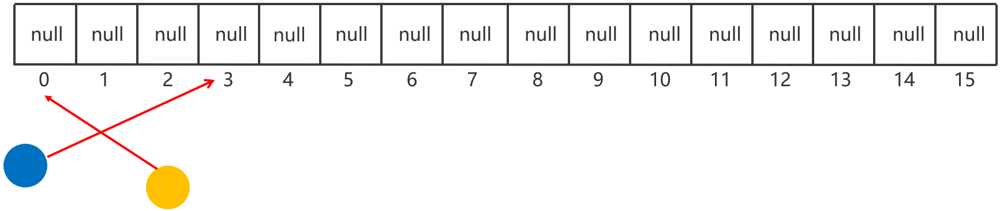

## 一、Set集合


### 1、Set集合的特点

特点：无序：添加数据的顺序和获取出的数据顺序不一致； 不重复； 无索引。

- HashSet：无序、不重复、无索引
- LinkedHashSet：**有序**、不重复、无索引
- TreeSet：**排序**、不重复、无索引

注意：**Set要用到的常用方法，基本上就是Collection提供的！！自己几乎没有额外新增一些常用功能！**

```java
Set<String> set = new HashSet<>(); // 一行经典代码
Set<String> set = new LinkedHashSet<>();
set.add("aaa");
set.add("bbb");
set.add("ccc");
set.add("aaa");
System.out.println(set);// [aaa, ccc, bbb]；[aaa, bbb, ccc]
// 2、创建一个TreeSet集合：排序（默认按大小顺序升序排序），不重复，无索引
Set<Double> set2 = new TreeSet<>();
set2.add(3.14);
set2.add(2.14);
set2.add(1.14);
set2.add(3.14);
System.out.println(set2);// [1.14, 2.14, 3.14]
```

### 2、HashSet集合的底层原理

#### 2.1 哈希值

- 就是一个**int类型**的**随机值**，Java中**每个对象都有一个哈希值**

- Java中所有对象，都可以调用Object类提供的hashCode方法，返回对象自己的哈希值

  ```java
  public int hashCode(); //返回对象的哈希值
  ```

对象哈希值的特点

- 同一个对象多次调用hashCode()方法返回的哈希值是相同的

- **不同的对象，它们的哈希值大概率不相等，但也有可能会相等(哈希碰撞)**

  

#### 2.2 哈希表

**HashSet集合的底层原理**

- 基于哈希表存储数据的

  

- **JDK8之前的哈希表：数组+链表的存储过程**

1. 创建一个默认长度16的数组，默认加载因子为0.75，数组名table

2. 使用元素的**哈希值**对**数组的长度做运算**计算出应存入的位置

3. 判断当前位置是否为null，如果是null直接存入

   

4. **如果不为null，表示有元素，则调用equals方法比较**

   **相等，则不存；不相等，则存入数组**

   - JDK 8之前，新元素存入数组，占老元素位置，老元素挂下面
   - JDK 8开始之后，新元素直接挂在老元素下面

   

- 扩容机制：

  - 哈希表中存储元素总量**超过16*0.75=12**，长度扩容为原来的**2倍**，把元素散开

  - **JDK8开始，当链表长度超过8，且数组长度>=64时，自动将链表转成红黑树**

    

    

#### 2.3 二叉树和红黑树

- 二叉树

  

  二叉查找树存在的问题：**当数据已经是排好序的，导致查询的性能与单链表一样，查询速度变慢！**

- 平衡二叉树（左旋右旋算法）：左右子树高差不超过1

  **在满足查找二叉树的大小规则下，让树尽可能矮小，以此提高查数据的性能**

  

- 红黑树：可以自平衡的二叉树，每条路径黑节点数相同

  **红黑树是一种增删改查数据性能相对都较好的结构**

  

  

#### 2.4 HashSet的特点

- 增删改查数据性能都较好
  - 查数据：用hash值算出位置，通过数组直接能查到（像新华字典）
  - 添加数据：用hash值算出位置，存到对应位置的链表(挂到最后)或红黑树(小左大右)中
  - 删除数据：查到就直接抹除，如果是链表或红黑树，删除都很快，改数据同理
- 问题：不能重复，没有索引，占内存，因为有空位置，每个数据得记位置(链表：记下一个节点的地址，红黑树：记左右节点的位置)

### 3、HashSet集合元素的去重操作

**需求：**

创建一个存储学生对象的集合，存储多个学生对象，要求：多个学生对象的成员变量值相同时，我们就认为是同一个对象，要求只保留一个。

**分析**：

1. 定义学生类，创建HashSet集合对象, 创建学生对象
2. 把学生添加到集合

**问题：**

不同的学生对象，即使数据相同，但哈希值不同，在HashSet中存储的位置不一样，而HashSet中只有在同一位置才会有比较值的操作，==如果希望Set集合认为2个内容一样的对象是重复的，必须重写对象的hashCode()和equals()方法==

```java
// 在学生类中重写方法
@Override
public boolean equals(Object o) {
    if (this == o) return true;// 自己跟自己比
    if (o == null || this.getClass() != o.getClass()) return false;// 和空值或者不是学生类的对象比
    Student student = (Student) o;
    // 如果name、age、address、phone相同，则认为两个对象是相同的，可以去重
    return age == student.age && Objects.equals(name, student.name) && Objects.equals(address, student.address) && Objects.equals(phone, student.phone);
}

@Override
public int hashCode() {
    // 保证了不同学生对象，如果name、age、address、phone相同，hashCode值也相同，保证在HashSet中存储位置一样
    return Objects.hash(name, age, address, phone);
}
```

### 4、LinkedHashSet

- LinkedHashSet：**有序**、不重复、无索引
- 依然是基于哈希表(**数组、链表、红黑树**)实现的。
- **但是，它的每个元素都额外的多了一个双链表的机制记录它前后元素的位置。**


### 5、TreeSet集合

- 特点：不重复、无索引、**可排序（默认升序排序 ，按照元素的大小，由小到大排序）**
- 底层是基于红黑树实现的排序

**注意：**

- 对于数值类型：Integer , Double，默认按照数值本身的大小进行升序排序。

- 对于字符串类型：默认按照首字符的编号升序排序。

- **对于自定义类型如Student对象，TreeSet默认是无法直接排序的。**

  解决方法

  - 让自定义对象实现Comparable接口，重写compareTo方法，指定排序的规则
  - 让TreeSet集合使用public TreeSet (Comparator c)比较器对象，指定排序的规则
  - 注意：如果同时出现两种方法，以TreeSet里面的Comparator比较器为主

  ```java
   // TreeSet集合默认不能给自定义对象排序，因为不知道大小规则
  // 两种方案解决：
  // 方法一：让自定义对象实现Comparable接口，重写compareTo方法，指定排序的规则
  @Data
  @NoArgsConstructor
  @AllArgsConstructor
  public class Teacher implements Comparable<Teacher> {
      private String name;
      private int age;
      private double salary;
  
      @Override
      public String toString() {
          return "Teacher{" +
                  "name='" + name + '\'' +
                  ", age=" + age +
                  ", salary='" + salary + '\'' +
                  '}' + '\n';
      }
  
      // t1.compareTo(t2)
      // this = t2 ，比较者
      // o = t1 ， 被比较者
      // 如果左边大于右边，要返回正整数
      // 如果左边小于右边，要返回负整数
      // 如果左边等于右边，要返回0
      // 默认升序
      @Override
      public int compareTo(Teacher o) {
          // 按照年龄升序排序
          return this.getAge() - o.getAge();
      }
  }
  
  // 方法二：让TreeSet集合使用public TreeSet (Comparator c)比较器对象，指定排序的规则
  public class SetDemo3 {
      public static void main(String[] args) {
          // 目标：搞清楚TreeSet集合对于自定义对象的排序
          // Set<Teacher> teachers = new TreeSet<>(((o1, o2) -> o1.getSalary() - o2.getSalary()));
          Set<Teacher> teachers = new TreeSet<>(new Comparator<Teacher>() {
              @Override
              public int compare(Teacher o1, Teacher o2) {
                  return o2.getAge() - o1.getAge();// 年龄降序
                  // Double.compare(o2.getSalary(), o1.getSalary());// 薪水降序
              }
          });
          teachers.add(new Teacher("小明", 12, 6000));
          teachers.add(new Teacher("小花", 14, 4444));
          teachers.add(new Teacher("小红", 15, 8888));
          teachers.add(new Teacher("小王", 14, 7000.78));
          System.out.println(teachers);
      }
  }
  ```

### 6、Collection集合(List和Set)总结


## 二、Map集合

### 1、认识Map集合

- Map集合也被叫做“键值对集合”，格式：{key1=value1 , key2=value2 , key3=value3 , ...}

- Map集合的所有键是不允许重复的，但值可以重复，键和值是一一对应的，每一个键只能找到自己对应的值

  

- **应用场景**：**需要存储一一对应的数据时，就可以考虑使用Map集合来做**

### 2、Map集合的体系


- **Map集合体系的特点**：

  注意：Map系列集合的特点都是由键决定的，值只是一个附属品，值是不做要求的

  - HashMap（由键决定特点）: **无序**、不重复、无索引； **（用的最多）**

  - LinkedHashMap （由键决定特点）: 由键决定的特点：**有序**、不重复、无索引。

  - TreeMap （由键决定特点）: **按照键大小默认升序排序**、不重复、无索引。（不允许键为空）

### 3、Map集合的常用方法

- Map是双列集合的祖宗，它的功能是全部双列集合都可以继承过来使用的。


### 4、Map集合的遍历方式


1. 键找值

   

   ```java
   // 方式一：通过键找值
   Set<String> keys = map.keySet();
   for (String key : keys) {
       Integer value = map.get(key);
       System.out.println(key + "=" + value);
   ```

2. 键值对(难)

   

   ```java
   // 方式二：通过键值对遍历
   // 把Map类型转换成Set集合，里面的元素类型都是键值对类型(Map.Entry<String, Integer>)
   /**
   * map = { 李四=99, 张三=100, 王五=98, 赵六=96 }
   * ↓
   * map.entrySet()
   * ↓
   * Set<Map.Entry<String, Integer>> entries = [(李四=99), (张三=100), (王五=98), (赵六=96)]
   */
   
   Set<Map.Entry<String, Integer>> entries = map.entrySet();
   for (Map.Entry<String, Integer> entry : entries) {
       String key = entry.getKey();
       Integer value = entry.getValue();
       System.out.println(key + "=" + value);
   }
   ```

3. Lambda表达式

   

   ```java
   // 方式三：通过Lambda表达式遍历
   // map.forEach(new BiConsumer<String, Integer>() {
   //     @Override
   //     public void accept(String key, Integer value) {
   //         System.out.println(key + "=" + value);
   //     }
   // });
   
   map.forEach((k,v)-> System.out.println(k + "=" + v));
   ```

### 5、**Map集合的案例统计投票信息**

**需求**

- 某个班级80名学生，现在需要组织秋游活动，班长提供了四个景点依次是（A、B、C、D）,每个学生只能选择一个景点，请统计出最终哪个景点想去的人数最多。

**分析**

- 将80个学生的选择放到程序里
- 建立Map集合统计各景点人数
- 选出人数最多的景点

**代码**

```java
package com.itheima.demo2map;

import java.util.*;

public class MapDemo4 {
    public static void main(String[] args) {
        // 1、随机生成80个学生选择的景点
        Random r = new Random();
        String[] names = {"A", "B", "C", "D"};
        List<String> locations = new ArrayList<>();
        for (int i = 0; i < 80; i++) {
            int num = r.nextInt(4);
            locations.add(names[num]);
        }

        // 2、统计景点出现的次数
        Map<String, Integer> summary = new HashMap<>();
        for (String location : locations) {
            // if (summary.containsKey(location)) {
            //     summary.put(location, summary.get(location) + 1);
            // } else {
            //     summary.put(location, 1);
            // }
            summary.put(location, summary.containsKey(location) ? summary.get(location) + 1 : 1);
        }
        System.out.println(summary);


        // 3、找出出现次数最多的景点
        // Set<Map.Entry<String, Integer>> entries = summary.entrySet();
        // int max = 0;
        // String a = "";
        // for (Map.Entry<String, Integer> entry : entries){
        //     if(entry.getValue() > max){
        //         max = entry.getValue();
        //         a = entry.getKey();
        //     }
        // }
        // System.out.println(a);
        summary.forEach((k,v)->{
            if(Objects.equals(v, Collections.max(summary.values()))){
                System.out.println(k);
            }
        });
    }
}
```

### 6、Map集合和Set集合的关系

Set底层就是一个只有键的Map

- HashMap跟HashSet的底层原理是一模一样的，都是基于哈希表实现的。

**实际上：原来学的Set系列集合的底层就是基于Map实现的，只是Set集合中的元素只要键数据，不要值数据而已。**

```java
public HashSet() {
    map = new HashMap<>();
}
```

- LinkedHashMap底层数据结构依然是基于哈希表实现的，只是每个键值对元素又额外的多了一个双链表的机制记录元素顺序(保证有序)

**实际上：原来学习的LinkedHashSet集合的底层原理就是LinkedHashMap。LinkedHashMap每次存的都是Entry对象。**

- TreeMap跟TreeSet集合的底层原理是一样的，都是基于红黑树实现的排序

  **TreeMap集合同样也支持两种方式来指定排序规则**

  - 让类实现Comparable接口，重写比较规则。

  - TreeMap集合有一个有参数构造器，支持创建Comparator比较器对象，以便用来指定比较规则。

    ```java
    package com.itheima.demo2map;
    
    import java.util.TreeMap;
    
    public class MapDemo5 {
        public static void main(String[] args) {
            // 目标：TreeMap集合(原理和用法和TreeSet一样)
            // 按照薪水降序排序
            TreeMap<Teacher, String> map = new TreeMap<>((o1, o2) -> Double.compare(o2.getSalary(), o1.getSalary()));
            map.put(new Teacher("张三", 20, 7000), "北京");
            map.put(new Teacher("李四", 18, 6000), "上海");
            map.put(new Teacher("王五", 19, 9000), "深圳");
            map.put(new Teacher("赵六", 23, 8000), "广州");
            System.out.println(map);
        }
    }
    // {Teacher{name='王五', age=19, salary='9000.0'}
    // =深圳, Teacher{name='赵六', age=23, salary='8000.0'}
    // =广州, Teacher{name='张三', age=20, salary='7000.0'}
    // =北京, Teacher{name='李四', age=18, salary='6000.0'}
    // =上海}
    ```

    

