## 一、存储&读写数据的方案

File、IO流

### 1、存储数据的方案

- 传统方案：变量、数组、对象、集合
  - 这些数据容器都**在内存中**，一旦**程序结束，或者断电，数据就没有了**
- File：是java.io.包下的类，File类的对象，用于代表当前操作系统的文件（可以是**文件或者文件夹**）
  - 功能：获取文件信息（大小，文件名，修改时间）、创建/删除文件/文件夹，判断文件类型
  - 缺点：File类只能对文件本身进行操作，**不能读写文件里面存储的数据。**

- IO流：用于**读写数据**的（可以读写文件，或网络中的数据...）

## 二、File

### 1、File类对象的创建

- File类的对象可以代表文件/文件夹，并可以调用其提供的方法对象文件进行操作

- 创建File类的对象

  

- 注意：

  - File对象既可以代表文件、也可以代表文件夹。
  - File封装的对象仅仅是一个路径名，这个路径可以是存在的，也允许是不存在的

- **绝对路径、相对路径：**

  

### 2、判断文件类型、获取文件信息

- **File提供的判断文件类型、获取文件信息功能**

  

  ```java
  // 1、创建File对象，去获取某个文件的信息
  File f1 = new File("D:\\Pictures\\Screenshots\\屏幕截图 2025-03-30 235421.png");
  System.out.println(f1.length());
  System.out.println(f1.getName());
  System.out.println(f1.isFile());// true
  System.out.println(f1.isDirectory());// false
  
  // 2、使用相对路径定位文件对象
  // 绝对路径一般带盘符
  // 相对路径不带盘符，相对当前项目根目录，即该IDEA工程下
  File f2 = new File("day03-file-io/src/ycz.txt");
  System.out.println(f2.length());
  ```

### 3、创建和删除文件

- **File提供的创建和删除文件的方法**

  

  **注意：**delete方法默认**只能删除文件和空文件夹**，删除后的文件不会进入回收站

  ```java
  // 3、创建File对象代表不存在的文件路径
  File f3 = new File("day03-file-io/src/ycz1.txt");
  System.out.println(f3.exists());// 判断是否存在，false
  System.out.println(f3.createNewFile());// 创建文件，返回boolean
  
  // 4、创建File对象代表不存在的文件夹路径
  File f4 = new File("day03-file-io/src/ycz2");
  System.out.println(f4.exists());
  System.out.println(f4.mkdir());// 只能创建一级文件夹
  System.out.println(f4.mkdirs());// 可以创建多级文件夹
  
  // 5、创建File对象代表存在的文件夹，然后删除它
  File f5 = new File("day03-file-io/src/ycz2");
  System.out.println(f5.delete());// 只能删除空文件夹，不能删除非空文件夹
  ```

### 4、遍历文件夹

- **File提供的遍历文件夹的方法**

  

  **使用listFiles方法时的注意事项：**

  |           主调           |                        返回                        |
  | :----------------------: | :------------------------------------------------: |
  | 文件，或者文件路径不存在 |                        null                        |
  |         空文件夹         |                   长度为0的数组                    |
  |      有内容的文件夹      |         所有一级文件和文件夹放在File数组中         |
  |    含隐藏文件的文件夹    | 所有一级文件和文件夹(包含隐藏文件)，放在File数组中 |
  |     没有权限的文件夹     |                        null                        |

  ```java
  // 6、获取目录下的文件名称
  File f6 = new File("D:\\笔记\\notes\\java\\java基础");
  String[] names = f6.list();
  assert names != null;
  for (String name : names) {
      System.out.println(name);
  }
  
  // 7、获取目录下的文件对象
  File[] files = f6.listFiles();
  assert files != null;
  for (File file : files) {
  	System.out.println(file.getAbsolutePath());
  }
  ```

## 三、递归(Recursion)

### 1、什么是递归

- 递归是一种算法，在程序设计语言中广泛应用。
- 从形式上说：方法调用自身的形式称为方法递归（ recursion）。

**递归的形式**

- 直接递归：方法自己调用自己。
- 间接递归：方法调用其他方法，其他方法又回调方法自己。

**使用方法递归时需要注意的问题：**

- 递归如果没有控制好终止，会出现递归死循环，导致栈内存溢出错误

### 2、递归算法和其执行流程

**需求：**计算n的阶乘

**分析：**

- f(n) = 1\*2\*3\*4\*...\*n
- f(n) = n*f(n-1)

```java
package com.itheima.demo2recursion;

public class RecursionDemo1 {
    public static void main(String[] args) {
        // 目标：认识递归
        // 计算n的阶乘
        System.out.println(f(5));

    }

    public static int f(int n) {
        if (n == 1) {
            return 1;
        }
        return n*f(n-1);
    }
}
```

**递归算法的三要素**

- **递归的公式：** **f(n) = f(n-1) \* n;**

- **递归的终结点：f(1)** 

- **递归的方向必须走向终结点：**

  

**例子1：求前n项和**

```java
package com.itheima.demo2recursion;

public class RecursionDemo2 {
    // 求arr的前n项之和
    public static void main(String[] args) {
        int n = 6;
        System.out.println(f(n-1));

    }

    public static int f(int n) {
        int[] arr = {8,9,7,7,9,0,2,3};
        if (n == 0) {
            return arr[0];
        } else{
            return arr[n] + f(n-1);
        }
    }
}
```

例子2：

猴子第一天摘下若干桃子，当即吃了一半，觉得好不过瘾，于是又多吃了一个

第二天又吃了前天剩余桃子数量的一半，觉得好不过瘾，于是又多吃了一个

以后每天都是吃前天剩余桃子数量的一半，觉得好不过瘾，又多吃了一个

等到第10天的时候发现桃子只有1个了

**请问猴子第一天摘了多少个桃子？**

```java
package com.itheima.demo2recursion;
// 递归公式：f(n+1) = 1/2*f(n) - 1 -> f(n) = 2*f(n+1) + 2
// 递归终结点：n==10, return 1;
// 递归方向：f(1) -> f(10), f(10)=1 -> f(1)
public class RecursionDemo3 {
    public static void main(String[] args) {
        System.out.println(f(1  ));

    }

    public static int f(int n){
        if (n==10){
            return 1;
        }else{
            return 2*f(n+1) + 2;
        }
    }
}
```

### 3、文件搜索、文件夹删除

**需求**：从D:盘中，搜索“QQ.exe” 这个文件，找到后直接输出其位置

**分析：**

①先找出D:盘下的所有一级文件对象

②遍历全部一级文件对象，判断是否是文件

③如果是文件，判断是否是自己想要的

④如果是文件夹，需要继续进入到该文件夹，重复上述过程

```java
package com.itheima.demo2recursion;

import java.io.File;
import java.io.IOException;

public class FileSearchTest4 {
    public static void main(String[] args) {
        // 目标：完成文件搜索，找出D:盘下的QQ.exe文件的位置
        File dir = new File("D:\\");

        try {
            searchFile(dir,"QQ.exe");
        } catch (IOException e) {
            throw new RuntimeException(e);
        }
    }

    /**
     * 搜索文件
     * @param dir 搜索的目录
     * @param fileName 搜索的文件名称
     */
    public static void searchFile(File dir, String fileName) throws IOException {
        // 1、判断极端情况
        if (dir == null || !dir.exists() || dir.isFile()){
            return;// 不搜索
        }

        // 2、获取目录下的所有一级文件或者文件夹对象
        File[] files = dir.listFiles();

        // 3、判断当前目录下是否存在一级文件对象，存在才可以遍历
        if (files != null && files.length > 0){
            // 4、遍历一级文件对象
            for(File file : files){
                // 5、判断当前一级文件是否为文件
                if (file.isFile()){
                    // 6、判断当前一级文件名是否与目标文件名相同
                    if (file.getName().contains(fileName)){
                        System.out.println("找到目标文件，目标文件路径为:");
                        System.out.println(file.getAbsolutePath());
                        Runtime r = Runtime.getRuntime();
                        r.exec(file.getAbsolutePath());// 启动
                        return;
                    }
                } else{
                    // 7、如果当前一级文件对象是文件夹，则继续递归调用
                    searchFile(file, fileName);
                }
            }
        }
    }
}
```

**需求：**删除非空文件夹

**分析：**

①File默认不可以删除非空文件夹

②我们需要遍历文件夹，先删除里面的内容，再删除自己。

```java
package com.itheima.demo2recursion;

import java.io.File;
import java.io.IOException;

public class FileDeleteTest5 {
    public static void main(String[] args) {
        File dir = new File("day03-file-io/src/ycz");
        boolean success = deleteFolder(dir);
        if (success) {
            System.out.println("文件夹删除成功: " + dir);
        } else {
            System.out.println("文件夹删除失败（可能不存在）: " + dir);
        }
    }

    public static boolean deleteFolder(File dir){
        if (dir==null||!dir.exists()){
            return false;
        }

        if(dir.isDirectory()) {
            File[] files = dir.listFiles();
            if (files != null) {
                for (File file : files) {
                    deleteFolder(file);
                }
            }
        }

        return dir.delete();
    }
}
```

## 四、字符集

### 1、常见字符集介绍


**标准ASCII字符集**

- [ASCII](‪../java基础/day01-Java基础.md)(American Standard Code for Information Interchange)： 美国信息交换标准代码，包括了英文、符号等
-  标准ASCII使用**1个字节**存储一个字符，**首位是0**，因此，总共可表示128个字符，对美国佬来说完全够用

**GBK（汉字内码扩展规范，国标）**

- 汉字编码字符集，包含了2万多个汉字等字符，GBK中一个中文字符编码成**2个字节**的形式存储。

- 注意：GBK兼容了ASCII字符集，**汉字首位是1**

  

**Unicode字符集(统一码，也叫万国码)**

- Unicode是国际组织制定的，可以容纳世界上所有文字、符号的字符集。
- UTF-32: **4个字节**表示一个字符，可以存42亿多个字符

==**UTF-8字符集(默认都用，最广泛)**==

- 是Unicode字符集的一种编码方案，采取**可变长**编码方案，共分四个长度区：1个字节，2个字节，3个字节，4个字节

- **英文字符、数字**等只占**1个字节**（兼容标准ASCII编码），**汉字**字符占用**3个字节**。

  | **UTF-8编码方式(二进制)**                           |
  | --------------------------------------------------- |
  | **0**xxxxxxx （ASCII码）                            |
  | **110**xxxxx **10**xxxxxx                           |
  | **1110**xxxx **10**xxxxxx **10**xxxxxx              |
  | **11110**xxx **10**xxxxxx **10**xxxxxx **10**xxxxxx |

  

重点：

- ASCII字符集：只有英文、数字、符号等，占1个字节。
- GBK字符集：汉字占2个字节，英文、数字占1个字节。
- UTF-8字符集：汉字占3个字节，英文、数字占1个字节。

注意：

- **字符编码时使用的字符集，和解码时使用的字符集必须一致，==否则会出现乱码==**
- **英文，数字一般不会乱码，因为很多字符集都兼容了ASCII编码**

例子：

a我m 

编码(GBK): 0xxxxxxx 1xxxxxxx xxxxxxxx 0xxxxxxx

解码(UTF-8): 0xxxxxxx ? ? 0xxxxxxx

### 2、字符集的编码、解码操作


```java
package com.itheima.demo3charset;

import java.util.Arrays;

public class CharSetDemo1 {
    public static void main(String[] args) throws Exception {
        // 目标：实现字符编码和解码
        // 1、编码
        String name = "我爱你中国abc666";

        // byte[] bytes = name.getBytes();// 使用平台默认的UTF-8编码,5*3+6*1
        byte[] bytes = name.getBytes("GBK");// 指定GBK进行编码5*2+6*1
        System.out.println(bytes.length);
        System.out.println(Arrays.toString(bytes));

        // 2、解码
        String name2 = new String(bytes);// 平台默认的UTF-8解码
        System.out.println(name2);// 乱码：�Ұ����й�abc666

        String name3 = new String(bytes,"GBK");
        System.out.println(name3);// 正确解码：我爱你中国abc666
    }
}
```

## 五、IO流

### 1、认识IO流

读写文件数据

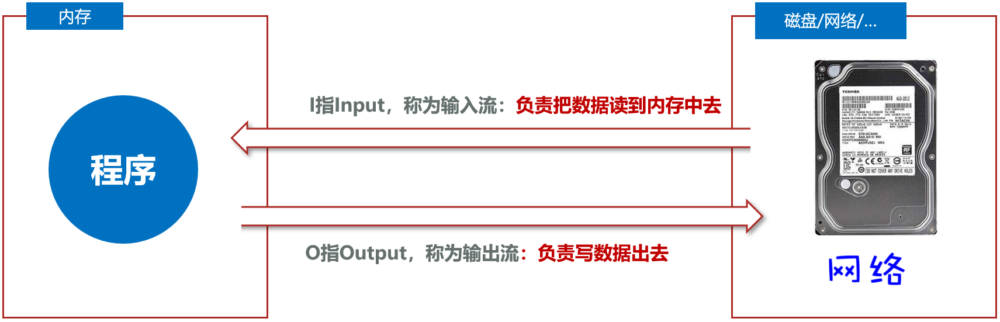

- IO流的分类

  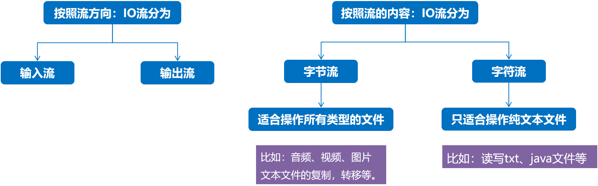

- IO流四大金刚
  - 字节输入流InputStream
  - 字节输出流OutputStream
  - 字符输入流Reader
  - 字符输出流Writer
  
  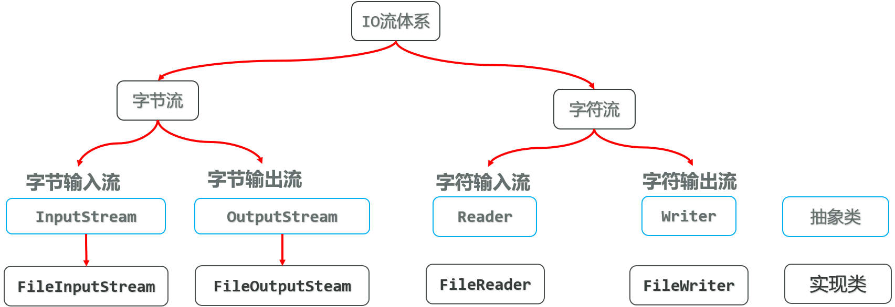

### 2、字节流

#### 2.1 文件字节输入流(FileInputStream)

- 作用：以内存为基准，可以把磁盘文件中的数据以字节的形式读入到内存中去

  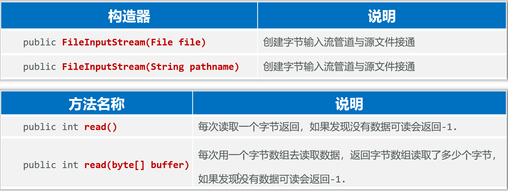

  ```java
  // 1、创建文件字节输入流管道与源文件接通
  InputStream is = new FileInputStream(new File("day03-file-io\\src\\com\\itheima\\ycz.txt"));
  InputStream is = new FileInputStream("day03-file-io\\src\\com\\itheima\\ycz.txt");
  
  // 2.1 每次读取一个字节
  // 定义一个变量记住每次读取的一个字节
  // 问题：每次读1个字节，性能较差，读取汉字会乱码（因为汉字占3个字节）
  int b;
  while((b = is.read()) != -1){
      System.out.print((char) b);
  }
  
  // 2.2 每次读取多个字节
  // 定义一个字节数组，用于每次读取字节
  // 每次读多个，减少硬盘和内存交互次数，提升性能
  // 问题：依然无法避免读取汉字输出乱码的问题，可能存在截断汉字字节的问题
  byte[] buffer = new byte[3];
  // 定义一个变量记住每次读了多少个字节
  int len;
  while ((len = is.read(buffer)) != -1) {
      // 3、把读取的字节数组转换成字符串输出
      // 假设字节为: abc666g
      String str = new String(buffer);// 读出来是: abc 666 g66，最后一个字节不满3位，只替换第1位
      String str = new String(buffer, 0, len);// abc 666 g，从第1个字节开始，读多少倒多少
      System.out.println(str);
  }
  ```

- **问题**

  - 使用FileInputStream每次读取一个字节，读取性能较差，并且读取汉字输出会乱码
  - 使用FileInputStream每次读取多个字节，读取性能得到了提升，但读取汉字输出还是会乱码
  - **可以定义一个与文件一样大的字节数组，一次性读取完文件的全部字节**

- InputStream的提供方法，**一次读取完全部字节**

  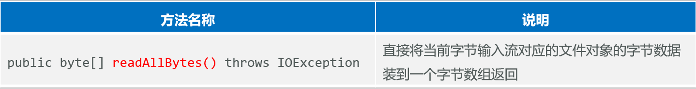

  - 直接把文件数据全部读取到一个字节数组可以避免乱码

  - 但是**如果文件过大，创建的字节数组也会过大，可能引起内存溢出**

- **读取文本**适合用**字符流**；**字节流**适合做**数据的转移**，比如：**文件复制**

#### 2.2 文件字节输出流(FileOutputStream)

- 作用：以内存为基准，把内存中的数据以字节的形式写出到文件中去

  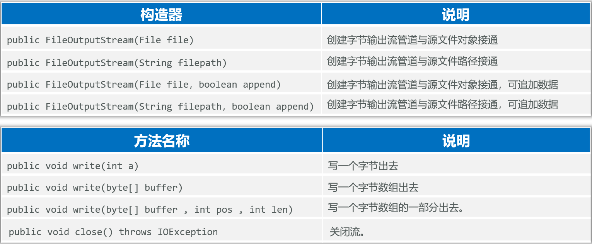

  ```java
  package com.itheima.demo5fileoutputstream;
  
  import java.io.FileNotFoundException;
  import java.io.FileOutputStream;
  import java.io.OutputStream;
  
  public class FileOutputStreamDemo1 {
      public static void main(String[] args) throws Exception {
          // 目标：学会使用文件字节输出流
          // 1、 创建一个文件字节输出流管道与目标文件接通
          // OutputStream fos = new FileOutputStream("day03-file-io\\src\\com\\itheima\\outycz.txt");// 覆盖管道
          OutputStream fos = new FileOutputStream("day03-file-io\\src\\com\\itheima\\outycz.txt", true);// 追加管道
          // 2、写入数据，一个字节
          fos.write(97);// 'a'的ASCII码
          fos.write('a');
          // fos.write('徐'); // 乱码，因为一个中文占3个字节，一个字节不能存中文
          fos.write("\r\n".getBytes()); // 换行
  
          // 3、写入数据，多个字节
          byte[] bytes = "游朝政太牛了".getBytes();
          fos.write(bytes);
          fos.write("\r\n".getBytes());
  
          // 4、写一个字节数组的一部分出去
          fos.write(bytes, 0, 3);// 写0-2字节，一个汉字 游
          fos.write("\r\n".getBytes());
  
          // 5、关闭流
          fos.close(); // 关闭管道，释放资源
      }
  }
  ```

#### 2.3 文件复制和释放资源


- 任何文件的底层都是字节，字节流做复制，是一字不漏的转移完全部字节，只要复制后的文件格式一致就没问题

  ```java
  package com.itheima.demo6copy;
  
  import java.io.*;
  
  public class CopyDemo {
      // 目标：使用字节流完成文件的复制操作
      public static void main(String[] args) {
          // 源文件：D:\Pictures\pic.png
          // 目标文件：D:\Desktop\pic_copy.png
          try {
              copyFile("D:\\Pictures\\pic.png","D:\\Desktop\\pic_copy.png");
          } catch (Exception e) {
              throw new RuntimeException(e);
          }
      }
  
      private static void copyFile(String srcPath, String destPath) throws Exception {
          // 1、创建一个文件字节输入流、输出流管道与源文件相通
          InputStream is = new FileInputStream(srcPath);
          OutputStream os = new FileOutputStream(destPath);
  
          // 2、读取一个字节数组，写入一个字节数组
          byte[] buffer = new byte[1024];
          int len;
          while ((len = is.read(buffer)) != -1) {
              os.write(buffer, 0, len);// 读取多少个字节就写入多少个字节
          }
          System.out.println("复制完成");
  
          os.close();
          is.close();
      }
  }
  ```

- 释放资源，如果直接使用os.close();is.close(); 那么如果释放资源之前程序有误，后面释放资源的操作就不会执行，因此需要改进

  - 改进方法1：try-catch-finally (无论try中的程序是正常执行了，还是出现了异常，最后都一定会执行finally区，除非JVM终止)

    作用：一般用于在程序执行完成后进行资源的释放操作（专业级做法）

    ```java
    package com.itheima.demo6copy;
    
    import java.io.*;
    
    public class CopyDemo1 {
        // 目标：使用字节流完成文件的复制操作
        public static void main(String[] args) {
            // 源文件：D:\Pictures\pic.png
            // 目标文件：D:\Desktop\pic_copy.png
    
            copyFile("D:\\Pictures\\pic.png","D:\\Desktop\\pic_copy.png");
    
        }
    
        private static void copyFile(String srcPath, String destPath) {
            InputStream is = null;
            OutputStream os = null;
            try {
                // 1、创建一个文件字节输入流、输出流管道与源文件相通
                is = new FileInputStream(srcPath);
                os = new FileOutputStream(destPath);
    
                // 2、读取一个字节数组，写入一个字节数组
                byte[] buffer = new byte[1024];
                int len;
                while ((len = is.read(buffer)) != -1) {
                    os.write(buffer, 0, len);// 读取多少个字节就写入多少个字节
                }
                System.out.println("复制完成");
            } catch (Exception e) {
                e.printStackTrace();
            } finally {
                try {
                    if(os != null) os.close();
                } catch (Exception e) {
                    e.printStackTrace();
                }
                try {
                    if(is != null) is.close();
                } catch (Exception e) {
                    e.printStackTrace();
                }
            }
        }
    }
    ```

  - 改进方法2：**JDK 7开始提供了更简单的资源释放方案：try-with-resource**，资源使用完毕后，会自动调用其close()方法，完成对资源的释放

    ```java
    package com.itheima.demo6copy;
    
    import java.io.*;
    
    
    public class CopyDemo2 {
        // 目标：使用字节流完成文件的复制操作
        public static void main(String[] args) {
            // 源文件：D:\Pictures\pic.png
            // 目标文件：D:\Desktop\pic_copy.png
    
            copyFile("D:\\Pictures\\pic.png","D:\\Desktop\\pic_copy.png");
    
        }
    
        private static void copyFile(String srcPath, String destPath) {
            // try(只能放资源对象)
            try(InputStream is = new FileInputStream(srcPath);
                OutputStream os = new FileOutputStream(destPath);) {
                // 2、读取一个字节数组，写入一个字节数组
                byte[] buffer = new byte[1024];
                int len;
                while ((len = is.read(buffer)) != -1) {
                    os.write(buffer, 0, len);// 读取多少个字节就写入多少个字节
                }
                System.out.println("复制完成");
            } catch (Exception e) {
                e.printStackTrace();
            }
        }
    }
    ```

    注意：

    - () 中只能放置资源，否则报错

    - 资源一般指的是最终实现了AutoCloseable接口

      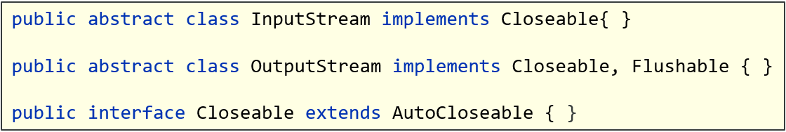

### 3、字符流

#### 3.1 文件字符输入流(FileReader)

- 作用：以内存为基准，可以把文件中的数据以字符的形式读入到内存中去

  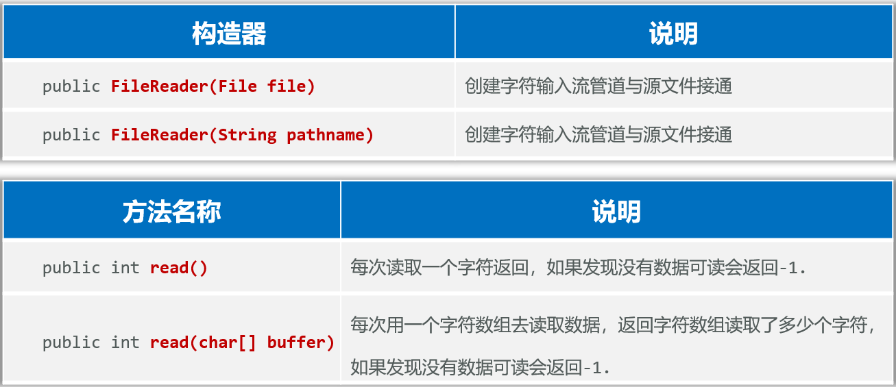

  ```java
  package com.itheima.demo7fileReader;
  
  import java.io.FileReader;
  import java.io.Reader;
  
  public class FileReaderDemo1 {
      public static void main(String[] args) {
          // 目标：使用字符流读取文本文件
          // 1、创建文件字符输入流与文件流接通
          try (Reader fr = new FileReader("day03-file-io\\src\\com\\itheima\\ycz3.txt")) {
              // 2、定义一个变量，用来记录每次读取的字符
              // int b;
              // while((b = fr.read()) != -1){
              //     System.out.print((char) b);
              // }
  
              // 2、定义一个字符数组，用来每次读取多个字符
              char[] buffer = new char[3];
              int len;
              while ((len = fr.read(buffer)) != -1) {
                  String str = new String(buffer, 0, len)
                  System.out.print(str);
              }
          }catch (Exception e){
              e.printStackTrace();
          }
      }
  }
  ```

  优点：文件字符输入流每次读取多个字符，性能较好（因为内存比硬盘更快，交互越少越好），而且按照字符读取，中文不会出现乱码

#### 3.2 文件字符输出流(FileWriter)

- 作用：以内存为基准，把内存中的数据以字符的形式写出到文件中去

  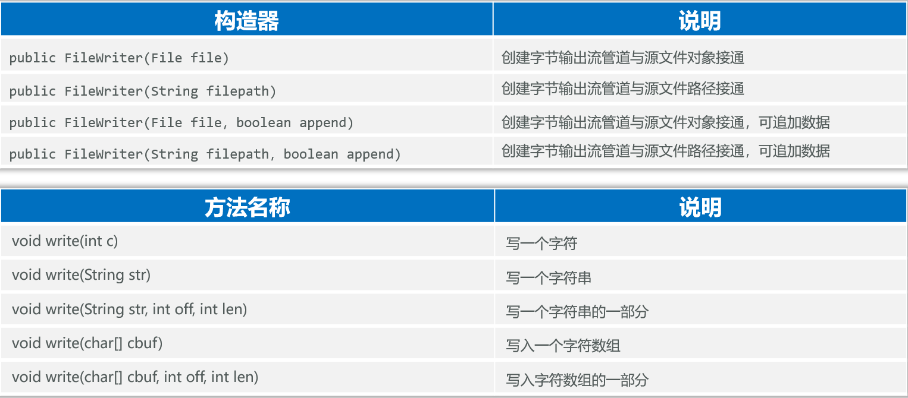

  ```java
  package com.itheima.demo8fileWriter;
  
  import java.io.FileWriter;
  import java.io.Writer;
  
  public class FileWriterDemo1 {
      public static void main(String[] args) {
          // 1.创建一个字符输出流对象
          try(    // 覆盖管道
                  // Writer fw = new FileWriter("day03-file-io\\src\\com\\itheima\\outycz2.txt");
                  // 追加管道
                  Writer fw = new FileWriter("day03-file-io\\src\\com\\itheima\\outycz2.txt", true);
                  ) {
  
              // 2.调用write方法，把数据写入到文件中
              // 1、字符
              fw.write('c');
              fw.write(98);// b
              fw.write("\r\n"); // 回车换行
              // 2、字符串
              fw.write("游朝政太牛了");
              fw.write("\r\n");
              // 3、字符数组
              char[] chars = "quantaty".toCharArray();
              fw.write(chars);
              fw.write("\r\n");
              // 4、字符数组的一部分
              fw.write(chars, 1, 4);// 从第2个字符开始，输出4个字符
              
              // 不需要关闭/刷新，try-with-resources包含了close(),而close()又包含了flush()
              // 刷新缓冲区
              // fw.flush(); // 刷新缓冲区，将数据写入到文件
              // 关闭流
              // fw.close(); // 关闭资源，关闭包含了刷新
          } catch (Exception e) {
              e.printStackTrace();
          }
      }
  }
  ```

- 注意：**字符输出流写出数据后，必须刷新流，或者关闭流**，写出去的数据才能生效

  可以都先写到内存的缓冲区，最后再IO写入硬盘

  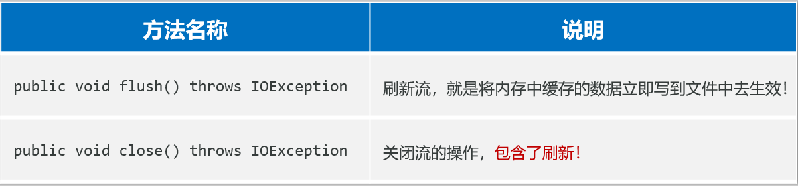

### 4、缓冲流

#### 4.1 缓冲流

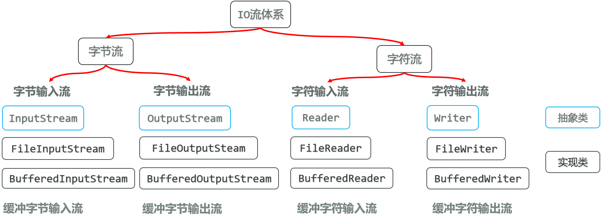

- **BufferedInputStream/BufferedOutputStream缓冲字节输入/输出流**

  - **作用：可以提高字节输入流读取数据的性能**
  - **原理：缓冲字节输入流**自带了**8KB缓冲池**；**缓冲字节输出流**也自带了**8KB缓冲池**

  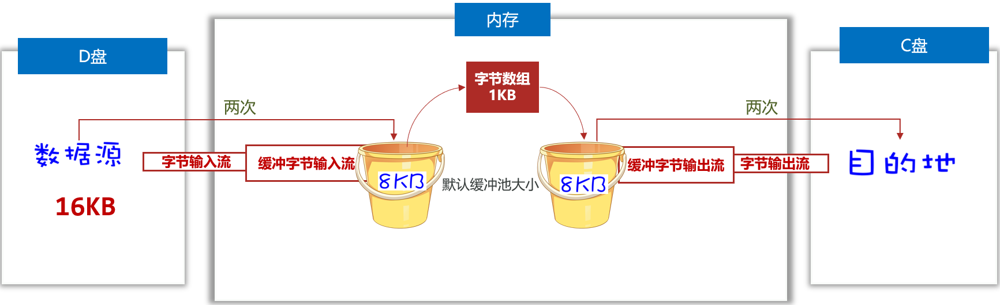

  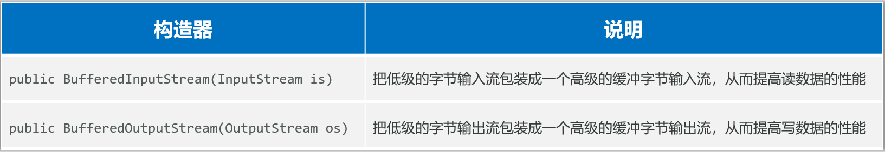

  ```java
  try(InputStream fis = new FileInputStream(srcPath);
      OutputStream fos = new FileOutputStream(destPath);
      // 把低级的字节输入流包装成高级的缓冲字节输入流
      InputStream bis = new BufferedInputStream(fis);
      // 把低级的字节输出流包装成高级的缓冲字节输出流
      OutputStream bos = new BufferedOutputStream(fos);
     ) {
      // 2、读取一个字节数组，写入一个字节数组
      byte[] buffer = new byte[1024];
      int len;
      while ((len = bis.read(buffer)) != -1) {
          bos.write(buffer, 0, len);// 读取多少个字节就写入多少个字节
      }
      System.out.println("复制完成");
  } catch (Exception e) {
      e.printStackTrace();
  }
  ```

- **BufferedReader缓冲字符输入流**

  - 作用：自带8K（8192）的字符缓冲池，可以提高字符输入流读取字符数据的性能

  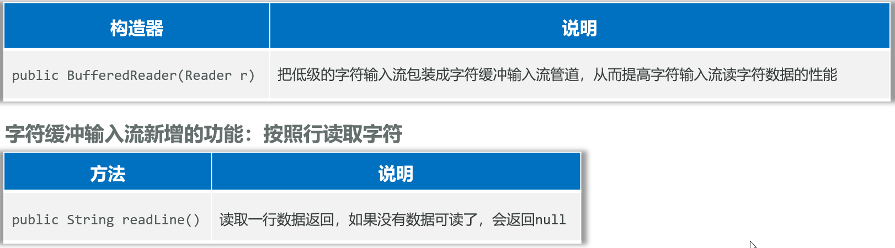

  ```java
  package com.itheima.demo10bufferedReader;
  
  import java.io.BufferedReader;
  import java.io.FileReader;
  import java.io.Reader;
  
  public class BufferedReaderDemo1 {
      public static void main(String[] args) {
          // 目标：使用缓冲字符流完成字符文件的读取
          // 1、创建文件字符输入流与文件流接通
          try (
                  Reader fr = new FileReader("day03-file-io\\src\\com\\itheima\\ycz3.txt");
                  BufferedReader br = new BufferedReader(fr)
          ){
              // 循环按行读取文件
              // 1、定义一个字符串变量，用于记住每次读的一行数据
              String line;
              while((line = br.readLine()) != null){
                  System.out.println(line);
              }
          }catch (Exception e){
              e.printStackTrace();
          }
      }
  }
  ```

- BufferedWriter缓冲字符输出流

  - 作用：自带8K的字符缓冲池，可以提高字符输出流写字符数据的性能

  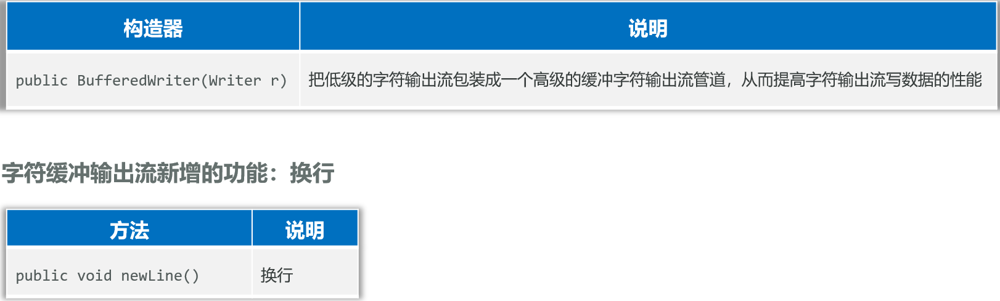

  ```java
  package com.itheima.demo11bufferedWriter;
  
  import java.io.BufferedWriter;
  import java.io.FileWriter;
  import java.io.Writer;
  
  public class BufferedWriterDemo1 {
      public static void main(String[] args) {
          // 1.创建一个字符输出流对象
          try(    // 覆盖管道
                  // Writer fw = new FileWriter("day03-file-io\\src\\com\\itheima\\outycz2.txt");
                  // 追加管道
                  Writer fw = new FileWriter("day03-file-io\\src\\com\\itheima\\outycz2.txt", true);
                  BufferedWriter bw = new BufferedWriter(fw);
          ) {
              // 2.调用write方法，把数据写入到文件中
              // 1、字符
              bw.write('c');
              bw.write(98);// b
              bw.newLine(); // 换行
              // 2、字符串
              bw.write("游朝政太牛了");
              bw.newLine();
              // 3、字符数组
              char[] chars = "quantaty".toCharArray();
              bw.write(chars);
              bw.newLine();
              // 4、字符数组的一部分
              bw.write(chars, 1, 4);// 从第2个字符开始，输出4个字符
  
          } catch (Exception e) {
              e.printStackTrace();
          }
      }
  }
  ```

#### 4.2 缓冲流案例——恢复《出师表》顺序

```java
package com.itheima.demo11bufferedWriter;

import java.io.*;
import java.util.ArrayList;
import java.util.Collections;
import java.util.List;

public class BufferedTest2 {
    public static void main(String[] args) {
        // 目标：完成出师表排序
        // 1、 创建缓存输入字符流与文件流接通
        File outFile = new File("day03-file-io\\src\\com\\itheima\\csbOut.txt");
        if(!outFile.exists()){
            try {
                outFile.createNewFile();
            } catch (IOException e) {
                e.printStackTrace();
            }
        }
        try (	  // 1、 创建缓存输入字符流和缓存输出字符流与文件流接通
                Reader fr = new FileReader("day03-file-io\\src\\com\\itheima\\csb.txt");
                BufferedReader br = new BufferedReader(fr);
                Writer fw = new FileWriter(outFile);
                BufferedWriter bw = new BufferedWriter(fw)
        ){
            // 2、提前准备一个List集合，用来存储出师表内容
            List<String> paper = new ArrayList<>();
            // 3、按行循环读取出师表内容，并把内容存储到List集合中
            String line;
            while((line = br.readLine()) != null){
                paper.add(line);
            }

            // 4、对List集合按首字符进行排序
            Collections.sort(paper);
            System.out.println(paper);

            // 5、把排序后的内容按行写入到文件
            for (String str : paper){
                bw.write(str);
                bw.newLine();
            }

            System.out.println("处理完毕");

        }catch (Exception e){
            e.printStackTrace();
        }
    }
}
```

### 5、原始流和缓冲流的性能分析

**测试用例：**

- 分别使用原始的字节流，以及字节缓冲流复制一个很大视频

**测试步骤：**

①使用低级的字节流按照一个一个字节的形式复制文件。

②使用低级的字节流按照字节数组的形式复制文件。

③使用高级的缓冲字节流按照一个一个字节的形式复制文件。

④**使用高级的缓冲字节流按照字节数组的形式复制文件**。

```java
package com.itheima.demo11bufferedWriter;

import java.io.*;

public class TimeTest3 {
    private static final String SRC_FILE = "D:\\BaiduNetdiskDownload\\6、Java+AI（Java基础入门到大牛）\\2. JavaSE基础加强6天课程\\day03-FIle、字符集、IO流\\视频\\02-File-操作文件，删除文件，创建文件.mp4";
    private static final String DEST_FILE = "D:\\Desktop\\";
    public static void main(String[] args) {

        // 目标：低级流，缓冲流性能分析
        // ①使用低级的字节流按照一个一个字节的形式复制文件: 非常慢
        //copyFile1();
        // ②使用低级的字节流按照字节数组的形式复制文件：比较慢
        copyFile2();
        // ③使用高级的缓冲字节流按照一个一个字节的形式复制文件：虽然是高级管道，但也是一个个复制，很慢
        copyFile3();
        // ④使用高级的缓冲字节流按照字节数组的形式复制文件：非常快，推荐使用
        copyFile4();
    }

    private static void copyFile4() {
        // 拿到系统当前时间
        long start = System.currentTimeMillis();
        try ( InputStream is = new FileInputStream(SRC_FILE);
              OutputStream os = new FileOutputStream(DEST_FILE + "4.mp4" );
              InputStream bis = new BufferedInputStream(is);
              OutputStream bos = new BufferedOutputStream(os);
        ){
            byte[] buffer = new byte[1024];
            int len;
            while ((len = bis.read(buffer)) != -1){
                bos.write(buffer, 0 ,len);
            }
            long end = System.currentTimeMillis();
            System.out.println("高级缓冲字节流字节数组复制文件耗时：" + (end - start)/1000.0 + "秒");
            System.out.println(new File(DEST_FILE + "4.png").getAbsoluteFile());
        }catch (Exception e){
            e.printStackTrace();
        }
    }

    private static void copyFile3() {
        // 拿到系统当前时间
        long start = System.currentTimeMillis();
        try ( InputStream is = new FileInputStream(SRC_FILE);
              OutputStream os = new FileOutputStream(DEST_FILE + "3.mp4");
              InputStream bis = new BufferedInputStream(is);
              OutputStream bos = new BufferedOutputStream(os);
        ){
            int b;
            while ((b = bis.read()) != -1){
                bos.write(b);
            }
            long end = System.currentTimeMillis();
            System.out.println("高级缓冲字节流一个一个字节复制文件耗时：" + (end - start)/1000.0 + "秒");
        }catch (Exception e){
            e.printStackTrace();
        }
    }

    private static void copyFile2() {
        // 拿到系统当前时间
        long start = System.currentTimeMillis();// 此刻时间毫秒值：1970-1-1到此刻的时间毫秒值
        // 3、定义一个字节输入流，把源文件读入到程序
        try (
                InputStream is = new FileInputStream(SRC_FILE);
                OutputStream os = new FileOutputStream(DEST_FILE + "2.mp4");
        ){
            byte[] buffer = new byte[1024];// 1KB
            int len;
            while((len = is.read(buffer)) != -1){
                os.write(buffer, 0, len);
            }
            long end = System.currentTimeMillis();
            System.out.println("低级字节流字节数组复制文件耗时：" + (end - start)/1000.0 + "秒");
        }catch (Exception e){
            e.printStackTrace();
        }
    }

    public static void copyFile1(){
        // 拿到系统当前时间
        long start = System.currentTimeMillis();// 此刻时间毫秒值：1970-1-1到此刻的时间毫秒值
        // 3、定义一个字节输入流，把源文件读入到程序
        try (
                InputStream is = new FileInputStream(SRC_FILE);
                OutputStream os = new FileOutputStream(DEST_FILE + "1.mp4");
        ){
            int b;
            while((b = is.read()) != -1){
                os.write(b);
            }
        }catch (Exception e){
            e.printStackTrace();
        }
        long end = System.currentTimeMillis();
        System.out.println("低级字节流一个一个字节复制文件耗时：" + (end - start)/1000.0 + "秒");
    }
}
```

### 6、其他流

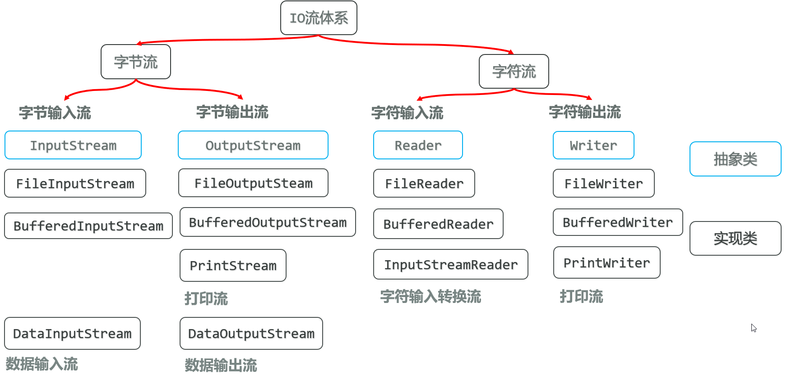

#### 6.1 字符输入转换流(InputStreamReader)

- 解决不同编码时，字符流读取文本内容乱码的问题。
- 解决思路：先获取文件的原始字节流，再将其按真实的字符集编码转成字符输入流，这样字符输入流中的字符就不乱码了。

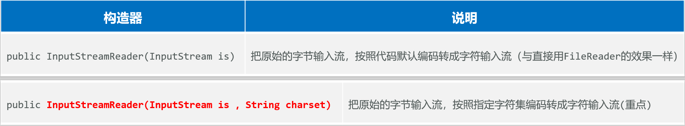

```java
package com.itheima.demo12inputstreamReader;

import java.io.*;

public class Demo2 {
    public static void main(String[] args) {
        // 目标：使用字符输入流InputStreamReader，解决不同编码读取乱码的问题。
        // 代码：UTF-8 文件：UTF-8 读取不乱码
        // 代码：UTF-8 文件：GBK 读取乱码
        try (
                // 1、提取文件的原始字节输入流
                InputStream is = new FileInputStream("day03-file-io\\src\\com\\itheima\\gbk.txt");
                // 2、指定字符集把原始字节输入流转换为字符输入流
                Reader isr = new InputStreamReader(is, "GBK");
                // 3、把字符输入流转换为字符缓冲输入流
                BufferedReader br = new BufferedReader(isr)
        ) {
            String line;
            while ((line = br.readLine()) != null) {
                System.out.println(line);
            }
        } catch (Exception e){
            e.printStackTrace();
        }
    }
}
```

#### 6.2 打印流(PrintStream/PrintWriter)

- **PrintStream/PrintWriter（打印流）**

  作用：打印流可以实现更方便、更高效的打印数据出去，能实现打印啥出去就是啥出去

- PrintStream

  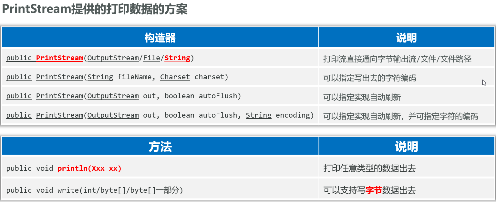

- PrintWriter

  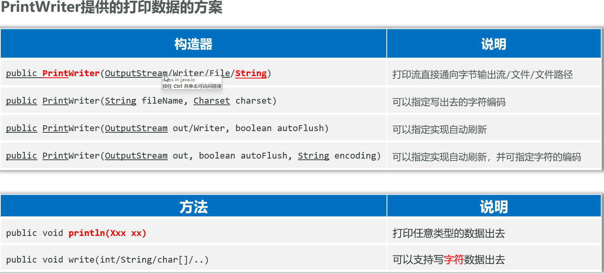

```java
package com.itheima.demo13printstream;

import java.io.PrintStream;
import java.io.PrintWriter;

public class PrintStreamDemo1 {
    public static void main(String[] args) {
        try (
                //PrintStream ps = new PrintStream("day03-file-io\\src\\com\\itheima\\ps.txt");
                PrintWriter ps = new PrintWriter("day03-file-io\\src\\com\\itheima\\ps.txt");
                ){
            ps.println(97);
            ps.println('a');
            ps.println("quantaty");
            ps.println(true);
            ps.println(1.23);
        }catch (Exception e){
            e.printStackTrace();
        }
    }
}
```

#### 6.3 数据输出/输入流(DataOutputStream/DataInputStream)

- **DataOutputStream(数据输出流)**

  允许把数据和其类型一并写出去

  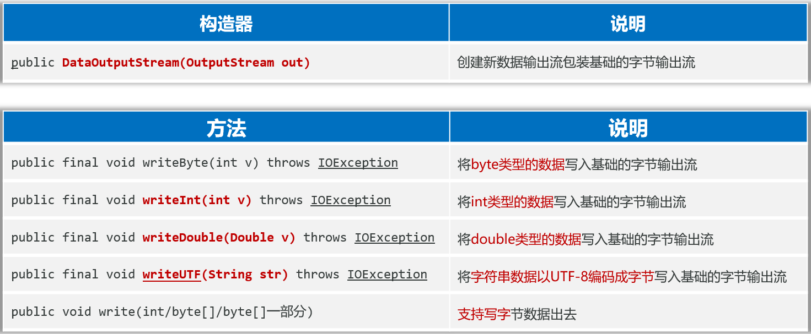

- **DataInputStream数据输入流)**

  用于读取数据输出流写出去的数据

  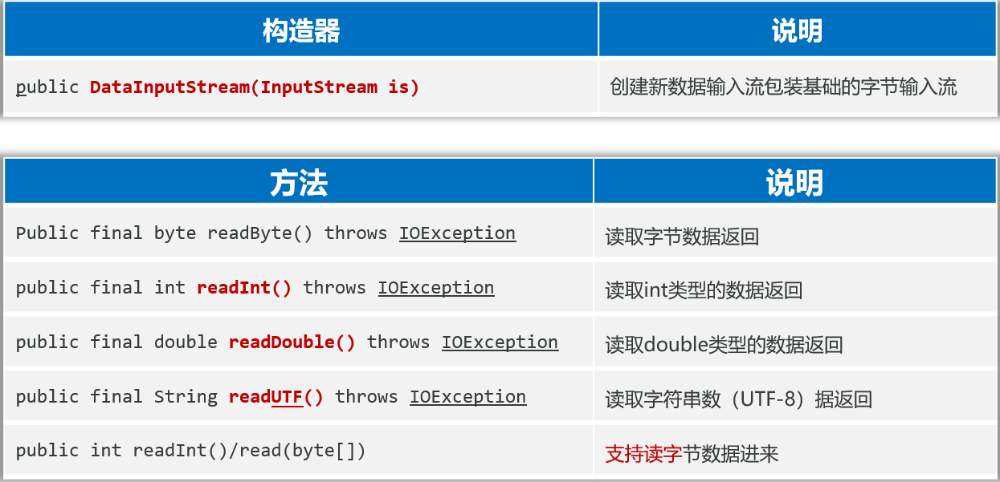

```java
package com.itheima.demo13printstream;

import java.io.DataInputStream;
import java.io.DataOutputStream;
import java.io.FileInputStream;
import java.io.FileOutputStream;

public class DataStreamDemo2 {
    public static void main(String[] args) {
        // 目标：使用DataOutputStream和DataInputStream
        try (
                DataOutputStream dos = new DataOutputStream(new FileOutputStream("day03-file-io\\src\\com\\itheima\\data.txt"));
                DataInputStream dis = new DataInputStream(new FileInputStream("day03-file-io\\src\\com\\itheima\\data.txt"))
        ) {
            // 通信的时候使用，怎么发就怎么接
            // write后可能是乱码，因为是数据流
            dos.writeInt(100);
            dos.writeDouble(99.99);
            dos.writeBoolean(true);
            dos.writeUTF("你好");

            System.out.println(dis.readInt());
            System.out.println(dis.readDouble());
            System.out.println(dis.readBoolean());
            System.out.println(dis.readUTF());
        }catch (Exception e){
            e.printStackTrace();
        }
    }
}
```

## 六、IO框架

- 框架（Framework）是一个预先写好的代码库或一组工具，旨在简化和加速开发过程

- 框架的形式：一般是把类、接口等编译成class形式，再压缩成一个.jar结尾的文件发行出去。

- IO框架：封装了Java提供的对文件、数据进行操作的代码，对外提供了更简单的方式来对文件进行操作，对数据进行读写等。

- commons-io.jar框架导入到项目中：

  ①在项目中创建一个文件夹：lib

  ②将commons-io.jar文件复制到lib文件夹

  ③在jar文件上点右键，选择 Add as Library -> 点击OK

  ④在类中导包使用

- Commons-io是apache开源基金组织提供的一组有关IO操作的小框架，目的是提高IO流的开发效率

  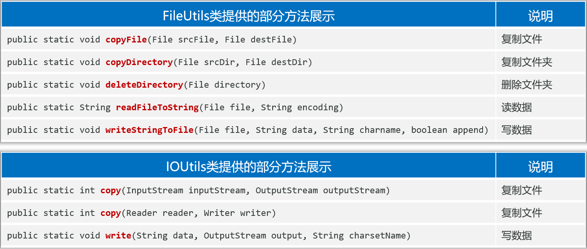

## 七、综合案例——石头迷阵历史最小步数

展示历史胜利所用的最小步数
1、在游戏界面上展示：历史胜利的最少步数
2、创建一个文件记录历史最少步数
3、每次胜利后都要比较当前步数和历史最小步数，如果当前步数小于历史最小步数，则更新历史最小步数
4、每次游戏启动时都要展示历史最小步数

```java
private int readFileScore(){
    // 读取文件中的最小步数
    try(
        Reader fr = new FileReader("stone-maze\\src\\score.txt");
        BufferedReader br = new BufferedReader(fr);
    ) {
        String line = br.readLine();
        return Integer.parseInt(line);
    } catch (Exception e){
        e.printStackTrace();
        return 0;
    }
}

private void writeFileScore(int count) {
    // 读取文件中的最小步数
    try(
        Writer fw = new FileWriter("stone-maze\\src\\score.txt");
        BufferedWriter br = new BufferedWriter(fw);
    ) {
        br.write(count + "");
    } catch (Exception e){
        e.printStackTrace();
    }
}
```

