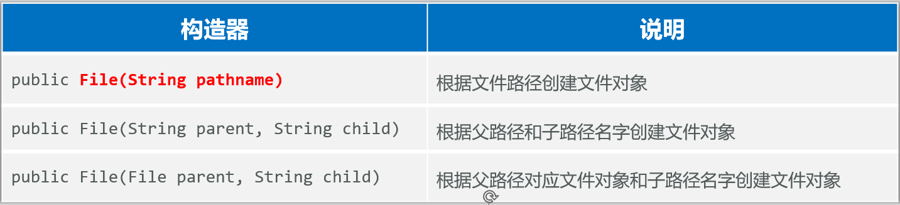
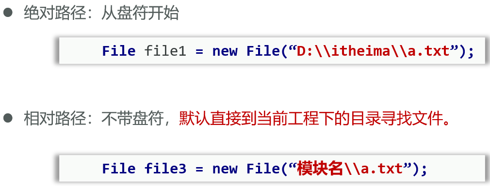
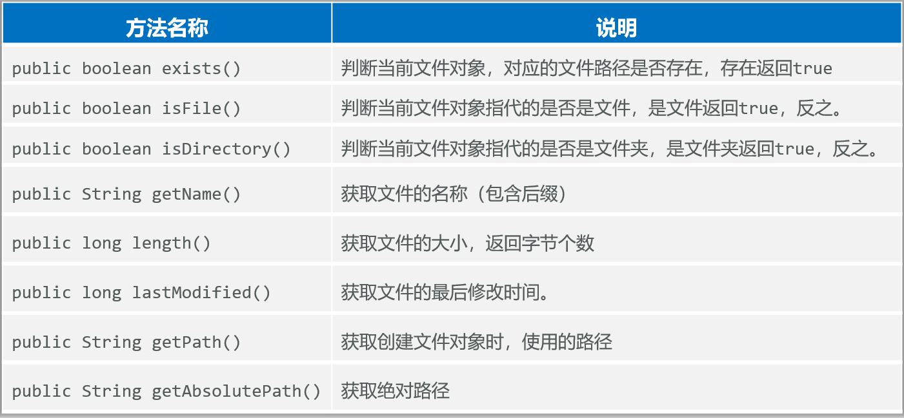
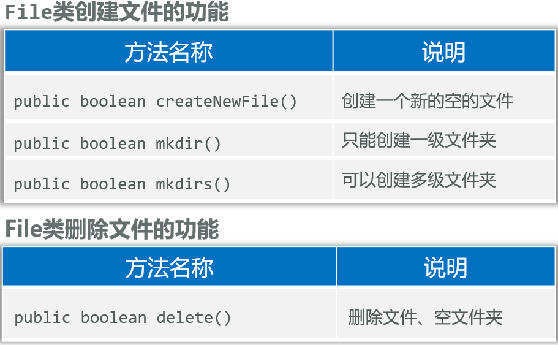
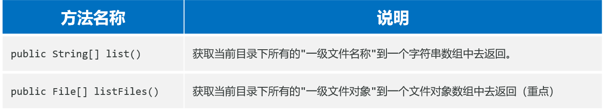
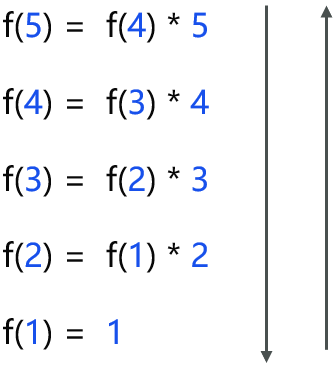
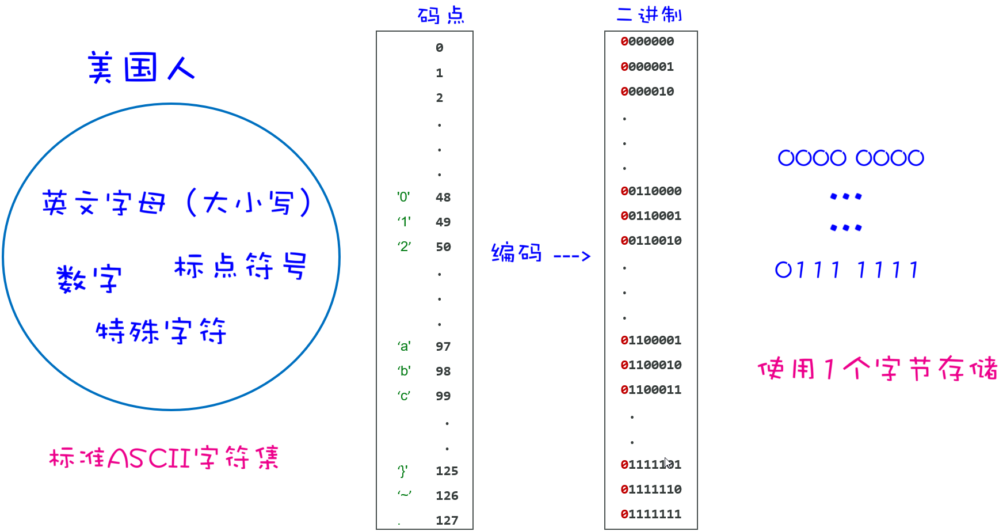
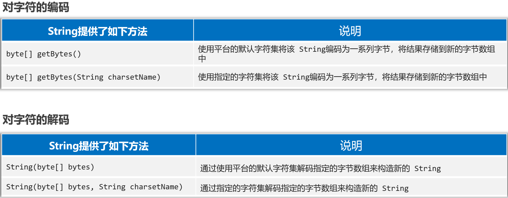

## 一、存储&读写数据的方案

File、IO流

### 1、存储数据的方案

- 传统方案：变量、数组、对象、集合
  - 这些数据容器都**在内存中**，一旦**程序结束，或者断电，数据就没有了**
- File：是java.io.包下的类，File类的对象，用于代表当前操作系统的文件（可以是**文件或者文件夹**）
  - 功能：获取文件信息（大小，文件名，修改时间）、创建/删除文件/文件夹，判断文件类型
  - 缺点：File类只能对文件本身进行操作，**不能读写文件里面存储的数据。**

- IO流：用于**读写数据**的（可以读写文件，或网络中的数据...）

## 二、File

### 1、File类对象的创建

- File类的对象可以代表文件/文件夹，并可以调用其提供的方法对象文件进行操作

- 创建File类的对象

  

- 注意：

  - File对象既可以代表文件、也可以代表文件夹。
  - File封装的对象仅仅是一个路径名，这个路径可以是存在的，也允许是不存在的

- **绝对路径、相对路径：**

  

### 2、判断文件类型、获取文件信息

- **File提供的判断文件类型、获取文件信息功能**

  

  ```java
  // 1、创建File对象，去获取某个文件的信息
  File f1 = new File("D:\\Pictures\\Screenshots\\屏幕截图 2025-03-30 235421.png");
  System.out.println(f1.length());
  System.out.println(f1.getName());
  System.out.println(f1.isFile());// true
  System.out.println(f1.isDirectory());// false
  
  // 2、使用相对路径定位文件对象
  // 绝对路径一般带盘符
  // 相对路径不带盘符，相对当前项目根目录，即该IDEA工程下
  File f2 = new File("day03-file-io/src/ycz.txt");
  System.out.println(f2.length());
  ```

### 3、创建和删除文件

- **File提供的创建和删除文件的方法**

  

  **注意：**delete方法默认**只能删除文件和空文件夹**，删除后的文件不会进入回收站

  ```java
  // 3、创建File对象代表不存在的文件路径
  File f3 = new File("day03-file-io/src/ycz1.txt");
  System.out.println(f3.exists());// 判断是否存在，false
  System.out.println(f3.createNewFile());// 创建文件，返回boolean
  
  // 4、创建File对象代表不存在的文件夹路径
  File f4 = new File("day03-file-io/src/ycz2");
  System.out.println(f4.exists());
  System.out.println(f4.mkdir());// 只能创建一级文件夹
  System.out.println(f4.mkdirs());// 可以创建多级文件夹
  
  // 5、创建File对象代表存在的文件夹，然后删除它
  File f5 = new File("day03-file-io/src/ycz2");
  System.out.println(f5.delete());// 只能删除空文件夹，不能删除非空文件夹
  ```

### 4、遍历文件夹

- **File提供的遍历文件夹的方法**

  

  **使用listFiles方法时的注意事项：**

  |           主调           |                        返回                        |
  | :----------------------: | :------------------------------------------------: |
  | 文件，或者文件路径不存在 |                        null                        |
  |         空文件夹         |                   长度为0的数组                    |
  |      有内容的文件夹      |         所有一级文件和文件夹放在File数组中         |
  |    含隐藏文件的文件夹    | 所有一级文件和文件夹(包含隐藏文件)，放在File数组中 |
  |     没有权限的文件夹     |                        null                        |

  ```java
  // 6、获取目录下的文件名称
  File f6 = new File("D:\\笔记\\notes\\java\\java基础");
  String[] names = f6.list();
  assert names != null;
  for (String name : names) {
      System.out.println(name);
  }
  
  // 7、获取目录下的文件对象
  File[] files = f6.listFiles();
  assert files != null;
  for (File file : files) {
  	System.out.println(file.getAbsolutePath());
  }
  ```

## 三、递归(Recursion)

### 1、什么是递归

- 递归是一种算法，在程序设计语言中广泛应用。
- 从形式上说：方法调用自身的形式称为方法递归（ recursion）。

**递归的形式**

- 直接递归：方法自己调用自己。
- 间接递归：方法调用其他方法，其他方法又回调方法自己。

**使用方法递归时需要注意的问题：**

- 递归如果没有控制好终止，会出现递归死循环，导致栈内存溢出错误

### 2、递归算法和其执行流程

**需求：**计算n的阶乘

**分析：**

- f(n) = 1\*2\*3\*4\*...\*n
- f(n) = n*f(n-1)

```java
package com.itheima.demo2recursion;

public class RecursionDemo1 {
    public static void main(String[] args) {
        // 目标：认识递归
        // 计算n的阶乘
        System.out.println(f(5));

    }

    public static int f(int n) {
        if (n == 1) {
            return 1;
        }
        return n*f(n-1);
    }
}
```

**递归算法的三要素**

- **递归的公式：** **f(n) = f(n-1) \* n;**

- **递归的终结点：f(1)** 

- **递归的方向必须走向终结点：**

  

**例子1：求前n项和**

```java
package com.itheima.demo2recursion;

public class RecursionDemo2 {
    // 求arr的前n项之和
    public static void main(String[] args) {
        int n = 6;
        System.out.println(f(n-1));

    }

    public static int f(int n) {
        int[] arr = {8,9,7,7,9,0,2,3};
        if (n == 0) {
            return arr[0];
        } else{
            return arr[n] + f(n-1);
        }
    }
}
```

例子2：

猴子第一天摘下若干桃子，当即吃了一半，觉得好不过瘾，于是又多吃了一个

第二天又吃了前天剩余桃子数量的一半，觉得好不过瘾，于是又多吃了一个

以后每天都是吃前天剩余桃子数量的一半，觉得好不过瘾，又多吃了一个

等到第10天的时候发现桃子只有1个了

**请问猴子第一天摘了多少个桃子？**

```java
package com.itheima.demo2recursion;
// 递归公式：f(n+1) = 1/2*f(n) - 1 -> f(n) = 2*f(n+1) + 2
// 递归终结点：n==10, return 1;
// 递归方向：f(1) -> f(10), f(10)=1 -> f(1)
public class RecursionDemo3 {
    public static void main(String[] args) {
        System.out.println(f(1  ));

    }

    public static int f(int n){
        if (n==10){
            return 1;
        }else{
            return 2*f(n+1) + 2;
        }
    }
}
```

### 3、文件搜索、文件夹删除

**需求**：从D:盘中，搜索“QQ.exe” 这个文件，找到后直接输出其位置

**分析：**

①先找出D:盘下的所有一级文件对象

②遍历全部一级文件对象，判断是否是文件

③如果是文件，判断是否是自己想要的

④如果是文件夹，需要继续进入到该文件夹，重复上述过程

```java
package com.itheima.demo2recursion;

import java.io.File;
import java.io.IOException;

public class FileSearchTest4 {
    public static void main(String[] args) {
        // 目标：完成文件搜索，找出D:盘下的QQ.exe文件的位置
        File dir = new File("D:\\");

        try {
            searchFile(dir,"QQ.exe");
        } catch (IOException e) {
            throw new RuntimeException(e);
        }
    }

    /**
     * 搜索文件
     * @param dir 搜索的目录
     * @param fileName 搜索的文件名称
     */
    public static void searchFile(File dir, String fileName) throws IOException {
        // 1、判断极端情况
        if (dir == null || !dir.exists() || dir.isFile()){
            return;// 不搜索
        }

        // 2、获取目录下的所有一级文件或者文件夹对象
        File[] files = dir.listFiles();

        // 3、判断当前目录下是否存在一级文件对象，存在才可以遍历
        if (files != null && files.length > 0){
            // 4、遍历一级文件对象
            for(File file : files){
                // 5、判断当前一级文件是否为文件
                if (file.isFile()){
                    // 6、判断当前一级文件名是否与目标文件名相同
                    if (file.getName().contains(fileName)){
                        System.out.println("找到目标文件，目标文件路径为:");
                        System.out.println(file.getAbsolutePath());
                        Runtime r = Runtime.getRuntime();
                        r.exec(file.getAbsolutePath());// 启动
                        return;
                    }
                } else{
                    // 7、如果当前一级文件对象是文件夹，则继续递归调用
                    searchFile(file, fileName);
                }
            }
        }
    }
}
```

**需求：**删除非空文件夹

**分析：**

①File默认不可以删除非空文件夹

②我们需要遍历文件夹，先删除里面的内容，再删除自己。

```java
package com.itheima.demo2recursion;

import java.io.File;
import java.io.IOException;

public class FileDeleteTest5 {
    public static void main(String[] args) {
        File dir = new File("day03-file-io/src/ycz");
        boolean success = deleteFolder(dir);
        if (success) {
            System.out.println("文件夹删除成功: " + dir);
        } else {
            System.out.println("文件夹删除失败（可能不存在）: " + dir);
        }
    }

    public static boolean deleteFolder(File dir){
        if (dir==null||!dir.exists()){
            return false;
        }

        if(dir.isDirectory()) {
            File[] files = dir.listFiles();
            if (files != null) {
                for (File file : files) {
                    deleteFolder(file);
                }
            }
        }

        return dir.delete();
    }
}
```

## 四、字符集

### 1、常见字符集介绍



**标准ASCII字符集**

- [ASCII](‪../java基础/day01-Java基础.md)(American Standard Code for Information Interchange)： 美国信息交换标准代码，包括了英文、符号等
-  标准ASCII使用**1个字节**存储一个字符，**首位是0**，因此，总共可表示128个字符，对美国佬来说完全够用

**GBK（汉字内码扩展规范，国标）**

- 汉字编码字符集，包含了2万多个汉字等字符，GBK中一个中文字符编码成**2个字节**的形式存储。

- 注意：GBK兼容了ASCII字符集，**汉字首位是1**

  

**Unicode字符集(统一码，也叫万国码)**

- Unicode是国际组织制定的，可以容纳世界上所有文字、符号的字符集。
- UTF-32: **4个字节**表示一个字符，可以存42亿多个字符

==**UTF-8字符集(默认都用，最广泛)**==

- 是Unicode字符集的一种编码方案，采取**可变长**编码方案，共分四个长度区：1个字节，2个字节，3个字节，4个字节

- **英文字符、数字**等只占**1个字节**（兼容标准ASCII编码），**汉字**字符占用**3个字节**。

  | **UTF-8编码方式(二进制)**                           |
  | --------------------------------------------------- |
  | **0**xxxxxxx （ASCII码）                            |
  | **110**xxxxx **10**xxxxxx                           |
  | **1110**xxxx **10**xxxxxx **10**xxxxxx              |
  | **11110**xxx **10**xxxxxx **10**xxxxxx **10**xxxxxx |

  

重点：

- ASCII字符集：只有英文、数字、符号等，占1个字节。
- GBK字符集：汉字占2个字节，英文、数字占1个字节。
- UTF-8字符集：汉字占3个字节，英文、数字占1个字节。

注意：

- **字符编码时使用的字符集，和解码时使用的字符集必须一致，==否则会出现乱码==**
- **英文，数字一般不会乱码，因为很多字符集都兼容了ASCII编码**

例子：

a我m 

编码(GBK): 0xxxxxxx 1xxxxxxx xxxxxxxx 0xxxxxxx

解码(UTF-8): 0xxxxxxx ? ? 0xxxxxxx

### 2、字符集的编码、解码操作



```java
package com.itheima.demo3charset;

import java.util.Arrays;

public class CharSetDemo1 {
    public static void main(String[] args) throws Exception {
        // 目标：实现字符编码和解码
        // 1、编码
        String name = "我爱你中国abc666";

        // byte[] bytes = name.getBytes();// 使用平台默认的UTF-8编码,5*3+6*1
        byte[] bytes = name.getBytes("GBK");// 指定GBK进行编码5*2+6*1
        System.out.println(bytes.length);
        System.out.println(Arrays.toString(bytes));

        // 2、解码
        String name2 = new String(bytes);// 平台默认的UTF-8解码
        System.out.println(name2);// 乱码：�Ұ����й�abc666

        String name3 = new String(bytes,"GBK");
        System.out.println(name3);// 正确解码：我爱你中国abc666
    }
}
```

