## 一、线程和多线程

单线程

- 线程(Thread)是一个程序内部的一条执行流程
- 程序中如果只有一条执行线程，那这个程序就是单线程程序

多线程

- 多线程是指从软硬件上实现的多条执行流程的技术（多条线程由CPU负责调度执行）
- 消息通信、买票、百度网盘、淘宝、京东系统都离不开多线程技术

## 二、创建线程

### 1、方式一：继承Tread类

**创建方法**

①定义一个子类MyThread继承线程类java.lang.Thread，重写run()方法

②创建MyThread类的对象

③调用线程对象的start()方法启动线程（启动后还是执行run方法的）

**优缺点**

- 优点：编码简单
- 缺点：线程类已经继承Thread，无法继承其他类，不利于功能的扩展

```java
package com.itheima.demo1create;

public class Test {
    // main方法本是很是由一条主线程负责推荐执行的
    public static void main(String[] args) {
        // 目标：认识多线程，掌握创建多线程的方式一：继承Thread类
        // 3、创建一个线程对象
        Thread t1 = new MyThread();
        // 4、调用线程对象的start方法，开启线程，并执行run方法
        t1.start();
        
        // 主线程，与子线程交替执行
        for(int i = 0; i < 5; i++){
            System.out.println(Thread.currentThread().getName() + "-->" + i);
        }
    }
}

// 1、定义一个子类继承Thread类，成为一个线程类
class MyThread extends Thread {
    // 2、重写run方法，编写线程执行的代码
    @Override
    public void run() {
        for (int i = 0; i < 5; i++) {
            System.out.println(Thread.currentThread().getName() + "-->" + i);
        }
    }
}
```

**注意事项：**

1、启动线程必须是调用start方法，不是调用run方法。

- **直接调用run方法会当成普通方法执行，此时相当于还是单线程执行。**

- **只有调用start方法才是启动一个新的线程执行。**

2、**不要**把主线程任务放在启动子线程之前

- **这样主线程一直是先跑完的，相当于是一个单线程的效果了。**

### 2、方式二：实现Runnable接口

**创建方法**

①定义一个线程任务类MyRunnable实现Runnable接口，重写run()方法

②创建MyRunnable任务对象

③把MyRunnable任务对象交给Thread处理。

| Thread类提供的构造器           | 说明                         |
| ------------------------------ | ---------------------------- |
| public Thread(Runnable target) | 封装Runnable对象成为线程对象 |

④调用线程对象的start()方法启动线程

**优缺点**

- 优点：任务类只是**实现接口**，可以**继续继承其他类**、**实现其他接口**，扩展性强。

- 缺点：需要多一个Runnable对象。

```java
package com.itheima.demo2create;

public class Test {
    // main方法本是很是由一条主线程负责推荐执行的
    public static void main(String[] args) {
        // 目标：认识多线程，掌握创建多线程的方式一：继承Thread类
        // 3、创建一个Runnable对象，表示一个线程任务
        Runnable r = new MyThread();
        // 4、把线程任务对象交给线程对象
        Thread t1 = new Thread(r);
        // 5、调用线程对象的start方法，开启线程，并执行run方法
        t1.start();

        // 主线程，与子线程交替执行
        for(int i = 0; i < 5; i++){
            System.out.println(Thread.currentThread().getName() + "-->" + i);
        }
    }
}

// 1、定义一个子类实现Runnable接口
class MyThread implements Runnable {
    // 2、重写run方法，编写线程执行的代码
    @Override
    public void run() {
        for (int i = 0; i < 5; i++) {
            System.out.println(Thread.currentThread().getName() + "-->" + i);
        }
    }
}
```

**匿名内部类写法**

①可以创建Runnable的匿名内部类对象。

②再交给Thread线程对象。

③再调用线程对象的start()启动线程。

```java
package com.itheima.demo2create;

public class Test2 {
    // 四条线程交替执行
    public static void main(String[] args) {
        // 目标：认识多线程，掌握创建多线程的方式一：继承Thread类
        // Thread-0
        // 创建一个匿名内部类对象，表示一个线程任务
        Runnable r = new Runnable() {
            @Override
            public void run() {
                for (int i = 0; i < 5; i++) {
                    System.out.println(Thread.currentThread().getName() + "-->" + i);
                }
            }
        };
        // 把线程任务对象交给线程对象
        Thread t1 = new Thread(r);
        // 调用线程对象的start方法，开启线程，并执行run方法
        t1.start();
			
        // Thread-1
        //简化版本
        new Thread(new Runnable() {
            @Override
            public void run() {
                for (int i = 0; i < 5; i++) {
                    System.out.println(Thread.currentThread().getName() + "-->" + i);
                }
            }
        }).start();

        // Thread-2
        // Lambda表达式
        new Thread(() -> {
            for (int i = 0; i < 5; i++) {
                System.out.println(Thread.currentThread().getName() + "-->" + i);
            }
        }).start();

        // main主线程，与子线程交替执行
        for(int i = 0; i < 5; i++){
            System.out.println(Thread.currentThread().getName() + "-->" + i);
        }
    }
}
```

### 3、方式三：实现Callable接口

**前两种**创建方法的**共同缺点**

- 假如线程执行完毕后有一些**数据需要返回**，他们重写的**run方法均不能直接返回结果**

**解决方法及优点**

- JDK 5.0提供了Callable接口和FutureTask类来实现

- 这种方式最大的优点：可以返回线程执行完毕后的结果

**创建方法**

① 创建任务对象

- 定义一个类实现Callable接口，重写call方法，封装要做的事情，和要返回的数据。

- 把Callable类型的对象封装成FutureTask（线程任务对象）。

  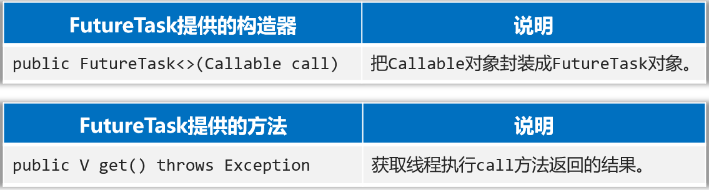

② 把线程任务对象交给Thread对象。

③ 调用Thread对象的start方法启动线程。

④ 线程执行完毕后、通过FutureTask对象的的get方法去获取线程任务执行的结果。

**优缺点**

- 优点：线程任务类只是实现接口，可以继续继承类和实现接口，扩展性强；可**以在线程执行完毕后去获取线程执行的结果**。
- 缺点：编码复杂一点。

```java
package com.itheima.demo3create;

import java.util.concurrent.Callable;
import java.util.concurrent.FutureTask;

public class Test {
    public static void main(String[] args) {
        // 第一条线程
        // 3、创建Callable接口实现类的对象
        Callable<String> c1 = new MyCallable(100);
        // 4、把Callable对象封装成一个真正的线程任务对象，FutureTask对象
        /**
         * 未来任务对象的作用
         * a、本质上是一个Runnable线程任务对象
         * b、可以获取到线程任务的执行结果
         */
        FutureTask<String> f1 = new FutureTask<>(c1);
        // 5、把线程任务对象交给线程对象
        Thread t1 = new Thread(f1);
        // 6、调用线程对象的start方法，开启线程
        t1.start();

        // 第二条线程
        Callable<String> c2 = new MyCallable(50);
        FutureTask<String> f2 = new FutureTask<>(c2);
        Thread t2 = new Thread(f2);
        t2.start();

        // 获取线程执行完毕后的结果
        // 两个try-catch，防止一个线程异常导致后面线程也挂了
        try {
            // 如果第一个线程还没有执行完毕，会让出CPU，等待第一个线程执行完毕后，才会往下执行
            System.out.println(f1.get());
        } catch (Exception e) {
            e.printStackTrace();
        }
        try {
            // 如果第二个线程还没有执行完毕，会让出CPU，等待第二个线程执行完毕后，才会往下执行
            System.out.println(f2.get());
        } catch (Exception e) {
            e.printStackTrace();
        }

    }
}

// 1、定义一个实现类实现Callable接口
class MyCallable implements Callable<String> {
    private int n;
    public MyCallable(int n) {
        this.n = n;
    }
    // 2、重写call方法，定义线程执行体
    @Override
    public String call() throws Exception {
        int sum = 0;
        for (int i = 0; i < this.n; i++) {
            sum += i;
        }
        return Thread.currentThread().getName() + "-->" + sum;
    }
}
```

### 4、方法对比

| 方式             | 优点                                                         | 缺点                                                   |
| ---------------- | ------------------------------------------------------------ | ------------------------------------------------------ |
| 继承Thread类     | 编程比较简单，可以直接使用Thread类中的方法                   | 扩展性较差，不能再继承其他的类，不能返回线程执行的结果 |
| 实现Runnable接口 | 扩展性强，实现该接口的同时还可以继承其他的类。               | 编程相对复杂，不能返回线程执行的结果                   |
| 实现Callable接口 | 扩展性强，实现该接口的同时还可以继承其他的类。可以得到线程执行的结果 | 编程相对复杂                                           |

## 三、线程的常用方法

Thread的常用方法

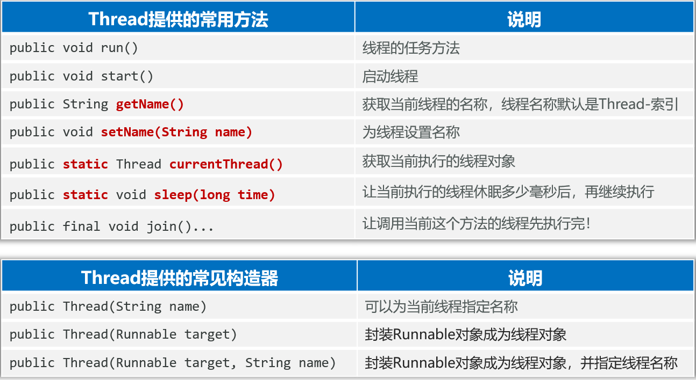

- 查名/改名，拿到当前线程对象

```java
package com.itheima.demo4threadapi;

public class ThreadApiDemo1 {
    public static void main(String[] args) {
        Thread t1 = new MyThread("线程1");
        // t1.setName("线程1");
        t1.start();
        System.out.println(t1.getName());

        Thread t2 = new MyThread();
        t2.setName("线程2");
        t2.start();
        System.out.println(t2.getName());

        // 哪个线程调用这段代码，这个代码就拿到哪个线程
        Thread m = Thread.currentThread(); // 拿到当前线程，主线程
        m.setName("主线程");
        System.out.println(m.getName()); // main

    }
}

// 1、定义一个子类继承Thread类，成为一个线程类
class MyThread extends Thread {
    // 2、重写run方法，编写线程执行的代码
    public MyThread(String name) {
        super(name);
    }
    public MyThread() {
        super();
    }
    @Override
    public void run() {
        for (int i = 0; i < 5; i++) {
            System.out.println(Thread.currentThread().getName() + "-->" + i);
        }
    }
}
```

- Thread.sleep()

```java
package com.itheima.demo4threadapi;

public class ThreadApiDemo2 {
    public static void main(String[] args) {
        // 目标：搞清楚Thread类的sleep方法的作用(线程休眠)
        for (int i = 0; i < 5; i++) {
            System.out.println(Thread.currentThread().getName() + "-->" + i);
            try {
                // 让当前线程进入休眠状态，直到时间到了，才会继续执行
                // 用户没交钱，就加上这段代码，交钱就注释掉
                Thread.sleep(1000);// 1000ms = 1s
            } catch (InterruptedException e) {
                e.printStackTrace();
            }
        }
    }
}
```

- thread.join()

```java
package com.itheima.demo4threadapi;

public class ThreadApiDemo3 {
    public static void main(String[] args) {
        // 目标：搞清楚线程的join方法，线程插队：让调用这个方法的线程先执行完毕
        Thread t1 = new MyThread2();
        t1.start();

        for (int i = 0; i < 5; i++){
            System.out.println(Thread.currentThread().getName() + "-->" + i);
            // 主线程输出到1时，让子线程插队等待其执行完毕
            if (i == 1){
                try {
                    t1.join();
                } catch (InterruptedException e) {
                    e.printStackTrace();
                }
            }
        }
    }
}

// 1、定义一个子类继承Thread类，成为一个线程类
class MyThread2 extends Thread {
    // 2、重写run方法，编写线程执行的代码
    @Override
    public void run() {
        for (int i = 0; i < 5; i++) {
            System.out.println(Thread.currentThread().getName() + "-->" + i);
        }
    }
}
```

## 四、线程安全

### 1、认识线程安全

- **多个线程，同时操作同一个共享资源**的时候，可能会出现业务安全问题

案例：取钱的线程安全问题

- 场景：小明和小红是一对夫妻，他们有一个共同的账户，余额是10万元，如果小明和小红同时来取钱，并且2人各自都在取钱10万元，可能会出现什么问题呢

  

### 2、模拟线程安全问题

问题场景：取钱

**需求**

- 小明和小红是一对夫妻，他们有一个共同的账户，余额是10万元，用程序模拟两人同时取钱10万元。

**分析**

① 怎样描述小明和小红的共同账户呢？**设计一个账户类，创建一个账户对象，代表2人的共享账户**

② 怎样模拟两人同时取钱？**设计一个线程类，创建并启动两个线程，在线程的run方法中调用账户的取钱方法**

**代码**

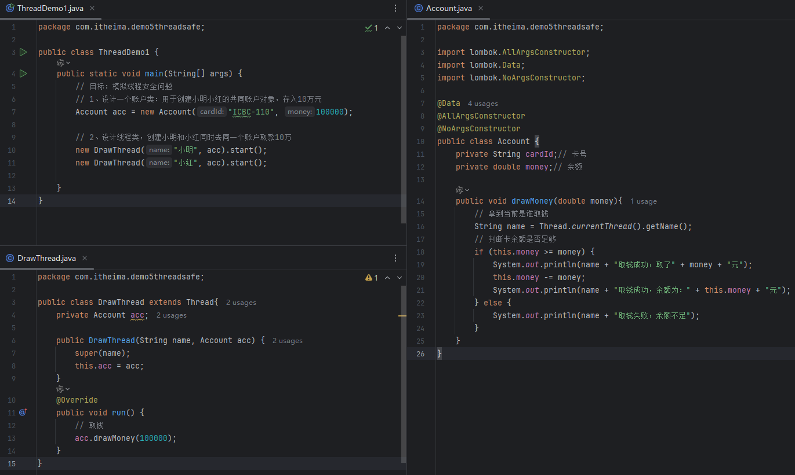

**结果**

| 小明取钱成功，取了100000.0元<br/>小红取钱成功，取了100000.0元<br/>小明取钱成功，余额为：0.0元<br/>小红取钱成功，余额为：-100000.0元 |
| ------------------------------------------------------------ |

## 五、线程同步—解决线程安全问题

### 1、认识线程同步

- 线程同步是线程安全问题的解决方案

**线程同步的核心思想**

- 让多个线程先后依次访问共享资源，这样就可以避免出现线程安全问题

**常见方案**

- 加锁：每次只允许一个线程加锁，加锁后才能进入访问，访问完毕后自动解锁，然后其他线程才能再加锁进来

  

### 2、方式一：同步代码块

- **作用**：把访问共享资源的核心代码给上锁，以此保证线程安全

  ```java
  synchronized(同步锁) {
      访问共享资源的核心代码
  }
  ```

- **原理**：每次只允许一个线程加锁后进入，执行完毕后自动解锁，其他线程才可以进来执行

- **同步锁的注意事项**：对于当前同时执行的线程来说，同步锁必须是同一把（**同一个对象**），否则会出bug

**代码**

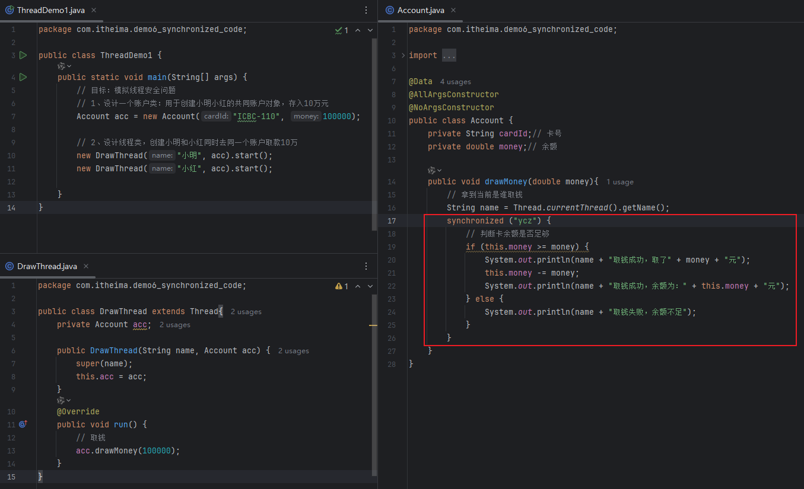

**结果**

| 小明取钱成功，取了100000.0元<br/>小明取钱成功，余额为：0.0元<br />小红取钱失败，余额不足 |
| ------------------------------------------------------------ |

上述代码的**缺点**：

- 锁对象选择了一个唯一的对象("ycz")，会影响其他无关进程的执行（其他账户取钱也得等前面解锁后才能执行，影响其他账户）

**锁对象的使用规范**

- 建议**使用共享资源作为锁对象**，对于**实例方法**建议使用**this**作为锁对象

  ```java
  private double money;
  public void drawMoney(double money){
      // 拿到当前是谁取钱
      String name = Thread.currentThread().getName();
      // 判断卡余额是否足够
      synchronized (this) {
          if (this.money >= money) {
              System.out.println(name + "取钱成功，取了" + money + "元");
              this.money -= money;
              System.out.println(name + "取钱成功，余额为：" + this.money+ "元");
          } else {
              System.out.println(name + "取钱失败，余额不足");
          }
      }
  }
  ```

- 对于**静态方法**建议使用**字节码（类名.class）**对象作为锁对象

  ```java
  private static double money1;
  public static void drawMoney(double money){
      // 拿到当前是谁取钱
      String name = Thread.currentThread().getName();
      // 判断卡余额是否足够
      synchronized (Account.class) {
          if (money1 >= money) {
              System.out.println(name + "取钱成功，取了" + money + "元");
              money1 -= money;
              System.out.println(name + "取钱成功，余额为：" + money1 + "元");
          } else {
              System.out.println(name + "取钱失败，余额不足");
          }
      }
  }
  ```

### 3、方式二：同步方法

- **作用**：把访问共享资源的核心方法给上锁，以此保证线程安全

  ```java
  修饰符 synchronized 返回值类型 方法名称(形参列表) {
      操作共享资源的代码
  }      
  ```

- **原理**：每次只能一个线程进入，执行完毕以后自动解锁，其他线程才可以进来执行

  ```java
  public synchronized void drawMoney(double money){
      // 拿到当前是谁取钱
      String name = Thread.currentThread().getName();
  
      // 判断卡余额是否足够
      if (this.money >= money) {
          System.out.println(name + "取钱成功，取了" + money + "元");
          this.money -= money;
          System.out.println(name + "取钱成功，余额为：" + this.money + "元");
      } else {
          System.out.println(name + "取钱失败，余额不足");
      }
  }
  ```

**同步方法底层原理**

- 同步方法其实底层也是有隐式锁对象的，只是锁的范围是整个方法代码。
- 如果方法是**实例方法**：同步方法默认用**this**作为的锁对象。
- 如果方法是**静态方法**：同步方法默认用**类名.class**作为的锁对象。

同步代码块好还是同步方法好？

- **范围上：同步代码块锁的范围更小(锁坑位)，同步方法锁的范围更大(锁厕所)**
- **可读性：同步方法更好**

### 4、方式三：lock锁

- Lock锁是JDK5开始提供的一个新的锁定操作，通过它可以创建出锁对象进行加锁和解锁，更灵活、更方便、更强大。

- Lock是接口，不能直接实例化，可以采用它的实现类ReentrantLock来构建Lock锁对象。

  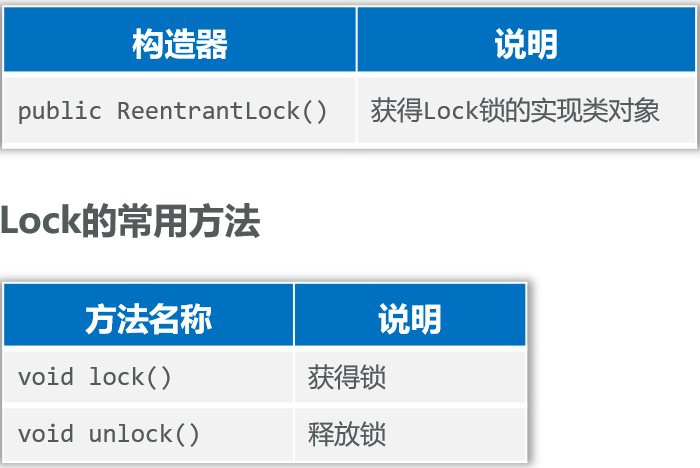

```java
private final Lock lk = new ReentrantLock();// 保护锁对象

public synchronized void drawMoney(double money){
    // 拿到当前是谁取钱
    String name = Thread.currentThread().getName();
    lk.lock();

    try {
        // 判断卡余额是否足够
        if (this.money >= money) {
            System.out.println(name + "取钱成功，取了" + money + "元");
            this.money -= money;
            System.out.println(name + "取钱成功，余额为：" + this.money + "元");
        } else {
            System.out.println(name + "取钱失败，余额不足");
        }
    } finally {
        lk.unlock();// 即使异常也能释放锁
    }
}
```

锁对象建议加上什么修饰？

- 建议使用**final**修饰，防止被别人篡改

释放锁的操作建议放到哪里？

- 建议将释放锁的操作放到**finally**代码块中，确保锁用完了一定会被释放

## 六、线程池

### 1、什么是线程池

- 线程池就是一个可以复用线程的技术

**不使用线程池的问题** 

- 用户每发起一个请求，后台就需要创建一个新线程来处理，下次新任务来了肯定又要创建新线程处理的， **创建新线程的开销是很大的，并且请求过多时，肯定会产生大量的线程出来**，这样会严重影响系统的性能。

**线程池的工作原理**

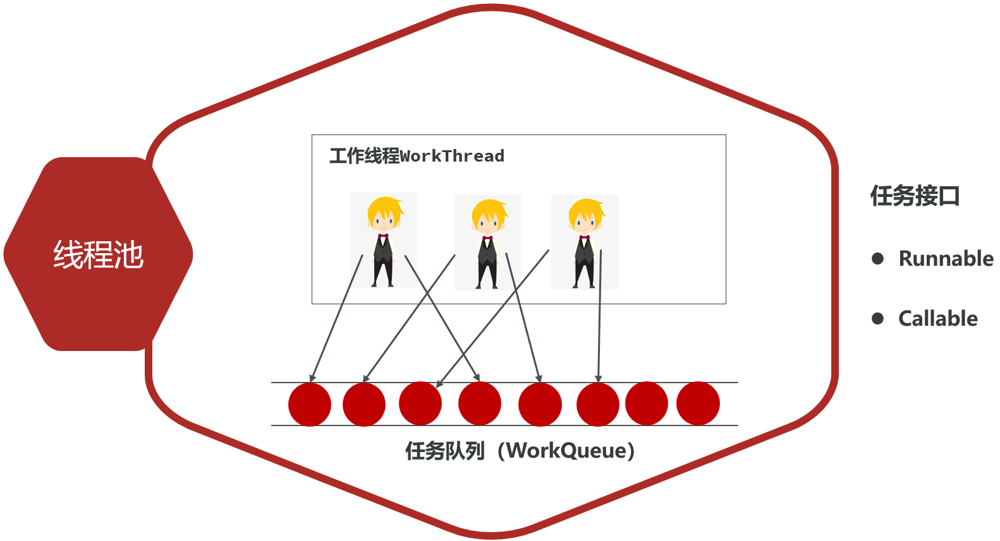

### 2、创建线程池

- JDK 5.0起提供了代表线程池的接口：ExecutorService

**如何创建线程池对象?**

- 方式一：使用ExecutorService的实现类ThreadPoolExecutor自创建一个线程池对象

  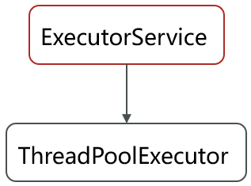

  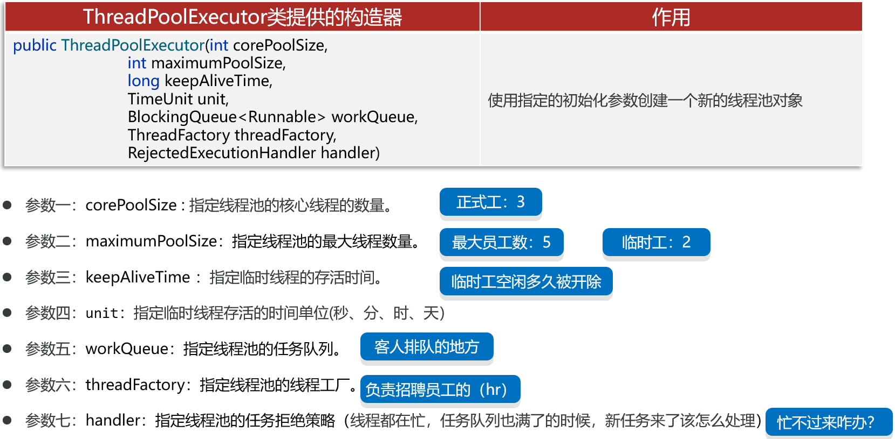

- 方式二：使用Executors（线程池的工具类）调用方法返回不同特点的线程池对象

### 3、方式一：ThreadPoolExecutor

- ExecutorService的常用方法(处理Runnable/Callable任务)

  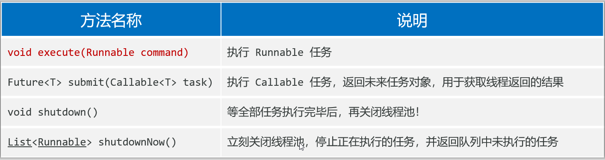

- 处理Runnable任务

  ```java
  package com.itheima.demo9executorService;
  
  import java.util.concurrent.*;
  
  public class ExecutorServiceDemo1 {
      public static void main(String[] args) {
          // 目标：创建线程池对象来使用
          // 1、使用线程池的实现类：ThreadPoolExecutor声明七个参数创建线程池对象
          ExecutorService pool = new ThreadPoolExecutor(
                  3,// corePoolSize
                  5,// maximumPoolSize
                  10,// keepAliveTime
                  TimeUnit.SECONDS,
                  new ArrayBlockingQueue<>(3),
                  Executors.defaultThreadFactory(),
                  new ThreadPoolExecutor.AbortPolicy()
          );
  
          // 2、使用线程池处理任务：看看会不会复用线程
          Runnable target = new MyRunnable();
          // 多次提交任务，复用线程池（里面有3个线程）
          for (int i = 0; i < 5; i++) {
              pool.execute(target);
          }
  
          // 3、关闭线程池对象
          // pool.shutdown();// 等所有任务执行完毕后再关闭
          pool.shutdownNow();// 立刻关闭，并清空队列，不管任务是否执行完毕
      }
  }
  ```

**注意事项**

- **什么时候开始**创建临时线程？

  新任务提交时发现**核心线程都在忙**，**任务队列也满了**，**并且还可以创建临时线程**，此时才会创建临时线程

- **什么时候会拒绝**新任务？

  **核心线程和临时线程都在忙，任务队列也满了**，新的任务过来的时候才会开始拒绝任务。

  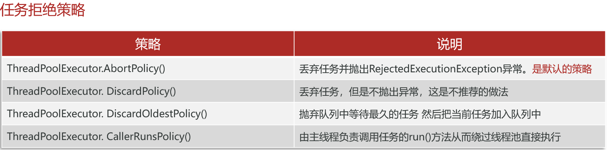

```java
package com.itheima.demo9executorService;

import java.util.concurrent.*;

public class ExecutorServiceDemo1 {
    public static void main(String[] args) {
        // 目标：创建线程池对象来使用
        // 1、使用线程池的实现类：ThreadPoolExecutor声明七个参数创建线程池对象
        ExecutorService pool = new ThreadPoolExecutor(
                3,// corePoolSize
                5,// maximumPoolSize
                10,// keepAliveTime
                TimeUnit.SECONDS,
                new ArrayBlockingQueue<>(3),
                Executors.defaultThreadFactory(),
                new ThreadPoolExecutor.AbortPolicy()
        );

        // 2、使用线程池处理任务：看看会不会复用线程
        Runnable target = new MyRunnable();
        // 多次提交任务，复用线程池（里面有3个线程）
        for (int i = 0; i < 9; i++) {
            // 第4个任务进入时，3个核心线程在忙，加入任务队列，等待3个核心线程忙完再执行
            // 第7个任务加入队列时，发现核心线程都在忙且队列满，创建临时线程4
            // 第8个任务加入队列时，发现3个核心线程和1个临时线程在忙且队列满，创建临时线程5
            // 第9个任务加入队列时，发现3个核心线程和2个临时线程都在忙，且队列满，此时拒绝任务
            pool.execute(target); // 3个核心线程在忙，第7个任务加入队列时，发现队列满，默认丢弃任务，并抛出异常
        }

        // 3、关闭线程池对象
        pool.shutdown();// 等所有任务执行完毕后再关闭
        // pool.shutdownNow();// 立刻关闭，并清空队列，不管任务是否执行完毕
    }
}

package com.itheima.demo9executorService;

// 1、定义一个线程任务类实现Runnable接口
public class MyRunnable implements Runnable {
    @Override
    public void run() {
        for (int i = 0; i < 5; i++){
            System.out.println(Thread.currentThread().getName() + "-->" + i);
            try {
                Thread.sleep(Integer.MAX_VALUE);// 执行一个任务就不让动了
            } catch (InterruptedException e) {
                e.printStackTrace();
            }
        }
    }
}
```

- 处理Callable任务

  代码

  ```java
  package com.itheima.demo9executorService;
  
  import java.util.concurrent.*;
  
  public class ExecutorServiceDemo2 {
      public static void main(String[] args) {
          // 目标：创建线程池对象来处理Callable任务
          // 1、使用线程池的实现类：ThreadPoolExecutor声明七个参数创建线程池对象
          ExecutorService pool = new ThreadPoolExecutor(
                  3,
                  5,
                  10,
                  TimeUnit.SECONDS,
                  new ArrayBlockingQueue<>(3),
                  Executors.defaultThreadFactory(),
                  new ThreadPoolExecutor.CallerRunsPolicy()
          );
  
          // 2、使用线程池处理Callable任务
          for (int i = 0; i < 5; i++){
              Future<String> f = pool.submit(new MyCallable((i+1)*100));
              try {
                  String s = f.get();
                  System.out.println(s);
              } catch (Exception e) {
                  e.printStackTrace();
              }
          }
      }
  }
  
  package com.itheima.demo9executorService;
  
  import java.util.concurrent.Callable;
  
  public class MyCallable implements Callable<String> {
      private int n;
      public MyCallable(int n) {
          this.n = n;
      }
  
      @Override
      public String call() throws Exception {
          int sum = 0;
          for (int i = 1; i <= n; i++) {
              sum += i;
          }
          return Thread.currentThread().getName() + "执行了" + n + "个数相加，结果是：" + sum;
      }
  }
  ```

  结果

  | pool-1-thread-1执行了100个数相加，结果是：5050<br/>pool-1-thread-2执行了200个数相加，结果是：20100<br/>pool-1-thread-3执行了300个数相加，结果是：45150<br/>pool-1-thread-1执行了400个数相加，结果是：80200<br/>pool-1-thread-2执行了500个数相加，结果是：125250 |
  | ------------------------------------------------------------ |

### 4、方式二：Executors

- 是一个线程池的**工具类**，提供了很多**静态方法**用于返回不同特点的线程池对象

  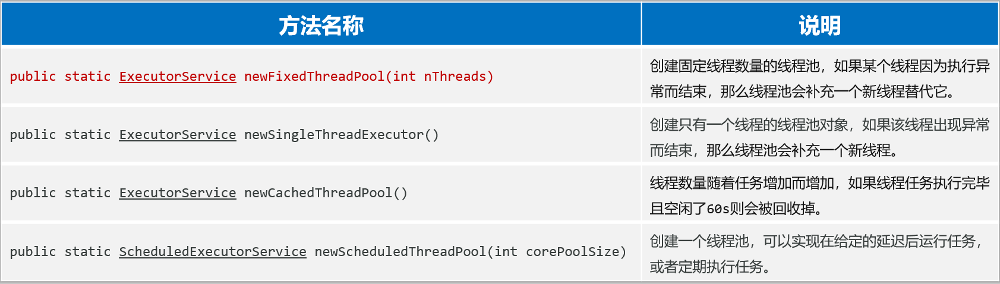

- **注意 ：这些方法的底层，都是通过线程池的实现类ThreadPoolExecutor创建的线程池对象**

  ```java
  package com.itheima.demo9executorService;
  
  import java.util.concurrent.ExecutorService;
  import java.util.concurrent.Executors;
  import java.util.concurrent.Future;
  
  public class ExecutorsDemo3 {
      public static void main(String[] args) {
          // 目标：通过线程池工具类：Executors创建线程池对象。
          // 1、使用线程池工具类：Executors创建线程池对象。
          ExecutorService pool = Executors.newFixedThreadPool(3);
  
          // 2、使用线程池处理Callable任务
          for (int i = 0; i < 5; i++){
              Future<String> f = pool.submit(new MyCallable((i+1)*100));
              try {
                  String s = f.get();
                  System.out.println(s);
              } catch (Exception e) {
                  e.printStackTrace();
              }
          }
      }
  }
  ```

- **Executors使用可能存在的陷阱**：大型并发系统环境中使用Executors如果不注意可能会出现系统风险，容易导致OOM(Out of Memory)

  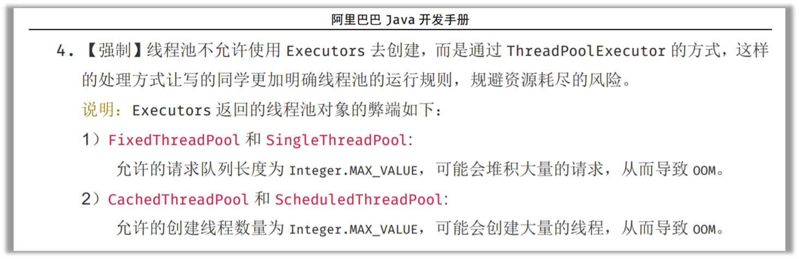

- 拓展：线程池的核心线程数量的配置公式(CPU密集型还是IO密集型)

## 七、并发、并行

**进程**

- 正在运行的程序（软件）就是一个独立的进程。
- 线程是属于进程的，一个进程中可以同时运行很多个线程。
- 进程中的多个线程其实是**并发和并行同时执行**的。

**并发**：同时请求，在全局上一起执行

- 进程中的线程是由CPU负责调度执行的，但CPU能同时处理线程的数量有限，为了保证全部线程都能往前执行，CPU会**轮询**为系统的每个线程服务，由于**CPU切换的速度很快**，给我们的**感觉这些线程在同时执行**，这就是并发

**并行**：在某一时刻一起执行

- 在同一个时刻上，同时有多个线程在被CPU调度执行

## 八、抢红包项目

需求

- 100个员工，发200个红包，小红包在[1, 30]之间，占比80%；大红包[31, 100]之间，占比20%

功能

1. 系统模拟上述要求产生200个红包
2. 模拟100个员工抢红包，需要输出哪个员工抢到哪个红包的过程，活动结束时需要提示活动结束
3. 活动结束后，对100名员工所抢红包总金额降序排序

主函数

```java
package com.itheima.demo10test;

import java.util.*;

public class ThreadTest {
    // 目标：完成多线程综合案例
    // 100个员工抢200个红包，结束后按总金额降序排序
    // 大红包：31-100， 20%；小红包：1-30， 80%
    // 100个员工：100个线程，抢200个红包
    public static void main(String[] args) throws InterruptedException {
        // 1、获取200个红包
        List<Integer> redPackets = getRedPackets();
        // 2、定义线程类创建100个员工线程，每个员工线程从redPackets集合中获取一个红包，并把红包放到一个集合中
        List<GetRedPackets> threads = new ArrayList<>();
        for(int i = 0; i < 100; i++){
            GetRedPackets thread = new GetRedPackets(redPackets, i+1+"员工");
            threads.add(thread);
            thread.start();
        }

        for (GetRedPackets thread : threads) {
            thread.join();
        }

        // 汇总结果
        Map<String, Integer> finalMap = new HashMap<>();
        for (GetRedPackets thread : threads) {
            finalMap.putAll(thread.getMap());
        }

        // 按抢红包的额度降序排序并输出
        List<Map.Entry<String, Integer>> list = new ArrayList<>(finalMap.entrySet());
        list.sort((e1, e2) -> e2.getValue().compareTo(e1.getValue())); // 降序排序

        // 输出结果
        System.out.println("最终抢红包结果（按额度降序）：");
        for (Map.Entry<String, Integer> entry : list) {
            System.out.println(entry.getKey() + "抢到了" + entry.getValue() + "元");
        }
    }

    // 准备200个随机的红包并返回，放到List集合中去返回
    public static List<Integer> getRedPackets(){
        List<Integer> redPackets = new ArrayList<>();

        for (int i = 0; i < 200; i++) {
            double random = Math.random();
            int redPacket = random > 0.2 ? (int)(Math.random() * 30 + 1)
                    : (int)(Math.random() * 70 + 31);
            redPackets.add(redPacket);
        }
        return redPackets;
    }
}
```

抢红包线程类

```java
package com.itheima.demo10test;

import lombok.Getter;

import java.util.*;

// 线程类
public class GetRedPackets extends Thread{
    private final List<Integer> redPackets;
    @Getter
    private Map<String, Integer> map = new HashMap<>();
    public GetRedPackets(List<Integer> redPackets, String name) {
        super(name);
        this.redPackets = redPackets;
    }
    @Override
    public void run() {
        String name = Thread.currentThread().getName();
        // 100个人抢redPackets中红包
        while(true) {
            synchronized (redPackets) {
                if (redPackets.isEmpty()) {
                    break;
                }
                // 随机取一个索引
                int index = (int) (Math.random() * redPackets.size());
                int redPacket = redPackets.remove(index);
                System.out.println(name + "抢到了" + redPacket + "元");
                if(!map.containsKey(name)) {
                    map.put(name, redPacket);
                } else {
                    int money = map.get(name);
                    money += redPacket;
                    map.put(name, money);
                }
                if (redPackets.isEmpty()) {
                    System.out.println("活动结束");
                    break;
                }
            }
            // 进程解锁后睡眠1秒
            try {
                Thread.sleep(1000);
            } catch (InterruptedException e) {
                e.printStackTrace();
            }
        }
        System.out.println(name + "抢到了" + map.get(name) + "元");
    }
}
```

