## 一、数据通信方案

- 网络编程：可以让设备中的程序与网络上其他设备中的程序进行数据交互的技术（实现网络通信）。

- 基本的通信架构：CS架构（Client客户端/Server服务端） 、 BS架构(Browser浏览器/Server服务端)。

  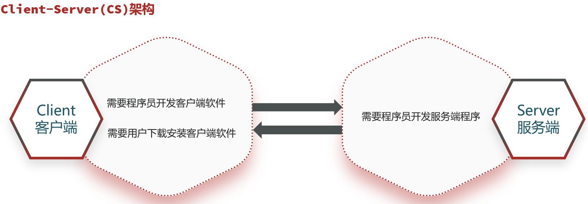

  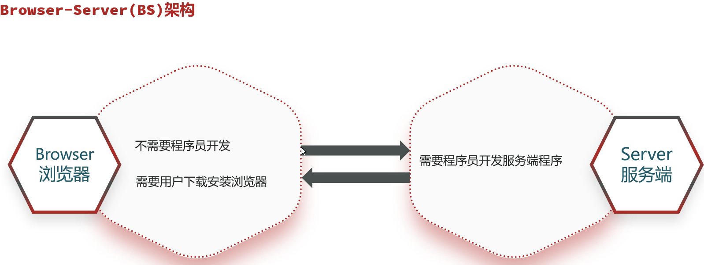

- 无论CS还是BS架构的软件都必须依赖网络编程

- java.net.*包下提供了网络编程的解决方案

## 二、网络编程的三要素

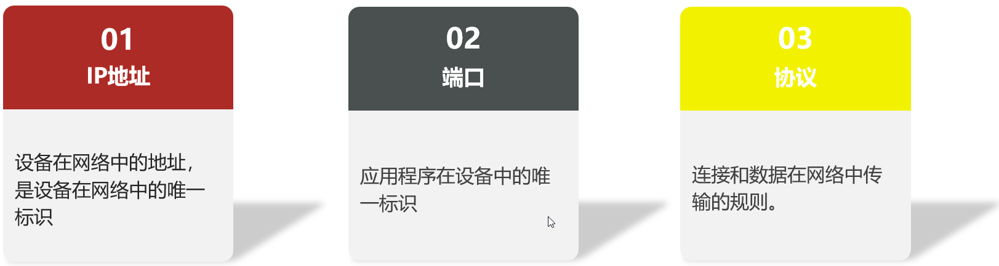

### 1、IP

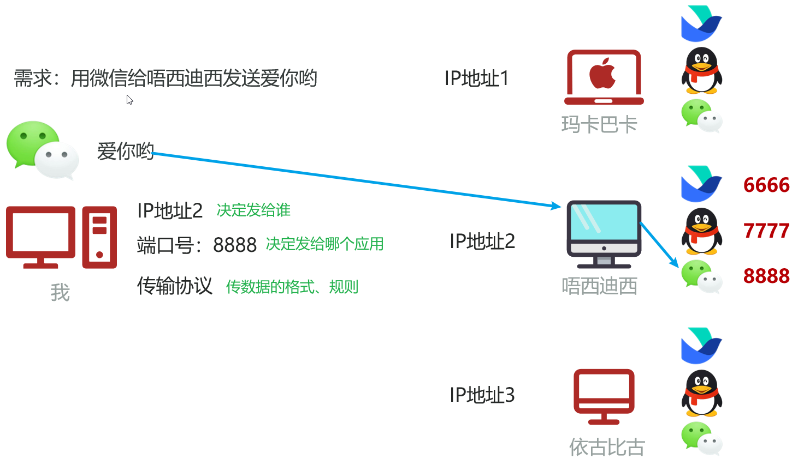

#### 1.1 IPv4和IPv6

- IP（Internet Protocol）：全称”互联网协议地址”，是分配给上网设备的唯一标识。

- 目前，被广泛采用的IP地址形式有两种：IPv4、IPv6。

  - Pv4是Internet Protocol version 4的缩写，它使用**32位**地址，通常以点分十进制表示

    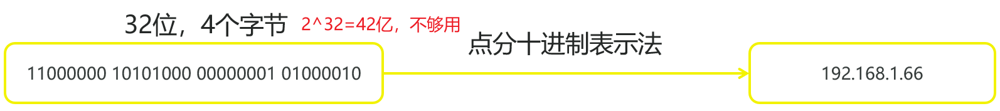

  - Pv6是Internet Protocol version 6的缩写，它使用**128位**地址，号称可以为地球上的每一粒沙子编号

    Pv6分成8段，每段每四位编码成一个十六进制位表示， 每段之间用冒号（:）分开，将这种方式称为冒分十六进制。

    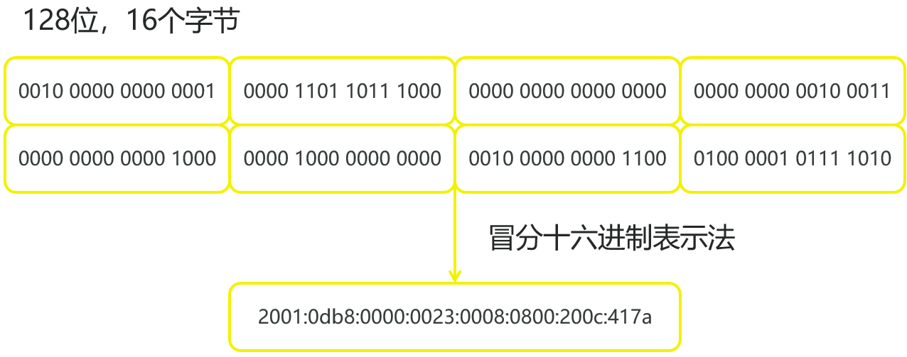

#### 1.2 IP域名与DNS域名解析

- IP域名(Domain Name)

  用于在互联网上识别和定位网站的人类可读的名称。

  例如：

  www.baidu.com

  www.itheima.com

- DNS域名解析(Domain Name System)

  是互联网中将域名转化为对应IP地址的分布式命名系统

  它充当了互联网的“电话簿”，将易记的域名映射到数字化的IP地址，使得用户可以通过域名来访问网站和其他网络资源

  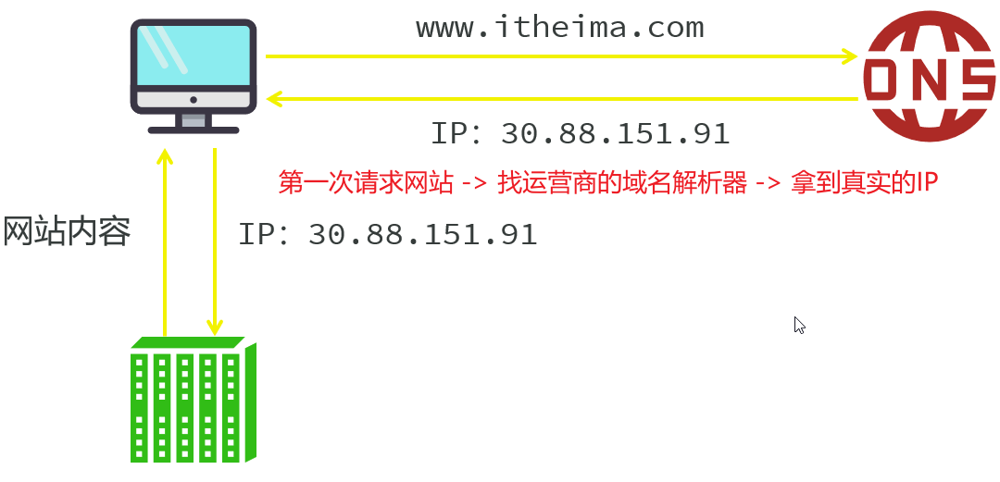

#### 1.3 公网IP、内网IP和本机IP

- 公网IP：是可以连接到互联网的IP地址；

- 内网IP：也叫局域网IP，是只能组织机构内部使用的IP地址；例如，**192.168. 开头**的就是常见的局域网地址，范围为192.168.0.0--192.168.255.255，专门为组织机构内部使用

- 本机IP：127.0.0.1、localhost：代表本机IP，只会寻找当前程序所在的主机

- IP常用命令：

  ipconfig：查看本机IP地址。

  ipconfig \all：查看更详细的信息（包括MAC物理地址，主机**唯一身份认证**）

  ping IP地址/域名：检查网络是否连通，常用于检测局域网中自己的IP和其他人的IP是否联通

#### 1.4 InetAddress

代表IP地址

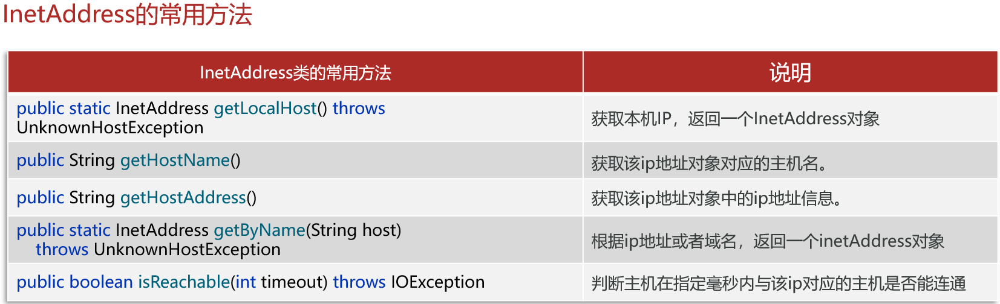

```java
package com.itheima.demo1inetaddress;

import java.net.InetAddress;

public class InetAddressDemo1 {
    public static void main(String[] args) {
        // 目标：认识InetAddress获取本机IP对象和对方IP对象
        try {
            // 1.获取本机IP对象
            InetAddress ip1 = InetAddress.getLocalHost();
            System.out.println(ip1.getHostName());
            System.out.println(ip1.getHostAddress());

            // 2、获取对方IP对象
            InetAddress ip2 = InetAddress.getByName("www.baidu.com");
            System.out.println(ip2.getHostName());
            System.out.println(ip2.getHostAddress());

            //3、判断主机与对应ip的主机能否联通
            System.out.println(ip2.isReachable(3000));

        } catch (Exception e) {
            e.printStackTrace();
        }
    }
}
```

### 2、端口

- 用来标记标记正在计算机设备上运行的应用程序，被规定为一个 16 位的二进制，范围是 0~65535

- 端口的分类

  周知端口：0~1023，被预先定义的知名应用占用（如：HTTP占用 80，FTP占用21） 

  注册端口：1024~49151，分配给用户进程或某些应用程序。

  动态端口：49152到65535，之所以称为动态端口，是因为它一般不固定分配某种进程，而是动态分配。

  注意：我们**自己开发**的程序**一般选择使用注册端口**，且**一个设备中不能出现两个程序的端口号一样**，否则报错

  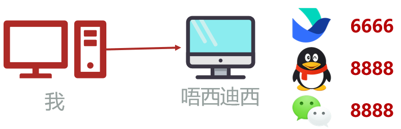

- bind socket exception：绑定窗口异常，说明该端口已经被绑定了

### 3、通信协议

- 网络上通信的设备，事先规定的**连接规则**，以及**传输/通信数据的规则**被称为网络通信协议
- 为了让全球所有上网设备都能互联互通，需要指定一套统一的标准

#### 3.1 开放式网络互联标准：OSI网络参考模型

- OSI网络参考模型：全球网络互联标准。
- TCP/IP网络模型：事实上的国际标准。

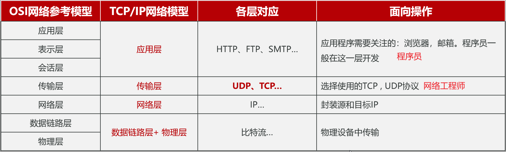

- 传输层的2个通信协议

  - UDP(User Datagram Protocol)：用户数据报协议。

  - TCP(Transmission Control Protocol) ：传输控制协议。

#### 3.2 UDP协议

- 特点：**无连接、不可靠通信，速度快，有大小限制一次最多发送64K，数据不安全，易丢失数据**

- 不事先建立连接，数据按照包发，一包数据包含：自己的IP、端口、目的地IP、端口和**数据（限制在64KB内）**等。

- 发送方不管对方是否在线，数据在中间丢失也不管，如果接收方收到数据也不返回确认，故是不可靠的

#### 3.3 TCP协议

- 特点：**面向连接、可靠通信**。

- TCP的最终目的：要保证在不可靠的信道上实现可靠的数据传输。

- TCP主要有三个步骤实现可靠传输：

  - 传输前：**三次握手建立连接，点对点的通信**
  - 连接中：传输数据进行确认，**可进行大数据量的传输**
  - 传输后：**四次挥手断开连接，确保消息全部收发完毕**

- 特点：**通信效率相对较低，可靠性相对较高**

- 三次握手建立**可靠连接**：确保通信的双方收发消息都是没问题的（全双工）

  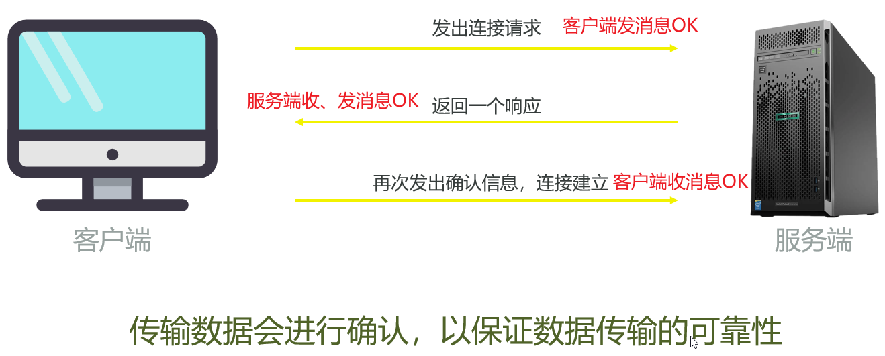

  

- 如果客户端发了两次请求，但没收到服务端的响应，此时不会建立连接，因为发送的请求有ID

- 四次握手**断开连接**：确保通信双方收发消息都已经完成

  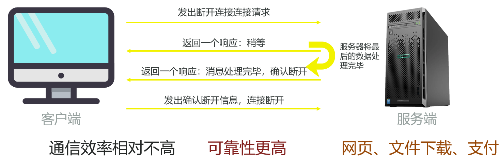

  

