## 一、数据通信方案

- 网络编程：可以让设备中的程序与网络上其他设备中的程序进行数据交互的技术（实现网络通信）。

- 基本的通信架构：CS架构（Client客户端/Server服务端） 、 BS架构(Browser浏览器/Server服务端)。

  

  

- 无论CS还是BS架构的软件都必须依赖网络编程

- java.net.*包下提供了网络编程的解决方案

## 二、网络编程的三要素


### 1、IP


#### 1.1 IPv4和IPv6

- IP（Internet Protocol）：全称”互联网协议地址”，是分配给上网设备的唯一标识。

- 目前，被广泛采用的IP地址形式有两种：IPv4、IPv6。

  - Pv4是Internet Protocol version 4的缩写，它使用**32位**地址，通常以点分十进制表示

    

  - Pv6是Internet Protocol version 6的缩写，它使用**128位**地址，号称可以为地球上的每一粒沙子编号

    Pv6分成8段，每段每四位编码成一个十六进制位表示， 每段之间用冒号（:）分开，将这种方式称为冒分十六进制。

    

#### 1.2 IP域名与DNS域名解析

- IP域名(Domain Name)

  用于在互联网上识别和定位网站的人类可读的名称。

  例如：

  www.baidu.com

  www.itheima.com

- DNS域名解析(Domain Name System)

  是互联网中将域名转化为对应IP地址的分布式命名系统

  它充当了互联网的“电话簿”，将易记的域名映射到数字化的IP地址，使得用户可以通过域名来访问网站和其他网络资源

  

#### 1.3 公网IP、内网IP和本机IP

- 公网IP：是可以连接到互联网的IP地址；

- 内网IP：也叫局域网IP，是只能组织机构内部使用的IP地址；例如，**192.168. 开头**的就是常见的局域网地址，范围为192.168.0.0--192.168.255.255，专门为组织机构内部使用

- 本机IP：127.0.0.1、localhost：代表本机IP，只会寻找当前程序所在的主机

- IP常用命令：

  ipconfig：查看本机IP地址。

  ipconfig \all：查看更详细的信息（包括MAC物理地址，主机**唯一身份认证**）

  ping IP地址/域名：检查网络是否连通，常用于检测局域网中自己的IP和其他人的IP是否联通

#### 1.4 InetAddress

代表IP地址


```java
package com.itheima.demo1inetaddress;

import java.net.InetAddress;

public class InetAddressDemo1 {
    public static void main(String[] args) {
        // 目标：认识InetAddress获取本机IP对象和对方IP对象
        try {
            // 1.获取本机IP对象
            InetAddress ip1 = InetAddress.getLocalHost();
            System.out.println(ip1.getHostName());
            System.out.println(ip1.getHostAddress());

            // 2、获取对方IP对象
            InetAddress ip2 = InetAddress.getByName("www.baidu.com");
            System.out.println(ip2.getHostName());
            System.out.println(ip2.getHostAddress());

            //3、判断主机与对应ip的主机能否联通
            System.out.println(ip2.isReachable(3000));

        } catch (Exception e) {
            e.printStackTrace();
        }
    }
}
```

### 2、端口

- 用来标记标记正在计算机设备上运行的应用程序，被规定为一个 16 位的二进制，范围是 0~65535

- 端口的分类

  周知端口：0~1023，被预先定义的知名应用占用（如：HTTP占用 80，FTP占用21） 

  注册端口：1024~49151，分配给用户进程或某些应用程序。

  动态端口：49152到65535，之所以称为动态端口，是因为它一般不固定分配某种进程，而是动态分配。

  注意：我们**自己开发**的程序**一般选择使用注册端口**，且**一个设备中不能出现两个程序的端口号一样**，否则报错

  

- bind socket exception：绑定窗口异常，说明该端口已经被绑定了

### 3、通信协议

- 网络上通信的设备，事先规定的**连接规则**，以及**传输/通信数据的规则**被称为网络通信协议
- 为了让全球所有上网设备都能互联互通，需要指定一套统一的标准

#### 3.1 开放式网络互联标准：OSI网络参考模型

- OSI网络参考模型：全球网络互联标准。
- TCP/IP网络模型：事实上的国际标准。


- 传输层的2个通信协议

  - UDP(User Datagram Protocol)：用户数据报协议。

  - TCP(Transmission Control Protocol) ：传输控制协议。

#### 3.2 UDP协议

- 特点：**无连接、不可靠通信，速度快，有大小限制一次最多发送64K，数据不安全，易丢失数据**

- 不事先建立连接，数据按照包发，一包数据包含：自己的IP、端口、目的地IP、端口和**数据（限制在64KB内）**等。

- 发送方不管对方是否在线，数据在中间丢失也不管，如果接收方收到数据也不返回确认，故是不可靠的

#### 3.3 TCP协议

- 特点：**面向连接、可靠通信**。

- TCP的最终目的：要保证在不可靠的信道上实现可靠的数据传输。

- TCP主要有三个步骤实现可靠传输：

  - 传输前：**三次握手建立连接，点对点的通信**
  - 连接中：传输数据进行确认，**可进行大数据量的传输**
  - 传输后：**四次挥手断开连接，确保消息全部收发完毕**

- 特点：**通信效率相对较低，可靠性相对较高**

- 三次握手建立**可靠连接**：确保通信的双方收发消息都是没问题的（全双工）

  

  

- 如果客户端发了两次请求，但没收到服务端的响应，此时不会建立连接，因为发送的请求有ID

- 四次握手**断开连接**：确保通信双方收发消息都已经完成

  

  

## 三、UDP通信

### 1、一发一收

- **UDP通信的特点：无连接、不可靠通信**

- 不事先建立连接；发送端每次把要发送的数据（限制在64KB内）、接收端IP等信息封装成一个数据包，发出去就不管了

- Java提供了一个**java.net.DatagramSocket**类来实现UDP通信

  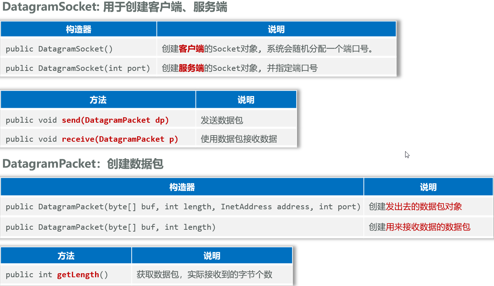

  - 客户端

    ```java
    package com.itheima.demo2udp1;
    
    import java.net.DatagramPacket;
    import java.net.DatagramSocket;
    import java.net.InetAddress;
    
    public class UDPClientDemo1 {
        public static void main(String[] args) throws Exception {
            // 目标：未完成UDP通信一发一收，客户端开发
            // 1、创建发送对象
            System.out.println("客户端启动");
            DatagramSocket socket = new DatagramSocket();// 随机注册的动态端口
            // 2、创建数据包对象封装要发送的数据
            byte[] bytes = "我是客户端，约你吃个饭".getBytes();
            /**
             * public DatagramPacket(byte[] buf, int length,
             *                           InetAddress address, int port)
             * 参数一：发送的数据，字节数组
             * 参数二：发送数据的长度
             * 参数三：指定发送的目标的IP地址
             * 参数四：指定发送的目标的端口号
             */
            DatagramPacket packet = new DatagramPacket(bytes, bytes.length, InetAddress.getLocalHost(),8080);
            socket.send(packet);
        }
    }
    ```

  - 服务端

    ```java
    package com.itheima.demo2udp1;
    
    import java.net.DatagramPacket;
    import java.net.DatagramSocket;
    
    public class UDPServerDemo2 {
        public static void main(String[] args) throws Exception {
            // 目标：完成UDP一发一收：服务端开发
            // 1、创建接收端对象，注册端口
            System.out.println("服务端启动了...");
            DatagramSocket socket = new DatagramSocket(8080);
            // 2、准备一个数据包对象，用来接受数据
            byte[] buffer = new byte[1024 * 64];// 64KB
            DatagramPacket packet = new DatagramPacket(buffer, buffer.length);
            // 3、接收数据，将数据封装到数据包对象的字节数组中去
            socket.receive(packet);
            // 4、看看数据是否收到了
            // 获取收到数据的长度
            int length = packet.getLength();
            String data = new String(buffer, 0, length);
            System.out.println("服务端收到数据：" + data);
            // 获取对方的IP对象和程序端口
            String ip = packet.getAddress().getHostAddress();// packet.getAddress()是InetAddress对象
            int port = packet.getPort();
            System.out.println("服务端收到数据：" + ip + ":" + port);
        }
    }
    ```

- **客户端实现步骤**

  ①创建DatagramSocket对象（客户端对象）  ->   扔韭菜的人

  ②创建DatagramPacket对象封装需要发送的数据（数据包对象）  ->   韭菜盘子

  ③使用DatagramSocket对象的send方法，传入DatagramPacket对象   ->  开始抛出韭菜

  ④释放资源

- **服务端实现步骤**

  ①创建DatagramSocket对象并指定端口（服务端对象）  ->  接韭菜的人

  ②创建DatagramPacket对象接收数据（数据包对象）  ->  韭菜盘子

  ③使用DatagramSocket对象的receive方法，传入DatagramPacket对象   ->   开始接收韭菜

  ④释放资源

### 2、多发多收

- 客户端（[可多开](D:\笔记\notes\软件使用贴士\IDEA软件贴士)）

  ```java
  package com.itheima.demo3udp2;
  
  import java.net.DatagramPacket;
  import java.net.DatagramSocket;
  import java.net.InetAddress;
  import java.util.Scanner;
  
  public class UDPClientDemo1 {
      public static void main(String[] args) throws Exception {
          // 目标：未完成UDP通信一发一收，客户端开发
          // 1、创建发送对象
          System.out.println("客户端启动");
          DatagramSocket socket = new DatagramSocket();// 随机注册的动态端口
  
          Scanner sc = new Scanner(System.in);
          while (true) {
              // 2、创建数据包对象封装要发送的数据
              System.out.println("请说：");
              String msg = sc.nextLine();
  
              // 如果用户输入bye，则结束聊天
              if ("bye".equals(msg)) {
                  System.out.println("客户端退出");
                  socket.close(); // 关闭资源管道
                  break;
              }
  
              byte[] bytes = msg.getBytes();
              DatagramPacket packet = new DatagramPacket(bytes, bytes.length,
                      InetAddress.getLocalHost(),8080);
              socket.send(packet);
          }
      }
  }
  ```

- 服务端

  ```java
  package com.itheima.demo3udp2;
  
  import java.net.DatagramPacket;
  import java.net.DatagramSocket;
  
  public class UDPServerDemo2 {
      public static void main(String[] args) throws Exception {
          // 目标：完成UDP一发一收：服务端开发
          // 1、创建接收端对象，注册端口
          System.out.println("服务端启动了...");
          DatagramSocket socket = new DatagramSocket(8080);
          // 2、准备一个数据包对象，用来接受数据
          byte[] buffer = new byte[1024 * 64];// 64KB
          DatagramPacket packet = new DatagramPacket(buffer, buffer.length);
          while (true) {
              // 3、接收数据，将数据封装到数据包对象的字节数组中去
              socket.receive(packet); // 等待式接收数据
  
              // 4、看看数据是否收到了
              // 获取收到数据的长度
              int length = packet.getLength();
              String data = new String(buffer, 0, length);
              System.out.println("服务端收到数据：" + data);
              // 获取对方的IP对象和程序端口
              String ip = packet.getAddress().getHostAddress();// packet.getAddress()是InetAddress对象
              int port = packet.getPort();
              System.out.println("服务端收到数据：" + ip + ":" + port);
              System.out.println("-----------------------------------------");
          }
      }
  }
  ```

- **客户端实现步骤**

  ①创建DatagramSocket对象（发送端对象

  ②使用while死循环不断的接收用户的数据输入，如果用户输入的exit则退出程序

  ③如果用户输入的不是exit, 把数据封装成DatagramPacket

  ④使用DatagramSocket对象的send方法将数据包对象进行发送

  ⑤释放资源

- **接收端实现步骤**

  ①创建DatagramSocket对象并指定端口（接收端对象）

  ②创建DatagramPacket对象接收数据（数据包对象）

  ③使用DatagramSocket对象的receive方法传入DatagramPacket对象

  ④使用while死循环不断的进行第3步

- UDP的接收端为什么**可以接收很多发送端的消息**？

  接收端只负责接收数据包，无所谓是哪个发送端的数据包

## 四、TCP通信

### 1、一发一收

- **TCP通信的特点：面向连接、可靠通信**
- 通信双方事先会采用“三次握手”方式建立可靠连接，实现端到端的通信；底层能保证数据成功传给服务端。
- Java提供了一个**java.net.Socket**类来实现TCP通信。

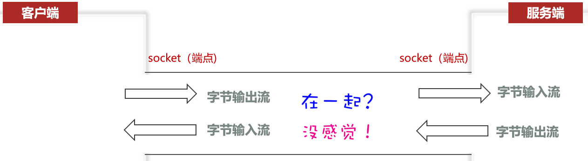


- **客户端**程序就是通过**java.net**包下的**Socket**类来实现的

  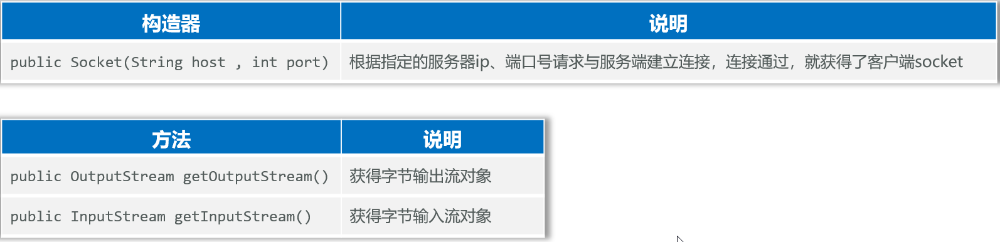

  ①创建客户端的Socket对象，请求与服务端的连接。

  ②使用socket对象调用getOutputStream()方法得到字节输出流。

  ③使用字节输出流完成数据的发送。

  ④释放资源：关闭socket管道。

  ```java
  package com.itheima.demo4tcp1;
  
  import java.io.DataOutputStream;
  import java.io.OutputStream;
  import java.net.Socket;
  
  public class ClientDemo1 {
      public static void main(String[] args) {
          // 目标：实现TCP通信下一发一收，客户端开发
          // 1、创建Socket对象，请求与服务端的Socket连接，可靠连接
          // 使用完自动释放资源
          try(Socket socket = new Socket("127.0.0.1", 9999);
              // 2、从socket对象通信管道中得到一个字节输出流对象
              OutputStream os = socket.getOutputStream();
              // 3、特殊数据流
              DataOutputStream dos = new DataOutputStream(os)
         ) {
              dos.writeInt(1);
              dos.writeUTF("我想你了");
          } catch (Exception e) {
              throw new RuntimeException(e);
          }
      }
  }
  ```

- **服务端**是通过**java.net**包下的**ServerSocket**类来实现的

  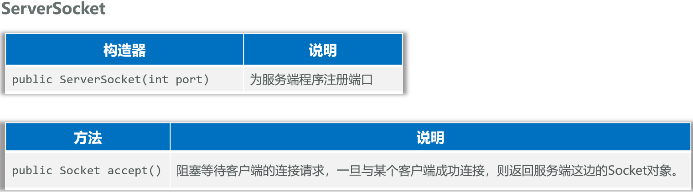

  ①创建ServerSocket对象，注册服务端端口。

  ②调用ServerSocket对象的accept()方法，等待客户端的连接，并得到Socket管道对象。

  ③通过Socket对象调用getInputStream()方法得到字节输入流、完成数据的接收。

  ④释放资源：关闭socket管道

  ```java
  package com.itheima.demo4tcp1;
  
  import java.io.DataInputStream;
  import java.io.InputStream;
  import java.net.ServerSocket;
  import java.net.Socket;
  
  public class ServerDemo2 {
      public static void main(String[] args) throws Exception {
          // 目标：实现TCP通信的一收一发，服务端开发
          System.out.println("服务端启动...");
          // 1、创建一个服务器Socket对象，绑定到9999端口，并监听客户端连接
          ServerSocket ss = new ServerSocket(9999);
          // 2、调用accept方法，阻塞等待客户端连接，一旦有客户端连接，就返回一个Socket对象
          Socket socket = ss.accept();
          try(
                  // 3、从socket通信管道中得到一个字节输入流
                  InputStream is = socket.getInputStream();
                  // 4、包装字节流为特殊数据输入流对象
                  DataInputStream dis = new DataInputStream(is);
          ) {
              // 5、读取数据
              int id = dis.readInt();
              String msg = dis.readUTF();
              System.out.println("id=" + id + ",msg=" + msg);
              // 6、客户端的IP和端口
              System.out.println("客户端的IP地址：" + socket.getInetAddress().getHostAddress());
              System.out.println("客户端的端口：" + socket.getPort());
          } catch (Exception e){
              e.printStackTrace();
          }
      }
  }
  ```

### 2、多发多收

①客户端使用死循环，让用户不断输入消息。

②服务端也使用死循环，控制服务端程序收完消息后，继续去接收下一个消息。

- 客户端

  ```java
  package com.itheima.demo5tcp2;
  
  import java.io.DataOutputStream;
  import java.io.OutputStream;
  import java.net.Socket;
  import java.util.Scanner;
  
  public class ClientDemo1 {
      public static void main(String[] args) {
          // 目标：实现TCP通信下一发一收，客户端开发
          System.out.println("客户端启动...");
  
  
          // 使用完自动释放资源
          try(// 1、创建Socket对象，请求与服务端的Socket连接，可靠连接
              Socket socket = new Socket("127.0.0.1", 9999);
              // 2、从socket对象通信管道中得到一个字节输出流对象
              OutputStream os = socket.getOutputStream();
              // 3、特殊数据流
              DataOutputStream dos = new DataOutputStream(os);
              Scanner sc = new Scanner(System.in)
         ) {
  
              while (true) {
                  System.out.println("请说：");
                  String msg = sc.nextLine();
                  dos.writeUTF(msg);
                  dos.flush();
                  if ("bye".equals(msg)) {
                      break;
                  }
              }
          } catch (Exception e) {
              throw new RuntimeException(e);
          }
      }
  }
  ```

- 服务端

  ```java
  package com.itheima.demo5tcp2;
  
  import java.io.DataInputStream;
  import java.io.InputStream;
  import java.net.ServerSocket;
  import java.net.Socket;
  
  public class ServerDemo2 {
      public static void main(String[] args) throws Exception {
          // 目标：实现TCP通信的一收一发，服务端开发
          System.out.println("服务端启动...");
  
          try(// 1、创建一个服务器Socket对象，绑定到9999端口，并监听客户端连接
              ServerSocket ss = new ServerSocket(9999);
              // 2、调用accept方法，阻塞等待客户端连接，一旦有客户端连接，就返回一个Socket对象
              Socket socket = ss.accept();
              // 3、从socket通信管道中得到一个字节输入流
              InputStream is = socket.getInputStream();
              // 4、包装字节流为特殊数据输入流对象
              DataInputStream dis = new DataInputStream(is)
          ) {
              while (true) {
                  // 5、读取数据
                  String msg = dis.readUTF(); // 阻塞式等待
                  System.out.println(msg);
                  if ("bye".equals(msg)) {
                      System.out.println("客户端请求关闭连接，服务端退出...");
                      break;
                  }
                  // 6、客户端的IP和端口
                  System.out.println("客户端的IP地址：" + socket.getInetAddress().getHostAddress());
                  System.out.println("客户端的端口：" + socket.getPort());
                  System.out.println("------------------");
              }
  
          } catch (Exception e){
              e.printStackTrace();
          }
      }
  }
  ```


### 3、同时接收多个客户端消息

- 上面的客户端不能像UDP通信那样直接多开

  因为服务端只有一个主线程，只能处理一个客户端的消息

- 可以给每个接收到的客户端连接的socket创建子线程

  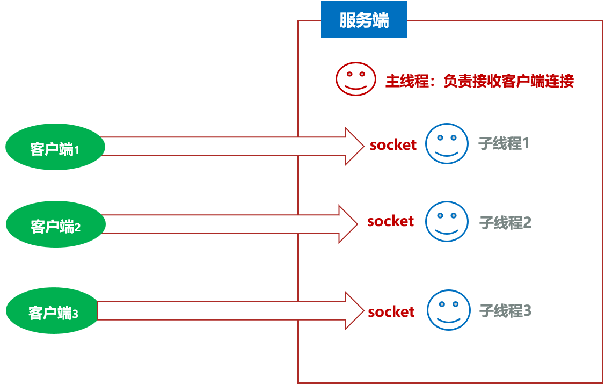

- 具体实现

  - 主线程定义了**循环负责接收客户端Socket**管道连接
  - 每接收到一个Socket通信管道后**分配一个独立的线程负责**处理它

  **线程类**

  ```java
  package com.itheima.demo6tcp3;
  
  import java.io.DataInputStream;
  import java.io.IOException;
  import java.io.InputStream;
  import java.net.Socket;
  
  public class ServerReader extends Thread{
      private Socket socket;
      public ServerReader(Socket socket) {
          this.socket = socket;
      }
      @Override
      public void run() {
          try {
              // 3、从socket通信管道中得到一个字节输入流
              InputStream is = socket.getInputStream();
              // 4、包装字节流为特殊数据输入流对象
              DataInputStream dis = new DataInputStream(is);
              while (true) {
                  // 5、读取数据
                  String msg = dis.readUTF(); // 阻塞式等待
                  System.out.println(msg);
                  // 6、客户端的IP和端口
                  System.out.println("客户端的IP地址：" + socket.getInetAddress().getHostAddress());
                  System.out.println("客户端的端口：" + socket.getPort());
                  System.out.println("------------------");
              }
          } catch (Exception e) {
              System.out.println("客户端退出了:"+socket.getInetAddress().getHostAddress()+":"+socket.getPort());
              System.out.println("------------------");
          }
      }
  }
  ```

  **服务端**

  ```java
  package com.itheima.demo6tcp3;
  
  import java.net.ServerSocket;
  import java.net.Socket;
  
  public class ServerDemo2 {
      public static void main(String[] args) throws Exception {
          // 目标：实现TCP通信的一收一发，服务端开发
          System.out.println("服务端启动...");
  
          try(// 1、创建一个服务器Socket对象，绑定到9999端口，并监听客户端连接
              ServerSocket ss = new ServerSocket(9999)
          ) {
              // 2、调用accept方法，阻塞等待客户端连接，一旦有客户端连接，就返回一个Socket对象
              while (true) {
                  Socket socket = ss.accept();
                  System.out.println("客户端连接了："+socket.getInetAddress().getHostAddress()+":"+socket.getPort());
                  new ServerReader(socket).start();
              }
          } catch (Exception e){
              e.printStackTrace();
          }
      }
  }
  ```

  **客户端**

  ```java
  package com.itheima.demo6tcp3;
  
  import java.io.DataOutputStream;
  import java.io.OutputStream;
  import java.net.Socket;
  import java.util.Scanner;
  
  public class ClientDemo1 {
      public static void main(String[] args) {
          // 目标：实现TCP通信下一发一收，客户端开发
          System.out.println("客户端启动...");
  
  
          // 使用完自动释放资源
          try(// 1、创建Socket对象，请求与服务端的Socket连接，可靠连接
              Socket socket = new Socket("127.0.0.1", 9999);
              // 2、从socket对象通信管道中得到一个字节输出流对象
              OutputStream os = socket.getOutputStream();
              // 3、特殊数据流
              DataOutputStream dos = new DataOutputStream(os);
              Scanner sc = new Scanner(System.in)
         ) {
              while (true) {
                  System.out.println("请说：");
                  String msg = sc.nextLine();
                  dos.writeUTF(msg);
                  dos.flush();
                  if ("bye".equals(msg)) {
                      break;
                  }
              }
          } catch (Exception e) {
              throw new RuntimeException(e);
          }
      }
  }
  ```

### 4、B/S架构的原理

- 客户端使用浏览器发起请求（不需要开发客户端）
- 服务端必须按照HTTP协议响应数据

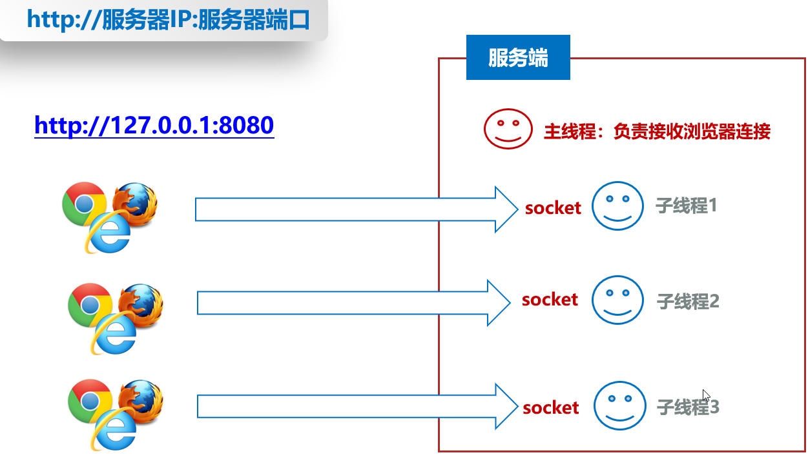

- **注意：服务器必须给浏览器响应HTTP协议规定的数据格式，否则浏览器不识别返回的数据**

- **HTTP协议**规定：响应给浏览器的数据格式必须满足如下格式

  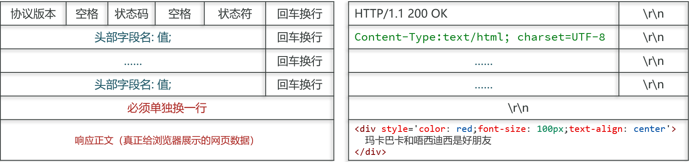

- 每次请求都开一个新线程，高并发时，容易宕机

  可以用**线程池进行优化**

  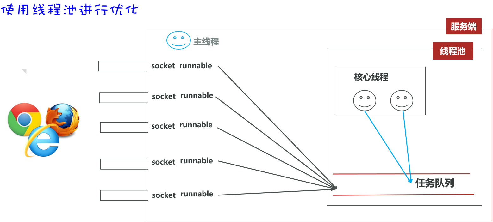

  **服务端**

  ```java
  package com.itheima.demo7tcp4;
  
  import java.net.ServerSocket;
  import java.net.Socket;
  import java.util.concurrent.*;
  
  public class ServerDemo {
      public static void main(String[] args) throws Exception {
          // 目标：BS架构的原理
          System.out.println("服务端启动...");
  
          // 1、创建一个服务器Socket对象，绑定到9999端口，并监听客户端连接
          ServerSocket ss = new ServerSocket(8080);
  
          // 创建一个线程池，用于处理客户端的请求
          ExecutorService pool = new ThreadPoolExecutor(3,10,10, TimeUnit.SECONDS,
                  new ArrayBlockingQueue<>(100), Executors.defaultThreadFactory(), new ThreadPoolExecutor.DiscardPolicy());
  
          // 2、调用accept方法，阻塞等待客户端连接，一旦有客户端连接，就返回一个Socket对象
          while (true) {
              Socket socket = ss.accept();
              System.out.println("客户端连接了："+socket.getInetAddress().getHostAddress()+":"+socket.getPort());
              // 把Socket对象包装成Runnable任务交给线程池处理
              pool.execute(new ServerReader(socket));
          }
      }
  }
  ```

  **任务类**

  ```java
  package com.itheima.demo7tcp4;
  
  import java.io.OutputStream;
  import java.io.PrintStream;
  import java.net.Socket;
  
  // Thread类本身就实现了Runnable接口，所以也可以直接继承Thread类，重写run方法，
  public class ServerReader implements Runnable{
      private Socket socket;
      public ServerReader(Socket socket) {
          this.socket = socket;
      }
      @Override
      public void run() {
          try {
              // 给当前对应的浏览器管道响应一个网页数据回去
              OutputStream os = socket.getOutputStream();
              // 通过字节输出流包装写出去数据给浏览器
              // 把字节输出包装成打印流
              PrintStream ps = new PrintStream(os);
              // 写响应的网页数据出去
              ps.println("HTTP/1.1 200 OK");
              ps.println("Content-Type:text/html;charset=utf-8");
              ps.println(); // 必须换一行
              ps.println("<html>");
              ps.println("<head>");
              ps.println("<meta charset='utf-8'>");
              ps.println("<title>");
              ps.println("游哥之家");
              ps.println("</title>");
              ps.println("</head>");
              ps.println("<body>");
              ps.println("<h1 style='color:red;font-size=20px'>hello world</h1>");
              ps.println("");
              ps.println("</body>");
              ps.println("</html>");
              ps.close();
              socket.close();
          } catch (Exception e) {
              e.printStackTrace();
          }
      }
  }
  ```

## 五、常用API

### 1、获取时间方案：LocalDateTime

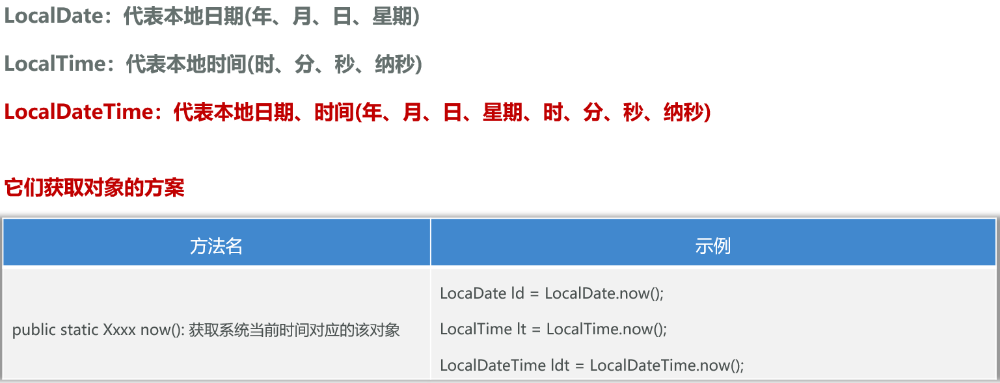

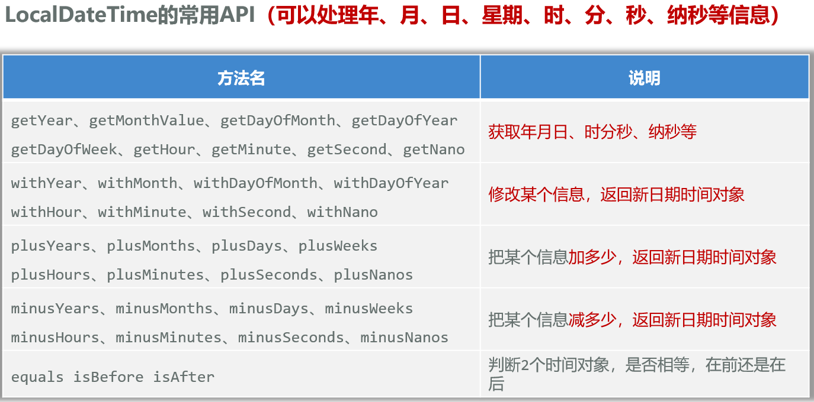

```java
package com.itheima.demo8api;

import java.text.SimpleDateFormat;
import java.time.LocalDateTime;
import java.time.format.DateTimeFormatter;
import java.util.Date;

public class Test1 {
    public static void main(String[] args) {
        // 目标：掌握java提供的获取时间的方案
        // JDK 8之前的方案：Date获取此刻日期时间
        Date d = new Date();
        System.out.println(d);

        // 格式化：SimpleDateFormat 简单日期格式化
        SimpleDateFormat sdf = new SimpleDateFormat("yyyy年MM月dd日 HH时mm分ss秒 EEE a");
        String str = sdf.format(d);
        System.out.println(str);
        System.out.println(d.getYear());// 已弃用

        d.setHours(23);// 修改小时，在d上直接改

        // JDK 8的新方案：LocalDateTime获取此刻日期时间
        LocalDateTime now = LocalDateTime.now();
        System.out.println(now);
        System.out.println(now.getYear());
        System.out.println(now.getDayOfYear());// 获取当前是当年的第几天

        LocalDateTime now2 = now.plusSeconds(60);// 加60秒，重新创建一个对象
        System.out.println(now);
        System.out.println(now2);

        // 格式化：DateTimeFormatter
        // 1、创建一个格式化对象
        DateTimeFormatter dtf = DateTimeFormatter.ofPattern("yyyy/MM/dd HH:mm:ss EEE a");
        // 2、格式化now对象的时间，得到格式化后的字符串
        String str2 = dtf.format(now);
        System.out.println(str2);
    }
}
```

### 2、高效操作字符串：StringBuilder

- 用"+"号拼接字符串效率太低，因为String对象是不可变对象，每次拼接都会指向一个新的对象

  可以换成StringBuilder对象中的append()方法

- **对于字符串相关的操作，如频繁的拼接、修改等，建议用StringBuidler，效率更高!**

  **注意：如果操作字符串较少，或者不需要操作，以及定义字符串变量，还是建议用String**

- **StringBuilder**代表**可变字符串对象**，相当于是一个容器，它里面装的字符串是可以改变的，就是用来操作字符串的

  **好处：StringBuilder比String更适合做字符串的修改操作，效率会更高，代码也会更简洁**

  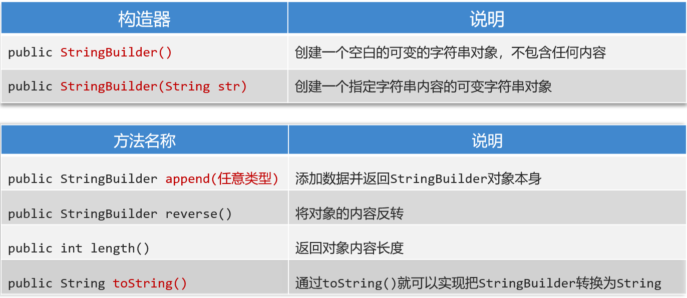

  ```java
  package com.itheima.demo8api;
  
  public class Test2 {
      public static void main(String[] args) {
          // 目标：高效拼接字符串
          // 加号"+"拼接
          // String字符串为不可变对象，共享数据性能可以，但修改数据性能较差
          // String s = "";
          // for (int i = 0; i < 100000; i++) {
          //     s += "abc";
          // }
  
          // 用StringBuilder拼接
          // StringBuilder为可变容器
          // 定义字符串可以用String，但是操作字符串用StringBuilder
          StringBuilder sb = new StringBuilder();
          for (int i = 0; i < 10; i++) {
              sb.append("abc");
          }
          System.out.println(sb);
          String s = sb.toString();
          System.out.println(s);
  
          // 支持链式调用
          StringBuilder sb2 = new StringBuilder();
          sb2.append("张三").append("李四").append("王五");
          String s2 = sb2.toString();
          System.out.println(s2);
      }
  }
  ```

### 3、解决浮点运算失真：BigDecimal

- 用于解决浮点型运算时，出现结果失真的问题，因为小数二进制存储是分开存的

  1 1 0 . 1 0 1 -> 1\*2^2 + 1\*2^1 + 0\*2^0 . 1\*2^(-1) + 0\*2^(-2) + 1\*2^(-3)

  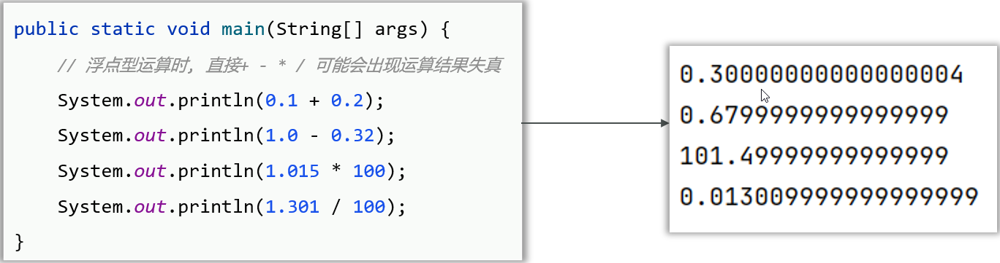

- BigDecimal常见构造器、常用方法

  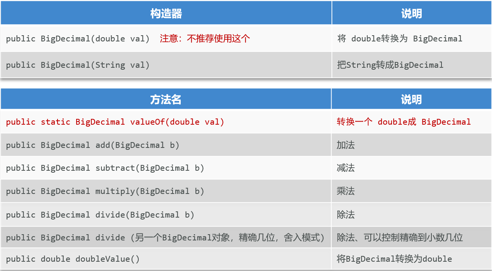

  ```java
  package com.itheima.demo8api;
  
  import java.math.BigDecimal;
  import java.math.RoundingMode;
  
  public class Test3 {
      public static void main(String[] args) {
          // 目标；掌握BigDecimal解决小数运算失真的问题
          double a = 0.1;
          double b = 0.2;
          System.out.println(a + b); // 0.30000000000000004
  
          // 如何解决？使用BigDecimal
          // 1、把小数包装成BigDecimal对象
          // 必须使用BigDecimal(String val)字符串构造器才能解决
          // BigDecimal a1 = new BigDecimal(Double.toString(a));
          // BigDecimal b1 = new BigDecimal(Double.toString(b));
  
          BigDecimal a1 = BigDecimal.valueOf(a);
          BigDecimal b1 = BigDecimal.valueOf(b);
          BigDecimal c1 = a1.add(b1);// 解决精度问题
          Double result = c1.doubleValue();// 把BigDecimal类型转换为double类型
          System.out.println(result);
  
          BigDecimal i = BigDecimal.valueOf(0.1);
          BigDecimal j = BigDecimal.valueOf(0.3);
          // 除不尽会抛异常, 需要用RoundingMode.HALF_DOWN四舍五入
          BigDecimal k = i.divide(j, 2, RoundingMode.HALF_DOWN);
          System.out.println(k);
      }
  }
  ```

  
