# Java高级技术

源码、框架、架构师层面的技术

## 一、单元测试

### 1、单元测试引入

- 针对**最小的功能单元：方法**，编写测试代码对其进行正确性测试

- 之前的单元测试方法

  - 只能在main方法编写测试代码，去调用其他方法进行测试。

  - 无法实现自动化测试，一个方法测试失败，可能影响其他方法的测试。

  - 无法得到测试的报告，需要程序员自己去观察测试是否成功。

    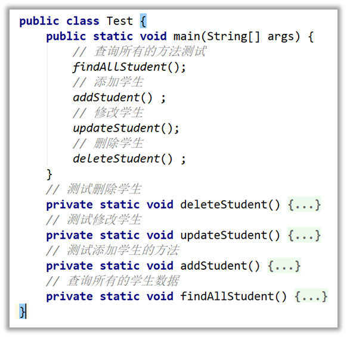

### 2、Junit单元测试框架

- 可以用来对方法进行测试，它是第三方公司开源出来的（很多开发工具已经集成了Junit框架，比如IDEA）

**优点**

- 可以灵活的编写测试代码，可以针对某个方法执行测试，也支持一键完成对全部方法的自动化测试(在Module处右键，"Run 'All Tests'")。

- 测试各自独立，某个方法测试失败了，不会影响其他测试方法的测试。

- 不需要程序员去分析测试的结果，会**自动生成测试报告**出来。

  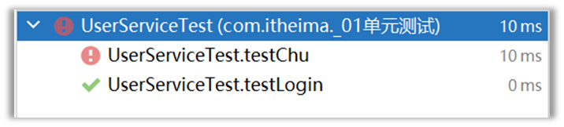

**需求**

- 某个系统，有多个业务方法，请使用Junit单元测试框架，编写测试代码，完成对这些方法的正确性测试

**具体步骤**

①将Junit框架的jar包导入到项目中（注意：IDEA集成了Junit框架，不需要我们自己手工导入了）

②为需要测试的业务类，定义对应的测试类，并为每个业务方法，编写对应的测试方法（必须：**公共、无参、无返回值**）

③测试方法上必须声明**@Test注解**，然后在测试方法中，编写代码调用被测试的业务方法进行测试；

④开始测试：选中测试方法，右键选择"JUnit运行"，如果**测试通过**则是**绿色**；如果**测试失败**，则是**红色**

**需要测试的代码**

```java
package com.itheima.demo1junit;
/**
 * 字符串工具类
 */
public class StringUtil {
    public static void printNumber(String name){
        if(name == null){
            System.out.println("参数为null！请注意");
            return;
        }
        System.out.println("名字长度是：" + name.length());
    }

    /**
     * 求字符串的最大索引
     */
    public static int getMaxIndex(String data){
        if(data == null || "".equals(data)) {
            return -1;
        }
        return data.length() - 1;
    }
}
```

**Junit测试代码**

```java
package com.itheima.demo1junit;

import org.junit.Assert;
import org.junit.Test;

// 测试类：junit单元测试框架，对业务类中的业务方法进行正确性测试
public class StringUnitTest {
    // 测试方法：必须是public，无参数，无返回值
    // 测试方法必须导入@Test注解（Junit框架的核心步骤）
    @Test
    public void testPrintNumber() {
        // 测试步骤
        StringUtil.printNumber("张三abc"); // 5
        // 测试用例
        StringUtil.printNumber("");
        StringUtil.printNumber(null);
    }

    @Test
    public void testGetMaxIndex() {
        // 测试步骤
        int index = StringUtil.getMaxIndex("abcdefg"); // 6
        // 测试用例
        int index2 = StringUtil.getMaxIndex("");
        int index3 = StringUtil.getMaxIndex(null);

        // 做断言：断言结果是否与预期结果一致
        Assert.assertEquals("本轮测试失败，业务获取的最大索引有问题，请检查",6, index);
        Assert.assertEquals("本轮测试失败，业务获取的最大索引有问题，请检查",-1, index2);
        Assert.assertEquals("本轮测试失败，业务获取的最大索引有问题，请检查",-1, index3);
    }
}
```

## 二、反射

### 1、认识反射

- 反射就是：加载类，并允许以编程的方式解剖类中的各种成分（成员变量、方法、构造器等）

  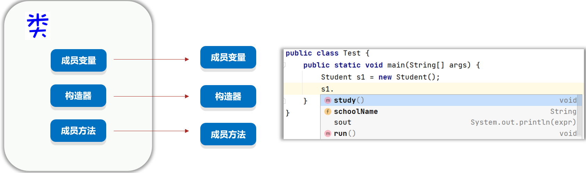

- 反射是为了学习获取类的信息、操作它们

  - 反射**第一步：加载类**，获取类的字节码：**Class**对象
  - 获取类的**构造器**：**Constructor**对象
  - 获取类的**成员变量**：**Field**对象
  - 获取类的**成员方法**：**Method**对象

### 2、获取类对象、类中的成分并对其进行操作

- 处理的目标：学生类代码

  ```java
  package com.itheima.demo2reflect;
  
  import lombok.Data;
  
  @Data
  public class Student {
      private String name;
      private int age;
  
      public Student()
      {
  
      }
      private Student(String name, int age)
      {
          this.name = name;
          this.age = age;
      }
      private void show()
      {
          System.out.println("我是私有方法");
      }
      public void show(String name)
      {
          System.out.println("我是有参方法");
      }
      @Override
      public String toString()
      {
          return "Student{" +
                  "name='" + name + '\'' +
                  ", age=" + age +
                  '}';
      }
  }
  ```

1. 反射第一步：获取Class对象

   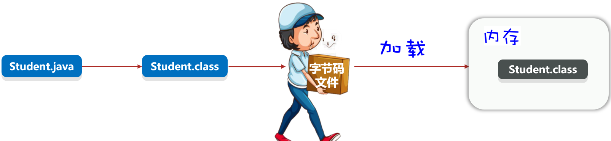

   三种获取Class对象的方式

   - Class c1 = 类名.class
   - 调用Class提供方法：public static Class forName(String package)； 
   - Object提供的方法： public Class getClass()； Class c3 = 对象.getClass();

   ```java
   package com.itheima.demo2reflect;
   
   public class ReflectDemo1 {
       public static void main(String[] args) throws Exception {
           // 目标：掌握反射第一步操作：获取类的Class对象（类本身）
           // 1、类.class
           Class c1 = Student.class;
           System.out.println(c1);
           // 2、Class.forName("类的全类名")
           Class c2 = Class.forName("com.itheima.demo2reflect.Student");
           System.out.println(c2);
           // 3、对象.getClass()
           Student s = new Student();
           Class c3 = s.getClass();
           System.out.println(c3);
           // 拿到的都是同一个类对象
           System.out.println(c1 == c2);// true
           System.out.println(c2 == c3);// true
           System.out.println(c1.getName()); // 全类名，com.itheima.demo2reflect.Student
           System.out.println(c1.getSimpleName()); // 类名，Student
       }
   }
   ```

2. 获取类中的成分并操作

   - **Class提供了从类中获取构造器的方法**

     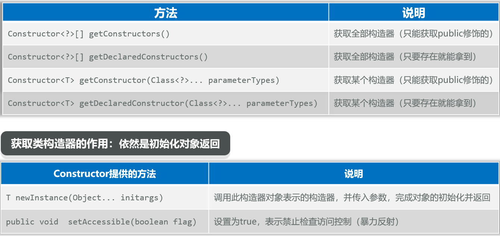

     ```java
     @Test
     public void getConstructorInfo() throws Exception {
         // 目标：反射第获取类的构造器信息
         // 1、反射第一步：获取类的Class对象，代表拿到类
         Class c1 = Student.class;
         // 2、获取构造器对象
         Constructor[] constructors = c1.getDeclaredConstructors();
         for (Constructor c : constructors) {
             System.out.println(c.getName()+"("+c.getParameterTypes()+")");
         }
         // 3、获取单个构造器对象
         Constructor con = c1.getDeclaredConstructor();// 获取无参构造器，公开的
         System.out.println(con.getName()+"("+con.getParameterTypes()+")");
     
         Constructor con2 = c1.getDeclaredConstructor(String.class,int.class);// 获取有参构造器，私有的
         System.out.println(con2.getName()+"("+con2.getParameterTypes()+")");
     
         // 4、获取构造器的作用依然是创建对象
         Student s1 = (Student) con.newInstance();
         System.out.println(s1);
         // 暴力反射：可以访问私有的构造器、方法和属性
         con2.setAccessible(true);
         Student s2 = (Student) con2.newInstance("Tom", 18);
         System.out.println(s2);
     }
     // com.itheima.demo2reflect.Student([Ljava.lang.Class;@6b71769e)
     // com.itheima.demo2reflect.Student([Ljava.lang.Class;@34ce8af7)
     
     // com.itheima.demo2reflect.Student([Ljava.lang.Class;@b684286)
     // com.itheima.demo2reflect.Student([Ljava.lang.Class;@880ec60)
     
     // Student{name='null', age=0}
     // Student{name='Tom', age=18}
     ```

   - **Class提供了从类中获取成员变量的方法**

     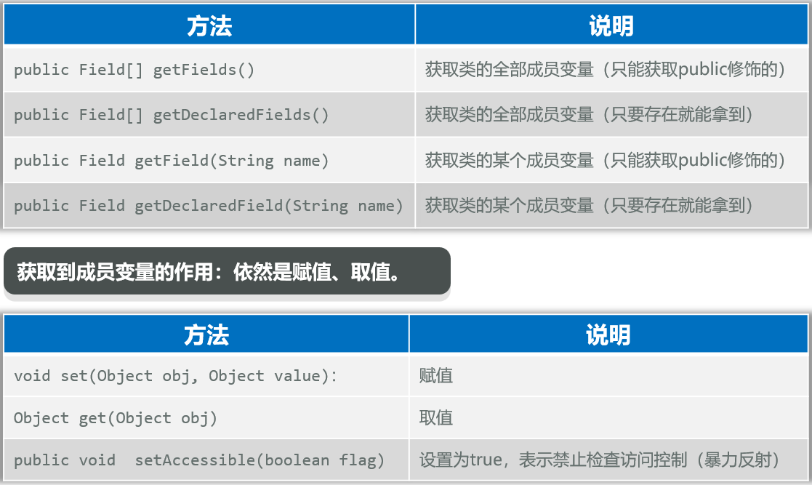

     ```java
     @Test
     public void getFieldInfo() throws Exception {
         // 目标：反射第获取类的属性信息，成员变量
         // 1、反射第一步：获取类的Class对象，代表拿到类
         Class c1 = Student.class;
         // 2、获取成员变量对象
         Field[] fields = c1.getDeclaredFields();
         for (Field f : fields) {
             System.out.println(f.getName()+"("+f.getType().getName()+")");
         }
         // 3、获取单个成员变量对象
         Field f = c1.getDeclaredField("name");
         System.out.println(f.getName()+"("+f.getType().getName()+")");
         Field f2 = c1.getDeclaredField("age");
         System.out.println(f2.getName()+"("+f2.getType().getName()+")");
     
         // 4、获取成员变量的作用依然是取值和赋值
         Constructor con = c1.getDeclaredConstructor(String.class,int.class);
         con.setAccessible(true);
         Student s = (Student) con.newInstance("Tom", 18);
         System.out.println(s);
         f.setAccessible(true);
         f.set(s,"Jerry");
         System.out.println(f.get(s));
         f2.setAccessible(true);
         f2.set(s,20);
         System.out.println(f2.get(s));
         System.out.println(s);
     }
     // name(java.lang.String)
     // age(int)
     
     // name(java.lang.String)
     // age(int)
     
     // Student{name='Tom', age=18}
     // Jerry
     // 20
     // Student{name='Jerry', age=20}
     ```

   - **Class提供了从类中获取成员方法的API**

     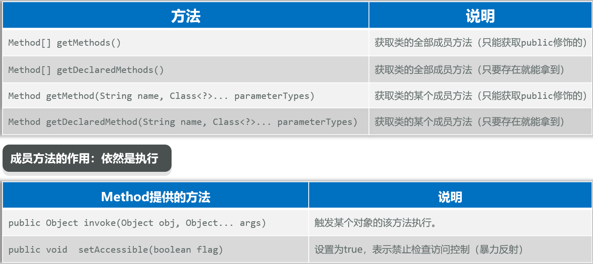

     ```java
     @Test
     public void getMethodInfo() throws Exception {
         // 目标：反射第获取类的方法信息
         // 1、反射第一步：获取类的Class对象，代表拿到类
         Class c1 = Student.class;
         // 2、获取方法对象
         Method[] methods = c1.getDeclaredMethods();
         for (Method m : methods) {
             System.out.println(m.getName() + "(" + m.getParameterTypes() + ")");
         }
         // 3、获取单个方法对象
         Method m = c1.getDeclaredMethod("show");// 获取无参show方法对象
         System.out.println(m.getName() + "(" + m.getParameterTypes() + ")");
         Method m2 = c1.getDeclaredMethod("show", String.class);// 获取有参show方法对象
         System.out.println(m2.getName() + "(" + m2.getParameterTypes() + ")");
     
         // 4、获取方法的作用依然是调用方法
         Student s = new Student();
         System.out.println(s);
         m.setAccessible(true);
         m.invoke(s);
         m2.invoke(s,"Jerry");
     }
     // show([Ljava.lang.Class;@6b71769e)
     // show([Ljava.lang.Class;@34ce8af7)
     // getName([Ljava.lang.Class;@b684286)
     // equals([Ljava.lang.Class;@880ec60)
     // toString([Ljava.lang.Class;@3f3afe78)
     // hashCode([Ljava.lang.Class;@7f63425a)
     // setName([Ljava.lang.Class;@36d64342)
     // canEqual([Ljava.lang.Class;@39ba5a14)
     // getAge([Ljava.lang.Class;@511baa65)
     // setAge([Ljava.lang.Class;@340f438e)
     
     // show([Ljava.lang.Class;@30c7da1e)
     // show([Ljava.lang.Class;@5b464ce8)
     
     // Student{name='null', age=0}
     // 我是私有方法
     // 我是有参方法
     ```


### 3、作用、应用场景

**作用**

- 基本作用：可以得到一个类的全部成分然后操作。

- 可以破坏封装性。

- 可以绕过泛型的约束

  ```java
  package com.itheima.demo2reflect;
  
  import java.lang.reflect.Method;
  import java.util.ArrayList;
  
  public class ReflectDemo3 {
      public static void main(String[] args) throws Exception {
          // 目标：反射的基本作用
          // 1、类的全部成分的获取
          // 2、可以破坏封装性
          // 3、可以绕过泛型的约束
          ArrayList<String> list = new ArrayList<>();
          list.add("hello");
          list.add("world");
          list.add("java");
  
          Class c1 = list.getClass();// c1==ArrayList.class
          // 获取ArrayList类中的add方法
          Method add = c1.getDeclaredMethod("add", Object.class);
          // 触发list集合对象的add方法执行
          add.invoke(list,9.9);// 翻墙
          add.invoke(list, true);// 翻墙
          System.out.println(list);
      }
  }
  ```

- **最重要的用途是：适合做Java的框架，基本上，主流的框架都会基于反射设计出一些通用的功能**。


**需求：使用反射做一个简易版的框架**

- 对于任意一个对象，该框架都可以把对象的字段名和对应的值，保存到文件中去。

  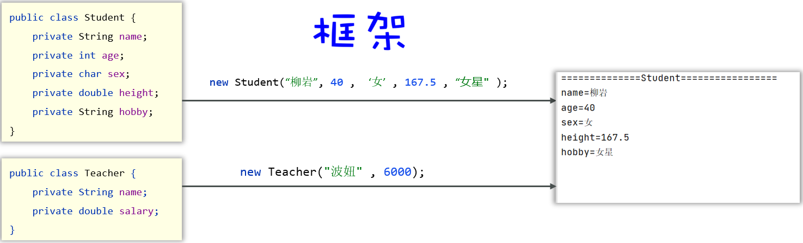

**实现步骤：**

① 定义一个方法，可以接收任意对象。

② 每收到一个对象后，使用反射获取该对象的Class对象，然后获取全部的成员变量。

③ 遍历成员变量，然后提取成员变量在该对象中的具体值。

④ 把成员变量名、和其值，写出到文件中去即可。

```java
package com.itheima.demo2reflect;

import java.io.FileOutputStream;
import java.io.OutputStream;
import java.io.PrintStream;
import java.lang.reflect.*;

public class SaveObjectFrameWork {
    // 保存任意对象的静态方法
    public static void saveObject(Object obj) throws Exception {
        OutputStream os = new FileOutputStream("day06-junit-reflect-annotation-proxy\\src\\obj.txt", true);
        PrintStream ps = new PrintStream(os);
        // obj可能是学生、老师，或者其他任意对象
        // 只有反射可以知道对象有多少字段
        // 1、获取Class对象
        Class c1 = obj.getClass();
        String simpleName = c1.getSimpleName();
        ps.println("=========" + simpleName + "=========");
        // 2、获取Class对象所有的字段
        Field[] fields = c1.getDeclaredFields();
        // 3、遍历字段
        for (Field field : fields) {
            // 4、获取字段的值
            // 4.1 获取字段名
            String fieldName = field.getName();
            // 4.2 获取字段的值
            field.setAccessible(true);
            Object fieldValue = field.get(obj) + "";
            // 5、打印到文件中去
            ps.println(fieldName + "=" + fieldValue);
        }
        ps.close();
    }
}
```

```java
package com.itheima.demo2reflect;

public class ReflectDemo4 {
    public static void main(String[] args) throws Exception {
        // 目标：搞清楚反射的作用，做简单框架
        // 创建学生对象
        Student  s = new Student();
        s.setAge(19);
        s.setName("小明");

        // 创建老师对象
        Teacher t = new Teacher("老王", 30, '男', 1000, "看书", "123123");
        SaveObjectFrameWork.saveObject(s);
        SaveObjectFrameWork.saveObject(t);
    }
}
```

## 三、注解

### 1、概述、自定义注解

**注解概述**

- 就是Java代码里的特殊标记，比如：@Override、@Test等，作用是：让其他程序根据注解信息来决定怎么执行该程序。
- 注意：注解可以用在类上、构造器上、方法上、成员变量上、参数上、等位置处。

**自定义注解**

```java
public @interface 注解名称 {
    public 属性类型 属性名() default 默认值 ;
}
```

```java
package com.itheima.demo3annotation;

@MyBook(name = "哥哥", age = 20, address = {"北京", "上海"})
@A("delete")// 只有一个属性，value = "delete"可以简化
public class AnnotationDemo1 {
    @MyBook(name = "小王", age = 18, address = {"北京", "上海"})
    public static void main(String[] args) {

    }
}

package com.itheima.demo3annotation;

public @interface MyBook {
    String name();
    int age() default 18;
    String[] address();
}

package com.itheima.demo3annotation;

public @interface A {
    // 特殊属性，在使用时如果只有一个value属性，value名称可以不写；
    // 或者其他属性有默认值时也可以省略不写，否则要写
    String value();
}
```

**注解的原理**

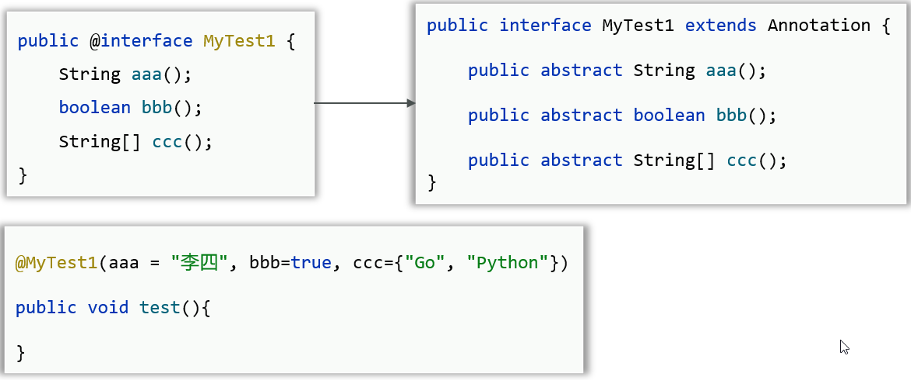

- 注解本质是一个接口，Java中所有注解都是继承了Annotation接口的。
- @注解(…)：其实就是一个实现类对象，实现了该注解以及Annotation接口。

### 2、元注解

- 指的是：注解注解的注解

  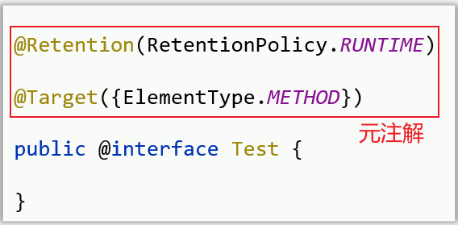

  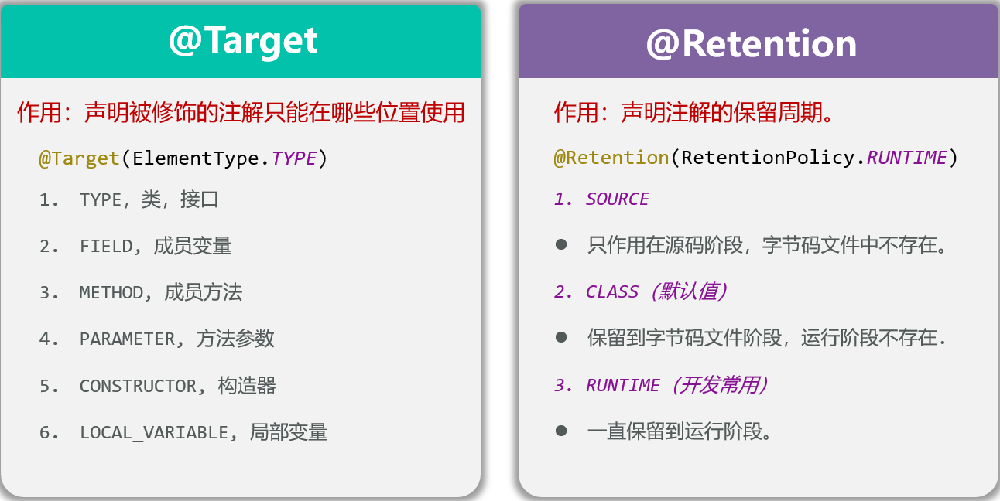

  ```java
  package com.itheima.demo3annotation;
  
  import java.lang.annotation.ElementType;
  import java.lang.annotation.Target;
  
  @Retention(RetentionPolicy.RUNTIME) // 表示这个注释一直保存到运行阶段
  @Target(ElementType.METHOD)// 表示注解的作用目标为方法
  public @interface MyTest1 {
  }
  
  package com.itheima.demo3annotation;
  
  // @MyTest1 报错
  public class AnnotationDemo2 {
      // @MyTest1 报错
      private int age;
  
      // @MyTest1 报错
      public AnnotationDemo2(){}
  
      @MyTest1
      public static void main(String[] args) {
          // 目标：搞清楚注解的作用
      }
  
      @MyTest1
      public void getAgeTest(){
  
      }
  }
  ```

### 3、注解的解析

- 就是判断类上、方法上、成员变量上是否存在注解，并把注解里的内容给解析出来。

**如何解析注解？**

- 指导思想：要解析谁上面的注解，就应该先拿到谁。
- 比如要解析类上面的注解，则应该先获取该类的Class对象，再通过Class对象解析其上面的注解。
- 比如要解析成员方法上的注解，则应该获取到该成员方法的Method对象，再通过Method对象解析其上面的注解。
- Class 、 Method 、 Field , Constructor、都实现了AnnotatedElement接口，它们都拥有解析注解的能力。

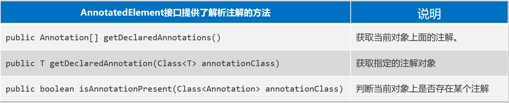

```java
package com.itheima.demo3annotation;

import java.lang.annotation.ElementType;
import java.lang.annotation.Retention;
import java.lang.annotation.RetentionPolicy;
import java.lang.annotation.Target;

@Target({ElementType.METHOD,ElementType.TYPE})
@Retention(RetentionPolicy.RUNTIME)
public @interface MyTest2 {
    String value();
    double height() default 170;
    String[] address();
}
```

```java
package com.itheima.demo3annotation;

@MyTest2(value = "张三", height = 178, address = {"北京", "上海"})
public class Demo {
    @MyTest2(value = "李四", height = 190, address = {"北京", "上海"})
    public void go(){}
}
```

```java
package com.itheima.demo3annotation;

import org.junit.Test;

import java.lang.reflect.Method;
import java.util.Arrays;

public class AnnotationDemo3 {
    @Test
    public void parseClass() throws Exception {
        // 1、获取类对象
        Class c1 = Demo.class;
        // 2、判断这个类上是否陈列了注解MyTest2
        if (c1.isAnnotationPresent(MyTest2.class)) {
            // 3、获取注解对象
            // Annotation myTest2 = c1.getDeclaredAnnotation(MyTest2.class);
            MyTest2 myTest2 = (MyTest2) c1.getDeclaredAnnotation(MyTest2.class);
            // 4、获取注解对象的值
            System.out.println(myTest2.value());// String
            System.out.println(myTest2.height());// double
            System.out.println(Arrays.toString(myTest2.address()));// String[]
        }
    }

    @Test
    public void parseMethod() throws Exception {
        // 1、获取类对象
        Class c1 = Demo.class;
        // 2、获取方法对象
        Method m1 = c1.getDeclaredMethod("go");
        // 3、判断这个方法上是否陈列了注解MyTest2
        if (m1.isAnnotationPresent(MyTest2.class)) {
            // 3、获取注解对象
            MyTest2 myTest2 = m1.getDeclaredAnnotation(MyTest2.class);
            // 4、获取注解对象的值
            System.out.println(myTest2.value());// String
            System.out.println(myTest2.height());// double
            System.out.println(Arrays.toString(myTest2.address()));// String[]
        }
    }
}
```

### 4、作用、应用场景

**注解的作用**

- **对Java中类、方法、成员变量做标记，然后进行特殊处理**。
- 例如：JUnit框架中，标记了注解@Test的方法就可以被当成测试方法执行，而没有标记的就不能当成测试方法执行。

**需求**

- 定义若干个方法，只要加了MyTest注解，就会触发该方法执行

**分析**

① 定义一个自定义注解MyTest，只能注解方法，存活范围是一直都在。

② 定义若干个方法，部分方法加上@MyTest注解修饰，部分方法不加。

③ 模拟一个junit程序，可以触发加了@MyTest注解的方法执行。

```java
package com.itheima.demo3annotation;

import java.lang.reflect.*;

public class AnnotationDemo4 {
    public static void main(String[] args) throws Exception {
        // 目标：搞清楚注解的应用场景：模拟junit框架的测试功能
        // 有MyTest注解的方法就执行，没有的就不执行
        AnnotationDemo4 ad4 = new AnnotationDemo4();
        // 1、获取类对象
        Class c1 = AnnotationDemo4.class;
        // 2、获取所有方法
        Method[] methods = c1.getMethods();// 测试方法都是公开的，可以直接拿
        // 3、遍历方法，判断方法上是否有MyTest注解，有的就执行，没有的就不执行
        for (Method m1 : methods) {
            // 4、判断这个方法上是否有MyTest注解
            if (m1.isAnnotationPresent(MyTest.class)) {
                MyTest myTest = m1.getDeclaredAnnotation(MyTest.class);
                int count = myTest.count();
                for (int i = 0; i < count; i++) {
                    m1.invoke(ad4);
                }
            }
        }
    }

    // 测试方法：public 无参 无返回值
    @MyTest
    public void test1() {
        System.out.println("test1方法执行了...");
    }

    public void test2() {
        System.out.println("test2方法执行了...");
    }

    @MyTest(count = 3)
    public void test3() {
        System.out.println("test3方法执行了...");
    }
}
```

```java
package com.itheima.demo3annotation;

import java.lang.annotation.ElementType;
import java.lang.annotation.Retention;
import java.lang.annotation.RetentionPolicy;
import java.lang.annotation.Target;

@Target(ElementType.METHOD)
@Retention(RetentionPolicy.RUNTIME)
public @interface MyTest {
    int count() default 1;
}
```

## 四、动态代理

### 1、代理：为什么？怎么做？

- **对象如果嫌身上干的事太多的话，可以通过代理来转移部分职责**
- **对象有什么方法想被代理，代理就一定要有对应的方法**
- **通过接口，中介可以知道要代理的方法**


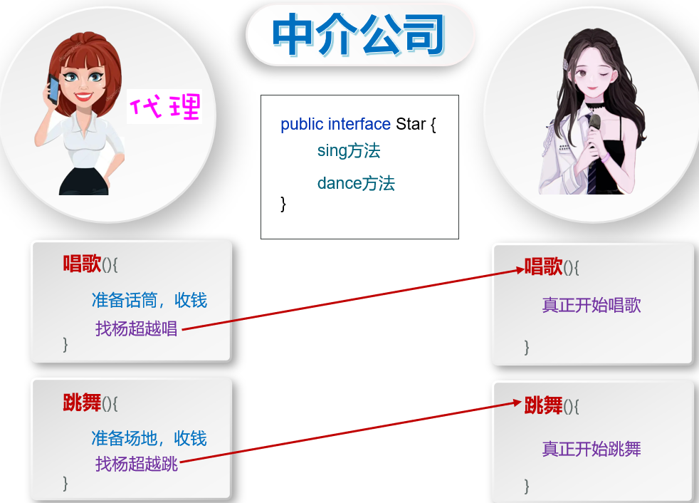

**创建代理的过程**

**java.lang.reflect.Proxy类：提供了为对象产生代理对象的方法**

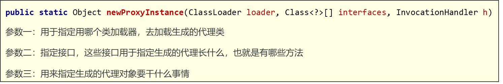

**通过invokehandler的invoke方法指定代理干的事时，这个invoke会被代理找到的方法调用**

- 准备明星对象，设计明星类Star，实现需要代理方法的接口StarService

  ```java
  package com.itheima.demo4proxy;
  
  public interface StarService {
      public void sing(String name);
      public String dance();
  }
  ```

  ```java
  package com.itheima.demo4proxy;
  
  import lombok.AllArgsConstructor;
  import lombok.Data;
  import lombok.NoArgsConstructor;
  
  @Data
  @NoArgsConstructor
  @AllArgsConstructor
  public class Star implements StarService{
      private String name;
      @Override
      public void sing(String name){
          System.out.println(this.name + "唱一首" + name);
  
      }
  
      @Override
      public String dance() {
          System.out.println(this.name + "表演跳舞，太牛啦");
          return "多谢大噶！";
      }
  }
  ```

- 为明星创建一个专属的代理对象，设计一个工具类(中介公司)ProxyUtil

  ```java
  package com.itheima.demo4proxy;
  
  import java.lang.reflect.InvocationHandler;
  import java.lang.reflect.Method;
  import java.lang.reflect.Proxy;
  
  /*
      代理工具类：中介公司，专门负责创建代理对象并返回给人使用
   */
  public class ProxyUtil {
      // 创建一个明星的代理对象，并返回
      public static StarService createProxy(StarService s){
          /**
           * 参数一：用于指定用哪个类加载器，去加载生成的代理类
           * 参数二：指定代理类需要实现的接口，明星类实现了哪些接口，代理类就实现了哪些接口
           * 参数三：用来指定袋类类需要如何去代理，生成的代理对象要干什么事情
           */
          StarService proxy = (StarService) Proxy.newProxyInstance(ProxyUtil.class.getClassLoader(),
                  s.getClass().getInterfaces(), new InvocationHandler() {
                      @Override
                      public Object invoke(Object proxy, Method method, Object[] args) throws Throwable {
                          // 用来声明代理对象要干的事情
                          // 参数一：proxy收到代理对象本身(暂时用处不大)
                          // 参数二：method代表正在被代理的方法
                          // 参数三：args代表正在被代理的方法的参数
                          String methodName = method.getName();
                          if ("sing".equals(methodName)){
                              System.out.println("准备话筒，收钱20万");
                          }else if ("dance".equals(methodName)){
                              System.out.println("准备场地，收钱100万");
                          }
                          // 真正干活(把真正的明星对象叫过来正式干活)
                          Object result = method.invoke(s, args);
                          return result;
                      }
                  });
  
          return proxy;
      }
  }
  ```

- 测试代码

  ```java
  package com.itheima.demo4proxy;
  
  public class Test {
      public static void main(String[] args) {
          // 目标：创建代理对象
          // 1、准备一个明星对象，设计明星类
          Star star = new Star("游哥");
          // 2、为明星创建一个专属于他的代理对象
          StarService proxy = ProxyUtil.createProxy(star);
          // 代理调用方法就回去找invoke，以知道自己要做什么
          proxy.sing("小苹果");
          System.out.println(proxy.dance());
      }
  }
  
  /**输出
   * 准备话筒，收钱20万
   * 游哥唱一首小苹果
   * 准备场地，收钱100万
   * 游哥表演跳舞，太牛啦
   * 多谢大噶！
   */
  ```

### 2、代理的应用场景与好处

**场景**

- 某系统有一个用户管理类，包含用户登录，删除用户，查询用户等功能，系统要求统计每个功能的执行耗时情况，以便后期观察程序性能。

  ```java
  package com.itheima.demo5proxy2;
  
  public interface UserService {
      // 登录功能
      void login(String username, String password) throws Exception;
      // 删除用户
      void deleteUsers() throws Exception;
      // 查询用户，返回数组形式
      String[] queryUsers() throws Exception;
  }
  ```

  ```java
  package com.itheima.demo5proxy2;
  
  // 模拟登录、删除、查询用户
  public class UserServiceImp implements UserService {
      @Override
      public void login(String username, String password) throws Exception {
          if("admin".equals(username) && "12345".equals(password)){
              System.out.println("登录成功");
          } else {
              System.out.println("登录失败");
          }
          Thread.sleep(1000);
      }
  
      @Override
      public void deleteUsers() throws Exception {
          System.out.println("删除了1万个用户~");
          Thread.sleep(1000);
      }
  
      @Override
      public String[] queryUsers() throws Exception {
          System.out.println("查询了3个用户~");
          String[] users = {"张三","李四","王五"};
          Thread.sleep(500);
          return users;
      }
  }
  ```

**需求**

- 现在，某个初级程序员已经开发好了该模块，请观察该模块的代码，找出目前存在的问题，并对其进行改造。

  创建一个代理，统计对象各个方法的运行时间

  ```java
  package com.itheima.demo5proxy2;
  
  import java.lang.reflect.InvocationHandler;
  import java.lang.reflect.Method;
  import java.lang.reflect.Proxy;
  
  public class ProxyUtil {
      public static UserService createProxy(UserService obj)
      {
          UserService proxy = (UserService) Proxy.newProxyInstance(ProxyUtil.class.getClassLoader(),
                  obj.getClass().getInterfaces(), new InvocationHandler() {
                      @Override
                      public Object invoke(Object proxy, Method method, Object[] args) throws Throwable {
                          long start = System.currentTimeMillis();
                          String methodName = method.getName();
                          Object result = method.invoke(obj, args);
                          long end = System.currentTimeMillis();
                          System.out.println(methodName + "运行耗时：" + (end-start)/1000.0 + "秒");
                          return result;
                      }
          });
          return proxy;
      }
  ```

  测试代码

  ```java
  package com.itheima.demo5proxy2;
  
  import java.util.Arrays;
  
  public class Test {
      public static void main(String[] args) throws Exception {
          // 创建目标对象
          UserService userService = new UserServiceImp();
          // 创建代理对象
          UserService proxy = ProxyUtil.createProxy(userService);
          // 调用代理对象的方法
          proxy.login("admin", "12345");
          proxy.deleteUsers();
          String[] users = proxy.queryUsers();
          System.out.println("查询到的用户是" + Arrays.toString(users));
      }
  }
  ```

- **使用泛型改进代理代码，更具有一般性**

  ```java
  package com.itheima.demo5proxy2;
  
  import java.lang.reflect.InvocationHandler;
  import java.lang.reflect.Method;
  import java.lang.reflect.Proxy;
  
  public class ProxyUtil {
      public static <T> T createProxy(T obj)
      {
          T proxy = (T) Proxy.newProxyInstance(ProxyUtil.class.getClassLoader(),
                  obj.getClass().getInterfaces(), new InvocationHandler() {
                      @Override
                      public Object invoke(Object proxy, Method method, Object[] args) throws Throwable {
                          long start = System.currentTimeMillis();
                          String methodName = method.getName();
                          Object result = method.invoke(obj, args);
                          long end = System.currentTimeMillis();
                          System.out.println(methodName + "运行耗时：" + (end-start)/1000.0 + "秒");
                          return result;
                      }
          });
          return proxy;
      }
  }
  ```

- 使用代理的好处：可以增强对象的能力(就像给新生儿打疫苗，加强能力)，例如Spring框架

  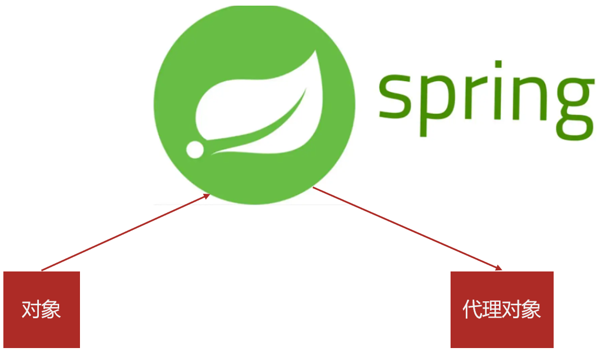
