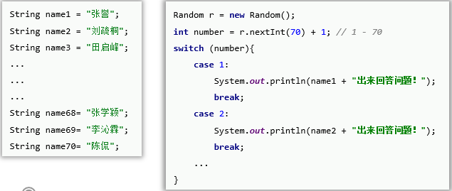
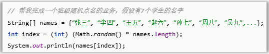
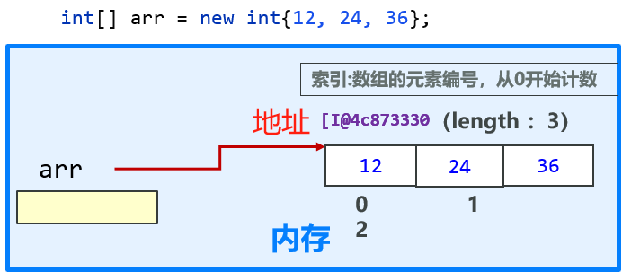
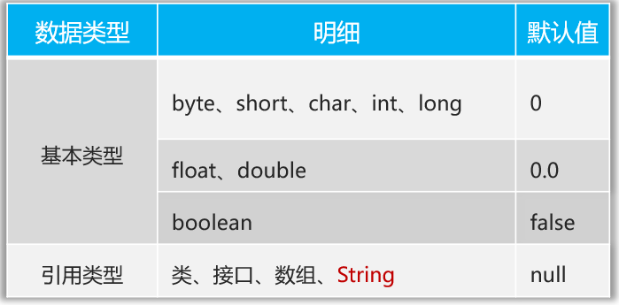
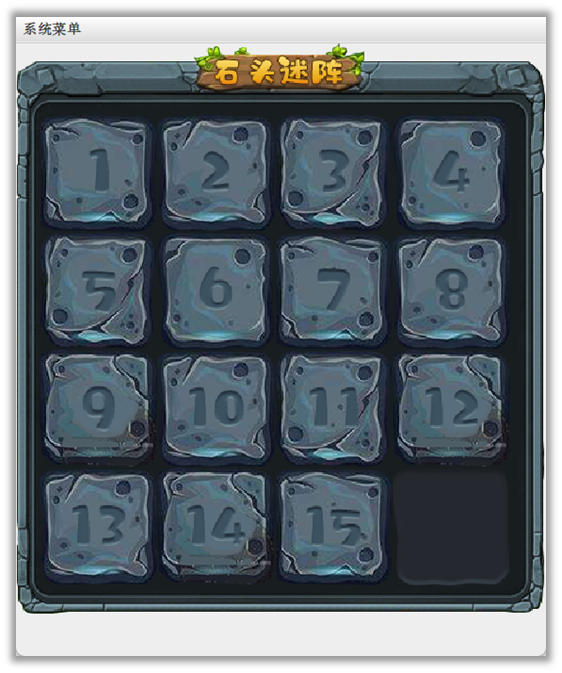

# 数组

## 一、数组概述

- 存储大批量数据的容器

### 1、程序里面的数据存储

- 程序是用来处理数据的，程序里面的数据存储的方式：变量、数组、二维数组...

  - 针对随机点名的需求，假设用变量存储学生名称，就要定义n个字符串来存储，并且循环也很麻烦

    

  - 假设用数组存储学生名称，则只需要一个数组，并且循环也很方便

    

- 对于**类型相同**的**大批量数据**，使用数组存储，明显优于使用多个变量存储

## 二、数组

- ==需求：一系列人名，如何实现随机点名==

### 1、静态初始化

- 静态初始化数组：定义数组的时候，数据**已经确定好了**

  ```java
  // 完整格式
  // 数据类型[]  数组名 = new 数据类型[]{元素1，元素2 ，元素3… };
  String[] names = new String[]{"张三", "李四",..., "吴九"} // 可读性更强
  String names[] = new String[]{"张三", "李四",..., "吴九"}
  
  // 或者可以把new String[]去除
  // 数据类型[] 数组名 = { 元素1，元素2 ，元素3，… }; 
  String[] names = {"张三", "李四",..., "吴九"}
  String names[] = {"张三", "李四",..., "吴九"}
  
  // 数组里面元素的索引: 0, 1, 2,...
  // 数组的访问：数组名[索引]
  String name = names[0];// 获取第一个人的名字
  
  // 获取数组的长度
  int len = names.lenth
  ```

- 存储方式

  - 数组变量通过地址指向数组对象

    

  - 数组变量存储的是数组对象的地址等信息，因此打印数组变量输出的并不是数组本身，而是一串包含数组信息 [ 、数据类型 java.lang.String 、以及数组对象存储地址 @7291c18f 的信息

    ```java
    // 需求：随机点名
    public static void randomCall(){
        String[] names = new String[] {"张三", "李四", "王五"};
        int index = (int) (Math.random()*names.length);
        System.out.println(names[index] + "回答问题");
        System.out.println(names); // 输出[Ljava.lang.String;@7291c18f
    }
    ```

### 2、动态初始化

- 动态初始化数组：只确定数组存储数据的**类型**和数组的**长度**，**不事先存入具体的数据 (元素值)**

  ```java
  // 数据类型[] 数组名 = new 数据类型[长度] 
  double[] grades = new double[8];
  // 默认double类型的数组位 grades = [0.0, 0.0, 0.0, 0.0, 0.0, 0.0, 0.0, 0.0]
  ```

- 动态初始化数组元素默认值规则：

  

### 3、数组的访问

- 数组的遍历：一个一个访问数组内的元素

  可以用来求和，元素搜索，找最大、最小值

  ```java
  // 访问数组: arr[index]
  // 遍历数组
  int[] arr = {20, 30, 40, 50};
  for (int i = 0; i < arr.length; i++) {
      System.out.println(arr[i]);
  }
  ```

### 4、数组的综合案例

#### 4.1 求平均分、最大、最小值

- 需求：输入有8名同学的成绩，求平均分、最高分、最低分

  ```java
  package com.itheima;
  
  import java.util.Scanner;
  
  public class ArrayDemo2 {
      public static void main(String[] args) {
          printGrades();
      }
  
      // 输入有8名同学的成绩，求平均分、最高分、最低分
      public static void printGrades(){
          double[] grades = new double[8];
          Scanner sc = new Scanner(System.in);
          double avg = 0;
          double max = 0;
          double min = 100;
          for (int i = 0; i < grades.length; i++){
              System.out.println("请输入第" + (i+1) + "位学生的成绩");
              grades[i] = sc.nextDouble();
              avg += grades[i];
              if (grades[i] > max){
                  max = grades[i];
              }
              if (grades[i] < min){
                  min = grades[i];
              }
          }
          avg = avg/grades.length;
          System.out.println("平均分是:" + avg);
          System.out.println("最高分是:" + max);
          System.out.println("最低分是:" + min);
      }
  }
  ```

#### 4.2 求一个数组的最大值

- 需求：给定一个数组，求其最大值

  ```java
  package com.itheima;
  
  public class ArrayDemo3 {
      public static void main(String[] args) {
          int[] array = new int[] {15, 9000, 10000, 20000, 9500, -5};
          System.out.println("最大值是:" + getMax(array));
      }
  
      public static int getMax(int[] array){
          int max = array[0];
          for (int i = 1; i < array.length; i++){
              if (array[i] > max){
                  max = array[i];
              }
          }
          return max;
      }
  }
  ```

#### 4.3 斗地主游戏

- 需求：开发一个简易版的斗地主游戏，要求只完成做牌(存储54张牌)、洗牌

  - 做牌：构造动态数组，将花色数组和点数数组拼接，一个个元素加到动态数组里，最后再加上大小王
  - 洗牌：遍历54个位置，当前次循环中：当前位置与任意位置交换；或者任意两个位置相互交换

  ```java
  package com.itheima;
  
  import java.util.Random;
  
  public class ArrayDemo4 {
      public static void main(String[] args) {
          String[] pokers = make();
          shuffle(pokers);
      }
  
      public static String[] make(){
          String[] colors = new String[] {"♣", "♦", "♠", "♥"};
          String[] numbers = new String[] {"3", "4", "5", "6", "7", "8", "9", "10", "J", "Q", "K", "A", "2"};
          String[] pokers = new String[54];
          int index = 0;
          for (String number : numbers) {
              for (String color : colors) {
                  pokers[index++] = color + number;
              }
          }
          pokers[index++] = "小王";
          pokers[index] = "大王";
          System.out.println("做牌后：");
          for (String poker : pokers) {
              System.out.print(poker + "\t");
          }
          System.out.println();
          return pokers;
          }
  
      public static void shuffle(String[] pokers){
          Random r = new Random();
          for (int i = 0; i < pokers.length; i++) {
              //交换当前位置和任意位置牌
              int index = r.nextInt(pokers.length);
              String value = pokers[index];
              pokers[index] = pokers[i];
              pokers[i] = value;
              // 交换两个任意位置的牌
  //            int index1 = r.nextInt(pokers.length);
  //            int index2 = r.nextInt(pokers.length);
  //            String value = pokers[index1];
  //            pokers[index1] = pokers[index2];
  //            pokers[index2] = value;
          }
          System.out.println("洗牌后：");
          for (String poker : pokers){
              System.out.print(poker + "\t");
          }
          System.out.println();
      }
  }
  ```

## 三、二维数组

- ==需求：开发一个程序，可以记录班级学生的座位信息==

### 1、静态初始化

```java
// 数据类型[][]  数组名 = new 数据类型[][]{元素1, 元素2, 元素3, ...};
String[][] seats = new String[][]{ 
        {"张无忌", "赵敏", "周芷若"},// 0 第一排
        {"张三丰", "宋远桥", "谢逊"},// 1 第二排
        {"游朝政", "靳芫浩", "高洪宽", "吴泰达"},// 2 第三排
        {"小周", "小吴"} };// 3 第四排
```

### 2、动态初始化

```java
// 数据类型[][]  数组名 = new 数据类型[长度1][长度2];
int[][] arr = new int[3][5]; // 3行5列
```

### 3、二维数组的访问

```java
// 访问1：数组名[行索引]
// 遍历第二排座位
String[] second = seats[1];
for (String person : second){
	System.out.print(person + "\t");
}

// 访问2：数组名[行索引][列索引]
// 访问第1排2列的座位
String seat = seats[0][1];

// 长度访问
int rows = seats.length; // 行数
int columns = seats[2].length; //第3行的列数

// 遍历座位表
for (String[] strings : seats){
    for (String seat : strings){
        System.out.print(seat + "\t");
    }
    System.out.println();
}
```

### 4、二维数组的综合案例

#### 4.1 石头迷阵游戏

- 需求：

  - 初始化石头迷阵游戏

  - 打乱石头迷阵

    

  ```java
  package com.itheima;
  
  import java.util.Random;
  
  public class TwoDimArrayDemo2 {
      public static void main(String[] args) {
          int[][] dis = start(5);
          shuffle(dis);
      }
  
      public static int[][] start(int k){
          int[][] dis = new int[k][k];
          int n = 0;
          System.out.println("初始化：");
          for (int i = 0; i < dis.length; i++){
              for (int j = 0; j < dis[i].length; j++){
                  dis[i][j] = ++n;
                  System.out.print(dis[i][j] + "\t");
              }
              System.out.println();
          }
          return dis;
      }
  
      public static void shuffle(int[][] dis){
          Random r = new Random();
          // 当前位置与随机位置的数交换
          for (int i = 0; i < dis.length; i++){
              for (int j = 0; j < dis[i].length; j++){
                  int index1 = r.nextInt(dis.length);
                  int index2 = r.nextInt(dis.length);
                  int tem = dis[index1][index2];
                  dis[index1][index2] = dis[i][j];
                  dis[i][j] = tem;
              }
          }
  
          System.out.println("打乱顺序：");
          printArray(dis);
      }
  
      public static void printArray(int[][] dis){
          for (int[] nums : dis){
              for (int num : nums){
                  System.out.print(num + "\t");
              }
              System.out.println();
          }
      }
  }
  ```


#### 4.2 行列不等的二维数组打乱顺序

- 需求：有一教室的座位分布，每一排人数不一致，如何打乱座位分布

  ```java
  package com.itheima;
  
  import java.util.ArrayList;
  import java.util.List;
  
  public class TwoDimArrayDemo {
      public static void main(String[] args) {
          String[][] seats = {
                  {"张无忌", "赵敏", "周芷若"},
                  {"张三丰", "宋远桥", "殷梨亭"},
                  {"灭绝", "陈昆", "玄冥二老", "金毛狮王"},
                  {"杨逍", "纪晓芙"}
          };
  
          System.out.println("打乱前的座位为：");
          printSeats(seats);
  
          shuffleSeats(seats);
  
          System.out.println("打乱后的座位为：");
          printSeats(seats);
      }
  
      public static void shuffleSeats(String[][] seats){
          // 用一个List存储
          List<String> lis = new ArrayList<>();
          for (String[] strings : seats){
              for (String seat : strings){
                  lis.add(seat);
              }
          }
  
          // 打乱顺序
          for (int i = 0; i < lis.size(); i++){
              int index = (int) (Math.random()*(lis.size()));
              String tem = lis.get(index);
              lis.set(index, lis.get(i));
              lis.set(i, tem);
          }
  
          // 重新填入座位
          int inex = 0;
          for (int i = 0; i < seats.length; i++){
              for (int j = 0; j < seats[i].length; j++){
                  seats[i][j] = lis.get(inex++);
              }
          }
      }
  
      // 打印二维数组
      public static void printSeats(String[][] seats){
          for (String[] strings : seats){
              for (String seat : strings){
                  System.out.print(seat + "\t");
              }
              System.out.println();
          }
      }
  }
  ```

  
