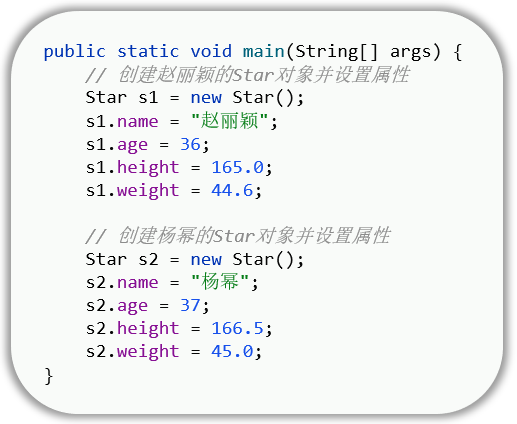
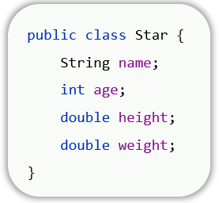
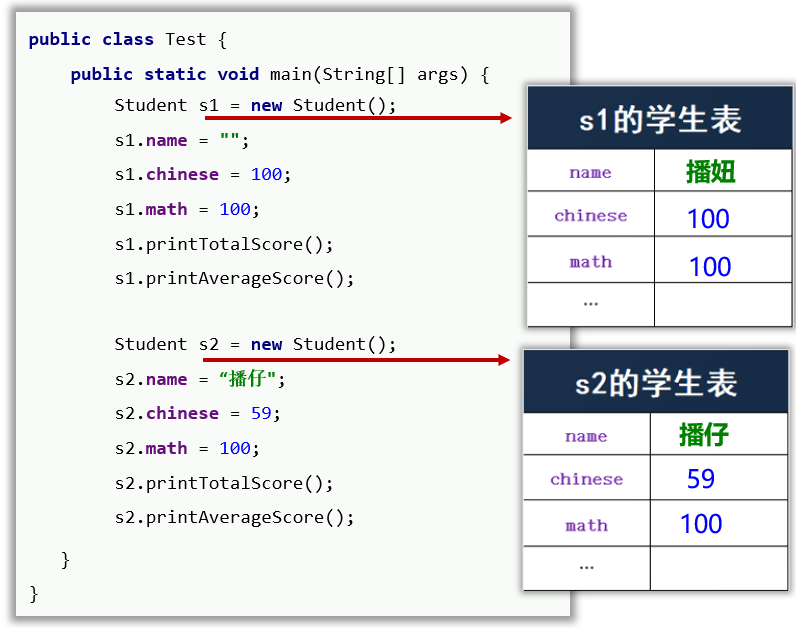
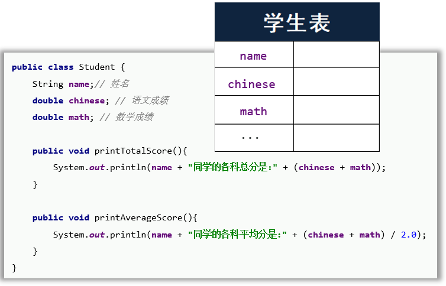
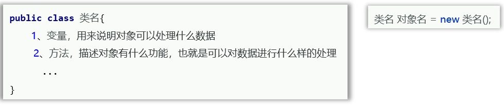
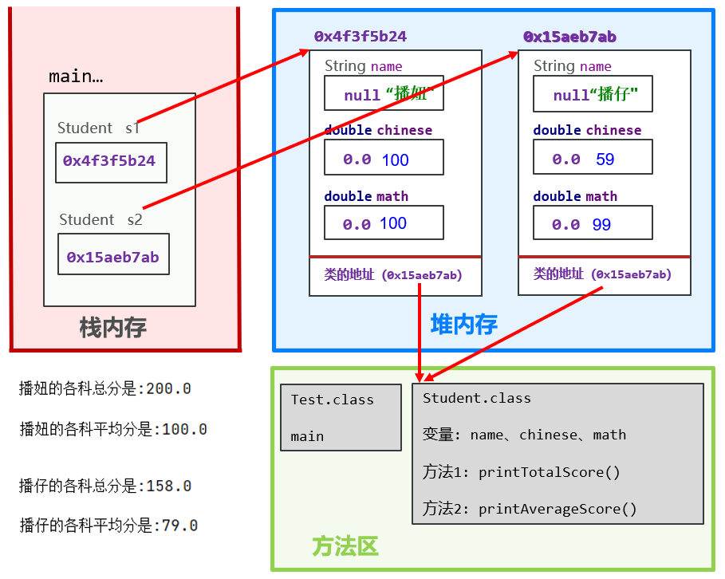
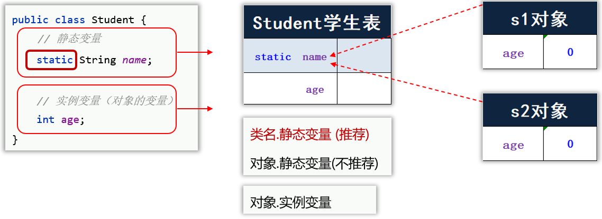
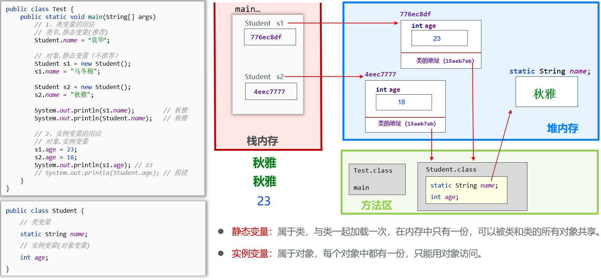
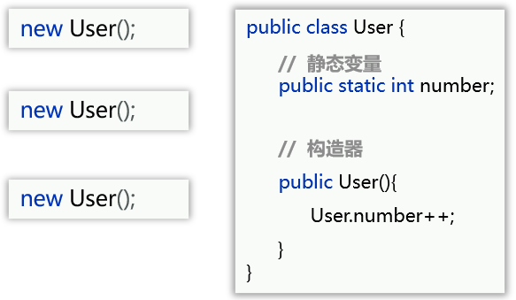
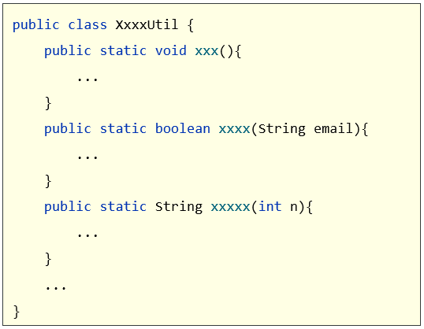

# 面向对象编程

java编程的核心套路

## 一、对象入门

### 1、面向对象快速入门

- **对象是一种特殊的数据结构，可以用来记住一个事物的数据，从而代表该事物** 

  比如说存储明星的信息：

  

- 构造一个对象

  - 先设计对象的模板，也就是对象的设计图：类

    

  - 通过new关键字，每new一次类就得到了一个新的对象

    

### 2、学生案例

- 需求：用面向对象编程的方式，存储两个学生的信息，并要求打印出每个学生的总成绩和平均成绩

  - 定义类和方法

  ```Java
  package com.itheima.object;
  
  public class Student {
      // 属性
      String name;
      double chiScore;
      double matScore;
  
      //方法：打印总成绩
      public void printSum(){
          System.out.println(name + "的总成绩为：" + (matScore+chiScore));
      }
  
      //方法：打印平均成绩
      public void printAvg(){
          System.out.println(name + "的平均成绩为：" + (matScore+chiScore)/2);
      }
  }
  ```

  - 调用实例化类成为对象，并调用方法

  ```java
  package com.itheima.object;
  
  public class TestStudent {
      public static void main(String[] args) {
          Student s1 = new Student();
          s1.name = "潘子";
          s1.chiScore = 100;
          s1.matScore = 100;
          s1.printSum();
          s1.printAvg();
  
          Student s2 = new Student();
          s2.name = "嘎子";
          s2.chiScore = 59;
          s2.matScore = 100;
          s2.printSum();
          s2.printAvg();
  
      }
  }
  ```

## 二、对象 (Object)

### 1、对象是什么

- **对象**本质上是一种**特殊的数据结构** (可以理解成一张表)

  

- **类(class)**是**对象的设计图** (或**对象的模板**)

  

- 对象是用类new出来的，有了类就可以创建出对象

  

### 2、对象在计算机中存储运行原理



### 3、面向对象编程

- 万物皆对象，谁的数据就用谁的对象存储

## 三、类的基本语法

- **为了设计出更好的对象**

### 1、构造器 (Constructor)

#### 1.1 构造器的形式

- 类的成分：构造器

- **构造器的形式：**

  ```java
  package com.itheima.constructor;
  
  public class Student {
      // 1、无参数构造器
      /* 构造器：是一种特殊的方法，
         不能返回值类型，名称必须是类名*/
      public Student(){
          System.out.println("调用了无参数构造器");
      }
  
      // 2、有参数构造器
      public Student(String str){
          System.out.println("调用了有参数构造器1");
      }
  
      public Student(String str, int n){
          System.out.println("调用了有参数构造器2");
      }
  }
  ```

#### 1.2 构造器的特点和应用场景

- **构造器的特点：**创建对象时，对象会去调用构造器，可以指定对象去调用哪个构造器

  ```java
  package com.itheima.constructor;
  
  public class Test {
      public static void main(String[] args) {
          Student s1 = new Student();// 调用了无参数构造器
          Student s2 = new Student("参数");// 调用了有参数构造器1
          Student s3 = new Student("参数", 2);//调用了有参数构造器2
      }
  }
  ```

- **构造器的常见应用场景：**创建对象时，同时完成对对象成员变量(属性)的初始化赋值

  - 创建构造器

    ```java
    package com.itheima.constructor;
    
    public class Student {
        String name;
        int age;
        char sex;
        // 创建了有参数构造器，此时类默认的无参数构造器失效
        public Student(String n, int a, char s){
            name = n;
            age = a;
            sex = s;
        }
        
        // 定义方法打印学生信息
        public printInfo{
            System.out.println(name);
            System.out.println(age);
            System.out.println(sex);
        }
    }
    ```

  - 创建对象

    ```java
    package com.itheima.constructor;
    
    public class Test {
        public static void main(String[] args) {
        	// 直接初始化赋值，更方便，不需要一个一个去点
            Student s = new Student("游朝政", 24, '男');
            s.printInfo();// 可以正常打印信息
        }
    
    }
    ```

#### 1.3 构造器的注意事项

- ==类默认就自带了一个无参构造器==
- ==如果为类定义了有参数构造器，类默认的无参数构造器就没有了，此时如果还想用无参数构造器，就必须自己手写一个无参数构造器出来==

### 2、this 关键字

#### 2.1 this 关键字是什么

- this 就是一个变量，可以用在方法中，**用来拿到当前对象**

- **哪个对象调用方法，this就拿到哪个对象**

  - 创建类

    ```java
    package com.itheima.thisdemo;
    
    public class Student {
        String name;
    
        public void print(){
            // this 就是一个变量，可以用在方法中，用来拿到当前对象
            // 哪个对象调用这个方法，this就拿到哪个对象
            System.out.println(this);
            System.out.println(this.name);
        }
    }
    ```

  - 创建对象

    ```java
    package com.itheima.thisdemo;
    
    
    public class Test {
    
        public static void main(String[] args) {
            Student s1 = new Student();
            s1.name = "张三";
            System.out.println(s1);// 打印s1的地址
            s1.print();// 这里打印this的地址与s1一致，打印this.name也与s1.name一致
    
            Student s2 = new Student();
            System.out.println(s2);// 打印s2的地址
            s2.print();// 这里打印this的地址与s2一致，打印this.name也与s2.name一致
        }
    }
    ```

#### 2.1 this 的应用场景

- **this的主要应用场景：**用来解决对象成员变量与方法内部变量名称一样时，导致访问冲突问题的

  - 创建类

    ```java
    package com.itheima.thisdemo;
    
    public class Student {
        String name;
    
        public void printHobby(String name){
            System.out.println(this.name + "喜欢" + name);// 两个变量冲突
        }
    }
    ```

  - 创建对象

    ```java
    package com.itheima.thisdemo;
    
    
    public class Test {
    
        public static void main(String[] args) {
            Student s = new Student();
            s.name = "游朝政";
            s.printHobby("学习");
        }
    }
    ```

- 有参数构造器结合this初始化变量：

  ```java
  package com.itheima.constructor;
  
  public class Student {
      // 成员变量
      String name;
      int age;
      char sex;
      
      // 无参数构造器
      public Student(){
          
      }
  
  	// 有参数构造器，用冲突的变量名赋值给 this.变量名，实现对象变量的赋值
      // 局部对象
      public Student(String name, int age, char sex){
          this.name = name;
          this.age = age;
          this.sex = sex;
      }
  }
  ```

### 3、封装 (Capsulation)

#### 3.1 什么是封装

- 面向对象的三大特征：**封装**、继承、多态
- 封装：就是用类设计对象处理某一个事物的数据时，应该把要处理的数据，以及处理这些数据的方法，设计到一个对象中去

- **类就是一种封装**

#### 3.2 封装的设计要求

- **合理隐藏，合理暴露**
  - **如何隐藏：**使用 ==**private**== 关键字修饰成员变量，就只能在本类中直接访问，而其他任何地方不能直接访问
  - **如何暴露：**使用 ==**public**== 关键字修饰 **get 和set 方法** 合理暴露成员变量的取值和赋值

- 封装例子：

  - 创建类

    ```java
    package com.itheima.capsulation;
    
    public class Student {
        private String name;
        private int age;
        // private double chinese;
        // private double math;
    
        // public修饰赋值函数
        public void setAge(int age){
            if (age > 0 && age <= 200){
                this.age = age;
            }else {
                System.out.println("您赋值的年龄非法");
            }
        }
    
        // public修饰取值函数
        public int getAge(){
            return age;
        }
    
        // 约定每个变量都要用get, set方法赋值和取值
        public void setName(String name){
            this.name = name;
        }
    
        public String getName(){
            return name;
        }
    }
    ```

  - 创建对象，调用赋值取值方法

    ```java
    package com.itheima.capsulation;
    
    public class Test {
        public static void main(String[] args) {
            Student s1 = new Student();
            s1.setAge(25);// 赋值
            System.out.println(s1.getAge());// 取值
        }
    }
    ```

### 4、JavaBean

#### 4.1 JavaBean是什么

- JavaBean是一种特殊的类，也叫做**实体类**，满足如下的要求

  - 类中变量全部私有，并提供 public 修饰的 getter/setter 方法
  - 类中需要提供一个无参数构造器，有参数构造器可选

- 例子：

  ```java
  package com.itheima.javabean;
  
  // 实体类
  public class Student {
      // 私有化成员变量
      private String name;
      private double chinese;
      private double math;
  
      // 提供一个无参构造器(如果没有有参构造器，就可以省略，因为默认自带无参构造器)
      public Student(){}
  
      // 有参构造器(可选)
      public Student(String name, double chinese, double math) {
          this.name = name;
          this.chinese = chinese;
          this.math = math;
      }
  
      // 提供公开的getter/setter方法
      public String getName() {
          return name;
      }
  
      public void setName(String name) {
          this.name = name;
      }
  
      public double getChinese() {
          return chinese;
      }
  
      public void setChinese(double chinese) {
          this.chinese = chinese;
      }
  
      public double getMath() {
          return math;
      }
  
      public void setMath(double math) {
          this.math = math;
      }
  }
  ```

#### 4.2 JavaBean的特点与应用场景

- **特点：**仅仅只是一个用来保存数据的java类，可以用它创建对象，保存某个事物的数据
- **应用场景：**实体类的对象只负责数据存取，而对数据的处理交给其他类的对象来完成，以实现数据和数据业务处理相分离

- **需求：**用实体类存储学生信息，并定义业务处理类，实现打印学生平均分和总分的功能

  - 实体类

    ```java
    package com.itheima.javabean;
    
    // 实体类
    public class Student {
        // 私有化成员变量
        private String name;
        private double chinese;
        private double math;
    
        // 提供一个无参构造器
        public Student(){}
    
        // 有参构造器
        public Student(String name, double chinese, double math) {
            this.name = name;
            this.chinese = chinese;
            this.math = math;
        }
    
        // 提供公开的getter/setter方法
        public String getName() {
            return name;
        }
    
        public void setName(String name) {
            this.name = name;
        }
    
        public double getChinese() {
            return chinese;
        }
    
        public void setChinese(double chinese) {
            this.chinese = chinese;
        }
    
        public double getMath() {
            return math;
        }
    
        public void setMath(double math) {
            this.math = math;
        }
    }
    ```

  - 业务处理类

    ```java
    package com.itheima.javabean;
    
    public class StudentOperator {
    
        private Student s;
    	
        // 定义有参构造器，将类对象赋给业务操作类作为成员变量存储
        public StudentOperator(Student s){
            this.s = s;
        }
        public void printSum(){
            System.out.println(s.getName() + "的总成绩是：" + (s.getChinese()+s.getMath()));
        }
    
        public void printAvg(){
            System.out.println(s.getName() + "的平均成绩是：" + (s.getMath()+s.getChinese())/2);
        }
    }
    ```

  - 存储数据并打印

    ```java
    package com.itheima.javabean;
    
    public class Test {
        public static void main(String[] args) {
            Student s1 = new Student();
            s1.setName("潘子");
            s1.setChinese(100);
            s1.setMath(98);
            System.out.println(s1.getName());
            System.out.println(s1.getChinese());
            System.out.println(s1.getMath());
            
            Student s2 = new Student("嘎子", 59, 90);
            System.out.println(s2.getName());
            System.out.println(s2.getChinese());
            System.out.println(s2.getMath());
    
            StudentOperator operator1 = new StudentOperator(s1);
            operator1.printSum();
            operator1.printAvg();
    
            StudentOperator operator2 = new StudentOperator(s2);
            operator2.printSum();
            operator2.printAvg();
        }
    }
    ```

### 5、static (静态) 关键字

- static可以修饰成员变量、成员方法

#### 5.1 static 修饰成员变量

- 按照有无 static 修饰，成员变量可以分为两种：

  - **静态变量 (类变量)：**有static修饰，属于类，在计算机里面只有一份，**会被类的全部对象共享**

    访问方式：==类名.静态变量== (推荐)
    			 对象.静态变量 (不推荐)

    注意：<u>访问自己类中的类变量，可省略类名；</u>

    ​	     <u>但在某个类中访问其他类的变量，则需加上类名。</u>

  - **实例变量 (对象的变量)**：无 static 修饰，**属于每个对象的**

    访问方式：==对象.实例变量==

​	

- 成员变量执行原理：

  

- **成员变量的应用场景：**

  - **静态变量：**如果某个数据只需要一份，且希望能够被共享 (访问、修改)，则该数据可以定义成静态变量来记住

  - **实例变量：**如果每个对象都要有一份数据，且数据各不相同 (name, score, age, etc.)

  - 例子：系统启动后，要求用户类可以记住自己创建了多少个用户对象了

    

#### 5.2 static修饰方法

- 成员方法的分类：

  - **静态方法：**有 static 修饰的成员方法，属于类

    访问方式：==类名.静态方法== (推荐)
    			  对象.静态方法 (不推荐)

    注意：<u>访问自己类中的类方法，可省略类名；</u>

    ​	  （解释了**main**中可以不加类名地调用同类中的静态方法）

    ​	     <u>但在某个类中访问其他类的方法，则需加上类名。</u>

  - **实例方法：**无 static 修饰的方法，属于对象

    访问方式：==对象.实例方法==

- 补充知识：**main方法** public static void main(String[] arg){}就是静态方法

  ​                     java Test --->  Test.main()

- 成员方法的应用场景：

  - **静态方法：**如果这个方法只是为了做一个功能，且不需要直接访问对象的数据，那么这个方法可以直接定义为静态方法
  - **实例方法：**如果这个方法是对象的行为，需要访问对象的数据，这个方法必须定义成实例方法

- 例子：

  - 构造类

    ```java
    package com.itheima.staticmethod;
    
    public class Student {
        private double score;
    
        // 静态方法：有static修饰，属于类持有
        public static void printHelloWorld(){
            System.out.println("Hello World");
            System.out.println("Hello World");
            System.out.println("Hello World");
        }
    
        // 实例方法：没有static修饰，属于对象持有
        public void printPass(){
            System.out.println(score >= 60 ? "通过了": "挂科了" );
        }
    
        public double getScore() {
            return score;
        }
    
        public void setScore(double score) {
            this.score = score;
        }
    }
    ```

  - 构造对象，调用成员方法

    ```java
    package com.itheima.staticmethod;
    
    public class Test {
        public static void main(String[] args) {
            Student.printHelloWorld();
    
            Student s1 = new Student();
            // s1.printHelloWorld();
    
            s1.setScore(59.5);
            s1.printPass();
        }
    }
    ```

#### 5.3 静态方法的应用——工具类

- 静态方法的常见应用场景

  **做工具类**

- 工具类**是什么**

  工具类中的方法都是一些静态方法，每个方法用来完成一个功能，以便供给开发人员直接使用

  

- 使用类方法设计工具类有什么**好处**

  ==提高了代码复用；调用方便，提高了开发效率。==

- 为什么**工具类**中的方法要**用静态方法**，而**不用实例方法**？

  - **实例方法**需要**创建对象**来调用，此时对象只是为了调用方法，**对象占内存**，这样会浪费内存
  - 静态方法，**直接用类名调用**即可，调用方便，也能**节省内存**

- **工具类的构造技巧**

  工具类没有创建对象的需求，建议将**工具类**的**构造器**进行**私有**

#### 5.4 static的注意事项

- 静态方法、实例方法访问相关的几点注意事项

  - **静态方法中可以直接访问静态成员，不可以直接访问实例成员。**
  - **实例方法中既可以直接访问静态成员，也可以直接访问实例成员。**
  - **实例方法中可以出现this关键字，静态方法中不可以出现this关键字的。**

  ```java
  package com.itheima.staticdemo;
  
  public class Test2 {
      // 静态变量
      public static int count = 100;
  
      // 静态方法
      public static void printHelloWorld(){
          System.out.println("Hello World");
      }
  
      // 实例变量
      private String name;
  
      // 实例方法
      public void run() { }
  
      public static void main(String[] args) {
          // 静态方法中可以直接访问静态成员，不可以直接访问实例成员。
          System.out.println(count);
          printHelloWorld();
          // 静态方法中不可以直接访问实例成员
          System.out.println(name);// 报错
          run();// 报错
          // 静态方法中不可以出现this关键字的
          System.out.println(this);// 报错
      }
  
      public void go(){
          // 实例方法中既可以直接访问静态成员
          System.out.println(count);
          printHelloWorld();
          // 也可以直接访问实例成员
          System.out.println(name);
          run();
          // 实例方法中可以出现this关键字
          System.out.println(this);
      }
  }
  ```

## 四、综合小项目——电影信息展示

- 需求：

  展示系统中的全部电影信息(每部电影展示：名称、价格)

  允许用户根据电影编号（id）查询出某个电影的详细信息

  

- 代码：

  - 创建实体类，存储电影数据的ID、名字、票价、演员信息等

    ```java
    package com.itheima.demo;
    
    public class Movie {
        // 成员变量为私有变量
        private int id;
        private String name;
        private double price;
        private String actor;
    
        // 无参构造器
        public Movie() {}
    	
        // 有参数构造器，传递参数给私有变量
        public Movie(int id, String name, double price, String actor){
            this.id = id;
            this.name = name;
            this.price = price;
            this.actor = actor;
        }
    
        // getter/setter方法
        public int getId() {
            return id;
        }
    
        public void setId(int id) {
            this.id = id;
        }
    
        public String getName() {
            return name;
        }
    
        public void setName(String name) {
            this.name = name;
        }
    
        public double getPrice() {
            return price;
        }
    
        public void setPrice(double price) {
            this.price = price;
        }
    
        public String getActor() {
            return actor;
        }
    
        public void setActor(String actor) {
            this.actor = actor;
        }
    }
    ```

  - 创建业务处理类，负责打印所有电影信息以及按ID搜索电影信息

    ```java
    package com.itheima.demo;
    
    import java.util.Scanner;
    
    public class MovieOperator {
        // 定义电影对象数组
        private Movie[] movies;
        
        // 电影构造器，接受电影数组，并传递给成员变量
        public MovieOperator(Movie[] movies){
            this.movies = movies;
        }
        
        // 打印所有电影信息
        public void printAll() {
            System.out.println("所有电影如下：");
            for (Movie movie : movies){
                Util.print(movie);// 打印的工具类
            }
        }
        
        // 根据编号打印电影信息
        public void searchMovieById() {
            Scanner sc = new Scanner(System.in);
            System.out.println("请输入您要查询的编号");
            int id = sc.nextInt();
            for (Movie movie : movies){
                if (movie.getId() == id){
                    Util.print(movie);// 打印的工具类
                    return;
                }
            }
            System.out.println("请输入正确的编号");
        }
    }
    ```

    

  - 创建工具类，把打印电影的操作封装起来

    ```java
    package com.itheima.demo;
    
    public class Util {
        // 私有化构造器，使该类不能创建对象
        private Util() {}
    
        // 打印电影信息
        public static void print(Movie m){
            System.out.print(m.getId() + "\t");
            System.out.print(m.getName() + "\t");
            System.out.print(m.getPrice() + "\t");
            System.out.print(m.getActor() + "\t");
            System.out.println();
        }
    }
    ```

  - 创建测试函数，运行代码

    ```java
    package com.itheima.demo;
    
    public class Test2 {
        public static void main(String[] args) {
            // 目标：完成面向对象的综合小案例
            // 1、设计电影类Movie、以便创建电影对象，封装电影数据
            // 2、封装系统中的全部电影数据（自己造数据）
            Movie[] movies = new Movie[6];// 创建数组，数组中每个元素都是对象
    
            // 录入电影信息
            movies[0] = new Movie(1, "星际穿越", 9.6, "安妮海瑟薇");
            movies[1] = new Movie(2, "速度与激情8", 9.2, "瑞秋·费尔南多");
            movies[2] = new Movie(3, "夏洛特烦恼", 9.1, "沈腾");
            movies[3] = new Movie(4, "战狼", 9.3, "吴京");
            movies[4] = new Movie(5, "让子弹飞", 9.4, "姜文");
            movies[5] = new Movie(6, "暗战", 9.5, "王大陆");
    
            // 初始化电影处理器对象
            MovieOperator mo = new MovieOperator(movies);
            
            // 打印所有电影信息，通过ID查找电影
            mo.printAll(); // Alt+Enter
            System.out.println("-------------------------");
            mo.searchMovieById();
        }
    }
    ```

    