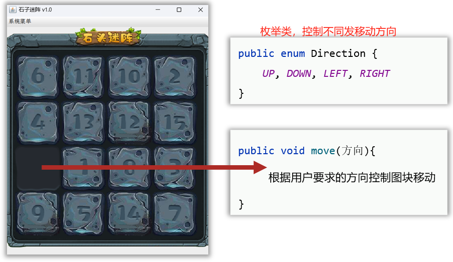
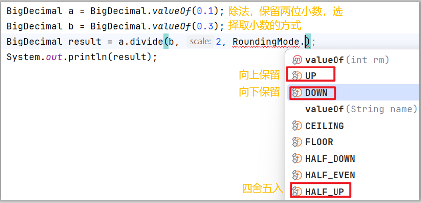
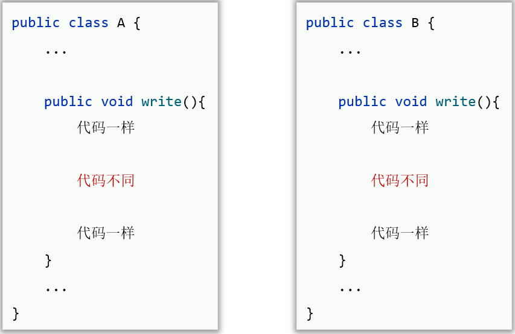
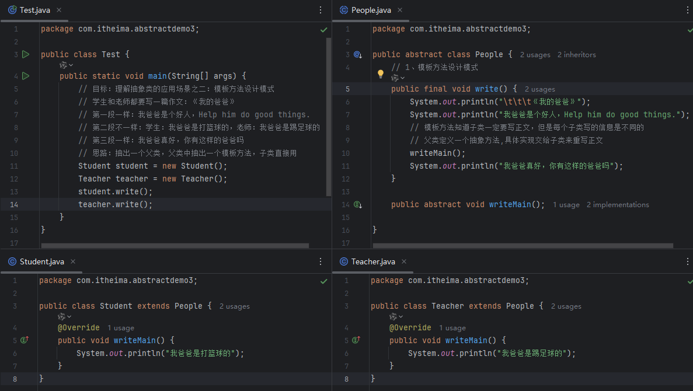
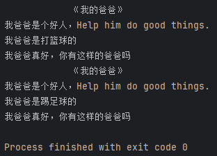
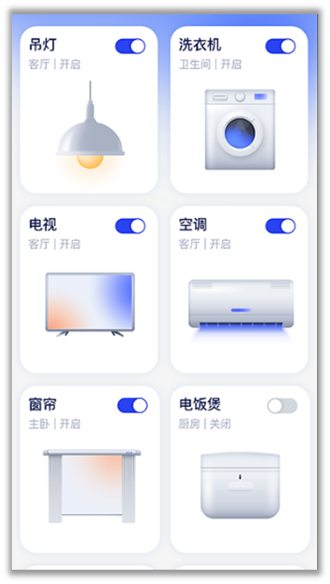

# 面向对象高级

final、单例类、枚举类、抽象类、接口

## 一、final关键字

### 1、认识final

final可以用来修饰：类、方法、变量

- **修饰类**：该类被称为最终类，特点是**不能被继承了**

- **修饰方法**：该方法被称为最终方法，特点是**不能被重写了**

- **修饰变量**：该变量**有且仅能被赋值一次**

  - **final修饰静态变量**，这个变量今后被称为**常量**，可以记住一个固定值，并且程序中不能修改了，通常这个值作为系统的配置信息。

    常量的名称，建议**全部大写**，**多个单词用下划线连接**

    ```java
    public final String SCHOOL_NAME = "电子科技大学";
    ```

  - final修饰实例变量，一般没有意义

    ```java
    public class Demo {
    	private final String name = "猪刚烈";
    	public static void main(String[] args){
    	Demo d = new Demo();
    	System.out.println(d.name);
    	d.name = "高翠兰";// 报错，不能赋值
    	}
    }
    ```

    

final修饰变量的注意：

- final修饰基本类型的变量，变量存储的**数据**不能被改变

- final修饰引用类型的变量，变量存储的**地址**不能被改变，但地址所指向对象的内容是可以被改变的

  ```java
  public class FinalDemo1 {
      public static void main(String[] args) {
          final int a = 10;
          a = 30;// final修饰的变量不能被修改
          
          final int[] arr = new int[]{1,2,3};
          arr = new int[]{4,5,6};// 报错，第二次赋值地址变了
          arr[2] = 90;// final修饰的数组可以修改
      }
  }
  ```

### 2、常量(Constant)

- 使用了static final修饰的成员变量就成为常量
- 作用：常用于记录系统中的配置信息
- 常量的名称建议**全部大写**，**多个单词用下划线连接**，公司里面一般用一个单独的Constant类保存项目中所需的常量，以后只需要再Constant里面改

**使用常量记录系统配置信息的优势、执行原理**

- 代码可读性更好，可维护性也更好
- 程序编译后，**常量**会被**“宏替换”**：出现**常量的地方**全部会被**替换成**其记住的**字面量**，这样可以保证使用常量**和直接用字面量的性能是一样的**。

## 二、单例类 (设计模式)

架构师层面、面试、源码会涉及到设计模式的内容 

### 1、什么是设计模式

- 一个问题通常有n种解法，其中肯定有一种解法是最优的，这个**最优法**被人总结出来了，称之为**设计模式**
- 设计模式有20多种，对应20多种软件开发中会遇到的问题

### 2、设计模式学什么

- 解决什么问题
- 怎么写

### 3、单例(Single Instance)设计模式

- **作用：确保某个类只能创建一个对象**

**写法，实现步骤：**

- 把类的构造器私有：确保单例类记住类的一个对象

- 定义一个类变量记住类的一个对象：用于基本本类的一个唯一对象

- 定义一个类方法，返回对象：提供一个公开的静态方法，返回这个类的唯一对象

  ```java
  // 设计成单例模式(饿汉式单例模型)
  public class A {
      //2、定义一个静态变量记住类的一个对象，私有化防止外部更改
      private static A a = new A();
      // private static final A a = new A();// 防止内部更改
  
      // 1、私有化构造器：确保单例类记住类的一个对象
      private A() {
      }
  
      // 3、定义一个公共的静态方法，返回类的一个对象
      public static A getObject() {
          return a;
      }
  }
  ```

**单例有什么应用场景，有啥好处**

- 任务管理器对象、获取运行时对象（JVM虚拟机）
- 在这些业务场景下，使用单例模式，可以**避免浪费内存**

**单例类的很多形式**

- 饿汉式单例：拿对象时，对象早就创建好了 (如上所示)

  ```java
  public class A {
  	// 2、定义一个类变量记住类的一个对象
  	private static A a = new A();
  	// 1、私有构造器
  	private A(){
  	}
  	// 3、定义一个类方法返回对象
  	public static A getInstance(){
  		return a;
  	}
  }
  ```

  

- 懒汉式单例：用对象时，才开始创建对象

  - 把类的构造器私有
  - 定义一个静态变量用于存储对象
  - 提供一个静态方法，保证返回的是同一个对象

  ```java
  public class B {
  	// 2、定义一个静态变量用于存储对象
  	private static B b;// null
  	// 1、单例必须私有构造器
  	private B() {
  	}
  	
  	// 3、提供一个静态方法，保证返回的是同一个对象
  	public static B getInstance() {
  		// 第一次拿对象时，会创建对象，给静态变量b记住	
         if (b == null) {
  			b = new B();
  		}
  		return b;
  	}
  }
  ```


## 三、枚举类(Enum)

### 1、认识枚举类

- 枚举是一种特殊的类

- 枚举类的写法

  ```java
  修饰符 enum 枚举类名{
  	名称1 ,  名称2, ... ; 
  	其他成员…
  }
  
  public enum A{
  	X , Y , Z;
      ...
  }
  ```

- 特点:

  - 枚举类中的**第一行**，**只能罗列枚举类的对象名称**，且要用逗号隔开

  - **这些名称，本质是常量，每个常量都记住了枚举类的一个对象**

    ```java
    Compiled from “A.java"
    // 枚举类的父类为java.lang.Enum<A>
    public final class A extends java.lang.Enum<A> {
        public static final A X = new A();
        public static final A Y = new A();
        public static final A Z = new A();
    	
        // 编译器为枚举类新增了几个方法
        public static A[] values();// 所有的枚举对象放到一个数组
        public static A valueOf(java.lang.String);// 根据名字对应某个枚举对象
    }
    ```

  - 枚举都是最终类，不可以被继承，枚举类都是继承 java.lang.Enum 类的

  - 枚举类的构造器是私有的（写不写都只能是私有的），因此，枚举类对外不能创建对象

  - 编译器为枚举类新增了几个方法

### 2、枚举类的常见应用场景

- 枚举类很适合做信息分类和标志

  - 控制移动方向

    

  - 控制取小数点的方式

    

- 例子：移动操作

  - 枚举类

    ```java
    package com.itheima.enumdemo;
    
    public enum Direction {
        UP, DOWN, LEFT, RIGHT;
    }
    ```

  - 运行文件

    ```java
    package com.itheima.enumdemo;
    
    public class Test2 {
        public static void main(String[] args) {
            // 目标：掌握枚举类的应用场景：做信息的分类和标志
            // 需求：模拟上下左右移动图片
            // 1、用常量做信息标志和分类:但参数不受约束
            // 定义Constant常数类：public static final int UP = 0;
            // move(int direction)
            // move(1); //可能超出范围
            // 2、用枚举做信息标志和分类:参数受枚举类的约束
            // 定义Directon枚举类
            move(Direction.UP);
        }
    
        public static void move(Direction direction){
            switch (direction) {
                // Direction.UP中Direction可省略，因为switch中接受的就是枚举类
                case UP:
                    System.out.println("向上移动");
                    break;
                case DOWN:
                    System.out.println("向下移动");
                    break;
                case LEFT:
                    System.out.println("向左移动");
                    break;
                case RIGHT:
                    System.out.println("向右移动");
                    break;
                default:
                    System.out.println("输入有误");
                    break;
            }
        }
    }
    ```

    

## 四、抽象类(Abstract)

### 1、认识抽象类

- java中有一个关键字: **abstract**，可以用来**修饰类、成员方法**

  - **abstract**修饰类，这个类就是**抽象类**

    ```java
    修饰符 abstract class 类名{ 
    	修饰符 abstract 返回值类型 方法名称(形参列表)；
     }
    ```

  - **abstract**修饰方法，这个方法就是**抽象方法**；只有方法签名，不能有方法体（没有大括号）

    ```java
    public abstract class A {
        // 抽象方法：必须abstract修饰，只有方法签名，不能有方法体（没有大括号）
        public abstract void test();
    }
    ```

- **抽象类的注意事项、特点**

  - 抽象类中不一定要有抽象方法，**有抽象方法的类必须是抽象类**
  - 类有的成员：成员变量、方法、构造器，抽象类都可以有
  - **抽象类最主要的特点：**抽象类==不能创建对象==，仅作为一种==特殊的父类==，==让子类继承并实现==
  - 一个类继承抽象类，必须**重写**完**抽象类**的**全部抽象方法**，否则这个类也必须定义成抽象类

  ```java
  package com.itheima.abstractdemo;
  
  import lombok.Data;
  
  @Data
  public abstract class A {
      private String name;
      private int age;
  
      public A() {
          System.out.println("A的无参数构造器");
      }
  
      public A(String name, int age) {
          this.name = name;
          this.age = age;
          System.out.println("A的有参数构造器");
      }
  
      // 抽象方法：没有方法体，只有方法声明
      public abstract void show();
  
      public void eat() {
          System.out.println("A类在吃饭");
      }
  }
  ```

- 抽象类的核心：**有得有失**，**得到**了**抽象方法**的能力，**失去**了**创建对象**的能力

- 抽象类的**使命**：就是**被子类继承**，就是为了生孩子

  ```java
  package com.itheima.abstractdemo;
  
  public class B extends A {
  
      // 一个类继承抽象类，必须重写完抽象类的全部抽象方法，否则这个类也必须定义成抽象类
      @Override
      public void show() {
          System.out.println("B类重写show方法");
      }
  }
  ```

### 2、抽象类的好处、应用场景

- 父类知道每个子类都要做某个行为，但每个子类要做的情况不一样，父类就定义成抽象方法，交给子类去重写实现，我们**设计这样的抽象类，就是为了更好的支持多态**

  - 抽象类Animal

    ```java
    package com.itheima.abstractdemo2;
    
    public abstract class Animal {
        // 每个动物的叫声
        // 子类不用这个方法，写成抽象类更简洁
        // 子类必须重写这个方法，防止忘记
        public abstract void cry();
    }
    ```

  - 子类一：Dog

    ```java
    package com.itheima.abstractdemo2;
    
    public class Dog extends Animal {
        @Override
        public void cry() {
            System.out.println("🐕是汪汪汪叫");
        }
    }
    ```

  - 子类二：Cat

    ```java
    package com.itheima.abstractdemo2;
    
    public class Cat extends Animal {
        @Override
        public void cry() {
            System.out.println("🐱是喵喵喵叫");
        }
    }
    ```

  - 运行文件

    ```java
    package com.itheima.abstractdemo2;
    
    public class Test {
        public static void main(String[] args) {
            // 目标：理解抽象类的好处
            Animal a = new Cat();
            a.cry();
        }
    }
    ```

### 3、模板方法设计模式

- 提供一个方法作为**完成某类功能**的**模板**，模板方法封装了每个实现步骤，但**允许子类提供特定步骤的实现**

- 模板方法设计模式好处：提高代码的复用、并简化子类设计

  

- **写法**

  1. 定义一个抽象类
  2. 在里面定义2个方法
     - 一个是**模板方法**：把**共同的实现步骤**放里面去
     - 一个是**抽象方法**：**不确定的实现步骤**，交给具体的子类来完成

- **建议：用final修饰模板方法**，**因为**

  - 模板方法是给子类直接使用的，不能被子类重写
  - 一旦子类重写了模板方法，模板方法就失效了

- 例子：写作文

  - 代码

  

  - 输出

  

## 五、接口(Interface)

### 1、认知接口

- java提供了一个**关键字interface**定义接口

  ```java
  public interface 接口名{
  	// 成员变量（常量）
  	// 成员方法（抽象方法）
  }
  
  public interface A {
      // JDK8之前，接口中只能定义常量和抽象方法
      // 1、常量：接口中常量可以省略public static final不写，默认会加上去
      String SCHOOL_NAME = "黑马程序员";
  
      // 2、抽象方法：接口中抽象方法可以省略public abstract不写，默认会加上去
      void run();
      String go();
  }
  
  public interface B {
      void play();
  }
  ```

- 注意：**接口不能创建对象**

- 接口是用来被类**实现 (implements)**的，实现接口的类称为**实现类**，**一个类可以同时实现多个接口**

  ```java
  修饰符 class 实现类类名 implements 接口1, 接口2, 接口3 , ... {
  	//实现类实现多个接口，必须重写完全部接口的全部抽象方法，否则实现类需要定义成抽象类。
  } 
  // C被称为实现类，同时实现了多个接口
  // 实现类实现多个接口，必须重写完全部的抽象方法，否则这个类必须定义为抽象类
  class C implements A, B{
  
      @Override
      public void run() {
          System.out.println("C重写了A的方法");
      }
  
      @Override
      public String go() {
          return "游朝政太牛啦";
      }
  
      @Override
      public void play() {
          System.out.println("C重写了B的方法");
      }
  }
  
  public class Test {
      public static void main(String[] args) {
          // 目标：认识接口，搞清楚接口的特点和基本使用
          System.out.println(A.SCHOOL_NAME);
  
          // 注意：接口不能创建对象
          C c = new C();
          c.run();
          System.out.println(c.go());
          c.play();
      }
  }
  ```

### 2、接口的好处

- 弥补了类单继承的不足，**一个类同时可以实现多个接口**，使类的**角色更多**，**功能更强大**

- 让程序可以**面向接口编程**，这样程序员就可以灵活方便的**切换各种业务实现**（更利于程序的**解耦合**）

  ```java
  package com.itheima.interface2;
  
  public class Test {
      public static void main(String[] args) {
          // 目标：理解java设计接口的好处、用处
          // 接口弥补了类单继承的不足，可以让类拥有更多的角色，功能丰富
          People p = new Student();
          Driver d = new Student();
          BoyFriend bf = new Student();
          
           // 接口可以实现面向接口编程，更利于解耦合
          Driver b = new Teacher();
          BoyFriend bf1 = new Teacher();
      }
  }
  
  interface Driver {}
  interface BoyFriend {}
  
  class People{}
  class Student extends People implements Driver, BoyFriend{}
  class Teacher implements Driver, BoyFriend{} 
  ```

### 3、接口的应用案例——学生信息管理模块

- 需求：请设计一个班级学生的信息管理模块：学生的数据有：姓名、性别、成绩

- 功能1：要求打印出全班学生的信息； 功能2：要求打印出全班学生的平均成绩

- 有两套方案

  - 第1套方案：能打印出班级全部学生的信息；能打印班级全部学生的平均分
  - 第2套方案：能打印出班级全部学生的信息（包含男女人数）；能打印班级全部学生的平均分（要求是去掉最高分、最低分）

- **要求：系统可以支持灵活的切换这些实现方案**

  - 学生类

    ```java
    package com.itheima.interface3;
    
    import lombok.AllArgsConstructor;
    import lombok.Data;
    import lombok.NoArgsConstructor;
    
    @Data
    @NoArgsConstructor
    @AllArgsConstructor
    public class Student {
        private String name;
        private char sex;
        private double score;
    }
    ```

  - 测试类

    ```java
    package com.itheima.interface3;
    
    public class Test {
        public static void main(String[] args) {
            /* 目标：完成接口小案例
             * 1、定义学生类，创建学生对象，封装学生数据，才能交给其他模块
             * 2、准备学生数据，目前测试数据*/
            Student[] allStudents = new Student[10];
            allStudents[0] = new Student("小明", '男', 100);
            allStudents[1] = new Student("小红", '女', 99);
            allStudents[2] = new Student("小花", '女', 98);
            allStudents[3] = new Student("小刚", '男', 97);
            allStudents[4] = new Student("小李", '男', 96);
            allStudents[5] = new Student("小赵", '男', 95);
            allStudents[6] = new Student("小钱", '男', 94);
            allStudents[7] = new Student("小孙", '男', 93);
            allStudents[8] = new Student("小吴", '男', 92);
            allStudents[9] = new Student("小郑", '女', 91);
    
            /* 3、提供两套业务实现方案，支持灵活切换（解耦合），面向接口编程
             *   -- 定义一个接口（规范思想）：必须打印全班学生信息，打印平均分
             *   -- 定义第一套实现类，实现接口：实现打印学生的信息；实现打印平均分
             *   -- 定义第二套实现类，实现接口：实现打印学生的信息（包含男女人数）；实现打印平均分（去掉最高分、最低分）*/
            ClassDataInter cdi = new ClassDataInterImpl2(allStudents);
            cdi.printAllStudentInfo();
            cdi.printAverageScore();
        }
    }
    ```

  - 接口类

    ```java
    package com.itheima.interface3;
    
    public interface ClassDataInter {
        void printAllStudentInfo();
        void printAverageScore();
    }
    ```

  - 实现类一

    ```java
    package com.itheima.interface3;
    
    public class ClassDataInterImpl1 implements ClassDataInter {
        private Student[] students;
        public ClassDataInterImpl1(Student[] students){
            this.students = students;
        }
        @Override
        public void printAllStudentInfo() {
            System.out.println("学生的全部信息如下：");
            for (Student student : students){
                System.out.println(student.getName() + " " + student.getSex() + " " + student.getScore());
            }
        }
    
        @Override
        public void printAverageScore() {
            System.out.println("学生的平均成绩为：");
            double avg = 0;
            for (Student student : students){
                avg += student.getScore();
            }
            avg = avg/students.length;
            System.out.println(avg);
        }
    }
    ```

  - 实现类二

    ```java
    package com.itheima.interface3;
    
    public class ClassDataInterImpl2 implements ClassDataInter {
        private Student[] students;
        public ClassDataInterImpl2(Student[] students){
            this.students = students;
        }
        @Override
        public void printAllStudentInfo() {
            System.out.println("学生的全部信息如下：");
            int male = 0;
            for (Student student : students){
                System.out.println(student.getName() + " " + student.getSex() + " " + student.getScore());
                if (student.getSex() == '男'){
                    male++;
                }
            }
            System.out.println("男生的数量为：" + male);
            System.out.println("女生的数量为：" + (students.length - male));
        }
    
        @Override
        public void printAverageScore() {
            double avg = students[0].getScore();
            double max = students[0].getScore();
            double min = students[0].getScore();
            for (int i = 1; i < students.length; i++){
                Student student = students[i];
                avg += student.getScore();
                if (student.getScore() > max){
                    max = student.getScore();
                }
                if (student.getScore() < min){
                    min = student.getScore();
                }
            }
            avg = (avg - max - min)/(students.length - 2);
            System.out.println("平均分是:"+avg);
            System.out.println("最高分是:"+max);
            System.out.println("最低分是:"+min);
        }
    }
    ```

### 4、JDK8开始，接口新增的方法

- **JDK 8开始，接口新增了三种形式的方法：**

  - 默认方法：使用default修饰，使用实现类的对象调用
  - 静态方法：static修饰，必须用当前接口名调用
  - 私有方法：private修饰，jdk9开始才有的，只能在接口内部被调用
  - 他们都会默认被public修饰

  ```java
  package com.itheima.interface4;
  
  public interface A{
      /**
       * 1、默认方法（实例方法）：使用用default修饰，
       * 默认会被加上public修饰。
       * 如何调用？只能使用接口的实现类的对象调用
       */
      default void go(){
          System.out.println("go方法执行了");
          run();
      }
  
      /**
       * 2、私有方法：必须用private修饰(JDK 9开始才支持)
       * 私有的实例方法
       * 如何调用？使用接口中的其他实例方法去调用
       */
      private void run(){
          System.out.println("run方法执行了");
      }
  
      /**
       * 3、类方法（静态方法）：使用static修饰，默认会被加上public修饰。
       * 如何调用？只能使用当前接口名来调用，实现类都不行
       */
      static void show(){
          System.out.println("show方法执行了");
      }
  }
  ```

- **JDK8开始，接口中为啥要新增这些方法**

  增强了接口的能力，更便于项目的扩展和维护

  之前如果要在接口中新增方法，那么所有的实现类都要进行相应的重写，代价比较大

### 5、接口的注意事项

1. **接口与接口可以多继承：一个接口可以同时继承多个接口[重点]**

   ```java
   /* 类与类：单继承，一个类只能继承一个直接父类
    *  类与接口：多实现，一个类可以实现多个接口
    *  接口与接口：多继承，一个接口可以继承多个接口*/
   interface A {
       void show1();
   }
   
   interface B {
       void show2();
   }
   
   interface C extends A, B {
       void show3();
   }
   
   // C继承了AB，此时D只需要实现C，就能实现AB中的方法
   class D implements C {
       public void show1() {
           System.out.println("show1");
       }
   
       public void show2() {
           System.out.println("show2");
       }
   
       public void show3() {
           System.out.println("show3");
       }
   }
   ```

2. 一个接口继承多个接口，如果多个接口中存在方法签名冲突，则此时不支持多继承，也不支持多实现

   ```java
   interface A1 {
       void show();
   }
   
   interface B1 {
       String show();
   }
   
   // 报错
   interface C1 extends A1, B1 {
   }
   // 报错
   class D1 implements A1, B1 {
   }
   ```

3. 一个类继承了父类，又同时实现了接口，如果父类中和接口中有同名的默认方法，实现类会优先用父类的

   ```java
   interface A2 {
       default void show() {
           System.out.println("接口A2.show");
       }
   }
   class Animal {
       public void show() {
           System.out.println("父类Animal.show");
       }
   }
   // 继承了Animal，又实现了A2
   class Dog extends Animal implements A2 {
       // 如果要接口A2的show()，只能定义一个方法来中转
       public void go() {
       show();// 父类的
       super.show();// 父类的
       A2.super.show();// 接口A2的
       }
   }
   
   public class Test {
       public static void main(String[] args) {
           Dog d = new Dog();
           d.show();// 输出"父类Animal.show"
       }
   }
   ```

4. 一个类实现了多个接口，如果多个接口中存在同名的默认方法，可以不冲突，这个类重写该方法即可

   ```java
   interface A3 {
       default void show() {
           System.out.println("接口A3.show");
       }
   }
   interface B3 {
       default void show() {
           System.out.println("接口B3.show");
       }
   }
   class C3 implements A3, B3 {
       @Override
       public void show() {
           A3.super.show(); // 接口A3的
           B3.super.show(); // 接口B3的
       }
   }
   ```

### 6、接口与抽象类的区别

- 相同点：
  1. 都是抽象形式，都可以有抽象方法，都不能创建对象；
  2. 都是派生子类形式：抽象类是被子类继承使用，接口是被实现类实现；
  3. 一个类继承抽象类或者实现接口，都必须重写完他们的抽象方法，否则自己要称为抽象类或者报错；
  4. 都能支持多态，都能实现解耦合。
- 不同点
  1. 抽象类中可以定义类的全部普通成员，接口只能定义常量、抽象方法（JDK8新增了三种方法）。
  2. 抽象类只能被类单继承，而接口可以被类多实现。
  3. 一个类继承了抽象类，就不能再继承其他类；一个类实现了接口，还可以继承其他类或者实现其他接口。
  4. 抽象类体现模板思想：更利于做父类，实现代码的复用性。（IO流）==最佳实践==
  5. 接口更适合做功能的解耦合：解耦合性更强，更灵活。（集合）==最佳实践==

## 六、综合小案例——智能家居控制系统

- 需求：某智能家居系统，可以让用户选择要控制的家用设备（吊灯，电视机，洗衣机，落地窗），并可以对它们进行打开或者关闭操作

  

- 测试类

  ```java
  package com.itheima.demo;
  
  import java.util.Scanner;
  
  public class Test {
      public static void main(String[] args) {
          // 目标：使用面向对象编程实现智能家居控制系统
          // 角色：设备（吊灯，电视，洗衣机，空调...）
          // 具备的功能：开和关
          // 谁控制他们：智能控制系统（单例对象），控制设备的开和关
          // 1、定义设备类：创建设备对象代表家里的设备
          // 2、准备这些设备对象，放到数组中，代表整个家庭的设备
          JD[] jds = new JD[4];
          jds[0] = new Lamp("欧灯", true);
          jds[1] = new TV("小米电视", false);
          jds[2] = new WashMachine("小天鹅洗衣机",true);
          jds[3] = new Air("格力空调",false);
  
          // 3、为每个设备指定一个开和关的功能，定义一个接口
          // 4、创建智能控制系统对象，控制设备的开和关
          SmartHomeControl smartHomeControl = SmartHomeControl.getInstance();
          // 5、控制电视机
          // smartHomeControl.control(jds[1]);
  
          // 6、提示用户操作：a.打印所有设备的状态，b.让用户选择哪一个操作
          while (true) {
              // 打印所有设备的状态
              smartHomeControl.printAllStatus(jds);
              // 让用户选择哪一个操作
              Scanner sc = new Scanner(System.in);
              System.out.println("请选择要操作的电器序号：");
              String index = sc.next();
              switch (index){
                  case "1":
                      smartHomeControl.control(jds[0]);
                      break;
                  case "2":
                      smartHomeControl.control(jds[1]);
                      break;
                  case "3":
                      smartHomeControl.control(jds[2]);
                      break;
                  case "4":
                      smartHomeControl.control(jds[3]);
                      break;
                  case "exit":
                      System.out.println("退出系统");
                      return;
                  default:
                      System.out.println("输入有误，请重新输入！");
              }
          }
      }
  }
  ```

- 开关的接口Switch

  ```java
  package com.itheima.demo;
  
  public interface Switch {
      void press();
  }
  ```

- 父类家电(JD)对象，实现开关接口Switch

  ```java
  package com.itheima.demo;
  
  import lombok.AllArgsConstructor;
  import lombok.Data;
  import lombok.NoArgsConstructor;
  
  @Data
  @AllArgsConstructor
  @NoArgsConstructor
  public class JD implements Switch {
      private String name;
      // 定义开和关
      private boolean status;// 默认为关，false
  
      @Override
      public void press() {
          // 控制当前设备的开和关
          status = !status;
      }
  }
  ```

- 创建吊灯类(Lamp)、电视(TV)、洗衣机(WashMachine)、空调(Air)类，继承JD类

  ```java
  package com.itheima.demo;
  // 吊灯
  public class Lamp extends JD {
      public Lamp(String name, boolean status) {
          super(name, status);
      }
  }
  ```

- 智能控制系统类SmartHomeControl，设计成单例模式

  ```java
  package com.itheima.demo;
  
  // 控制系统设计成单例模式
  public class SmartHomeControl {
      // 静态变量记住对象
      private static final SmartHomeControl smartHomeControl = new SmartHomeControl();
      private SmartHomeControl(){}
      public void control(JD jd){
          System.out.println(jd.getName() + "状态目前是：" + (jd.isStatus() ? "开着" : "关闭！"));
          System.out.println("开始您的操作");
          jd.press();
          System.out.println(jd.getName() + "状态变成了：" + (jd.isStatus() ? "开着" : "关闭！"));
      }
      public void printAllStatus(JD[] jds){
          for (int i = 0; i < jds.length; i++){
              JD jd = jds[i];
              System.out.println((i+1) + ". " + jd.getName() + "状态目前是：" + (jd.isStatus() ? "开着" : "关闭！"));
          }
      }
  
      public static SmartHomeControl getInstance(){
          return smartHomeControl;
      }
  }
  ```

  
