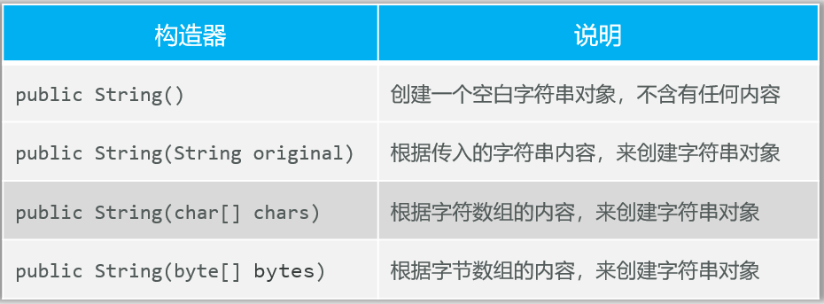
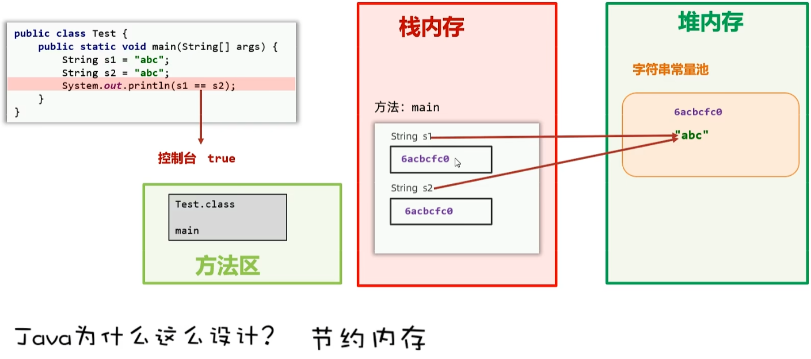
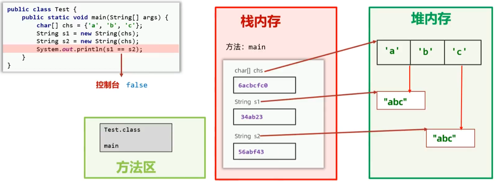
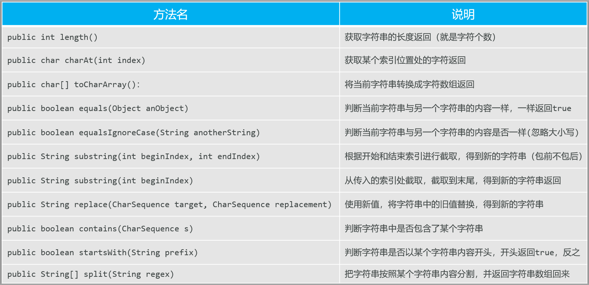
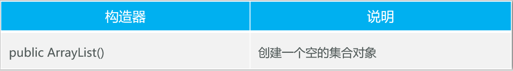
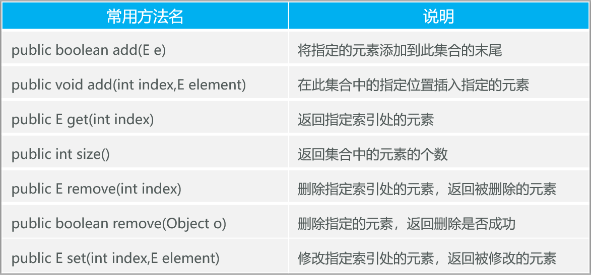

# 面向对象高级

代码块、内部类、函数式编程、常用API、GUI编程

## 一、代码块

- 代码块是类的五大成分之一（成员变量、构造器、方法、代码块、内部类）

**代码块分为两种**

- 静态代码块：

  - **格式：**static { }
  - **特点：**类加载时自动执行，由于类只会加载一次，所以静态代码块也只会执行一次。
  - **作用：**完成类的初始化，例如：对静态变量的初始化赋值。

  ```java
  package com.itheima.code;
  
  import java.util.Arrays;
  
  public class CodeDemo1 {
      public static String schoolName;
      public static String[] cards = new String[54];
      // 静态代码块
      // 作用：可以完成对类的静态资源初始化
      // 只在类加载时执行一次，相较于在main中赋值，静态代码块初始化赋值不会在main中重复调用
      static {
          System.out.println("静态代码执行了");
          schoolName = "黑马程序员";
          cards[0] = "A";
          cards[1] = "2";
          cards[2] = "3";
      }
      public static void main(String[] args) {
          System.out.println("main方法执行了");
          System.out.println(schoolName);
          System.out.println(Arrays.toString(cards));// 返回数组的内容
      }
  }
  ```

- 实例代码块：

  - **格式**：{ }
  - **特点**：每次创建对象时，执行实例代码块，并在构造器前执行。
  -  **作用：**和构造器一样，都是用来完成对象的初始化的，例如：对实例变量进行初始化赋值

  ```java
  package com.itheima.code;
  
  public class CodeDemo2 {
      private String name;
      private String[] direction = new String[4]; // 实例变量
  
      // 实例代码块：无static修饰，属于对象，每次创建对象时，都会优先执行一次
      // 基本作用：初始化对象的实例变量
      {
          System.out.println("实例代码块执行了");
          name = "itheima";
          direction[0] = "N";
          direction[1] = "S";
          direction[2] = "E";
          direction[3] = "W";
      }
      public static void main(String[] args) {
          System.out.println("main方法执行了");
          new CodeDemo2();
          new CodeDemo2();
          new CodeDemo2();
      }
  }
  ```

## 二、内部类(InnerClass)

- 如果一个类定义在另一个类的内部，这个类就是内部类

- 场景：当一个类的内部，包含了一个完整的事务，且这个事物没有必要单独设计时，就可以把这个事物设计成内部类

  ```java
  public class Car{
      // 内部类
  	public class Engine{
      }
  }
  ```

  

- 内部类的分类：

  - 成员内部类
  - 静态内部类
  - 局部内部类
  - ==匿名内部类==

### 1、成员内部类

- 就是类中的一个普通成员，类似于前面学过的普通的成员变量、成员方法

  ```java
  public class Outer {
      // 成员内部类
      public class Inner {     
     
      }
  }
  
  // 创建对象的格式：
  // 外部类名.内部类名 对象名 = new 外部类(...).new 内部类(...);
  Outer.Inner in = new Outer().new Inner();
  ```

- 成员内部类中访问其他成员的特点：

  1. 成员内部类种可以直接访问外部类的实例成员、静态成员

     ```java
     public class InnerClassDemo1 {
     
         public static void main(String[] args) {
             // 目标：搞清楚内部类的语法
             // 成员内部类创建对象的格式：
             // 外部类名.内部类名 对象名 = new 外部类(...).new 内部类(...);
             Outer.Inner oi = new Outer().new Inner();
             // 1、成员内部类种可以直接访问外部类的实例成员、静态成员，包括私有的
             oi.setName("小雷");
             oi.show();
         }
     }
     
     // 外部类
     public class Outer {
         // 静态成员变量
         public static String schoolName = "传智播客";
         // 静态成员方法
         public static void test(){
             System.out.println("test()");
         }
         // 实例成员变量
         private int age;
     
         // 实例成员方法
         public void run(){
             System.out.println("run()");
         }
     
         // 成员内部类：无static修饰，属于外部类持有
         class Inner{
             private String name;
             // 构造器
             public Inner(){
                 System.out.println("Inner()");
             }
             // 有参构造器
             public Inner(String name){
                 System.out.println("Inner(String name)");
             }
             public void show(){
                 System.out.println("show");
                 System.out.println(schoolName);// "传智播客"
                 test();// "test()"
                 System.out.println(age);// 0
                 run();// "run()"
                 System.out.println(this);// 内部类地址
                 System.out.println(Outer.this);// 外部类地址
             }
     
             //getter setter
             public String getName() {
                 return name;
             }
             public void setName(String name) {
                 this.name = name;
             }
         }
     }
     ```

  2. 成员内部类的实例方法中，可以直接拿到当前外部类对象，格式是：外部类名.this 

     ```java
     public class InnerClassDemo1 {
         public static void main(String[] args) {
             // 2、成员内部类的实例方法中，可以直接拿到当前外部类对象，格式是：外部类名.this
             People.Heart ph = new People().new Heart();
             ph.beat();
     
         }
     }
     
     class People {
         private int heartbeat = 60;
     
         public class Heart {
             private int heartbeat = 80;
             public void beat() {
                 int heartbeat = 100;
                 System.out.println(heartbeat); // 100
                 System.out.println(this.heartbeat); // 80
                 System.out.println(People.this.heartbeat); // 60
             }
         }
     }
     ```

### 2、静态内部类

- 有static修饰的内部类，属于外部类自己持有

  ```java
  public class Outer{
      // 静态内部类
     	public static class Inner{
  	}
  }
  
  // 创建对象的格式：
  // 外部类名.内部类名 对象名 = new 外部类.内部类(…);
  Outer.Inner in = new Outer.Inner();
  ```

- 静态内部类中访问外部类成员的特点

  可以直接访问外部类的静态成员，不可以直接访问外部类的实例成员

  ```java
  public class InnerClassDemo2 {
      public static void main(String[] args) {
          // 目标：搞清楚内部类的语法
          // 创建对象：外部类名.内部类名 对象名 = new 外部类.内部类(…);
          Outer.Inner oi = new Outer.Inner();
          oi.show();
      }
  }
  
  package com.itheima.innerclass2;
  
  public class Outer {
      public static String schoolName = "传智播客";
      public int age;
      // 静态内部类：属于外部类本身持有
      public static class Inner{
          public void show(){
              System.out.println("show...");
              // 可以!直接访问外部类的静态成员
              System.out.println(schoolName);
              // 不可以!直接访问外部类的实例成员
              System.out.println(age);// 报错,
          }
      }
  }
  ```

### 3、局部内部类 (了解)

- 局部内部类是定义在在方法中、代码块中、构造器等执行体中

  ```java
  public class Test {
     	public static void main(String[] args) {
      }
     	public static void go(){
         	class A{
          }
         	abstract class B{
          }
         	interface C{
         	}
      }
  }
  ```

### 4、匿名内部类 (重点)

#### 4.1 认识

- 是一种特殊的局部内部类

- 所谓匿名：指的是程序员不需要为这个类申明名字，默认有个隐藏的名字

  ```java
  new  类或接口(参数值…) {
      类体(一般是方法重写)；
  };
  
  new Animal(){
      @Override
      public void cry() {
      }
  };
  ```

- **特点**：匿名内部类**本质就是一个子类**，并会**立即创建出一个子类对象**

- **作用**：用于**更方便的创建一个子类对象**

```java
package com.itheima.innerclass3;
public class Test {
    public static void main(String[] args) {
        // 匿名内部类实际上是有名字的，外部类名$编号.class
        // 匿名内部类本质上是一个子类，同时又会立即创建一个子类对象
        Animal a2 = new Animal() {
            @Override
            public void cry() {
                System.out.println("叫了一声...");
            }
        };
        a2.cry(); // 叫了一声...
    }
}

package com.itheima.innerclass3;
public abstract class Animal {
    public abstract void cry();
}


// 文件名Test$1.class
// Source code recreated from a .class file by IntelliJ IDEA
// (powered by FernFlower decompiler)
// 匿名内部类反编译后的代码
package com.itheima.innerclass3;
class Test$1 extends Animal {
   	Test$1() {
    }

   	public void cry() {
       	System.out.println("叫了一声...");
    }
}
```

#### 4.2 常见使用形式——学生老师游泳

**匿名内部类在开发中的常见形式**

- ==通常作为一个对象参数传输给方法==

- 需求：学生老师游泳

  ```java
  package com.itheima.innerclass3;
  
  public class Test2 {
      public static void main(String[] args) {
          // 目标：搞清楚匿名函数类的使用形式：通常可以作为一个对象参数传给方法使用
          // 需求：学生老师都要参加游泳方法
          // 对象多态
          Swim s = new Student();
          start(s);
          Swim t = new Teacher();
          start(s);
  
          System.out.println("--------------------------");
  
          // 匿名内部类对象
          // 对象回调：对象给你，你又来调我的方法
          Swim s1 = new Swim(){
              @Override
              public void swimming() {
                  System.out.println("学生可以游泳");
              }
          };
          start(s1);
          
          // 更简洁的写法
          start(new Swim(){
              @Override
              public void swimming() {
                  System.out.println("老师可以游泳");
              }
          });
      }
  
      // 设计一个方法，可以接收学生和老师，开始比赛
      public static void start(Swim s) {
          System.out.println("开始");
          s.swimming();
          System.out.println("结束");
      }
  }
  
  class Teacher implements Swim {
      @Override
      public void swimming() {
          System.out.println("老师可以游泳");
      }
  }
  
  class Student implements Swim {
      @Override
      public void swimming() {
          System.out.println("学生可以游泳");
      }
  }
  
  interface Swim {
      void swimming();
  }
  ```

#### 4.3 应用场景

- 调用别人提供的方法实现需求时，这个方法正好可以让我们传输一个匿名内部类对象给其使用

- 开发中不是我们主动去写匿名内部类，而是用别人的功能时，别人可以让我们去写一个内部类吗，我们才会写

  ```java
  package com.itheima.innerclass3;
  
  import javax.swing.*;
  import java.awt.event.ActionEvent;
  import java.awt.event.ActionListener;
  
  public class Test3 {
      public static void main(String[] args) {
          // 目标：搞清楚几个匿名内部类的使用场景
          // 需求：创建一个登录窗口，窗口上只有一个登录按钮
          // 铺桌子
          JFrame win = new JFrame("登录窗口");
          win.setSize(300,200);
          win.setLocationRelativeTo(null);// 居中显示：相对于中心点展示
          win.setDefaultCloseOperation(JFrame.EXIT_ON_CLOSE);
  
          // 垫桌布
          JPanel panel = new JPanel();
          win.add(panel);
  
          // 把按钮加在桌布上
          JButton btn = new JButton("登录");
          win.add(btn);
  
          // java要求必须给这个按钮添加一个监听器对象，这样就能监听用户的点击操作，就可以做出
          btn.addActionListener(new ActionListener() {
              @Override
              public void actionPerformed(ActionEvent e) {
                  System.out.println("登录成功");
              }
          });
          
  		  // 更简便的写法，与上面等价
          btn.addActionListener(e -> System.out.println("登录成功"));
  
  
          win.setVisible(true);
      }
  }
  ```

- 案例：**使用comparator接口的匿名内部类实现对数组进行排序**

  ```java
  package com.itheima.innerclass3;
  
  import java.util.Arrays;
  import java.util.Comparator;
  
  // Arrays.sort(T[] a, new Comparator<T>)
  //			参数一：需要排列的数组
  //			参数二：需要给sort声明一个Comparetor比较器对象（指定排序规则）
  
  public class Test4 {
  
      public static void main(String[] args) {
          // 目标：完成给数组排序，理解其中匿名内部类的用法
          // 准备一个学生类型的数组，存放6个学生对象
          Student[] students = new Student[6];
          students[0] = new Student("小明", 18, 1.75, "男");
          students[1] = new Student("小红", 19, 1.60, "女");
          students[2] = new Student("小刚", 20, 1.65, "男");
          students[3] = new Student("小花", 18, 1.63, "女");
          students[4] = new Student("小蕊", 28, 1.55, "女");
          students[5] = new Student("小卡", 19, 1.65, "女");
  
          // 需求：按年龄升序排序，调用Sun公司写好的API
          Arrays.sort(students, new Comparator<Student>() {
              @Override
              public int compare(Student o1, Student o2) {
                  // 指定排序规则：
                  // 如果认为左边对象 大于 右边对象  应该返回正整数
  					// 如果认为左边对象 小于 右边对象  应该返回负整数
  					// 如果认为左边对象 等于 右边对象  应该返回0整数
                  // a1 > a2 ? 1 : ( a1== a2 ? 0 : -1 )
                  return o1.getAge() - o2.getAge();// 按年龄升序，沉底
                  // return o2.getAge() - o1.getAge();// 按年龄降序
                  
              }
          });
      }
  }
  ```
  

## 三、函数式编程

- 此“函数”类似于数学中的函数(强调做什么)，只要输入的数据一致返回的结果也是一致的
  - 数学中的函数示例：   2x + 1
  - Java中的函数(Lambda表达式)：(x) -> 2x+1
- 函数式编程解决了什么问题
  - 使用**Lambda函数替代**某些**匿名内部类对象**，从而让程序代码更简洁，可读性更好。

### 1、Lambda表达式

#### 1.1 认识Lambda

- JDK 8开始新增的一种语法形式，它表示函数

- 可以**用于替代某些匿名内部类对象，从而让程序更简洁，可读性更好。**

  ```java
  (被重写方法的形参列表) -> {
      被重写方法的方法体代码。
  }
  ```

- lambda并不是可以简化所有的匿名内部类，**Lambda只能简化函数式接口的匿名内部类**

**什么是函数式接口？**

- 有且**仅有一个抽象方法**的**接口**
- 注意：将来我们见到的大部分函数式接口，上面都可能会有一个**@FunctionalInterface的注解**，该注解用于**约束当前接口必须是函数式接口**

```java
package com.itheima.lambda;

public class LambdaDemo1 {
    public static void main(String[] args) {
        // 目标：认识lambda表达式，搞清楚其基本作用
        Animal1 a = new Animal1() {
            @Override
            public void cry() {
                System.out.println("喵喵喵");
            }
        };
        a.cry();


        // 错误用法，lambda并不是可以简化所有的匿名内部类，Lambda只能简化函数式接口的匿名内部类
        // Animal1 a1 = () -> {
        //     System.out.println("喵喵喵");
        // };
        // a1.cry();
		  
        // Lambda函数表达式
        Animal2 a2 = () -> {
            System.out.println("喵喵喵");
        };
        a2.cry();

    }
}

abstract class Animal1 {
    public abstract void cry();
}

@FunctionalInterface
interface Animal2 {
    void cry();
}
```


#### 1.2 实战示例、省略规则

- 示例1：Lambda简化Comparator接口的匿名内部类

```java
// 需求：按年龄升序排序，调用Sun公司写好的API
// 匿名内部类
Arrays.sort(students, new Comparator<Students>() {
    @Override
    public int compare(Student o1, Student o2) {
        return o1.getAge() - o2.getAge();
    }
});

// Lambda表达式
Arrays.sort(students, (Student o1, Student o2) -> {
    return o1.getAge() - o2.getAge();
});
```

- 示例2：Lamda简化ActionListener接口的匿名内部类

```java
// 给btn按钮添加一个监听器对象，这样就能监听用户的点击操作，就可以做出反应
// 匿名内部类
btn.addActionListener(new ActionListener() {
    @Override
    public void actionPerformed(ActionEvent e) {
        System.out.println("登录成功");
    }
});

// Lambda表达式
btn.addActionListener((ActionEvent e) -> {
    System.out.println("登录成功");
});
```

- Lambda表达式的省略规则：用于进一步简化Lambda表达式的写法

  - **参数类型**全部可以省略不写
  - 如果**只有一个参数**，参数类型省略的同时**"()"也可以省略**；但如果有多个参数，则不能省略"()"
  - 如果Lambda表达式中**只有一行代码**，**大括号可以不写**，同时要**省略分号";"**，如果这行代码是r**eturn语句，也必须去掉return**

  ```java
  // 示例1：
  // Lambda表达式
  Arrays.sort(students, (Student o1, Student o2) -> {
      return o1.getAge() - o2.getAge();
  });
  
  // 省略后的Lambda表达式
  Arrays.sort(students, (o1, o2) -> o1.getAge() - o2.getAge());
  
  // 示例2：
  // Lambda表达式
  btn.addActionListener((ActionEvent e) -> {
      System.out.println("登录成功");
  });
  
  // 省略后的Lambda表达式
  btn.addActionListener(e -> System.out.println("登录成功"));
  ```

### 2、方法引用

#### 2.1 静态方法引用

- **类名::静态方法**

- **使用场景**

  如果某个Lambda表达式里**只是调用一个静态方法**，并且**“->”前后参数的形式一致**，就可以使用静态方法引用

  ```java
  // 省略后的Lambda表达式
  Arrays.sort(students, (o1, o2) -> o1.getAge() - o2.getAge());
  
  // Lambda表达式调用一个静态方法
  Arrays.sort(students, (o1, o2) -> Student.compareByAge(o1, o2));
  // 静态方法引用 类名::静态方法
  Arrays.sort(students, Student::compareByAge);
  
  package com.itheima.method1referrence;
  import lombok.AllArgsConstructor;
  import lombok.Data;
  import lombok.NoArgsConstructor;
  
  @Data
  @NoArgsConstructor
  @AllArgsConstructor
  public class Student {
          // 姓名 年龄 身高 性别
          private String name;
          private int age;
          private double height;
          private String sex;
  
          public static int compareByAge(Student o1, Student o2) {
              return o1.getAge() - o2.getAge();
          }
  }
  ```

#### 2.2 实例方法引用

- **对象名::实例方法**

- **使用场景**

  如果某个Lambda表达式里只是通过**对象名称调用一个实例方法**，并且**“->”前后参数的形式一致**，就可以使用实例方法引用

  ```java
  // 实例方法引用，身高按升序排序
  Student s = new Student();
  // Arrays.sort(students, (o1, o2) ->  s.compareByHeight(o1, o2));
  Arrays.sort(students, s::compareByHeight);
  
  import lombok.AllArgsConstructor;
  import lombok.Data;
  import lombok.NoArgsConstructor;
  @Data
  @NoArgsConstructor
  @AllArgsConstructor
  public class Student {
          // 姓名 年龄 身高 性别
          private String name;
          private int age;
          private double height;
          private String sex;
  
          public static int compareByAge(Student o1, Student o2) {
              return o1.getAge() - o2.getAge();
          }
  
          public int compareByHeight(Student o1, Student o2) {
              return Double.compare(o1.getHeight(), o2.getHeight());
          }
  }
  ```

#### 2.3 特定类型方法的引用

- **特定类的名称::方法**

- **使用场景**

  如果某个Lambda表达式里只是**调用一个特定类型的实例方法**，并且前面**参数列表中**的**第一个参数是作为方法的主调**，**后面的所有参数都是作为该实例方法的入参**的，则此时就可以使用特定类型的方法引用

  ```java
  package com.itheima.method1referrence;
  
  import java.util.Arrays;
  import java.util.Comparator;
  
  public class Demo3 {
      public static void main(String[] args) {
          // 目标：特定类型方法引用
          // 需求：有一个字符串数组，里面有一系列英文名字，请按照名字的首字符升序排序
          String[] names = {"Tom", "Jerry", "Jim", "Mary", "Jack", "Rose", "Annie", "Bobby", "GGBond","caocao","曹操"};
  
          // 把这个数组进行排序：Arrays.sort(names, Comparator)
          // Arrays.sort(names);// 默认按照首字母的ASCII码升序排序
          // 要求：忽略首字母的大小进行升序排序
          // 匿名内部类
          Arrays.sort(names, new Comparator<String>() {
              @Override
              public int compare(String o1, String o2) {
                  // java已经提供了字符串按照首字母忽略大小写比较的方法：compareToIgnoreCase
                  return o1.compareToIgnoreCase(o2);
              }
          });
  
          // Lamda表达式简化
          Arrays.sort(names, (o1, o2) -> o1.compareToIgnoreCase(o2));
          
          // 特定类型方法的引用
          Arrays.sort(names, String::compareToIgnoreCase);
      }
  }
  ```

#### 2.4 构造器引用

- 类名::new

- **使用场景**

  如果某个Lambda表达式里**只是在创建对象**，并且“**->”前后参数情况一致**，就可以使用构造器引用
  
  ```java
  package com.itheima.method1referrence;
  
  import lombok.AllArgsConstructor;
  import lombok.Data;
  import lombok.NoArgsConstructor;
  
  public class Demo4 {
      public static void main(String[] args) {
          // 目标：理解构造器引用
          // 创建了接口的匿名内部类对象
          // CarFactor cf = new CarFactor() {
          //     @Override
          //     public Car getCar(String name) {
          //         return new Car(name);
          //     }
          // };
  
          // Lambda表达式
          // CarFactor cf = name -> new Car(name);
  
          // 构造器引用
          CarFactor cf = Car::new;
  
          Car c1 = cf.getCar("奔驰");
          System.out.println(c1);
  
      }
  }
  
  @ FunctionalInterface
  interface CarFactor {
      Car getCar(String name);
  }
  
  @Data
  @NoArgsConstructor
  @AllArgsConstructor
  class Car{
      private String name;
  }
  ```

## 四、常用API

### 1、String

- String代表字符串，它的对象可以封装字符串数据，并提供了很多方法完成对字符串的处理
  1. **创建字符串对象，封装字符串数据**
  2. **调用String提供的操作字符串数据的方法**

#### 1.1 String创建字符串

- **String创建字符串对象的方式**

  - 方式一：Java 程序中的所有字符串文字（例如“abc”）都为此类的对象

    ```java
    // 1、推荐方式一：直接用""就可以创建字符串对象，封装字符串数据
    String name = "小黑";
    String schoolName = "黑马程序员";
    ```

  - 方式二：调用String类的构造器初始化字符串对象

    

    ```java
    // 2、方式二：通过构造器初始化字符串对象
    String s2 = new String();// 不推荐
    System.out.println(s2);// 空字符串
    
    String s3 = new String("Hello World");// 不推荐
    System.out.println(s3);
    
    char[] chars = {'H','e','l','l','o',' ','W','o','r','l','d'};
    String s4 = new String(chars);
    System.out.println(s4);
    
    byte[] bytes = {72,101,108,108,111,32,87,111,114,108,100};
    String s5 = new String(bytes);// ASCII码对应的字符组成Hello World
    System.out.println(s5);
    ```

- **两种方式创建出的字符串的区别：**

  - 只要是**以"..."方式写出的字符串**，会存储到**字符串常量池**，且**相同内容的字符串只存储一份**；

    

  - 通过new方式创建的字符串对象，每new一次，都会产生一个新的对象放在堆内存中。

    

#### 1.2 String提供的操作字符串数据的方法

- String提供的常用方法

  

- 注意：

  两个字符串对象s1, s2的内容进行比较时，不要用 s1\==s2，因为"\=="默认比较地址，字符串内容一样时地址不一定一样；建议使用 s1.equals(s2)，内容相同，则返回true

#### 1.3 String开发验证码和实现登录功能

- 实现随机产生验证码，验证码的每位可能是数字、大写字母、小写字母

```java
package com.itheima.stringdemo;

/**
 * 类名：StringDemo2
 * 描述：演示如何生成随机验证码
 */
public class StringDemo2 {

    /**
     * 主函数入口
     * 目标：实现随机产生验证码，验证码的每位可能是数字、大写字母、小写字母
     * @param args 命令行参数
     */
    public static void main(String[] args) {
        // 调用getCode方法生成6位的随机验证码
        String code = getCode(6);
        // 输出生成的验证码
        System.out.println(code);
    }

    /**
     * 生成指定长度的随机验证码
     * @param n 验证码的长度
     * @return 生成的随机验证码字符串
     */
    public static String getCode(int n) {
        // 定义包含所有可能的验证码字符的字符串
        String str = "ABCDEFGHIJKLMNOPQRSTUVWXYZabcdefghijklmnopqrstuvwxyz0123456789";
        // 初始化验证码字符串为空
        String code = "";
        // 循环生成验证码的每一位字符
        for (int i = 0; i < n; i++) {
            // 随机生成一个索引值，用于选取str中的字符
            int index = (int) (Math.random() * str.length());
            // 将根据索引选取的字符添加到验证码字符串中
            code += str.charAt(index);
        }
        // 返回生成的验证码字符串
        return code;
    }
}

```

- 实现登录功能：系统正确的登录名和密码是：itheima/123456，请在控制台开发一个登录界面，接收用户输入的登录名和密码，判断用户是否登录成功，登录成功后展示：“欢迎进入系统!”，即可停止程序（注意：要求最多给用户三次登录机会） 

```java
package com.itheima.stringdemo;

import java.util.Scanner;

public class StringDemo3 {
    public static final String NAME = "itheima";
    public static final String CODE = "123456";

    public static void main(String[] args){
        Scanner sc = new Scanner(System.in);
        for (int i = 0; i < 3; i++){
            System.out.print("请输入用户名：");
            String name = sc.next();
            System.out.print("请输入密码：");
            String code = sc.next();
            if (login(name, code)){
                break;
            }
            if (i == 2){
                System.out.println("登录失败，请稍后重试");
            }
        }

    }
    public static boolean login(String name, String code){
        if (name.equals(NAME) && code.equals(CODE)){
            System.out.println("欢迎进入系统!");
            return true;
        }else {
            System.out.println("请检查用户名或密码是否正确");
            return false;
        }

    }
}
```

### 2、ArrayList

#### 2.1 集合

- ArrayList归属于集合，什么是集合？

  集合是一种容器，用来装数据的，类似于数组

- **有了数组，为什么还学习集合？**
  - 数组定义完成并启动后，**长度就固定了**
  - **集合大小可变**，功能丰富，开发中用的更多

- 集合的种类很多

  

#### 2.2 ArrayList集合

- **ArrayList是集合中最常用的一种，ArrayList是泛型类，可以约束存储的数据类型**

- **创建ArrayList对象，代表一个集合容器**

  

- **调用ArrayList提供的方法，对容器中的数据进行增删改查操作**

  

```java
package com.itheima.arraylist;

import java.util.ArrayList;

public class ArrayListDemo1 {
    public static void main(String[] args) {
        // 目标：掌握ArrayList集合的常用方法
        // 创建一个ArrayList对象，代表一个集合容器
        ArrayList<String> list = new ArrayList<>();
        // 添加数据
        list.add("张三");
        list.add("李四");
        list.add("王五");
        list.add("Java");
        list.add("Java1");
        System.out.println(list);// [张三, 李四, 王五, Java, Java1]

        //查看数据
        for (int i = 0; i < list.size(); i++) {
            System.out.println(list.get(i));
        }

        // 删除数据
        System.out.println(list.remove(1));// 根据索引删除，返回删除的数据
        System.out.println(list);// [张三, 王五, Java, Java1]
        System.out.println(list.remove("Java"));// 根据数据删除，返回删除是否成功
        System.out.println(list);// [张三, 王五, Java1]
        
        // 修改数据
        list.set(1,"赵六");
        System.out.println(list);// [张三, 赵六, 王五, Java1]
    }
}
```

## 五、GUI编程(不常用)

### 1、快速入门、常用组件

- 什么是GUI编程

  - GUI，全称Graphical User Interface，是指图形用户界面。

  - 通过图形元素（如窗口、按钮、文本框等）与用户进行交互。

  - 与命令行界面（CLI）相比，GUI更加直观、友好。

- **为什么学习GUI编程？**
  - 增强用户体验
  - 广泛应用于**桌面应用程序开发**
  - Java提供了强大的GUI编程支持

- **Java的GUI编程包**

  - AWT（Abstract Window Toolkit）：不常用

    提供了一组原生的GUI组件，依赖于操作系统的本地窗口系统

  - **Swing**

    基于AWT，提供了更丰富的GUI组件，轻量级组件，**不依赖于本地窗口系统，不依赖操作系统**

- **常用的Swing组件**

  - JFrame: 窗口

  - JPanel: 用于组织其他组件的容器

  - JButton: 按钮组件

  - JTextField: 输入框

  - JTable: 表格

  - …

- 常见的布局管理器(Layout Manager)：决定组件在容器中的布局方式，避免了手动设置每个组件的位置和大小，从而简化了GUI设计过程（==[见java工具文件夹](java工具\布局管理器简介.md)==）
  - FlowLayout
  - BorderLayout
  - GridLayout
  - BoxLayout

### 2、事件处理

- GUI编程中，事件的处理是通过事件监听器（Event Listener）来完成的

**常用的时间监听器对象**

- 点击事件监听器 ActionListener
- 按键事件监听器 KeyListener
- 鼠标行为监听器 MouseListener
- …

**事件的常用写法**

1. 直接提供实现类，用于创建事件监听器

   ```java
   package com.itheima.gui2;
   
   import javax.swing.*;
   import java.awt.event.ActionEvent;
   import java.awt.event.ActionListener;
   
   public class Test2 {
       public static void main(String[] args) {
           JFrame jf = new JFrame("登录窗口");// 创建一个窗口
           JPanel panel = new JPanel();// 创建一个面板
           jf.add(panel);
   
           jf.setSize(400,300);// 设置窗口大小
           jf.setLocationRelativeTo(null);// 居中显示：相对于中心点展示
           jf.setDefaultCloseOperation(JFrame.EXIT_ON_CLOSE);// 设置关闭窗口的默认操作
   
           JButton jb = new JButton("登录");
           panel.add(jb);// 将登录按钮添加到面板上
   
           jf.setVisible(true);
   
           jb.addActionListener(new MyActionListener(jf));
       }
   }
   
   // 1、直接提供实现类，用于创建事件监听器
   class MyActionListener implements ActionListener {
       private JFrame jf;
       
       public MyActionListener(JFrame jf) {
           this.jf = jf;
       }
       @Override
       public void actionPerformed(ActionEvent e) {
           JOptionPane.showMessageDialog(jf, "登录成功");
       }
   }
   ```

2. 直接使用匿名内部类的对象，代表事件监听对象

3. **自定义窗口，让窗口对象实现事件的接口（更符合开发逻辑）**

   - 自定义登录窗口

     ```java
     package com.itheima.gui2;
     
     import javax.swing.*;
     import java.awt.event.ActionEvent;
     import java.awt.event.ActionListener;
     
     public class LoginFrame extends JFrame implements ActionListener {
         public LoginFrame() {
             this.setTitle("登录界面");// 设置窗口标题
             this.setSize(400, 300);// 设置窗口大小
             this.setLocationRelativeTo(null);// 居中显示：相对于中心点展示
             this.setDefaultCloseOperation(JFrame.EXIT_ON_CLOSE);// 设置关闭窗口的默认操作
             init();// 初始化窗口上的组件
         }
     
         private void init() {
             // 添加一个登录按钮
             JButton jb = new JButton("登录");
     
             jb.addActionListener(this);
     
             JPanel panel = new JPanel();
             this.add(panel);
     
             panel.add(jb);
         }
     
         @Override
         public void actionPerformed(ActionEvent e) {
             JOptionPane.showMessageDialog(this, "登录成功");
         }
     }
     ```

   - 测试类

     ```java
     package com.itheima.gui2;
     
     public class Test3 {
         public static void main(String[] args) {
             // 目标：自定义一个登录界面，让界面对象本身也是事件监听器
             LoginFrame lf = new LoginFrame();// 登录界面
             lf.setVisible(true);// 显示窗口
     
         }
     }
     ```

     
