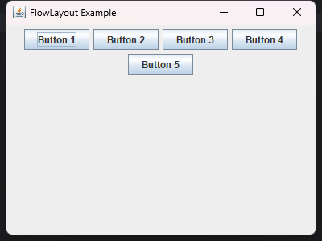
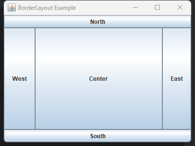
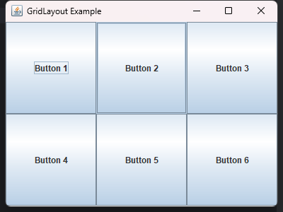
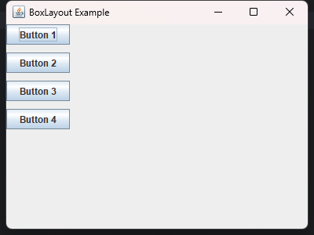

### 布局管理器简介

#### 什么是布局管理器？

布局管理器（Layout Manager）是Java Swing中用于控制容器中组件排列和大小的对象。它们决定了组件在容器中的布局方式，避免了手动设置每个组件的位置和大小，从而简化了GUI设计过程。

### 常见的布局管理器

#### FlowLayout

- **简介**: FlowLayout 是最简单的布局管理器，它按水平方向从左到右排列组件，当一行排满时，自动换到下一行。

  

- **特点**

  - 默认居中对齐，可以设置为左对齐或右对齐。
  - 适用于需要简单排列的场景。

- **代码示例**

  ```java
  import java.awt.*;
  
  public class FlowLayoutExample {
      public static void main(String[] args) {
          JFrame frame = new JFrame("FlowLayout Example");
          frame.setSize(400, 300);
          frame.setDefaultCloseOperation(JFrame.EXIT_ON_CLOSE);
  
          frame.setLayout(new FlowLayout());
  
          frame.add(new JButton("Button 1"));
          frame.add(new JButton("Button 2"));
          frame.add(new JButton("Button 3"));
          frame.add(new JButton("Button 4"));
          frame.add(new JButton("Button 5"));
  
          frame.setVisible(true);
      }
  }
  ```

#### BorderLayout

- **简介**: BorderLayout 将容器划分为五个区域：东、南、西、北和中（East, South, West, North, Center）。每个区域只能添加一个组件，未添加组件的区域保持空白。

  

- **特点**

  - 适用于需要在特定区域布局组件的场景。
  - 中间区域会占据所有剩余的空间。

- **代码示例**

  ```java
  import java.awt.*;
  
  public class BorderLayoutExample {
      public static void main(String[] args) {
          JFrame frame = new JFrame("BorderLayout Example");
          frame.setSize(400, 300);
          frame.setDefaultCloseOperation(JFrame.EXIT_ON_CLOSE);
  
          frame.setLayout(new BorderLayout());
  
          frame.add(new JButton("North"), BorderLayout.NORTH);
          frame.add(new JButton("South"), BorderLayout.SOUTH);
          frame.add(new JButton("East"), BorderLayout.EAST);
          frame.add(new JButton("West"), BorderLayout.WEST);
          frame.add(new JButton("Center"), BorderLayout.CENTER);
  
          frame.setVisible(true);
      }
  }
  ```

#### GridLayout

- **简介**: GridLayout 将容器划分为等大小的网格，每个网格中可以添加一个组件，所有组件大小相同。

  

- **特点**

  - 适用于需要均匀排列组件的场景。
  - 行和列的数量可以指定。

- **代码示例**

  ```java
  import javax.swing.*;
  import java.awt.*;
  
  public class GridLayoutExample {
      public static void main(String[] args) {
          JFrame frame = new JFrame("GridLayout Example");
          frame.setSize(400, 300);
          frame.setDefaultCloseOperation(JFrame.EXIT_ON_CLOSE);
  
          frame.setLayout(new GridLayout(2, 3)); // 2行3列的网格
  
          frame.add(new JButton("Button 1"));
          frame.add(new JButton("Button 2"));
          frame.add(new JButton("Button 3"));
          frame.add(new JButton("Button 4"));
          frame.add(new JButton("Button 5"));
          frame.add(new JButton("Button 6"));
  
          frame.setVisible(true);
      }
  }
  ```

#### BoxLayout

- **简介**: BoxLayout 能够沿着单一轴线（X轴或Y轴）排列组件。可以创建水平（X轴）或垂直（Y轴）排列的布局。

  

- **特点**

  - 适用于需要沿单一方向排列组件的场景。
  - 可以通过添加垂直或水平间隔（Glue、Strut）来调整组件间距。

- **代码示例**

  ```java
  import java.awt.*;
  
  public class BoxLayoutExample {
      public static void main(String[] args) {
          JFrame frame = new JFrame("BoxLayout Example");
          frame.setSize(400, 300);
          frame.setDefaultCloseOperation(JFrame.EXIT_ON_CLOSE);
  
          JPanel panel = new JPanel();
          panel.setLayout(new BoxLayout(panel, BoxLayout.Y_AXIS)); // 垂直排列
  
          panel.add(new JButton("Button 1"));
          panel.add(Box.createVerticalStrut(10)); // 添加垂直间隔
          panel.add(new JButton("Button 2"));
          panel.add(Box.createVerticalStrut(10));
          panel.add(new JButton("Button 3"));
          panel.add(Box.createVerticalStrut(10));
          panel.add(new JButton("Button 4"));
  
          frame.add(panel);
          frame.setVisible(true);
      }
  }
  ```

这些示例展示了布局管理器在Java Swing中的基本用法。你可以根据实际需求选择合适的布局管理器来设计你的GUI应用程序。