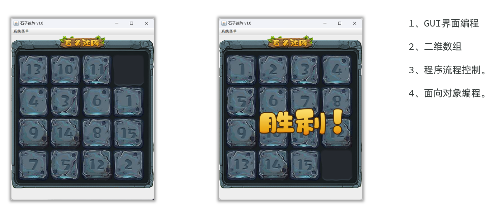

## AI结合GUI开发一个石头迷阵的游戏



### 准备环节

* 创建一个模块用于开发石头迷阵游戏，模块名称取名为：stone-maze
* 导入项目需要的资源包到src目录下：主要是一些图片文件，在image文件夹下。
* 创建项目包：com.itheima.

### 1、创建石头迷阵的界面

- 定义主界面类，MainFrame继承JFrame. 自定义窗口。
  1. 初始化界面：initFrame()
     - 设置窗口标题，设置窗口大小：原始图片为450\*484 (可设置窗口大小为465\*580)
     - 设置窗口居中，默认关闭操作
  2. 初始化色块位置：initImage()
     - 展示行列矩阵的图片色块依次铺满面板
     - 添加背景图片到面板上
  3. 初始化界面菜单（系统退出，重启游戏）：initMenu()

```java
package com.itheima;

import javax.swing.*;
import java.awt.event.KeyAdapter;
import java.awt.event.KeyEvent;

public class MainFrame extends JFrame {

    // 准备一个数组，用于存储数字图片色块的行列位置
    private int[][] imageData = {
            {1,2,3,4},
            {5,6,7,8},
            {9,10,11,12},
            {13,14,15,0}
    };
    // 图片路径
    private static final String imagePath = "stone-maze\\src\\image\\";

    public MainFrame() {
        // 1、调用一个初始化方法，初始化窗口大小等信息
        initFrame();
        // 2、初始化界面，展示数字色块
        initImage();
        // 3、初始化系统菜单：点击弹出菜单信息是系统退出，重启游戏
        initMenu();

        // 最后才设置窗口可见
        this.setVisible(true);
    }

    private void initFrame() {
        // 设置窗口标题
        this.setTitle("石头迷阵");
        // 设置窗口大小
        this.setSize(465, 580);
        // 设置窗口居中显示
        this.setLocationRelativeTo(null);
        // 设置窗口关闭默认操作
        this.setDefaultCloseOperation(JFrame.EXIT_ON_CLOSE);
        // 设置布局方式为绝对位置定位
        this.setLayout(null);
    }

    private void initImage() {
        // 1、展示行列矩阵的图片色块依次铺满窗口
        for (int i = 0; i < 4; i++) {
            for (int j = 0; j < 4; j++) {
                // 通过位置获取图片色块
                String imageName = imageData[i][j] + ".png";
                // 创建一个图片组件
                JLabel label = new JLabel();
                // 设置图片到label里面去
                label.setIcon(new ImageIcon(imagePath + imageName));
                // 设置图片位置(图片左上角的坐标)
                label.setBounds(25 + j * 100, 80 + i * 100, 100, 100);
                // 将色块添加到面板上，设置层级
                JLayeredPane layeredPane = this.getLayeredPane();
                layeredPane.add(label, JLayeredPane.PALETTE_LAYER);  // 更高层级
            }
        }

        // 设置背景图片
        JLabel background = new JLabel(new ImageIcon(imagePath + "background.png"));
        background.setBounds(0, 20, 450, 484);
        // 将背景添加到面板上，设置层级
        JLayeredPane layeredPane = this.getLayeredPane();
        layeredPane.add(background, JLayeredPane.DEFAULT_LAYER); // 默认层级
    }

    private void initMenu() {
        JMenuBar menuBar = new JMenuBar();// 创建菜单条
        JMenu menu = new JMenu("系统菜单");// 创建菜单
        // 退出游戏
        JMenuItem exitItem = new JMenuItem("退出");
        menu.add(exitItem);
        exitItem.addActionListener(e -> {
            System.exit(0);
        });
        // 重新开始
        JMenuItem restartItem = new JMenuItem("重新开始");
        menu.add(restartItem);
        restartItem.addActionListener(e -> {
            this.dispose();
            new MainFrame();
        });
        menuBar.add(menu);
        this.setJMenuBar(menuBar);
    }    
}
```

### 2、打乱顺序（防止不能走通的问题）

* 打乱界面的图片顺序：initRandomArray()

  ```java
  // 方法1：遍历数组，当前位置和随机位置数据交换
  private void initRandomArray() {
      // 打乱数组的顺序
      for (int i = 0; i < imageData.length; i++) {
          for (int j = 0; j < imageData[i].length; j++){
              int row = (int) (Math.random() * 4);
              int col = (int) (Math.random() * 4);
              int temp = imageData[row][col];
              imageData[row][col] = imageData[i][j];
              imageData[i][j] = temp;
          }
      }
  }
  
  // 方法2：以空白块为中心，随机选取方向移动100次，打乱数组的顺序
  private void initRandomArray() {
      for (int i = 0; i < 100; i++) {
          Direction randomDirection = Direction.randomDirection();
          switchAndMove(randomDirection);
      }
  }
  ```

- 定义方向枚举类

  ```java
  // 为防止完全随机打乱不能恢复原样，因此每次可以随机选择一个方向去移动
  public enum Direction {
      UP, DOWN, LEFT, RIGHT;
      // 随机数
      private static final Random RANDOM = new Random();
      // 随机生成一个方向
      public static Direction randomDirection() {
          Direction[] directions = values();
          return directions[RANDOM.nextInt(directions.length)];
      }
  }
  ```

  

### 3、控制上下左右移动

* **给窗口绑定上下左右按键事件**，每点击一次，计数加一，并显示在面板中

  ```java
  // 显示
  private void initImage() {
      // 清空窗口，重新绘制
      this.getLayeredPane().removeAll();
  
      // 刷新界面时，展示步骤
      // 给窗口添加一个展示文字的组件
      JLabel countText = new JLabel("当前步数：" + count);
      countText.setBounds(0, 500, 100, 20);
      getLayeredPane().add(countText);
  
      // 色块铺满面板、添加背景代码
      // ......
  
      // 重新添加菜单
      initMenu();
      // 刷新界面
      this.revalidate();
      this.repaint();
  }
  
  // 绑定事件
  private void initKeyPressEvent() {
      // 给当前窗口绑定上下左右按键事件
      this.addKeyListener(new KeyAdapter() {
          @Override
          public void keyPressed(KeyEvent e) {
              // 获取当前按钮的编号
              int keyCode = e.getKeyCode();
              // 判断这个编号是否是上下左右
              switch (keyCode) {
                      // 用户按了向上键
                  case KeyEvent.VK_UP:
                      count++;
                      switchAndMove(Direction.UP);
                      break;
                      // 用户按了向下键
                  case KeyEvent.VK_DOWN:
                      count++;
                      switchAndMove(Direction.DOWN);
                      break;
                      // 用户按了向左键
                  case KeyEvent.VK_LEFT:
                      count++;
                      switchAndMove(Direction.LEFT);
                      break;
                      // 用户按了向右键
                  case KeyEvent.VK_RIGHT:
                      count++;
                      switchAndMove(Direction.RIGHT);
                      break;
              }
          }
      });
  }
  ```

* **控制位置的交换**

  ​    ---  定位当前空白色块的位置

  ​    --- 根据用户点击的方位确定交换哪个数据，到数组中交换

  ```java
  private void switchAndMove(Direction direction){
  
          // 判断移动方向，交换色块，更新空白色块位置
          switch (direction) {
              case UP:
                  if (row < imageData.length-1 && imageData[row + 1][col] != 0) {
                      imageData[row][col] = imageData[row + 1][col];
                      imageData[row + 1][col] = 0;
                      row++;
                  }
                  break;
              case DOWN:
                  if (row > 0 && imageData[row - 1][col] != 0) {
                      imageData[row][col] = imageData[row - 1][col];
                      imageData[row - 1][col] = 0;
                      row--;
                  }
                  break;
              case LEFT:
                  if (col < imageData[row].length-1 && imageData[row][col + 1] != 0) {
                      imageData[row][col] = imageData[row][col + 1];
                      imageData[row][col + 1] = 0;
                      col++;
                  }
                  break;
              case RIGHT:
                  if (col > 0 && imageData[row][col - 1] != 0) {
                      imageData[row][col] = imageData[row][col - 1];
                      imageData[row][col - 1] = 0;
                      col--;
                  }
                  break;
          }
          // 刷新色块布局
          initImage();
      }
  }
  ```

### 4、判断是否通关，重新绘制主界面

* **判断是否胜利**

  ```java
  // 通关所需色块的位置
  private final int[][] winData = {
      {1,2,3,4},
      {5,6,7,8},
      {9,10,11,12},
      {13,14,15,0}
  };
  
  // 判断是否胜利
  private boolean isWin() {
      for (int i = 0; i < imageData.length; i++) {
          for (int j = 0; j < imageData[i].length; j++) {
              if(imageData[i][j] != winData[i][j]){
                  return false;
              }
          }
      }
      return true;
  }
  ```

  

* **重新绘制主界面的内容**

  ​    ---  让主界面按照二维数组的最新内容刷新界面

  ```java
  private void initImage() {
      // 清空窗口，重新绘制
      this.getLayeredPane().removeAll();
  
      // 刷新界面时，展示步骤
      // 给窗口添加一个展示文字的组件
      JLabel countText = new JLabel("当前步数：" + count);
      countText.setBounds(0, 500, 100, 20);
      getLayeredPane().add(countText);
  
      // 1、展示行列矩阵的图片色块依次铺满窗口
      for (int i = 0; i < 4; i++) {
          for (int j = 0; j < 4; j++) {
              // 通过位置获取图片色块
              String imageName = imageData[i][j] + ".png";
              // 创建一个图片组件
              JLabel label = new JLabel();
              // 设置图片到label里面去
              label.setIcon(new ImageIcon(imagePath + imageName));
              // 设置图片位置(图片左上角的坐标)
              label.setBounds(25 + j * 100, 80 + i * 100, 100, 100);
              // 将色块添加到面板上，设置层级
              JLayeredPane layeredPane = this.getLayeredPane();
              layeredPane.add(label, 1);  // 更高层级
  
          }
      }
  
      // 设置背景图片
      JLabel background = new JLabel(new ImageIcon(imagePath + "background.png"));
      background.setBounds(0, 20, 450, 484);
      // 将背景添加到面板上，设置层级
      JLayeredPane layeredPane = this.getLayeredPane();
      layeredPane.add(background, JLayeredPane.DEFAULT_LAYER); // 默认层级
  
      // 判断胜利的图片
      if (isWin()){
          JLabel label = new JLabel(new ImageIcon(imagePath + "win.png"));
          label.setBounds(124, 230, 266, 88);
          this.getLayeredPane().add(label, 2);
      }
  
      initMenu();
      // 刷新界面
      this.revalidate();
      this.repaint();
  }
  ```

### 5、MainFrame的完整代码

```java
package com.itheima;

import javax.swing.*;
import java.awt.event.KeyAdapter;
import java.awt.event.KeyEvent;

public class MainFrame extends JFrame {

    private final int[][] winData = {
            {1,2,3,4},
            {5,6,7,8},
            {9,10,11,12},
            {13,14,15,0}
    };
    // 准备一个数组，用于存储数字图片色块的行列位置
    private int[][] imageData = {
            {1,2,3,4},
            {5,6,7,8},
            {9,10,11,12},
            {13,14,15,0}
    };
    // 图片路径
    private static final String imagePath = "stone-maze\\src\\image\\";

    // 定位空白色块的行列位置
    private int row = 3;
    private int col = 3;
    private int count = 0;

    public MainFrame() {
        // 1、调用一个初始化方法，初始化窗口大小等信息
        initFrame();
        // 4、打乱数字色块的顺序，再展示图片
        initRandomArray();
        // 2、初始化界面，展示数字色块
        initImage();
        // 3、初始化系统菜单：点击弹出菜单信息是系统退出，重启游戏
        // initMenu();
        // 5、给当前窗口绑定上下左右按键事件
        initKeyPressEvent();

        // 最后才设置窗口可见
        this.setVisible(true);
    }

    private void initFrame() {
        // 设置窗口标题
        this.setTitle("石头迷阵");
        // 设置窗口大小
        this.setSize(465, 580);
        // 设置窗口居中显示
        this.setLocationRelativeTo(null);
        // 设置窗口关闭默认操作
        this.setDefaultCloseOperation(JFrame.EXIT_ON_CLOSE);
        // 设置布局方式为绝对位置定位
        this.setLayout(null);


    }

    private void initImage() {
        // 清空窗口，重新绘制
        this.getLayeredPane().removeAll();

        // 刷新界面时，展示步骤
        // 给窗口添加一个展示文字的组件
        JLabel countText = new JLabel("当前步数：" + count);
        countText.setBounds(0, 500, 100, 20);
        getLayeredPane().add(countText);

        // 1、展示行列矩阵的图片色块依次铺满窗口
        for (int i = 0; i < 4; i++) {
            for (int j = 0; j < 4; j++) {
                // 通过位置获取图片色块
                String imageName = imageData[i][j] + ".png";
                // 创建一个图片组件
                JLabel label = new JLabel();
                // 设置图片到label里面去
                label.setIcon(new ImageIcon(imagePath + imageName));
                // 设置图片位置(图片左上角的坐标)
                label.setBounds(25 + j * 100, 80 + i * 100, 100, 100);
                // 将色块添加到面板上，设置层级
                JLayeredPane layeredPane = this.getLayeredPane();
                layeredPane.add(label, 1);  // 更高层级

            }
        }

        // 设置背景图片
        JLabel background = new JLabel(new ImageIcon(imagePath + "background.png"));
        background.setBounds(0, 20, 450, 484);
        // 将背景添加到面板上，设置层级
        JLayeredPane layeredPane = this.getLayeredPane();
        layeredPane.add(background, JLayeredPane.DEFAULT_LAYER); // 默认层级

        // 判断胜利的图片
        if (isWin()){
            JLabel label = new JLabel(new ImageIcon(imagePath + "win.png"));
            label.setBounds(124, 230, 266, 88);
            this.getLayeredPane().add(label, 2);
        }

        initMenu();
        // 刷新界面
        this.revalidate();
        this.repaint();
    }

    private void initMenu() {
        JMenuBar menuBar = new JMenuBar();// 创建菜单条
        JMenu menu = new JMenu("系统菜单");// 创建菜单
        // 退出游戏
        JMenuItem exitItem = new JMenuItem("退出");
        menu.add(exitItem);
        exitItem.addActionListener(e -> {
            System.exit(0);
        });
        // 重新开始
        JMenuItem restartItem = new JMenuItem("重新开始");
        menu.add(restartItem);
        restartItem.addActionListener(e -> {
            this.dispose();
            new MainFrame();
        });
        menuBar.add(menu);
        this.setJMenuBar(menuBar);
    }

    private void initRandomArray() {
        // 以空白块为中心，随机移动100次，打乱数组的顺序
        for (int i = 0; i < 100; i++) {
           Direction randomDirection = Direction.randomDirection();
           switchAndMove(randomDirection);
        }
    }

    private void initKeyPressEvent() {
        // 给当前窗口绑定上下左右按键事件
        this.addKeyListener(new KeyAdapter() {
            @Override
            public void keyPressed(KeyEvent e) {
                // 获取当前按钮的编号
                int keyCode = e.getKeyCode();
                // 判断这个编号是否是上下左右
                switch (keyCode) {
                    // 用户按了向上键
                    case KeyEvent.VK_UP:
                        count++;
                        switchAndMove(Direction.UP);
                        break;
                    // 用户按了向下键
                    case KeyEvent.VK_DOWN:
                        count++;
                        switchAndMove(Direction.DOWN);
                        break;
                    // 用户按了向左键
                    case KeyEvent.VK_LEFT:
                        count++;
                        switchAndMove(Direction.LEFT);
                        break;
                    // 用户按了向右键
                    case KeyEvent.VK_RIGHT:
                        count++;
                        switchAndMove(Direction.RIGHT);
                        break;
                }
            }
        });
    }

    private void switchAndMove(Direction direction){

        // 判断移动方向，交换色块，更新空白色块位置
        switch (direction) {
            case UP:
                if (row < imageData.length-1 && imageData[row + 1][col] != 0) {
                    imageData[row][col] = imageData[row + 1][col];
                    imageData[row + 1][col] = 0;
                    row++;
                }
                break;
            case DOWN:
                if (row > 0 && imageData[row - 1][col] != 0) {
                    imageData[row][col] = imageData[row - 1][col];
                    imageData[row - 1][col] = 0;
                    row--;
                }
                break;
            case LEFT:
                if (col < imageData[row].length-1 && imageData[row][col + 1] != 0) {
                    imageData[row][col] = imageData[row][col + 1];
                    imageData[row][col + 1] = 0;
                    col++;
                }
                break;
            case RIGHT:
                if (col > 0 && imageData[row][col - 1] != 0) {
                    imageData[row][col] = imageData[row][col - 1];
                    imageData[row][col - 1] = 0;
                    col--;
                }
                break;
        }
        // 刷新色块布局
        initImage();
    }
}
```

### 

