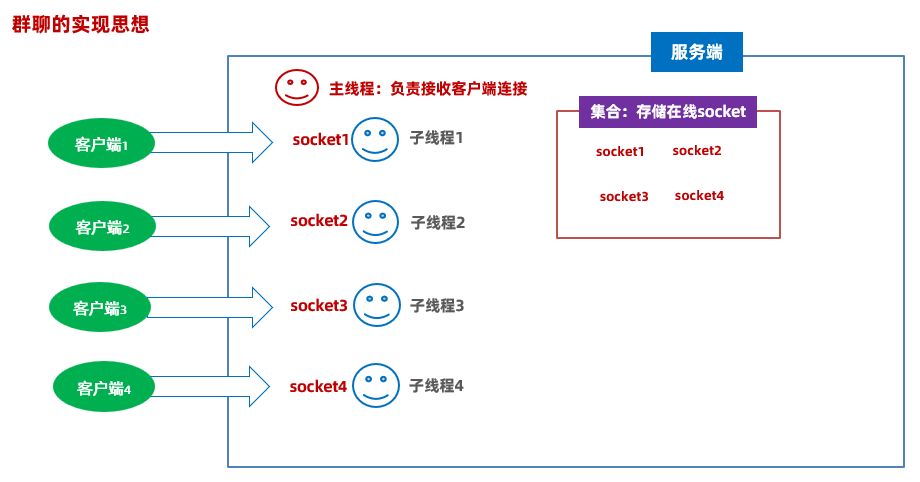

# 《综合项目实战-局域网内的沟通软件》

## 一、需求

- 展示一个用户的登录界面，这个界面只要求用户输入自己聊天的昵称就可以了

- 登录进入后，展示一个群聊窗口，这个窗口，展示在线人数，展示消息展示框，消息输入框，发送按钮。可以实现群聊，实现实时展示在线人数，完全做到即时通信功能。

## 二、技术选型

1、GUI编程技术：Swing

2、网络编程

3、面向对象设计

4、常用API

## 三、思路分析

### 1、分析系统的整体架构



- 开发服务端：
  1. 接收客户端的管道连接
  2. 接收登录消息，接收昵称信息
  3. 服务端也可能接收客户端发过来的群聊消息
  4. 存储全部在线的socket管道，以便到时候知道哪些客户端在线，以便为这些客户端转发消息
  5. 如果服务端收到了登录消息，接收昵称，更新所有客户端在线人数列表
  6. 如果服务端收到了群聊消息，需要接收这个人的消息，再转发给所有客户端展示这个消息
- 客户端界面：登录界面、聊天界面

### 2、创建一个模块，代表客户端：itheima-chat-system

#### 2.1 拿到系统需要的界面：Swing的代码

- 登录界面：只要求用户输入自己的聊天昵称

  ```java
  package com.itheima.ui;
  
  import javax.swing.*;
  import java.awt.*;
  import java.io.DataOutputStream;
  import java.io.IOException;
  import java.net.Socket;
  
  public class ChatEntryFrame extends JFrame {
  
      private JTextField nicknameField;
      private JButton enterButton;
      private JButton cancelButton;
  
      public ChatEntryFrame() {
          setTitle("局域网聊天室");
          setSize(350, 150);
          setDefaultCloseOperation(JFrame.EXIT_ON_CLOSE);
          setLocationRelativeTo(null);
          setResizable(false); // 禁止调整大小
  
          // 设置背景颜色
          getContentPane().setBackground(Color.decode("#F0F0F0"));
  
          // 创建主面板并设置布局
          JPanel mainPanel = new JPanel(new BorderLayout());
          mainPanel.setBackground(Color.decode("#F0F0F0"));
          add(mainPanel);
  
          // 创建顶部面板
          JPanel topPanel = new JPanel(new FlowLayout(FlowLayout.CENTER, 10, 10));
          topPanel.setBackground(Color.decode("#F0F0F0"));
  
          // 标签和文本框
          JLabel nicknameLabel = new JLabel("昵称:");
          nicknameLabel.setFont(new Font("楷体", Font.BOLD, 16));
          nicknameField = new JTextField(10);
          nicknameField.setFont(new Font("楷体", Font.PLAIN, 16));
          nicknameField.setBorder(BorderFactory.createCompoundBorder(
                  BorderFactory.createMatteBorder(1, 1, 1, 1, Color.GRAY),
                  BorderFactory.createEmptyBorder(5, 5, 5, 5)
          ));
  
          topPanel.add(nicknameLabel);
          topPanel.add(nicknameField);
          mainPanel.add(topPanel, BorderLayout.NORTH);
  
          // 按钮面板
          JPanel buttonPanel = new JPanel(new FlowLayout(FlowLayout.CENTER, 10, 10));
          buttonPanel.setBackground(Color.decode("#F0F0F0"));
  
          enterButton = new JButton("登录");
          enterButton.setFont(new Font("楷体", Font.BOLD, 16));
          enterButton.setBackground(Color.decode("#007BFF"));
          enterButton.setForeground(Color.WHITE);
          enterButton.setBorderPainted(false);
          enterButton.setFocusPainted(false);
  
          cancelButton = new JButton("取消");
          cancelButton.setFont(new Font("楷体", Font.BOLD, 16));
          cancelButton.setBackground(Color.decode("#DC3545"));
          cancelButton.setForeground(Color.WHITE);
          cancelButton.setBorderPainted(false);
          cancelButton.setFocusPainted(false);
  
          buttonPanel.add(enterButton);
          buttonPanel.add(cancelButton);
          mainPanel.add(buttonPanel, BorderLayout.SOUTH);
  
          this.setVisible(true); // 显示窗口
      }
  
      public static void main(String[] args) {
          new ChatEntryFrame();
      }
  }
  ```

- 聊天界面

  ```java
  package com.itheima.ui;
  
  import javax.swing.*;
  import java.awt.*;
  import java.awt.event.ActionEvent;
  import java.awt.event.ActionListener;
  import java.io.DataOutputStream;
  import java.io.IOException;
  import java.net.Socket;
  import java.util.List;
  
  public class ClientChatFrame extends JFrame {
      public JTextArea smsContent = new JTextArea(23, 50);
      private JTextArea smsSend = new JTextArea(4, 40);
      public JList<String> onLineUsers = new JList<>();
      private JButton sendBn = new JButton("发送");
  
      public ClientChatFrame() {
          initView();
          this.setVisible(true);
      }
  
      public ClientChatFrame(String nickname, Socket socket) {
          this(); // 先调用上面的无参数构造器，初始化界面信息
          // 初始化数据。
          // 立马展示昵称到窗口
          this.setTitle(nickname + "的聊天窗口");
      }
  
  
      private void initView() {
          this.setSize(700, 600);
          this.setLayout(new BorderLayout());
          this.setDefaultCloseOperation(JFrame.EXIT_ON_CLOSE); // 关闭窗口，退出程序
          this.setLocationRelativeTo(null); // 窗口居中
  
          // 设置窗口背景色
          this.getContentPane().setBackground(new Color(0xf0, 0xf0, 0xf0));
  
          // 设置字体
          Font font = new Font("SimKai", Font.PLAIN, 14);
  
          // 消息内容框
          smsContent.setFont(font);
          smsContent.setBackground(new Color(0xdd, 0xdd, 0xdd));
          smsContent.setEditable(false);
  
          // 发送消息框
          smsSend.setFont(font);
          smsSend.setWrapStyleWord(true);
          smsSend.setLineWrap(true);
  
          // 在线用户列表
          onLineUsers.setFont(font);
          onLineUsers.setFixedCellWidth(120);
          onLineUsers.setVisibleRowCount(13);
  
          // 创建底部面板
          JPanel bottomPanel = new JPanel(new BorderLayout());
          bottomPanel.setBackground(new Color(0xf0, 0xf0, 0xf0));
  
          // 消息输入框
          JScrollPane smsSendScrollPane = new JScrollPane(smsSend);
          smsSendScrollPane.setBorder(BorderFactory.createEmptyBorder());
          smsSendScrollPane.setPreferredSize(new Dimension(500, 50));
  
          // 发送按钮
          sendBn.setFont(font);
          sendBn.setBackground(Color.decode("#009688"));
          sendBn.setForeground(Color.WHITE);
  
          // 按钮面板
          JPanel btns = new JPanel(new FlowLayout(FlowLayout.LEFT, 5, 5));
          btns.setBackground(new Color(0xf0, 0xf0, 0xf0));
          btns.add(sendBn);
  
          // 添加组件
          bottomPanel.add(smsSendScrollPane, BorderLayout.CENTER);
          bottomPanel.add(btns, BorderLayout.EAST);
  
          // 用户列表面板
          JScrollPane userListScrollPane = new JScrollPane(onLineUsers);
          userListScrollPane.setBorder(BorderFactory.createEmptyBorder());
          userListScrollPane.setPreferredSize(new Dimension(120, 500));
  
          // 中心消息面板
          JScrollPane smsContentScrollPane = new JScrollPane(smsContent);
          smsContentScrollPane.setBorder(BorderFactory.createEmptyBorder());
  
          // 添加所有组件
          this.add(smsContentScrollPane, BorderLayout.CENTER);
          this.add(bottomPanel, BorderLayout.SOUTH);
          this.add(userListScrollPane, BorderLayout.EAST);
      }
  
      // 发送消息
      private void sendMsgToServer(String msg) {
          try {
              // 1、从socket管道中得到一个特殊数据输出流
              DataOutputStream dos = new DataOutputStream(socket.getOutputStream());
              // 2、把消息发送给服务端
              dos.writeInt(2);
              dos.writeUTF(msg);
              dos.flush();
          } catch (Exception e) {
              e.printStackTrace();
          }
      }
  
      public static void main(String[] args) {
          new ClientChatFrame();
      }
  }
  ```

#### 2.2 定义一个App启动类，创建界面对象并展示

```java
import com.itheima.ui.ChatEntryFrame;

public class App {
    public static void main(String[] args) {
        new ChatEntryFrame();
    }
}
```

- 

### 3、创建一个模块，代表服务端：itheima-chat-server

#### 3.1 服务端启动、连接客户端

- 第一步：创建服务端模块

- 第二步：创建一个服务端启动类，启动服务器等待与客户端的连接

  ```java
  package com.itheima;
  
  import java.io.IOException;
  import java.net.ServerSocket;
  import java.net.Socket;
  
  public class Server {
      public static void main(String[] args) {
          System.out.println("服务端系统启动了......");
          try {
              // 1、注册端口
              ServerSocket ss = new ServerSocket(Constant.PORT);
              // 2、主线程负责接收客户端连接
              while (true) {
                  System.out.println("等待客户端连接...");
                  Socket socket = ss.accept();
                  System.out.println("一个客户端连接了...");
              }
          } catch (IOException e) {
              throw new RuntimeException(e);
          }
      }
  }
  ```

- 第三步：把管道交给一个独立的线程来处理，以便支持多个客户端同时通信

  ```java
  package com.itheima;
  
  import java.io.DataInputStream;
  import java.io.InputStream;
  import java.net.Socket;
  
  public class ServerReaderThread extends Thread{
      private Socket socket;
      public ServerReaderThread(Socket socket) {
          this.socket = socket;
      }
      @Override
      public void run() {
          try {
              
              }
          } catch (Exception e) {
              System.out.println("客户端下线了:"+socket.getInetAddress().getHostAddress()+":"+socket.getPort());
              System.out.println("------------------");
          }
      }
  }
  ```

- 第四步：定义一个集合容器，存储所有登录进来的客户端管道，以便群发消息给他们

  这个集合需要一个记住所有在线的客户端socket

  ```java
  // 定义一个Map集合，键为socket管道，昵称作为值
  public static final Map<Socket, String> onLineSockets = new HashMap<>();
  ```

#### 3.2 服务端线程接收消息

```java
// 接收多种类消息：1、登录消息（包含昵称）；2、群聊消息（包含昵称+内容）；3、私聊消息（包含昵称+内容）
// 所以客户端必须声明协议发送消息
// 比如客户端先发1：代表接下来是登录消息
// 先发2：代表接下来是群聊消息
// 先发3：代表接下来是私聊消息
```

- 先定义一个type表示服务端接收消息的类型

  ```java
  package com.itheima;
  
  import java.io.DataInputStream;
  import java.io.InputStream;
  import java.net.Socket;
  
  public class ServerReaderThread extends Thread{
      private Socket socket;
      public ServerReaderThread(Socket socket) {
          this.socket = socket;
      }
      @Override
      public void run() {
          try {
              // 接收多种类消息：1、登录消息（包含昵称）；2、群聊消息（包含昵称+内容）；3、私聊消息（包含昵称+内容）
              // 所以客户端必须声明协议发送消息
              // 比如客户端先发1：代表接下来是登录消息
              // 先发2：代表接下来是群聊消息
              // 先发3：代表接下来是私聊消息
              // 先从socket中接收客户端发来的消息类型编号
              DataInputStream dis = new DataInputStream(socket.getInputStream());
              int type = dis.readInt();
              switch (type) {
                  case 1:
                      // 客户端发来了登录消息，接收昵称，再更新在线人数列表
                      break;
                  case 2:
                      // 客户端发来了群聊消息，接收昵称+内容，再把群聊消息发给所有在线用户
                      break;
                  case 3:
                      // 客户端发来了私聊消息，接收昵称+内容，再把群聊消息发给指定客户端
                      break;
              }
          } catch (Exception e) {
              System.out.println("客户端下线了:"+socket.getInetAddress().getHostAddress()+":"+socket.getPort());
              System.out.println("------------------");
          }
      }
  }
  ```

  - 接收登录消息

  ```java
  package com.itheima;
  
  import java.io.*;
  import java.net.Socket;
  import java.util.Collection;
  
  public class ServerReaderThread extends Thread{
      private Socket socket;
      public ServerReaderThread(Socket socket) {
          this.socket = socket;
      }
      @Override
      public void run() {
          try {
              // 接收多种类消息：1、登录消息（包含昵称）；2、群聊消息（包含昵称+内容）；3、私聊消息（包含昵称+内容）
              // 所以客户端必须声明协议发送消息
              // 比如客户端先发1：代表接下来是登录消息
              // 先发2：代表接下来是群聊消息
              // 先发3：代表接下来是私聊消息
              // 先从socket中接收客户端发来的消息类型编号
              DataInputStream dis = new DataInputStream(socket.getInputStream());
              int type = dis.readInt();
              switch (type) {
                  case 1:
                      // 客户端发来了登录消息，接收昵称，再更新在线人数列表
                      String nickname = dis.readUTF();
                      // 把登录成功的客户端socket保存到在线集合中
                      Server.onLineSockets.put(socket, nickname);
                      // 更新全部客户端的在线人数列表
                      upDateClientOnLineUserList();
                      break;
                  case 2:
                      // 客户端发来了群聊消息，接收昵称+内容，再把群聊消息发给所有在线用户
                      break;
                  case 3:
                      // 客户端发来了私聊消息，接收昵称+内容，再把群聊消息发给指定客户端
                      break;
              }
          } catch (Exception e) {
              System.out.println("客户端下线了:"+socket.getInetAddress().getHostAddress()+":"+socket.getPort());
              Server.onLineSockets.remove(socket);// 把下线的socket从在线集合中移除
              // 下线用户后，也需要更新全部客户端的在线人数列表
              upDateClientOnLineUserList();
              System.out.println("------------------");
          }
      }
  
      private void upDateClientOnLineUserList() {
          // 更新全部客户端在线人数列表
          // 拿到全部在线客户端的用户名称，把这些名称转发给全部在线socket管道
          // 1、拿到全部在线客户端的用户名称
          Collection<String> onLineUsers = Server.onLineSockets.values();
          // 2、把这个集合中所有用户都推给全部在线socket管道
          for (Socket socket : Server.onLineSockets.keySet()) {
              try {
                  // 3、把集合中的所有用户名称，通过socket管道发给客户端
                  OutputStream os = socket.getOutputStream();
                  // 创建数据输出流
                  DataOutputStream dos = new DataOutputStream(os);
                  dos.writeInt(1);// 1代表接下来发的是在线人数列表信息，2代表群聊消息，3代表私聊消息
                  dos.writeInt(onLineUsers.size());// 告诉客户端，接下来要发多少个用户名称
                  for (String onLineUser : onLineUsers) {
                      dos.writeUTF(onLineUser);
                  }
                  dos.flush();
              } catch (Exception e) {
                  e.printStackTrace();
              }
          }
      }
  }
  ```

  - 接收群聊消息

  ```java
  package com.itheima;
  
  import java.io.*;
  import java.net.Socket;
  import java.time.LocalDateTime;
  import java.time.format.DateTimeFormatter;
  import java.util.Collection;
  
  public class ServerReaderThread extends Thread{
      private Socket socket;
      public ServerReaderThread(Socket socket) {
          this.socket = socket;
      }
      @Override
      public void run() {
          try {
              // 接收多种类消息：1、登录消息（包含昵称）；2、群聊消息（包含昵称+内容）；3、私聊消息（包含昵称+内容）
              // 所以客户端必须声明协议发送消息
              // 比如客户端先发1：代表接下来是登录消息
              // 先发2：代表接下来是群聊消息
              // 先发3：代表接下来是私聊消息
              // 先从socket中接收客户端发来的消息类型编号
              DataInputStream dis = new DataInputStream(socket.getInputStream());
              while (true) {
                  int type = dis.readInt();
                  switch (type) {
                      case 1:
                          // 客户端发来了登录消息，接收昵称，再更新在线人数列表
                          String nickname = dis.readUTF();
                          // 把登录成功的客户端socket保存到在线集合中
                          Server.onLineSockets.put(socket, nickname);
                          // 更新全部客户端的在线人数列表
                          upDateClientOnLineUserList();
                          break;
                      case 2:
                          // 客户端发来了群聊消息，接收昵称+内容，再把群聊消息发给所有在线用户
                          String msg = dis.readUTF();
                          sendMesgToAll(msg);
                          break;
                      case 3:
                          // 客户端发来了私聊消息，接收昵称+内容，再把群聊消息发给指定客户端
                          break;
                  }
              }
          } catch (Exception e) {
              System.out.println("客户端下线了:"+socket.getInetAddress().getHostAddress()+":"+socket.getPort());
              Server.onLineSockets.remove(socket);// 把下线的socket从在线集合中移除
              // 下线用户后，也需要更新全部客户端的在线人数列表
              upDateClientOnLineUserList();
              System.out.println("------------------");
          }
      }
  
      private void sendMesgToAll(String msg) {
          // 一定要拼装好这段消息，再发给所有在线socket管道
          StringBuilder sb = new StringBuilder();
          String name = Server.onLineSockets.get(socket);
          LocalDateTime now = LocalDateTime.now();
          DateTimeFormatter dtf = DateTimeFormatter.ofPattern("yyyy-MM-dd HH:mm:ss");
          String nowStr = dtf.format(now);
          sb.append(name).append(" ").append(nowStr).append("\r\n").append(msg).append("\r\n");
          String finalMsg = sb.toString();
          // 推送给全部的在线socket管道
          for (Socket socket : Server.onLineSockets.keySet()) {
              try {
                  // 3、把集合中的所有用户名称，通过socket管道发给客户端
                  OutputStream os = socket.getOutputStream();
                  // 创建数据输出流
                  DataOutputStream dos = new DataOutputStream(os);
                  dos.writeInt(2);// 1代表接下来发的是在线人数列表信息，2代表群聊消息，3代表私聊消息
                  dos.writeUTF(finalMsg);// 输出群聊消息
                  dos.flush();
              } catch (Exception e) {
                  e.printStackTrace();
              }
          }
      }
  
      private void upDateClientOnLineUserList() {
          // 更新全部客户端在线人数列表
          // 拿到全部在线客户端的用户名称，把这些名称转发给全部在线socket管道
          // 1、拿到全部在线客户端的用户名称
          Collection<String> onLineUsers = Server.onLineSockets.values();
          // 2、把这个集合中所有用户都推给全部在线socket管道
          for (Socket socket : Server.onLineSockets.keySet()) {
              try {
                  // 3、把集合中的所有用户名称，通过socket管道发给客户端
                  OutputStream os = socket.getOutputStream();
                  // 创建数据输出流
                  DataOutputStream dos = new DataOutputStream(os);
                  dos.writeInt(1);// 1代表接下来发的是在线人数列表信息，2代表群聊消息，3代表私聊消息
                  dos.writeInt(onLineUsers.size());// 告诉客户端，接下来要发多少个用户名称
                  for (String onLineUser : onLineUsers) {
                      dos.writeUTF(onLineUser);
                  }
                  dos.flush();
              } catch (Exception e) {
                  e.printStackTrace();
              }
          }
      }
  }
  ```

  - 接收私聊消息

  ```java
  case 3:
  // 客户端发来了私聊消息，接收昵称+内容，再把群聊消息发给指定客户端
  String name = dis.readUTF(); // 发给的人
  String msg2 = dis.readUTF();
  sendMesgToOne(name, msg2);
  break;
  
  private void sendMesgToOne(String name, String msg2) {
      StringBuilder sb = new StringBuilder();
      String nowName = Server.onLineSockets.get(socket);
      LocalDateTime now = LocalDateTime.now();
      DateTimeFormatter dtf = DateTimeFormatter.ofPattern("yyyy-MM-dd HH:mm:ss");
      String nowStr = dtf.format(now);
      sb.append(nowName).append(" ").append(nowStr).append("\r\n").append(msg2).append("\r\n");
      String finalMsg = sb.toString();
      for (Socket socket : Server.onLineSockets.keySet()) {
          String user = Server.onLineSockets.get(socket);
          if (user.equals(name)) {
              try {
                  // 3、把集合中的所有用户名称，通过socket管道发给客户端
                  OutputStream os = socket.getOutputStream();
                  // 创建数据输出流
                  DataOutputStream dos = new DataOutputStream(os);
                  dos.writeInt(3);// 1代表接下来发的是在线人数列表信息，2代表群聊消息，3代表私聊消息
                  dos.writeUTF(finalMsg);// 输出群聊消息
                  dos.flush();
              } catch (Exception e) {
                  e.printStackTrace();
              }
          }
      }
  }
  ```

### 4、完善客户端开发

- **第一步：从登录界面开始**

  - 给进入按钮绑定一个事件监听器，让他可以点击，一旦点击了，获取到昵称，然后请求与服务端的socket管道连接
  - 并立即发送登录信息：发送1，发送昵称

  ```java
  package com.itheima.ui;
  
  import javax.swing.*;
  import java.awt.*;
  import java.io.DataOutputStream;
  import java.net.Socket;
  
  public class ChatEntryFrame extends JFrame {
  
      private JTextField nicknameField;
      private JButton enterButton;
      private JButton cancelButton;
      private Socket socket; // 记住当前客户端系统的通信管道
  
      public ChatEntryFrame() {
          setTitle("局域网聊天室");
          setSize(350, 150);
          setDefaultCloseOperation(JFrame.EXIT_ON_CLOSE);
          setLocationRelativeTo(null);
          setResizable(false); // 禁止调整大小
  
          // 设置背景颜色
          getContentPane().setBackground(Color.decode("#F0F0F0"));
  
          // 创建主面板并设置布局
          JPanel mainPanel = new JPanel(new BorderLayout());
          mainPanel.setBackground(Color.decode("#F0F0F0"));
          add(mainPanel);
  
          // 创建顶部面板
          JPanel topPanel = new JPanel(new FlowLayout(FlowLayout.CENTER, 10, 10));
          topPanel.setBackground(Color.decode("#F0F0F0"));
  
          // 标签和文本框
          JLabel nicknameLabel = new JLabel("昵称:");
          nicknameLabel.setFont(new Font("楷体", Font.BOLD, 16));
          nicknameField = new JTextField(10);
          nicknameField.setFont(new Font("楷体", Font.PLAIN, 16));
          nicknameField.setBorder(BorderFactory.createCompoundBorder(
                  BorderFactory.createMatteBorder(1, 1, 1, 1, Color.GRAY),
                  BorderFactory.createEmptyBorder(5, 5, 5, 5)
          ));
  
          topPanel.add(nicknameLabel);
          topPanel.add(nicknameField);
          mainPanel.add(topPanel, BorderLayout.NORTH);
  
          // 按钮面板
          JPanel buttonPanel = new JPanel(new FlowLayout(FlowLayout.CENTER, 10, 10));
          buttonPanel.setBackground(Color.decode("#F0F0F0"));
  
          enterButton = new JButton("登录");
          enterButton.setFont(new Font("楷体", Font.BOLD, 16));
          enterButton.setBackground(Color.decode("#007BFF"));
          enterButton.setForeground(Color.WHITE);
          enterButton.setBorderPainted(false);
          enterButton.setFocusPainted(false);
  
          cancelButton = new JButton("取消");
          cancelButton.setFont(new Font("楷体", Font.BOLD, 16));
          cancelButton.setBackground(Color.decode("#DC3545"));
          cancelButton.setForeground(Color.WHITE);
          cancelButton.setBorderPainted(false);
          cancelButton.setFocusPainted(false);
  
          buttonPanel.add(enterButton);
          buttonPanel.add(cancelButton);
          mainPanel.add(buttonPanel, BorderLayout.SOUTH);
  
          // 添加监听器
          enterButton.addActionListener(e -> {
              String nickname = nicknameField.getText(); // 获取昵称
              nicknameField.setText("");
              if (!nickname.isEmpty()) {
                  try {
                      // 立即发送登录消息给服务端程序
                      login(nickname);
                      // 进入聊天室逻辑: 启动聊天界面。把昵称传给聊天界面。
                      new ClientChatFrame(nickname, socket);
                      this.dispose(); // 关闭登录窗口
                  } catch (Exception ex) {
                      ex.printStackTrace();
                  }
              } else {
                  JOptionPane.showMessageDialog(this, "请输入昵称!");
              }
          });
  
          cancelButton.addActionListener(e -> System.exit(0));
  
          this.setVisible(true); // 显示窗口
      }
  
      public void login(String nickname) throws Exception {
          // 立即发送登录消息给服务端程序。
          // 1、创建Socket管道请求与服务端的socket链接
          socket = new Socket(Constant.SERVER_IP, Constant.SERVER_PORT);
          // 2、立即发送消息类型1 和自己的昵称给服务端
          DataOutputStream dos = new DataOutputStream(socket.getOutputStream());
          dos.writeInt(1); // 消息类型 登录
          dos.writeUTF(nickname);
          dos.flush();
      }
  
      public static void main(String[] args) {
          new ChatEntryFrame();
      }
  }
  ```

  - 再展示客户端的聊天界面：接收到了昵称，和属于自己客户端的socket通信管道

  ```java
  package com.itheima.ui;
  
  import javax.swing.*;
  import java.awt.*;
  import java.io.DataOutputStream;
  import java.net.Socket;
  import java.util.List;
  
  public class ClientChatFrame extends JFrame {
      public JTextArea smsContent = new JTextArea(23, 50);
      private JTextArea smsSend = new JTextArea(4, 40);
      public JList<String> onLineUsers = new JList<>();
      private JButton sendBn = new JButton("发送");
      private String nickname;
      private Socket socket;
  
      public ClientChatFrame() {
          initView();
          this.setVisible(true);
      }
  
      public ClientChatFrame(String nickname, Socket socket) {
          this(); // 先调用上面的无参数构造器，初始化界面信息
          // 初始化数据。
          // 立马展示昵称到窗口
          this.setTitle(nickname + "的聊天窗口");
          this.socket = socket;
      }
  }
  ```

- **第二步：立即在消息聊天界面，立即读取客户端socket管道从服务端发来的在线人数更新/群聊消息**

  - 交给一个独立的线程专门负责读取客户端socket从服务端收到的在线人数更新和群聊数据
  - 收到消息，先判断消息的类型，判断是在线人数更新消息还是群聊消息，分开处理

- **第三步：接收群聊消息**

  - 接收消息类型2，接收群聊数据，展示到面板上去即可

- **第四步：发送群聊消息**

  - 给发送按钮绑定一个点击事件，获取输入框的消息内容，再发送2，最后把群聊内容发送给服务端


