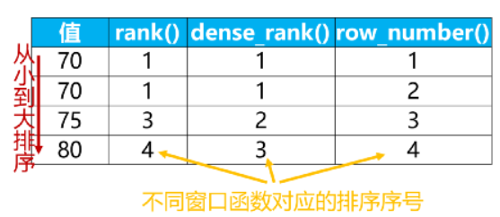
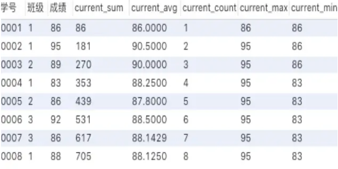
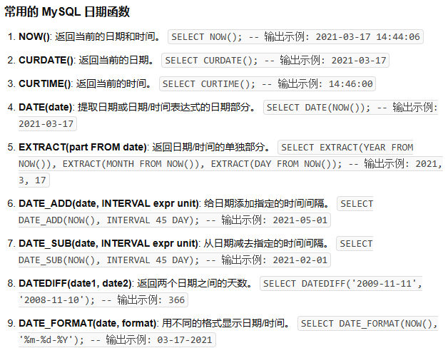
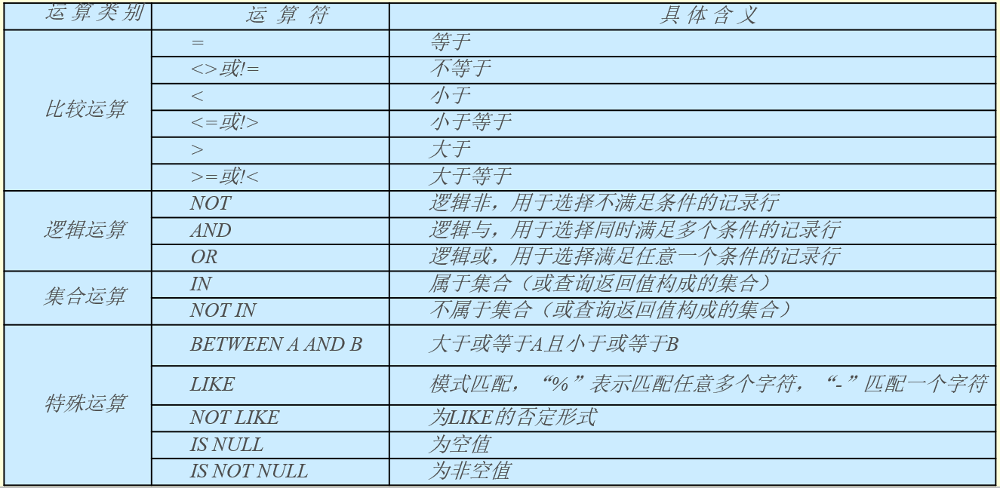
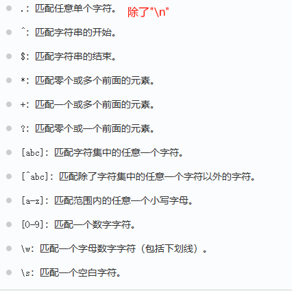
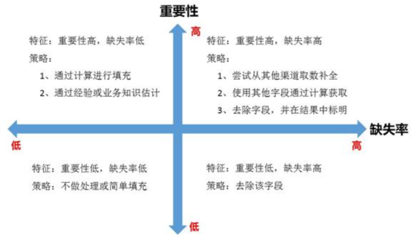
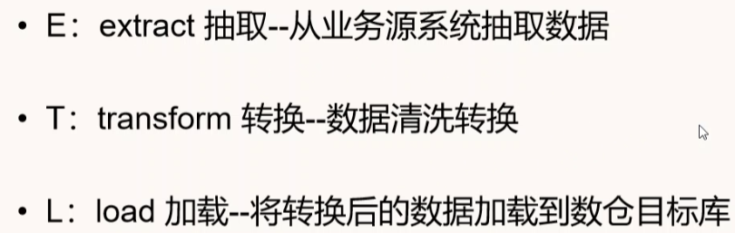
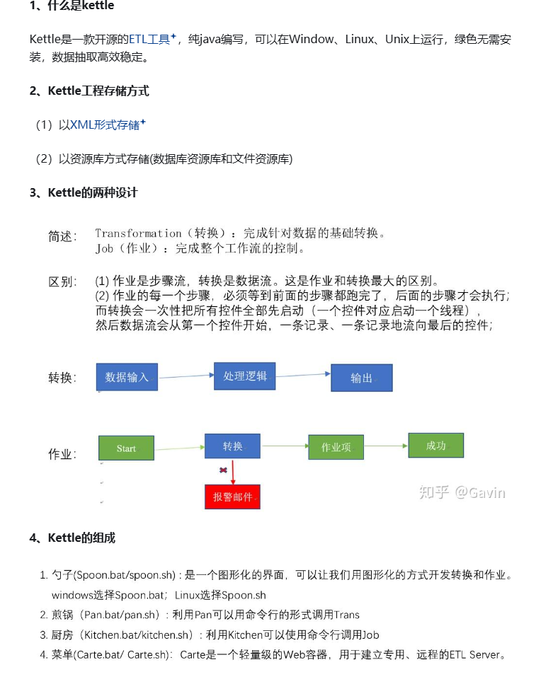

## 一、SQL

- **求一个公司每个部门工资最高的人的名字和工资（窗口函数）**

```sql
select name, department, salary
from 
(select name, department, salary, 
 row_number() over(partition by department order by salary desc) as rk from table) as tablename
where rk = 1
```

- **窗口函数**：

  <窗口函数>的位置，可以放以下两种函数：

  1） 专用窗口函数，包括后面要讲到的[rank](https://zhida.zhihu.com/search?content_id=700312099&content_type=Answer&match_order=1&q=rank&zhida_source=entity), [dense_rank](https://zhida.zhihu.com/search?content_id=700312099&content_type=Answer&match_order=1&q=dense_rank&zhida_source=entity), [row_number](https://zhida.zhihu.com/search?content_id=700312099&content_type=Answer&match_order=1&q=row_number&zhida_source=entity)等专用窗口函数。

  ```sql
  select *,
     rank() over (partition by 班级 # partition by用来对表分组。
             order by 成绩 desc) as ranking # order by子句的功能是对分组后的结果进行排序
  from 班级表
  ```

  

  2） [聚合函数](https://zhida.zhihu.com/search?content_id=700312099&content_type=Answer&match_order=1&q=聚合函数&zhida_source=entity)，如sum. avg, count, max, min等

  ```java
  select *,
     sum(成绩) over (order by 学号) as current_sum,
     avg(成绩) over (order by 学号) as current_avg,
     count(成绩) over (order by 学号) as current_count,
     max(成绩) over (order by 学号) as current_max,
     min(成绩) over (order by 学号) as current_min
  from 班级表
  ```

  

- **内连接（INNER JOIN）**：查询与连接条件相匹配的数据，左右两边空值都会裁剪
- **外连接**
  - 左连接（LEFT OUTER JOIN）:输出左表的所有记录相关列值，右表输出与左表匹配的记录，如果没有与左表匹配的记录，则使用NULL匹配输出
  - 右连接（RIGHT OUTER OUT）:输出右表的所有记录相关列值，左表输出与右表匹配的记录，如果没有与右表匹配的记录，则使用NULL匹配输出
  - 全连接（FULL OUTER JOIN）:返回左表和右表中的所有行。当某行在另一表中没有匹配行，则另一表中的列返回空值
- **交叉连接（CROSS JOIN）：也称迪卡尔积**，返回两表行数乘积的数据

- **数据类型：**
  - 数值型：tiny1, small2, medium3, int4, big8; float4, double8, decimal(总位数, 小数位数)
  - 日期类型：date3, time3, year1, datetime(date+time)8, timestamp4
  - 字符串：char(定长), varchar, blob(二进制, tiny medium long), text(长文本, tiny, mediun long)

- **date的操作：**

  

- **条件查询：**



like 中，%代表任意长度字符串，_代表任意单个字符


- **正则化查询：**

```sql
# 方式1
SELECT column1, column2, ...
FROM table_name
WHERE column_name REGEXP 'pattern';
# 方式2
SELECT column1, column2, ...
FROM table_name
WHERE column_name RLIKE 'pattern';
```



视图和表的区别
数据规模大有没有考虑过性能问题

## 二、python

数据清洗还有异常值处理

sql,python类型转换

数据清洗：

- 缺失值处理：均值、中位数、众数、临近值填补



- 去重：去除数据集中的重复记录。这可以通过比较记录中的唯一标识符或关键字段来实现。
- 异常值处理：箱线图原理，3sigma原则(99.7)，PCA(前k个主成分对应特征相差过大)
- 数据标准化：统一数据格式


append和extend的区别

## 三、业务

数据岗


ETL(Extract-Transform-Load)



ETL，是英文Extract-Transform-Load的缩写，用来描述将数据从来源端经过抽取（extract）、转换（transform）、加载（load）至目的端的过程，是数据仓库的生命线。

```java
抽取（Extract）主要是针对各个业务系统及不同服务器的分散数据，充分理解数据定义后，规划需要的数据源及数据定义，制定可操作的数据源，制定增量抽取和缓慢渐变的规则。
    
转换（transform）主要是针对数据仓库建立的模型，通过一系列的转换来实现将数据从业务模型到分析模型，通过ETL工具可视化拖拽操作可以直接使用标准的内置代码片段功能、自定义脚本、函数、存储过程以及其他的扩展方式，实现了各种复杂的转换，并且支持自动分析日志，清楚的监控数据转换的状态并优化分析模型。

装载（Load）主要是将经过转换的数据装载到数据仓库里面，可以通过直连数据库的方式来进行数据装载，可以充分体现高效性。在应用的时候可以随时调整数据抽取工作的运行方式，可以灵活的集成到其他管理系统中
```



### SQL优化

1. 避免使用select*

   只要一两列的情况下，没必要select所有数据(占内存，多的数据增加传输时间)，而且有大量的非索引列，出现大量的回表操作，可以把经常需要查询的列建立联合索引（树结构的叶子节点存储），实现索引覆盖，但是索引也要占用磁盘空间，如果是经常执行增删改的表就不适合（要维护索引，降低增删改的速度），而只进行查找的表很适合建立索引

2. 用union all代替union

   union all可以获取查询到的所有数据，而union会排重，需要遍历、排序、比较，更耗时间

3. 小表驱动大表

   如果sql语句中包含了in关键字，则它会优先执行in里面的子查询语句，然后再执行in外面的语句。如果in里面的数据量很少，作为条件查询速度更快。

   而如果sql语句中包含了exists关键字，它优先执行exists左边的语句（即主查询语句）。然后把它作为条件，去跟右边的语句匹配。如果匹配上，则可以查询出数据。如果匹配不上，数据就被过滤掉了

   - `in` 适用于左边大表，右边小表。
   - `exists` 适用于左边小表，右边大表。

4. 存在性问题

   不用count()，count()会遍历统计所有满足条件的数据出现的次数，如果大于0，则存在；而加入limit 1之后，只要查到一条数据，就返回1

5. group by

   我们有很多业务场景需要使用`group by`关键字，它主要的功能是去重和分组。

   通常它会跟`having`一起配合使用，表示分组后再根据一定的条件过滤数据。

   这种写法性能不好，它先把所有的订单根据用户id分组之后，再去过滤用户id大于等于200的用户。这种写法性能不好，它先把所有的订单根据用户id分组之后，再去过滤用户id大于等于200的用户。

6. 连接查询代替子查询

   缺点是mysql执行子查询时，需要创建临时表，查询完毕后，需要再删除这些临时表，有一些额外的性能消耗。这时可以改成连接查询。