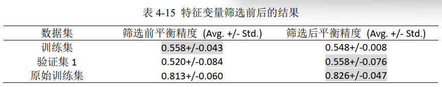
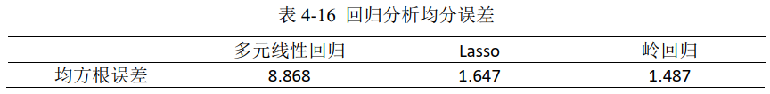
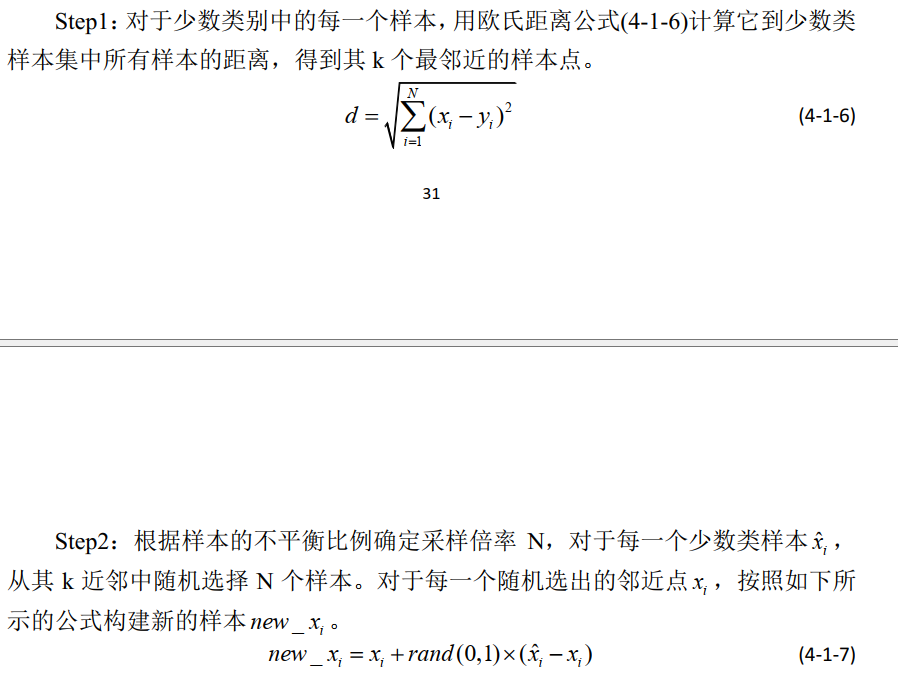
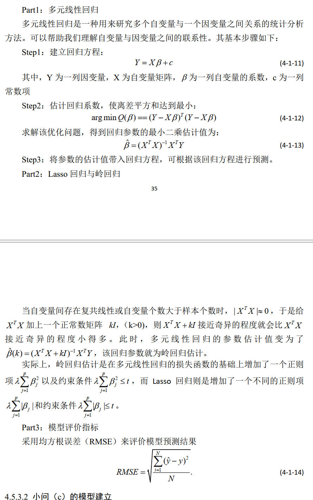

## 一、华西

### 1、建立医学技术词关联词库

**工作：**参与设计开发关联词库的建立方法并实现

**细节：**每个关键词要求找到十个与之相关联的子技术，调用大语言模型API接口，设计prompt，生成固定格式的十个关键词

**困难：**是gpt为概率模型，每次生成的结果不一样，因此循环生成10次，最终取词频最高的10个关键词

### 2、自动化报告生成

**工作：**本人负责医学技术相关专利模块数据的读取和处理接口的实现，以及完整的技术相关企业模块的设计和实现(包括对数据的读取、处理、绘图以及自动写入报告等接口)；

**细节：**pandas.read_excel读取表格中指定列的数据，pandas.fillna('-')填补缺失值，docx库中docx.Document读取word模板，doc.tables获取表格，replace逐段逐行将模板中的标签替换，并用run.add_picture添加图片

### 3、爬取疾病论文数据

**工作：**本人负责爬取部分疾病相关的web of science科学数据库中的论文数据，包括国家、期刊、机构等论文数据，设计自动脚本做简单处理并输出到excel表格中；

**细节：**使用python中selenium包从web of science中爬取数据，简单计算排名前10的国家、机构等论文数量占比和引文数量占比，使用matplotlib绘制柱状图，并用plt.savefig保存图片

**难点：**网速不够快即使用time.sleep等待了，页面还没刷新，直接find_element找不到网页元素，就使用WebDriverWait().until(EC.element_to_be_clickable/visibility_of_element_located)，同时页面爬取次数过多，可能会导致网页元素变化，需要定期维护爬虫程序

selenium定位元素：by_id、name、class

### 4、提取疾病相关课题数据

**工作：**本人负责从本地化数据库中，使用正则化查询方法，从表格中提取与某些疾病相关的课题数据，并输出到excel表格中。

**细节：**从课题名称，给定一个疾病名称使用wordcloud库生成关键词词云图，使用networkx生成关系图（节点大小代表出现频次，边的宽度代表两个关键词同时出现再同一个课题的频次），使用dataframe中str.contains进行正则化匹配

## 二、华为杯

### 1、数据

三张excel表格

- 表1：患者信息(年龄，性别，脑出血前mRS，血压，卒中病史，吸烟、饮酒史，脑室引流、止血治疗治疗等方案)，基本都是0，1变量，首次流水号
- 表2：血肿及水肿体积及位置（分成好几个区域，是否在某个区域里用0、1表示），首次+随访流水号
- 表3：血肿及血肿形状和灰度分布，首次+随访流水号

一共160条数据，100条训练，30条只考虑首次做训练集，30条考虑首次+随访做训练集

### 2、目标

a) 考虑首次做预后90天mRS评分预测(0-6多分类)

b) 考虑首次+随访做预后90天mRS评分预测(0-6多分类)

c) 分析90天mRS预后与不同因素的关联关系，提出临床建议

### 3、思路

a) 小问

1. 按首次流水号对表1和表2进行拼接；
2. 存在样本类别不均衡问题，使用SMOTE过采样扩充样本；
3. 采用两层交叉方法划分训练和测试集：外层分层抽样3折交叉，内层再把外层的训练集再做3折交叉，进行参数调优（内层验证集平均指标表现最好的作为最优参数）；
4. 随机森林进行训练和预测：对多重共线性不敏感，能处理多变量数据；
5. 评价指标：使用平衡精度（针对样本不平衡数据），多分类问题为多个二分类问题求平均；
6. 改进：只使用随机森林导出的排名前30的特征，再进行训练，得到模型的效果更好

b) 小问

1. 考虑了随访影响，因此一位患者对应了张影像，使用PCA加权合并多张影像数据
2. 后面步骤与小问a)一致

c) 小问：

1. 多元回归探究因变量与自变量之间的关系，回归系数越大越重要

2. 相关系数图像表示一些自变量之间存在多重共线性，可以采用lasso和岭回归改进

3. 根据均方根误差评价模型好坏

   

4. lasso和岭回归导出最重要的九大特征，二者只有一个特征不一样，结果较好

### 4、细节

1. SMOTE过采样

   

2. lasso和岭回归

   

